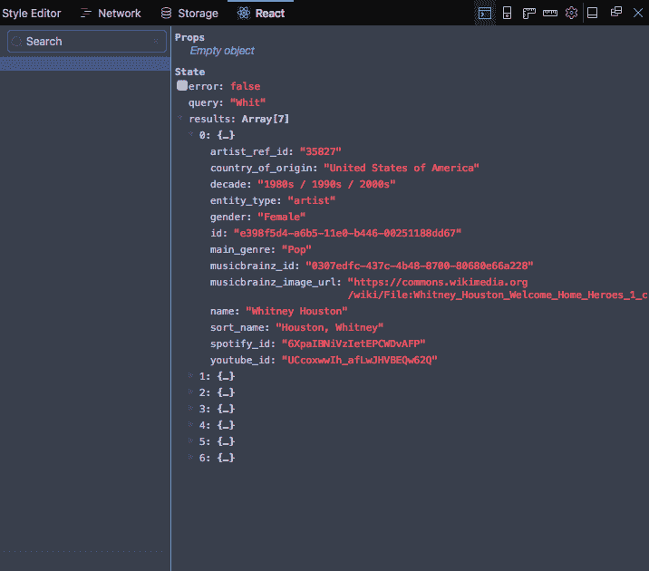
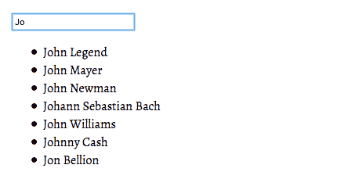

# 如何在 React 中编写带有建议的搜索组件

> 原文：<https://dev.to/saaage/how-to-write-a-search-component-with-suggestions-in-react-d20>

[Github Repo](https://github.com/Sage911/blog-autocomplete)
*这个例子使用了需要 transpiling 的语法。完整巴别塔配置见回购。*

提供搜索建议是改善用户体验的好方法。它可以节省时间，也可以指导那些不确定自己在找什么的用户。

确定了“为什么”,我们就可以继续实施了。但是我们如何在 JavaScript 中实现建议呢？

和大多数解决问题的练习一样，一个好的开始是问正确的问题:

*   有没有一个库可以解决我想要完成的事情，我应该使用它吗？ *快速的谷歌搜索会返回像* [autocomplete.js](http://autocomplete-js.com/) ，*这样的选项，但是通过编写我们自己的内容可以获得有价值的洞察力。*

*   **我们正在操作哪些 HTML 元素？** *看起来我们可以用*`<form>``<input/>``<ul>`。

### 我们决定自己写。

#### 我们需要什么:

*   信息来源。我们在寻找一个值的集合，以便与用户输入的内容进行比较(我们将获取一个 API 响应，但是您也可以使用一个值的本地数组)。

*   HTTP 客户端。允许我们向特定的端点发出请求，以获取我们正在寻找的数据。我选择了 [axios](https://www.npmjs.com/package/axios) ，因为它为我们提供了一些比[获取 API](https://developer.mozilla.org/en-US/docs/Web/API/Fetch_API) 更多的特性，比如自动解析它接收到的数据。

*   一个智能/容器组件，它进行引用受控输入的 API 调用。

*   用于显示结果的表示性[(无状态函数)](https://reactjs.org/blog/2015/10/07/react-v0.14.html#stateless-functional-components)组件。

让我们从我们的容器开始，搜索:

```
import React, { Component } from 'react'

class Search extends Component {
 state = {
   query: '',
 }

 handleInputChange = () => {
   this.setState({
     query: this.search.value
   })
 }

 render() {
   return (
     <form>
       <input
         placeholder="Search for..."
         ref={input => this.search = input}
         onChange={this.handleInputChange}
       />
       <p>{this.state.query}</p>
     </form>
   )
 }
}

export default Search 
```

Enter fullscreen mode Exit fullscreen mode

您会注意到，当您在输入字段中键入内容时，`Search`会重新呈现，我们的输入值如下所示。多亏了 [refs](https://reactjs.org/docs/refs-and-the-dom.html) ，我们可以选择输入元素并做一些有用的事情，比如获取它的值或调用 DOM 事件，比如`focus` (this.search.focus())。

接下来，让我们连接一个 API。这里我们将使用 [MusicGraph](https://developer.musicgraph.com) ，一个音乐信息的数据库。在这里抓取一个 API 键[。](https://developer.musicgraph.com/signup?)

我们将使用 axios 创建一个`getInfo`方法(查看您的 API 文档，了解如何构建您的请求 URL):

```
 getInfo = () => {
    axios.get(`${API_URL}?api_key=${API_KEY}&prefix=${this.state.query}&limit=7`)
      .then(({ data }) => {
        this.setState({
          results: data.data
        })
      })
  } 
```

Enter fullscreen mode Exit fullscreen mode

Axios `.get`返回一个承诺，意味着它在等待 API 响应时不会阻止应用程序的其余部分执行。这里我们向 MovieGraph API 的 artist 端点发出请求，使用 refs 的魔力来填充前缀查询参数。(API_URL 和 API_KEY 是在类定义之上定义的，参见下一个快照。)

让我们也调整一下`handleInputChange`方法。我们不需要为每个 onChange 事件或者当输入被清除时进行 API 调用。

到目前为止的完整组件:

```
import React, { Component } from 'react'
import axios from 'axios'

const { API_KEY } = process.env
const API_URL = 'http://api.musicgraph.com/api/v2/artist/suggest'

class Search extends Component {
  state = {
    query: '',
    results: []
  }

  getInfo = () => {
    axios.get(`${API_URL}?api_key=${API_KEY}&prefix=${this.state.query}&limit=7`)
      .then(({ data }) => {
        this.setState({
          results: data.data // MusicGraph returns an object named data, 
                             // as does axios. So... data.data 
        })
      })
  }

  handleInputChange = () => {
    this.setState({
      query: this.search.value
    }, () => {
      if (this.state.query && this.state.query.length > 1) {
        if (this.state.query.length % 2 === 0) {
          this.getInfo()
        }
      } 
    })
  }

  render() {
    return (
      <form>
        <input
          placeholder="Search for..."
          ref={input => this.search = input}
          onChange={this.handleInputChange}
        />
        <p>{this.state.query}</p>
      </form>
    )
  }
}

export default Search 
```

Enter fullscreen mode Exit fullscreen mode

如果您的浏览器中安装了 React Dev 工具，您可以观察到 API 调用完成时搜索状态的变化:
[](https://res.cloudinary.com/practicaldev/image/fetch/s--NIqvX0Jl--/c_limit%2Cf_auto%2Cfl_progressive%2Cq_auto%2Cw_880/https://res.cloudinary.com/dfcuz6b1o/image/upload/q_100/v1512061633/reactdevtoolssearch.png)

最后冲刺。现在将我们的结果呈现给 DOM。

正如在设置中提到的，让我们创建我们的表示组件，`Suggestions`。

```
import React from 'react'

const Suggestions = (props) => {
  const options = props.results.map(r => (
    <li key={r.id}>
      {r.name}
    </li>
  ))
  return <ul>{options}</ul> }

export default Suggestions 
```

Enter fullscreen mode Exit fullscreen mode

我们已经设置了一些建议来期待一个名为`results`的道具。

让我们呈现我们的建议组件:

```
import React, { Component } from 'react'
import axios from 'axios'
import Suggestions from 'components/Suggestions'

const { API_KEY } = process.env
const API_URL = 'http://api.musicgraph.com/api/v2/artist/suggest'

class Search extends Component {
  state = {
    query: '',
    results: []
  }

  getInfo = () => {
    axios.get(`${API_URL}?api_key=${API_KEY}&prefix=${this.state.query}&limit=7`)
      .then(({ data }) => {
        this.setState({
          results: data.data
        })
      })
  }

  handleInputChange = () => {
    this.setState({
      query: this.search.value
    }, () => {
      if (this.state.query && this.state.query.length > 1) {
        if (this.state.query.length % 2 === 0) {
          this.getInfo()
        }
      } else if (!this.state.query) {
      }
    })
  }

  render() {
    return (
      <form>
        <input
          placeholder="Search for..."
          ref={input => this.search = input}
          onChange={this.handleInputChange}
        />
        <Suggestions results={this.state.results} />
      </form>
    )
  }
}

export default Search 
```

Enter fullscreen mode Exit fullscreen mode

尝试一下:

[T2】](https://res.cloudinary.com/practicaldev/image/fetch/s--chrKP_GD--/c_limit%2Cf_auto%2Cfl_progressive%2Cq_auto%2Cw_880/http://res.cloudinary.com/dfcuz6b1o/image/upload/q_100/v1512067865/autocomplete.png)

有用！

一旦建立了路由，我们可以将每个结果包装在一个 anchor/react-router `Link`组件中。但这是另一篇文章的主题。在此之前，我希望这是有帮助的人！