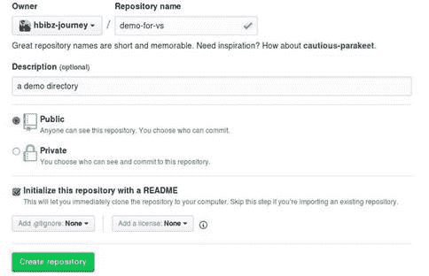
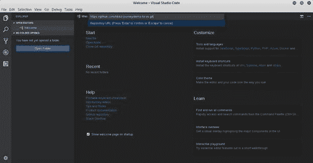
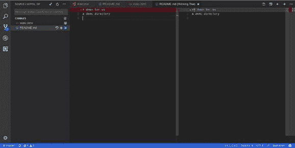
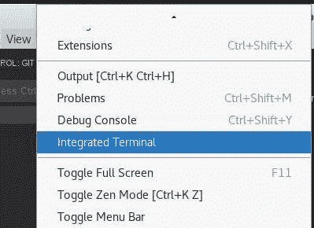

# 微软 Visual Studio 代码 Git 指南

> 原文:[https://dev.to/hbibzdeploy/ms-visual-studio-code-git-CFF 指南](https://dev.to/hbibzdeploy/ms-visual-studio-code---guide-to-git-cff)

大家好，我是 Muhammad Habib Jawady，今天我将向大家展示如何使用 MS visual Studio 代码来正确地使用 git。这将是一个实践教程，我希望你会发现这很有用，因为“代码”的用户数量在这一年中急剧增长，需要一个完整的教程来帮助人们掌握它的大量功能。

对于 VS 代码的完整文档，我推荐访问官方文档: [Docs](https://code.visualstudio.com/docs) 。我将跳过对这个代码编辑器的介绍，并且我将假设您已经具备了代码编辑器和 ide 的基础知识。关于这个问题的更多信息，您可以访问本指南并获得对 git 概念的基本认识。

[T2】](https://res.cloudinary.com/practicaldev/image/fetch/s---R_BLBIt--/c_limit%2Cf_auto%2Cfl_progressive%2Cq_auto%2Cw_880/http://csharpcorner.mindcrackerinc.netdna-cdn.com/article/ms-visual-studio-code-guide-to-gimg/image002.jpg)

**GIT 克隆**

首先，我们将创建我们的演示项目，存储库的名称是“demo-for-vs ”,并用 README markdown 对其进行初始化，也就是 README.md

[T2】](https://res.cloudinary.com/practicaldev/image/fetch/s--pNZrP7zt--/c_limit%2Cf_auto%2Cfl_progressive%2Cq_auto%2Cw_880/http://csharpcorner.mindcrackerinc.netdna-cdn.com/article/ms-visual-studio-code-guide-to-gimg/image003.jpg)

然后，我们将复制克隆。git url 位于右上角，打开 MS VS 代码菜单，从启动窗口的欢迎页面中选择“克隆 git 库”选项，然后粘贴该 url。

[T2】](https://res.cloudinary.com/practicaldev/image/fetch/s--NZulhj0W--/c_limit%2Cf_auto%2Cfl_progressive%2Cq_auto%2Cw_880/http://csharpcorner.mindcrackerinc.netdna-cdn.com/article/ms-visual-studio-code-guide-to-gimg/image004.jpg)

我们点击输入并填充我们想要克隆的存储库，然后从下一个弹出菜单中选择“打开存储库”。

**进行/准备变更**

现在让我们对本地版本进行一些更改。为此，我将更改自述文件中标题的大小，并添加一个新文件“index.html”。

如果你点击左边的“源代码管理”标签(在搜索标志下面)，你应该能看到这个，

[T2】](https://res.cloudinary.com/practicaldev/image/fetch/s--zTReARIa--/c_limit%2Cf_auto%2Cfl_progressive%2Cq_auto%2Cw_880/http://csharpcorner.mindcrackerinc.netdna-cdn.com/article/ms-visual-studio-code-guide-to-gimg/image005.jpg)

你可以注意到，左边是原始版本，右边是你的本地版本。

现在，我们必须点击文件名右边的“+”图标来准备我们的更改。

**去委员会**

为了提交，您必须点击文件顶部的按钮，如下所示，

[T2】](https://res.cloudinary.com/practicaldev/image/fetch/s--piLOt9Tj--/c_limit%2Cf_auto%2Cfl_progressive%2Cq_auto%2Cw_880/http://csharpcorner.mindcrackerinc.netdna-cdn.com/article/ms-visual-studio-code-guide-to-gimg/image006.jpg)

**去推**

为了在原始存储库中应用更改，我们将从集成在代码中的终端运行常规的 push 命令。

为此，我们首先转到“视图”> >“集成终端”，

[T2】](https://res.cloudinary.com/practicaldev/image/fetch/s--9Oc9-iVr--/c_limit%2Cf_auto%2Cfl_progressive%2Cq_auto%2Cw_880/http://csharpcorner.mindcrackerinc.netdna-cdn.com/article/ms-visual-studio-code-guide-to-gimg/image007.jpg)

然后我们运行- _git 推原点大师_->成功^^

我希望你今天学到了一些新东西…对于任何询问，请随时提交评论。