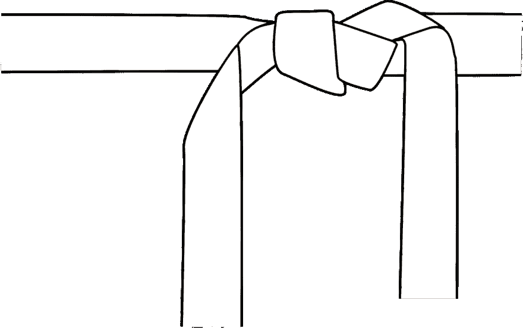
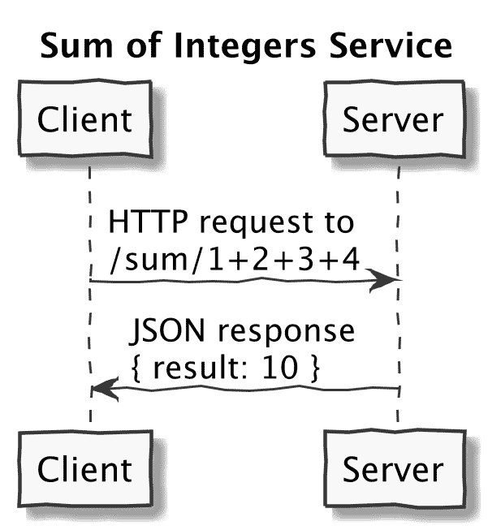

# 7 级程序员:程序员、程序员、计算机科学家、开发人员、工程师、架构师

> 原文:[https://dev . to/lpas qualis/7-ranks-of-coder hood-coder-程序员-计算机-科学家-开发人员-工程师-建筑师-eca](https://dev.to/lpasqualis/7-ranks-of-coderhood-coder-programmer-computer-scientist-developer-engineer-architect-eca)

这篇文章最初发表在 [CoderHood](https://coderhood.com) 上，名为[Coder hood 的 7 个等级:程序员、程序员、计算机科学家、开发人员、工程师、架构师](https://www.coderhood.com/7-ranks-coder-programmer-computer-scientist-developer-engineer-architect/)。CoderHood 是一个致力于软件工程人类层面的博客。

[T2】](https://www.coderhood.com/7-ranks-coder-programmer-computer-scientist-developer-engineer-architect/)

# 一个软件构建者的众多名字

在我的[博客](https://coderhood.com)中，我一直在交替使用术语编码员、程序员、软件开发员和软件工程师。我这样做主要是为了避免语言上的重复。然而，我认为这些词和其他类似的词是有区别的。

在本文中，我将讨论一组常用来指代编写代码的人的名词。我还将给出我对这些术语与工程技能水平之间关系的解释。

## 解释意思

我在这里给出的定义不是官方的。据我所知，没有正式的定义，也没有可信的机构来创建这样的东西。然而，有许多人对此事有强烈的看法。我对每一个术语含义的理解都是基于我在软件行业三十年的经验，但是我完全希望其他人不同意我的解释。

我的意图不是开始一场辩论或试图说服任何可能有强烈意见的人。我不认为此时有对错之分。然而，如果你还没有形成一个强有力的意见，我希望这个指南将提供一些可能的解释。

## 三管齐下

为了清楚起见，对于每个名词，我将做三件事:

### #1 -描述技能等级

我将提供一个技能水平的描述，在我的解释中，这个术语是隐含的。

### # 2——提供一个与武学平行的军衔

我就用武功排名来打个比方。特别是，我会将术语所暗示的技术软件制作技能水平等同于武术带颜色。

### #3 -举个代码例子

我将提供一个例子来说明我是如何期望处于那个层次的人会选择处理一个简单的编程问题的。我将使用的定义是琐碎的，并不打算成为一个现实的例子。其目的是比较和讨论技能水平。这种简单性旨在让任何人，无论经验如何，都能轻松地遵循。我将使用的问题是:

> 计算一组整数的和。

当你在读我的论文时，请配合并想象这是一个更复杂情况的代表。在这个虚构的宇宙中，这项任务需要认真思考，并有许多潜在的解决方案和设计方法。想象它是一个需要扩展和执行的系统的核心计算部分。

我将使用 Ruby 展示一些琐碎的实现示例；代码足够简单，即使你不懂 Ruby，也应该可以理解。如果你不懂，也不用担心。

## 列表

我将要讨论的名词是:

*   初学者。
*   编码器。
*   (黑客)
*   程序员。
*   计算机科学家。
*   软件开发人员。
*   软件工程师。
*   软件架构师。

准备好了吗？让我们开始吧。

# 武术腰带

当我十多岁、二十几岁(大约 40 磅前)住在意大利时，我花了几年时间练习柔道和功夫。在那段时间里，我了解到在许多武术中，腰带的颜色是练习者技能水平的象征。一个典型的颜色模式是从白到黑，其中黑与经验水平成比例。

初学者佩戴白带，因为他们没有经验。白色表示“新的和干净的”随着武术家的训练，腰带会变暗以示进步。颜色代表了辛勤工作和汗水积累的污垢。一个有着多年经验的武术家最终会达到黑带级别，表明他有着高水平的专业知识和技能。

传统上，皮带只有黑色或白色。近几十年来，事物已经发展到包括更多的颜色。今天，不同的武术学校有不同的腰带颜色模式。模式取决于风格、dojo 和国家。

## 为什么我说的是武侠？

我将使用武术带的颜色，在软件专业人员的软件构建技能和武术艺术家的格斗技能之间画一个平行线。为此，我将使用欧洲常用的腰带颜色模式。依次为:白色、黄色、橙色、绿色、蓝色、棕色和黑色。

下表显示了我提到的工程级别。对于他们中的每一个，表格显示了相应的腰带颜色和通常给予该技能水平的人的头衔:

| 工程水平 | 武术等级(腰带颜色) | 职位名称示例 |
| --- | --- | --- |
| 新手 | 怀特（姓氏） |  |
| 黑客 | 街头霸王(无腰带) |  |
| 编码器 | 黄色 | 小 Dev |
| 节目编排者 | 柑橘 | 软件开发 |
| 计算机科学家 | 格林（姓氏）；绿色的 | 软件开发 |
| 软件开发人员 | 蓝色 | 高级软件开发 |
| 软件工程师 | 褐色的 | 主要开发人员 |
| 软件架构师 | 黑色 | 软件架构师 |

工程技能水平与开发人员的技术和团队合作能力有关。这个职位是这个行业称呼这个级别的人的一个例子(很大程度上取决于公司和地理区域)。

## 初学者-白带

[](https://res.cloudinary.com/practicaldev/image/fetch/s--sqeuIBcO--/c_limit%2Cf_auto%2Cfl_progressive%2Cq_auto%2Cw_880/https://thepracticaldev.s3.amazonaws.com/i/6ohjp6vy3z26nkdkwner.png) 
你必须从某个地方开始，那通常就是“完全没有经验”软件开发初学者就是:刚接触编码，处于学习的初级阶段。如果不查阅书籍、教程、烹饪书或从某人那里获得帮助，初学者还不能可靠地编写或理解简单的功能程序。

初学者可能能够编写工作代码，但是他们通常不理解代码工作的细节。他们通常会花大量时间在 StackOverflow 或类似网站上搜索代码片段，并将它们拼接在一起，直到某个功能正常为止。

### 强大的工具并不等同于强健的技能

更令人困惑的是，许多“现代”语言和框架允许任何人生成复杂程序的结构和一些实现，而无需了解幕后发生的事情。例如，启动并运行一个简单的 Ruby on Rails 应用程序并接受 HTTP 请求，任何人只需几个命令行命令和一点点决心就可以做到。

下面是在*nix 系统上如何做:

```
$ gem install rails
...
$ rails new website
...
$ cd website
$ bin/rails server
... 
```

<svg width="20px" height="20px" viewBox="0 0 24 24" class="highlight-action crayons-icon highlight-action--fullscreen-on"><title>Enter fullscreen mode</title></svg> <svg width="20px" height="20px" viewBox="0 0 24 24" class="highlight-action crayons-icon highlight-action--fullscreen-off"><title>Exit fullscreen mode</title></svg>

搞定了。这就是让服务器响应 web 浏览器生成的 HTTP 请求所需的全部内容。如果这是一场武术比赛，那就相当于带着盔甲和枪出现。盔甲可以让你多活一会儿，有了枪，你可能会赢得比赛。然而，以这种方式赢得战斗并不能让你成为一个熟练的武术家。它只是给你工具去做一些有挑战性的事情，而不需要传统的训练、努力或学习。

不要误解我。像 Ruby on Rails 这样允许开发人员快速完成工作的工具非常棒。事实上，我认为减少花在任何锅炉板块代码上的时间是非常棒的。它是一个项目的极好开端，但它只需要一个白带的技能水平。

当教程结束时，当工具不能自动生成您试图实现的应用程序时，真正的战斗就开始了。要超越这一点，你需要成为一名程序员。

### 举个例子

如果一个初学者想写一个用 Ruby 对一组数字求和的程序，他们可以谷歌一下“如何用 Ruby 对一组数字求和？”，并找到[这一页](https://stackoverflow.com/questions/1538789/how-to-sum-array-of-numbers-in-ruby)。这是我写这篇文章时的第一个谷歌搜索结果。该页面给出了以下投票率最高的答案，在 StackOverflow 上获得了 524 张赞成票:

```
array.inject(0){|sum,x| sum + x } 
```

<svg width="20px" height="20px" viewBox="0 0 24 24" class="highlight-action crayons-icon highlight-action--fullscreen-on"><title>Enter fullscreen mode</title></svg> <svg width="20px" height="20px" viewBox="0 0 24 24" class="highlight-action crayons-icon highlight-action--fullscreen-off"><title>Exit fullscreen mode</title></svg>

果然有效。这里有一个例子:

```
$ irb
2.4.2 :001 > array=[1,2,3]
 => [1, 2, 3] 
2.4.2 :002 > array.inject(0){|sum,x| sum + x }
 => 6 
```

<svg width="20px" height="20px" viewBox="0 0 24 24" class="highlight-action crayons-icon highlight-action--fullscreen-on"><title>Enter fullscreen mode</title></svg> <svg width="20px" height="20px" viewBox="0 0 24 24" class="highlight-action crayons-icon highlight-action--fullscreen-off"><title>Exit fullscreen mode</title></svg>

初学者可能会这样做，但是他们不理解代码的权衡。可读性强吗？与做同样的事情的其他方法相比，它快吗？是否可维护？为什么有效？当这一行被执行时，会发生什么？它用了多少 CPU？变量“sum”和“x”是在那行代码运行后定义的吗？

初学 Ruby 的开发人员不知道大多数问题的答案。

## 编码员-黄带

程序员是一个可以在没有帮助的情况下，将多行计算机代码组合在一起，解决一系列简单问题的人。结果不会很美，但是一个程序员明白为什么它会工作，他们会完成工作。

### 必要的第一步

我把我的博客叫做“程序员”，因为每个以写代码为生的人在某个时候都达到了“程序员”的水平。Coderhood 是我创造的一个词，用来表示一个开发人员的技术生涯，从第一条黄带开始。

初学者和程序员的主要区别在于，程序员可以写代码并理解它。他们可能不明白幕后发生了什么，但是他们知道为什么要写他们写的代码。

在业界，与程序员相关的头衔是“小开发人员”或“培训中的开发人员”

### 举个例子

我希望一个“Ruby 程序员”能够想出并知道计算一个整数数组的和的大多数方法之间的区别:

```
$ irb
2.4.2 :001 > array=[1,2,3]
 => [1, 2, 3] 
2.4.2 :002 > array.inject(0){|sum,x| sum + x }
 => 6 
2.4.2 :003 > sum=0;array.each { |x| sum+= x };sum
=> 6 
2.4.2 :004 > array.sum
=> 6 
2.4.2 :005 > array.inject(0, :+)
 => 6 
2.4.2 :006 > array.reduce(0, :+)
 => 6 
2.4.2 :007 > eval array.join '+'
=> 6 
```

<svg width="20px" height="20px" viewBox="0 0 24 24" class="highlight-action crayons-icon highlight-action--fullscreen-on"><title>Enter fullscreen mode</title></svg> <svg width="20px" height="20px" viewBox="0 0 24 24" class="highlight-action crayons-icon highlight-action--fullscreen-off"><title>Exit fullscreen mode</title></svg>

如果你想知道，其中一些是糟糕的解决方案，但它们仍然是可行的解决方案。

## 骇客——牛仔裤，没带

我把“黑客”列入名单是因为有人会问这个问题。然而，它不太适合这个讨论。

### 非必要技能

我不相信“黑客”是一个软件开发者成长道路上的必备技能。黑客技术对于学习如何测试和保护软件应用程序和系统是有用的，但我不认为这是一个描述整体“技能水平”的词。我把它归类为一些人做的事情，而不是表明技术熟练的事情。其实一个黑客的技术水平可以遍地都是。有些是惊人的，而其他的[就没那么](https://www.youtube.com/watch?v=oJagxe-Gvpw)了。

由于成为一名黑客并不是软件开发进程中的必要垫脚石，所以在我的类比中，黑客并没有佩戴传统的武术腰带。他们更像是街头斗士，穿着没有腰带的牛仔裤。

他们中有些人是愤怒的暴徒，有些人是生存主义者，有些人是保护人民的好人，而大多数人则介于两者之间。

### 众多类型的“黑客”

黑客有很多种。他们有的会编码，有的不会。这个词的意思取决于上下文和谁在使用它。一些常见的定义是:

1.  一个坚守技术和编程亚文化的计算机专家。
2.  出于恶意(黑帽)或安全研究(白帽)目的而危及计算机安全的个人。
3.  一个以最快最肮脏的方式完成工作的软件开发人员。
4.  研究、试验或探索电信系统、设备和连接到电话网络的系统的人。这种类型的黑客也称为 phreaker。
5.  一个熟练的工程师，他工作在非常靠近金属的地方，出于正当的原因(例如，从硬件中榨取更多的性能)或恶意的目的(例如，利用安全漏洞并找到绕过操作系统防御的方法)来获得对系统的更多控制。

### 一些例子

#### 类型 3

类型 3 的黑客可能选择用下面的“ruby 代码”对整数数组求和:

```
$ irb
2.4.2 :001 > `echo "1+2+3" | bc`.to_i
 => 6 
```

<svg width="20px" height="20px" viewBox="0 0 24 24" class="highlight-action crayons-icon highlight-action--fullscreen-on"><title>Enter fullscreen mode</title></svg> <svg width="20px" height="20px" viewBox="0 0 24 24" class="highlight-action crayons-icon highlight-action--fullscreen-off"><title>Exit fullscreen mode</title></svg>

至少在某些系统上是可行的，但它是一个...“完全黑。”这是不熟练的编写代码的黑客做的事情。他们以可疑的方式做事，通常执行不可读的命令行命令，直到他们以某种方式得到他们想要的结果。

#### 类型 5

5 型黑客的操作水平非常低，接近金属。这种技能是有道理的；它不容易获得，如果您试图保护一个软件系统或编写非常高性能的应用程序，它会非常有价值。我从来不是你所说的“黑客”，但我开始编写非常接近金属的代码(C 和汇编)，我仍然认为自己本质上是一个低级开发人员。

第五类黑客可能是出色的街头战士，他们的疯狂技能会让许多专业程序员在一些非常专业的任务上望尘莫及。那种“黑客”可能会选择使用汇编对一个整数数组求和，[就像这个](http://www.ee.nmt.edu/~rison/ee308_spr02/supp/020201.pdf)。

## 程序员-橙带

程序员是能够编写功能性应用程序、理解基本算法并具备一些计算机科学基础的人。一个程序员可以让一个产品正常工作，即使从长期来看它可能不太具有可伸缩性或可维护性。一个程序员通常独自工作得很好，可能是也可能不是一个好的团队成员。

大多数开发人员都止步于此，尤其是如果他们不打算学习计算机科学理论的话。程序员可以写出像样的代码，并在软件行业中以那样的水平工作一辈子。

从行业头衔的角度来看，程序员通常被称为“软件工程师”

在这个简单的“整数数组的和”的例子中，程序员可能决定这样写代码:

```
#!/usr/bin/env ruby

if ARGV.size==0
  puts "Usage: "
  puts "   sum [space separated list of integers]"
else
  puts ARGV.sum{|x| x.to_i}
end 
```

<svg width="20px" height="20px" viewBox="0 0 24 24" class="highlight-action crayons-icon highlight-action--fullscreen-on"><title>Enter fullscreen mode</title></svg> <svg width="20px" height="20px" viewBox="0 0 24 24" class="highlight-action crayons-icon highlight-action--fullscreen-off"><title>Exit fullscreen mode</title></svg>

这段代码实现了一个可用的命令行命令来对一组数字求和。如果不带参数调用它，它会显示一条有用的用法消息。否则，它会在标准输出上打印结果。这里有一个用法的例子:

```
$ sum
Usage: 
   sum [space separated list of integers]
$ sum 1 2 3
6 
```

<svg width="20px" height="20px" viewBox="0 0 24 24" class="highlight-action crayons-icon highlight-action--fullscreen-on"><title>Enter fullscreen mode</title></svg> <svg width="20px" height="20px" viewBox="0 0 24 24" class="highlight-action crayons-icon highlight-action--fullscreen-off"><title>Exit fullscreen mode</title></svg>

这是一个“完整的解决方案”，它是自文档化的，并且有些抽象，因为您可以将其作为命令行命令来调用。

## 计算机科学家——绿带

[](https://res.cloudinary.com/practicaldev/image/fetch/s--kWsiCKUC--/c_limit%2Cf_auto%2Cfl_progressive%2Cq_auto%2Cw_880/https://thepracticaldev.s3.amazonaws.com/i/6k7cf66u7fl4hlgaxfdj.png)

*   基数为 N (N = 2，10，16)
*   二元运算
*   布尔逻辑
*   算法复杂性& big-O 符号
*   数据结构(数组、链表、B 树、红黑树、队列、堆栈、哈希表、堆、集合、图形)
*   排序算法，以及何时使用它们。
*   -对 NP 完全性的基本理解
*   基本多线程算法
*   内存管理和垃圾收集(仅仅因为你用一种为你处理内存管理的语言编码，并不意味着你可以不理解它而逃脱惩罚)
*   指针(你至少需要理解概念，即使你没有用 C 或 C++编码)，以及通过值或引用传递参数的区别。
*   OOP 概念(接口、继承、构造器、析构器、类、对象、抽象、封装、多态等等)
*   面向对象设计和模式
*   递归
*   对动态规划、贪婪算法和摊销分析、字符串匹配和近似算法有一些基本的了解

一个计算机科学家有一个 CS 学位或者已经作为一名开发人员工作了很多年，并且在工作中学习了应用 CS 理论。如你所知，[我不认为要在软件工程领域取得成功，有一个计算机科学学位](https://www.coderhood.com/5-cs-degree-myth-busting-software-engineering-fact/)是必要的。

现在，仅仅是一名计算机科学家并不能让你成为一名伟大的程序员，这似乎有点打破了武术的类比。然而，事实并非如此。这么想吧:就算是武侠世界，也是有特长的。有些绿化带在某些方面比其他的更好。这种发展是非线性的。腰带的颜色通常代表了经验的水平和掌握武术的工作量，而不是每个方面的技能水平。

计算机科学家可能会像程序员一样编写整数和的解决方案。然而，不同之处在于，计算机科学家能够立即告诉你，该算法的复杂度是 O(n)。如上所述，这是一个基本的例子，但你得到的想法。

## 软件开发员-蓝带

[](https://res.cloudinary.com/practicaldev/image/fetch/s--0AfUSRiv--/c_limit%2Cf_auto%2Cfl_progressive%2Cq_auto%2Cw_880/https://thepracticaldev.s3.amazonaws.com/i/c2rud4gk6cc234xtx8df.png) 
软件开发人员是能够完成更大更复杂项目的人。与程序员和计算机科学家相比，软件开发人员:

*   编写更干净、设计更好、更易维护、有文档记录和可读的代码。
*   编写更少的 bug。
*   工作速度更快。
*   更好地在团队中工作，理解开发过程的价值。
*   更擅长发现和优化代码和软件系统的瓶颈。
*   有更多的经验(去过那里并做过那件事)。

### 举个例子

在简单的“整数之和”示例中，软件开发人员可能会选择通过构建公开 Web API 的服务来解决问题。API 将接受一组整数，并返回总和。

我希望该应用程序至少是有良好文档记录和可配置的。它还将有测试、适当的源代码组织，并且它将很容易被其他开发人员维护。

在 Ruby 中，使用 Sinatra:
的主应用程序可能看起来像这样

```
require 'sinatra'
require "sinatra/config_file"

# Load the server configuration from config.yml:
config_file 'config.yml'

#
# EndPoints:
#
# /sum/n1+n2+n3+n4+...
# Return:
#     {result: [sum of n1,n2,n3,n4,...]}
#
# Example:
#    $ curl http://localhost:8080/sum/1+2+3+4
#    {"result":"10"}
#
get '/sum/:numbers' do |numbers|
    {result: numbers.split("+").collect{ |x| x.to_i}.sum}.to_json
end 
```

<svg width="20px" height="20px" viewBox="0 0 24 24" class="highlight-action crayons-icon highlight-action--fullscreen-on"><title>Enter fullscreen mode</title></svg> <svg width="20px" height="20px" viewBox="0 0 24 24" class="highlight-action crayons-icon highlight-action--fullscreen-off"><title>Exit fullscreen mode</title></svg>

与其他解决方案相比，一个好的软件开发人员应该很清楚这个解决方案的许多局限性。例如，这种解决方案仅限于对符合 URI 的一组数字求和；它没有显式的错误检查，它将不以数字开头的字符串解释为零，等等。

## 软件工程师-棕带

[](https://res.cloudinary.com/practicaldev/image/fetch/s--MXEl8tUb--/c_limit%2Cf_auto%2Cfl_progressive%2Cq_auto%2Cw_880/https://thepracticaldev.s3.amazonaws.com/i/3vwbh7q5ytrpeqpyit7d.png) 
软件开发人员和软件工程师的区别是有争议的；我完全承认。这两个术语通常可以互换使用。然而，我想说的是，软件工程师是拥有计算机科学家的计算机科学知识和丰富的软件开发经验的人。主要区别是:

*   创建更多可扩展系统的能力。
*   他们工作的持久性。他们的工作持续时间更长，问题更少。
*   更少的错误，更好的代码质量。
*   能够成为项目和团队的技术领导者。
*   拥有优秀的协作和沟通技巧。
*   足够的软件架构技能，能够完成工作。

在这个行业中，你会发现这种开发人员有“高级开发人员”或“首席开发人员”这样的头衔

### 举个例子

软件工程师可能会像开发人员一样，通过构建一个服务并公开一个 API 来获取一组整数，从而选择编写“整数之和”应用程序。然而，我希望软件工程师解决方案包括如下改进:

*   结果缓存。
*   从总和到请求中传递的任何数学表达式的概念抽象。
*   包括日志记录、认证、监控挂钩等。

### 这个例子变傻了

正如您所看到的，我选择的简单例子变得有问题，甚至愚蠢。它演变成了一场关于如何为一个微不足道的问题改进一个已经过度设计的解决方案的讨论。

例如，管理对一小组数字执行的简单运算的结果的缓存很可能比一开始就进行计算更繁重和更慢。只有当您可以传递给 API 的数字非常大时，这才有意义；但是，在这种情况下，该列表不适合 URI 的请求。

您可以将数字列表移动到请求体中，但是这样它就不再是 RESTFUL API，请求也不再是可缓存的。在这种情况下，您很想将请求更改为 POST，但这将使它永远无法缓存。无论如何，讨论可以继续下去。

### 关键部分

你知道这是怎么回事吗？随着开发人员技能的提高和项目变得更加复杂，有趣的事情发生了。艰难的选择变得越来越不以“核心代码”为中心相反，它们变得越来越集中于处理核心代码运行的上下文。

因此，高技能的软件工程师花费大部分时间来改进系统的各个方面，如可伸缩性、性能、错误检查、健壮性、可维护性、抽象性、可移植性、边缘条件的处理等。

此外，他们学习如何更有效地工作，或者改进他们与其他开发人员的交流方式，以及他们计划如何处理工作以最小化风险，等等。构建软件变得更少关于编码，更多关于工程系统和解决问题。

## 软件架构师-黑带

[](https://res.cloudinary.com/practicaldev/image/fetch/s--xGfAWDbc--/c_limit%2Cf_auto%2Cfl_progressive%2Cq_auto%2Cw_880/https://thepracticaldev.s3.amazonaws.com/i/4ngld3eoatzw9yl1o704.png) 
所有的软件开发人员和软件工程师都需要能够设计他们将要构建的系统和产品的各个部分。“软件架构师”将这种技能带到了一个更高的层次，并且需要能够在由其他工程师开发的更大的软件系统的高层交互上做出设计选择。

### 举个例子

在我们的示例中，架构师可能会绘制此图来指导服务的实现，以对一组整数求和:

[T2】](https://res.cloudinary.com/practicaldev/image/fetch/s--V8eKmiy9--/c_limit%2Cf_auto%2Cfl_progressive%2Cq_auto%2Cw_880/https://thepracticaldev.s3.amazonaws.com/i/5chp3rtvc51nvfd836u8.png)

### 肌肉记忆和领导力

为了能够有效地做到这一点，软件架构师必须经过多年的培训，在各个级别都有工作经验。这种亲身体验一定已经深深地印在了他们的肌肉记忆中。这使得架构师能够做出正确的高层决策，而不会陷入细节中。

也就是说，我不相信纯粹的架构师，也就是全职负责高层决策的工程师。相反，我认为可靠的架构师需要在细节上跳来跳去，必要时停留在高层次，准备好定期高效地钻研代码。

在武术中，黑带是老师和导师。我认为教学和指导也是软件架构师的职能之一。我所指的教导不是直接的(讲课)，更多的是以身作则，指明道路，引导人们做出决定。

# 结论

严肃的武术家一生都在研究他们的艺术；严肃的软件开发人员也是如此。我希望这次讨论对您有所帮助。希望它给出了一些经常定义不清的术语的上下文，并且理想地解释了如何以更精确的方式使用常用术语。

* * *

### 如果你喜欢这篇文章，请保持联系！

*   在 CoderHood 上找到我所有的帖子。不要忘记订阅邮件来接收新帖子的通知。
*   在 LinkedIn 上加入我的职业网络。
*   在推特上关注我。
*   加入我的脸书主页。
*   最后，请在 dev.to 上关注我！