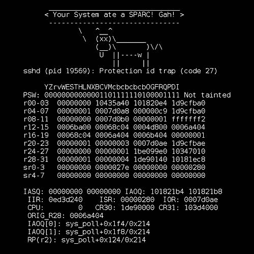

# 对坏主意的剖析

> 原文：<https://dev.to/codemouse92/anatomy-of-a-bad-idea-3o7>

我喜欢探索奇怪的想法。在我的同事中，我以此闻名。我喜欢为代码中的问题寻找不寻常的解决方案，有不少已经成功了。

今天的疯狂想法不在其中。

作为开发人员，我们经常喜欢分享我们的成功。我们甚至会冒险通过公开提问来展示我们不知道的东西。但是我们很少分享我们的失败。

老实说，我想知道为什么。也许这是我们的冒名顶替综合症在说话，或者也许我们只是害怕来自其他开发者的羞辱和破坏性的批评。

不管是什么原因，这真的很遗憾。我也犯过错误，我可以说，当事情变得不顺利时，我学到的要比事情变得顺利时多得多！

因此，从今天下午开始，我谦卑地向一个考虑不周的算法提供我自己的不幸遭遇。

* * *

这一切都是从我和我的程序员朋友 Richard 在 IRC 上聊天时开始的，聊到了一些我刚刚评审完的代码。他要求我提供链接，我也分享了，他指出了一些他能看到的改进。这就引出了对迭代器以及如何最好地从数组中移除元素的简短讨论，接着我提到了 [FlexArray](https://mousepawmedia.com/projects/libraries/pawlib) 。

一个想法开始在我脑海中形成。你知道当你从一个数组中移除一个元素时，你必须把它后面的所有元素都向左移动一个位置吗？这是我们永远无法在顺序阵列中真正解决的令人烦恼的昂贵问题之一。

我想，“嗯，如果我们能以某种方式将一个元素标记为死的，就像你在对象池中做的那样，并解决它，这不是很好吗？在某些情况下，如果有必要的话，你可以把那些昂贵的搬迁工作推迟到你希望 T1 去处理的时候。”

[T2】](https://res.cloudinary.com/practicaldev/image/fetch/s--LVcTPpIb--/c_limit%2Cf_auto%2Cfl_progressive%2Cq_66%2Cw_880/https://thepracticaldev.s3.amazonaws.com/i/pgpcsdcchdw03y31hr5f.gif)

从理论上讲，这非常合理。如果你把 20 张扑克牌放在桌子上，从中间拿走一张，你实际上没有*让*把最右边的 10 张牌滑过来填满这个位置。你可以决定把这个地方留作空白。节省了很多时间！

但是，**剧透预警**，计算机不会像人一样思考。这是一个基本事实，我们谁也想不明白。迟早，我们都会假设计算机也有和我们一样的思维捷径，只是因为*我们自己一半的时间都没有意识到这些捷径*。

例如，我们中的任何一个人都可以扫视一个有 30 个人的房间，并在瞬间挑出最高的人。然而，计算机必须有相当复杂的算法来做同样的事情。在某些问题上，我们的大脑比电脑工作得更快。射，我们的大脑自动执行微分方程来计算一辆路过的车到达给定点需要多长时间，而我们甚至从来不知道！我们还拥有更大的内存缓存、更快的 IO 时间、更多的输入和更好的多处理能力。

试想一下——你的脑袋里装着一台三磅重、[100t RAM](http://slate.me/1I6vYSp)的超并行处理超级计算机。难怪 AI 花了这么长时间才赶上。

当然，我还没有意识到我自己的超级计算机已经崩溃了。

[T2】](https://res.cloudinary.com/practicaldev/image/fetch/s--nYB8hLWr--/c_limit%2Cf_auto%2Cfl_progressive%2Cq_auto%2Cw_880/https://thepracticaldev.s3.amazonaws.com/i/iqrgz88x4f7o0nlo7k39.jpg)

* * *

我学到的一件事是在编写主要代码之前计划好一切。白板出来了，我开始讨论这是如何工作的。

```
Actual Index:   0  1  2  3  4  5  6  7 
Offset Index:   0  1     2  3     5  6
(X = ignored)  [ ][ ][X][ ][ ][X][ ][ ] 
```

Enter fullscreen mode Exit fullscreen mode

我想，如果我要将一个元素标记为 dead，也许用一个像“0xDEADBEEF”这样的幻值或一个布尔标志，我需要能够偏移索引来考虑我们忽略的所有那些元素。因此，在上面的例子中，如果用户想要索引 2，他们实际上想要内部索引 3。我如何可预测地偏移索引，以便用户总是访问预期的元素？这是最根本的问题。如果我能战胜它，我就能轻松完成剩下的工作了！

(顺便说一句——不要在存储中使用神奇的值——不管是什么面向用户的数据结构。对他们来说,`0xDEADBEEF`可能是一个完全有效的值。只有当你完全控制所有进入的数据时，这种变戏法才是可以接受的。)

快速而肮脏的方法显然是一次增加一个元素，如果该元素被标记为忽略(或“死”)，就跳过它。然而，我知道这种方法会大大降低 FlexArray 的速度，flex array 目前使用指针算法访问元素。

我突然想到:如果我为每个元素存储一个真/假值(“它死了，Jim”)，我只需要一个与内部数组长度相同的位集。然后我就可以用二进制来工作，也就是说*总是*要展示一个问题最有效的可能解决方案。我对二进制相当熟悉，所以我相信我可以找到一个完美的解决这个问题的方案。

我没花多长时间就算出了每次可靠访问偏移量索引*的数学方法。*

我将从表示元素可用(0)还是失效(1)的位开始。我决定把它命名为`db`(代表“DeadBeef”，而不是“DataBase”)。我还会有用户提供的所需元素的索引(`i`)。

```
db = 00100100
i = 5 
```

Enter fullscreen mode Exit fullscreen mode

为了让数学可靠地工作，我需要处理基于 0 的数字，所以我需要偏移我的长度(`l`)，基本上使它与最大可能的索引相同。

```
l = 7 
```

Enter fullscreen mode Exit fullscreen mode

我知道我需要忽略我们试图访问的索引后面的所有元素。如果在索引后面有任何死元素，简单的位移会丢弃任何不需要的信息。

```
db2 = db << l-i 
```

Enter fullscreen mode Exit fullscreen mode

现在我只需要数一下`db2`中的`1`的数量，我就能准确地知道要给`i`加多少才能得到内部索引！我离它如此之近，我能尝到它的味道。

[T2】](https://res.cloudinary.com/practicaldev/image/fetch/s--hLyzKkVs--/c_limit%2Cf_auto%2Cfl_progressive%2Cq_66%2Cw_880/https://thepracticaldev.s3.amazonaws.com/i/ngi41ptxxby8xt2ii09r.gif)

* * *

那么，如何计算二进制中 1 的个数呢？在 DuckDuckGo 上快速搜索发现这被称为“人口计数”，有时也被称为汉明重量。

值得庆幸的是，我有一本由小亨利·s·沃伦(Henry s . Warren Jr .)撰写的叫做 [*黑客的喜悦*的漂亮的小书，其中包含了关于如何高效执行复杂的二进制数学的详细讨论。我翻到关于人口统计的那一章(第五章，如果你有这本书的话)，开始阅读。](http://a.co/h2JT5Hh)

事实证明，计算 1 位比简单的数学运算要复杂得多。看，得到一个字节的总数是相当简单的——只需要几条指令，我们就可以了！然而，如果我们在不止一个字节内计数，事情就变得更棘手了。这是因为*显而易见的*方法——获取每个字节的总数并将其添加到累加器中——实际上是效率最低的方法之一。相反，我们可以使用一个*进位保存加法器*(或 CSA)来加速这个过程。

简而言之，如果你让 CSA 以 8 个为一组进行加法运算，你将花费 8 条指令*每字节*来获得任意大小数组的总数。(对那些跟随算法的人来说，那将是`O(n)`。)我知道，通过将 CSA 进程分成 16 组(每字节 7 条指令，或者每字节 32 - 6.5 条指令)，可能会使这个过程稍微有效一点，但是 8 有助于简单的计算(您很快就会看到)和非常接近的近似值。

[如果你想知道更多这是如何工作的，我强烈推荐拿起一本*黑客的喜悦*。

然而，有些事情不太对劲，我开始怀疑这个想法可能会失败。

[T2】](https://res.cloudinary.com/practicaldev/image/fetch/s--NsmB2cz8--/c_limit%2Cf_auto%2Cfl_progressive%2Cq_auto%2Cw_880/https://thepracticaldev.s3.amazonaws.com/i/k7bohfcg5l7ypne7q5um.jpeg)

* * *

这个`8n`周期的开销是在*访问*的每个元素上。数据缓存并不能真正克服这一点，因为我必须为每个可以想到的索引(整个数据结构的空间开销为`n`字节)存储*的偏移量，而且无论如何，我仍然必须在任何给定的索引第一次被访问时运行该操作。如果我添加或删除元素，我将不得不重新评估一切，或多或少。*

尽管如此，我还是决定把这个实验进行到底。也许费用仍然会比传统的一切都要转移的情况少？也许在某些情况下这是值得的？

当将一个元素从位置`n`复制到位置`n-1`时，通常有两条指令:(1)从`n`复制到缓存，以及(2)从缓存复制到`n-1`。(这是因为许多系统不能直接进行内存到内存的复制。)

有趣的是,“死区”访问元素操作和传统的移除元素操作共享相同的最坏情况——移除元素`0` -
,这使得比较更容易。

给定一个具有 1000 个元素的数组，移除`0`将需要 999 个元素向后移动一个位置，总共 1998 条指令。

给定相同的数组和一个“死”元素`0`，访问任何元素肯定需要计算偏移量，这将需要每个字节 8 条指令。每一位代表一个元素，一个字节有 8 位，所以指令是`8*n/8`，或者只是(方便地)`n`。换句话说，要计算一个 1000 个元素的数组的索引偏移量，我需要 1000 条指令，然后再用一些指令来完成剩下的运算。

或者，基本上，我会在每一次访问时，在*上查看大约一半的移除元素的指令计数。嗷。*

* * *

现在，一些 C++程序员可能正在对我大喊大叫，因为 *`std::bitset`已经有了一个`count()`函数！*

不要担心——我认为标准库可能从一开始就有类似的东西，但我总是以相同的方式处理这类问题:摆脱抽象，从底层解决它，然后将可用的抽象与理想的算法进行比较。

不出所料，`std::bitset::count`在我怀疑的地方进行了基准测试，因为前面提到的二进制数学是已知的最快的人口统计方法。(我认为他们使用 32 人一组，基于您稍后将看到的基准。)

下面是我的代码来测试我的数学和假设。

```
#include <bitset> #include <iostream> #include "pawlib/flex_array.hpp"  
int offset_index(int i, std::bitset<1024> db, int l)
{
    db.set(200,1);
    db.set(400,1);

    l = l - 1;
    std::bitset<1024> db2 = db << l-i;
    return i + db2.count();
}

int main()
{
    std::bitset<1024> db;
    int l = 1024;
    int i = 512;

    pawlib::FlexArray<int> arr;
    for (int n = 0; n < l; ++n)
    {
        arr.push(n);
    }

    std::cout << arr.getSize() << std::endl;

    int oi = offset_index(i, db, l);
    arr.yank(i);

    std::cout << oi << std::endl;

    return 0;
} 
```

Enter fullscreen mode Exit fullscreen mode

编译它，运行它通过`valgrind --tool=cachegrind`，然后查看函数`yank()`(从数组中移除第一个元素)和`offset_index()`的估计周期，证实了我的怀疑。

`pawlib::FlexArray<int>::yank(unsigned int)` : 476 周期
`offset_index(int, std::bitset<1024ul>, int)` : 261 周期

这些数字给棺材钉上了最后一颗钉子。这是一个糟糕的主意。

[T2】](https://res.cloudinary.com/practicaldev/image/fetch/s--cGBsrMZm--/c_limit%2Cf_auto%2Cfl_progressive%2Cq_66%2Cw_880/https://thepracticaldev.s3.amazonaws.com/i/xn1a3h10h4yeb4ibr5x2.gif)

* * *

现在，我们有了:我如何想出一个据说很棒的主意，测试它，然后像流言终结者一样把它炸成碎片的故事。

[T2】](https://res.cloudinary.com/practicaldev/image/fetch/s--f25VyxSi--/c_limit%2Cf_auto%2Cfl_progressive%2Cq_66%2Cw_880/https://thepracticaldev.s3.amazonaws.com/i/rp1o2ml32rl3kiqybj6o.gif)

那么，我们今天学到了什么？

1)无论我们如何努力，计算机都不会像我们一样思考。

2)通常，最明显的解决方案并不是最快的。我从来没有想到，仅仅将一堆字节的人口计数相加是解决问题最慢的方式！

3)摆脱抽象，在较低的层次上工作，给问题一个全新的视角...并可能为你省下几小时、几天、几周或几个月的痛苦和心痛。想象一下，如果我没有先调查它的内部工作原理就把这个想法付诸实施，那该有多好！

4)过早的优化可能是所有[各种]罪恶的根源，但是*未能考虑优化*也会产生同样多的结果。取得健康的平衡。

我还应该提醒你一些不是这里的教训！有些人会说，“你应该假设标准库的作者知道他们在做什么，你永远不会更快。”有一段时间，我可能会相信这一点，但在我去年看了`FlexArray`实际上*击败* `std::vector`之后，我知道情况并非总是如此。人们总是想出新的更好的主意。

这个想法可能并不新鲜。当然也不会更好。但它就在那里，也许别人可以借鉴！

* * *

轮到你了——你从哪些编程错误中吸取了教训？