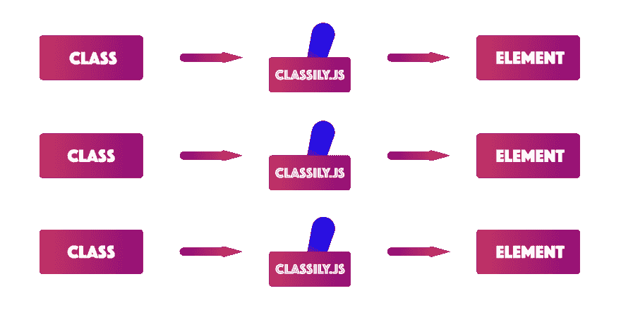

# js——更有类别地切换类别

> 原文:[https://dev.to/starbist/classilyjs-切换类-更高级-4ki](https://dev.to/starbist/classilyjs---toggling-classes-more-classily-4ki)

[T2】](https://www.silvestar.codes/articles/classily-js-toggling-classes-more-classily/)

*这篇文章最初发表于 [silvestar.codes](https://www.silvestar.codes/articles/classily-js-toggling-classes-more-classily/) 。*

我创建了一个`JavaScript`插件，用于切换更多的**类**，我把它命名为**[. js](https://github.com/maliMirkec/Classily.js)**。该插件简单而强大，如果使用正确，它可以解决不那么简单的任务。

## classily . js 是什么？

js 是一个`Javascript`插件，用来解决一个问题——在`HTML`元素上切换一个`CSS`类。当前版本的 Classily.js 有更多的特性，包括切换多个类和针对多个元素。

在我们看到运行中的插件之前，让我们看看如何安装它。

## 如何安装 Classily.js？

您可以通过从 GitHub:
克隆一个库来安装 Classily.js

```
git clone https://github.com/maliMirkec/Classily.js.git 
```

<svg width="20px" height="20px" viewBox="0 0 24 24" class="highlight-action crayons-icon highlight-action--fullscreen-on"><title>Enter fullscreen mode</title></svg> <svg width="20px" height="20px" viewBox="0 0 24 24" class="highlight-action crayons-icon highlight-action--fullscreen-off"><title>Exit fullscreen mode</title></svg>

或者使用 npm 安装:

```
npm install classily.js 
```

<svg width="20px" height="20px" viewBox="0 0 24 24" class="highlight-action crayons-icon highlight-action--fullscreen-on"><title>Enter fullscreen mode</title></svg> <svg width="20px" height="20px" viewBox="0 0 24 24" class="highlight-action crayons-icon highlight-action--fullscreen-off"><title>Exit fullscreen mode</title></svg>

或者使用纱线:

```
yarn add classily.js 
```

<svg width="20px" height="20px" viewBox="0 0 24 24" class="highlight-action crayons-icon highlight-action--fullscreen-on"><title>Enter fullscreen mode</title></svg> <svg width="20px" height="20px" viewBox="0 0 24 24" class="highlight-action crayons-icon highlight-action--fullscreen-off"><title>Exit fullscreen mode</title></svg>

或者使用 Bower:

```
bower install classily.js 
```

<svg width="20px" height="20px" viewBox="0 0 24 24" class="highlight-action crayons-icon highlight-action--fullscreen-on"><title>Enter fullscreen mode</title></svg> <svg width="20px" height="20px" viewBox="0 0 24 24" class="highlight-action crayons-icon highlight-action--fullscreen-off"><title>Exit fullscreen mode</title></svg>

## 如何初始化 Classily.js？

要初始化 Classily.js，将`script`标签添加到您的`HTML`文档:

```
<script src="/path/to/Classily.min.js"></script> 
```

<svg width="20px" height="20px" viewBox="0 0 24 24" class="highlight-action crayons-icon highlight-action--fullscreen-on"><title>Enter fullscreen mode</title></svg> <svg width="20px" height="20px" viewBox="0 0 24 24" class="highlight-action crayons-icon highlight-action--fullscreen-off"><title>Exit fullscreen mode</title></svg>

然后添加下面的代码:

```
<script>
  new Classily({
    selector: ".my-classily-element"
  });
</script> 
```

<svg width="20px" height="20px" viewBox="0 0 24 24" class="highlight-action crayons-icon highlight-action--fullscreen-on"><title>Enter fullscreen mode</title></svg> <svg width="20px" height="20px" viewBox="0 0 24 24" class="highlight-action crayons-icon highlight-action--fullscreen-off"><title>Exit fullscreen mode</title></svg>

其中`selector: ".my-classily-element"`是一个触发选择器——一个将触发类切换动作的元素——通常是一个锚或者一个按钮。默认选择器是`.js-classily`。

一旦你安装并初始化了这个插件，你就可以使用它了，并且会发现这个插件有很多新的用处。

## classily . js 有哪些选项？

可以向 Classily.js 传递两个主要选项:

*   `data-target`和
*   `data-class`。

`data-target`选项用于定位元素。我们通过为`querySelectorAll()`函数提供选择器来定位元素。

`data-class`选项用于传递将在目标元素上切换的类名。

我们可以通过用逗号分隔来提供多个目标和类。使用这两个选项，根据选项的传递方式，我们可以实现四种不同的场景:

*   在单个选择器上切换单个类，
*   在多个选择器上切换单个类，
*   在单个选择器上切换多个类
*   在多个选择器上切换多个类。

当选择器和类的数量相等时，每个选择器可以用一组不同的类来切换。例如，如果我们传递两个用逗号分隔的选择器和两个用逗号分隔的类，第一个类将在第一个选择器的目标元素上切换，第二个类将在第二个选择器的目标元素上切换。

[T2】](https://res.cloudinary.com/practicaldev/image/fetch/s--b8HSBSku--/c_limit%2Cf_auto%2Cfl_progressive%2Cq_auto%2Cw_880/https://thepracticaldev.s3.amazonaws.com/i/k0igzm9mmlggmchmy6pe.png)

当选择器和类的数量不相等时，所有提供的类将在每个选择器指向的每个元素上切换。例如，如果我们传递两个用逗号分隔的选择器和三个用逗号分隔的类，那么这三个类都将在两个选择器指向的每个元素上切换。

足够的理论，让我们看看这个插件的行动。

## 如何使用 Classily.js？

要触发类切换动作，您应该添加以下代码:

```
<button type="button"
  class="js-classily"
  data-target=".my-class"
  data-class="blue">
  Toggle
</button>
...
<div class="my-class">...</div> 
```

<svg width="20px" height="20px" viewBox="0 0 24 24" class="highlight-action crayons-icon highlight-action--fullscreen-on"><title>Enter fullscreen mode</title></svg> <svg width="20px" height="20px" viewBox="0 0 24 24" class="highlight-action crayons-icon highlight-action--fullscreen-off"><title>Exit fullscreen mode</title></svg>

在哪里

*   `class="js-classily"`用作插件初始化的选择器(参见 *[如何初始化 classily . js](https://dev.toHow-to-initialize-Classily-js)*)；
*   `data-target=".my-class"`用于目标元素或将要切换的元素类；
*   `data-class="blue"`用于提供一个或多个将被切换的类。

如你所见，Classily.js 使用起来并不复杂。事实上，它看起来不能做太多，但我想向你保证，情况并非如此。留在我身边；我将通过例子来指导你。

## 如何在多个元素上切换同一类？

如果你点击下面例子中的“切换按钮”,你会看到两个标题都改变了颜色。

[https://code codes . io/cita/pen/poanej/](https://codepen.io/CiTA/pen/POaNEj/)

下面是代码:

```
<button class="js-classily"
  type="button"
  data-target=".my-class"
  data-class="blue">
  Toggle class
</button>
...
<h1 class="my-class">...</h1>
<h1 class="my-class">...</h1> 
```

<svg width="20px" height="20px" viewBox="0 0 24 24" class="highlight-action crayons-icon highlight-action--fullscreen-on"><title>Enter fullscreen mode</title></svg> <svg width="20px" height="20px" viewBox="0 0 24 24" class="highlight-action crayons-icon highlight-action--fullscreen-off"><title>Exit fullscreen mode</title></svg>

通过在目标元素上添加相同的类`.my-class`,我们同时瞄准了两个标题。那是因为 Classily.js 使用了`querySelectorAll()`函数。

还有另一种方法可以达到同样的效果——我们可以提供一个逗号分隔的选择器列表。

## 如何在多个元素上切换多个类？

在下面的例子中，我们在两个独立的元素上切换两个不同的类。

[https://code codes . io/cita/pen/vrdak/](https://codepen.io/CiTA/pen/VrdaGK/)

逗号分隔的选择器的数量必须与逗号分隔的类的数量相匹配。注意，第二个元素切换了两个不同的类，`hidden`和`blue`——我们可以通过使用空格作为分隔符来提供多个类。

```
<button type="button"
  class="js-classily"
  data-target=".my-first-target, .my-second-target"
  data-class="blue, hidden blue">
  Toggle classes
</button>
...
<h1 class="my-first-target">...</h1>
<h1 class="my-second-target">...</h1> 
```

<svg width="20px" height="20px" viewBox="0 0 24 24" class="highlight-action crayons-icon highlight-action--fullscreen-on"><title>Enter fullscreen mode</title></svg> <svg width="20px" height="20px" viewBox="0 0 24 24" class="highlight-action crayons-icon highlight-action--fullscreen-off"><title>Exit fullscreen mode</title></svg>

很棒，对吧。你准备好更高级的例子了吗？

## 如何使用 Classily.js 进行状态切换？

在下面的示例中，标题可能有三种状态:

*   默认状态，
*   “蓝色”状态，
*   “红色”状态和
*   “黄金”州。

一旦我们激活了“蓝色”、“红色”或“金色”状态，航向就再也不会回到默认状态。

[https://codepen.io/CiTA/pen/pdKbzY](https://codepen.io/CiTA/pen/pdKbzY)

为了创造同样的效果，想想你应该写多少行`JavaScript`代码。现在让我们看看如何使用 Classily.js:
来达到这个效果

```
<button type="button"
  class="js-classily"
  data-target=".my-class.red, .my-class.gold, .my-class:not(.blue)"
  data-class="red, gold, blue">
  Toggle Blue
</button>
...
<h1 class="my-class">...</h1> 
```

<svg width="20px" height="20px" viewBox="0 0 24 24" class="highlight-action crayons-icon highlight-action--fullscreen-on"><title>Enter fullscreen mode</title></svg> <svg width="20px" height="20px" viewBox="0 0 24 24" class="highlight-action crayons-icon highlight-action--fullscreen-off"><title>Exit fullscreen mode</title></svg>

首先，我们以具有`.red`类的`.my-class`元素为目标。如果没有这样的元素，Classily.js 会跳过这一步。如果元素存在，那么我们删除`.red`类。对`.gold`类重复同样的操作。然后，我们的目标是不包含`.blue`类的`.my-class`元素。如果元素存在，那么添加`.blue`类。标题现在处于“蓝色”状态。“红色”和“金色”州也是如此。

上述方法可以应用于创建选项卡部分，例如，在许多网站上看到的功能。当用户点击一个标签，不同的内容出现。

## classily . js 有特色吗？

通常需要切换元素本身的状态，就像这个例子中的按钮。

[https://codepen.io/CiTA/pen/JOZKEb](https://codepen.io/CiTA/pen/JOZKEb)

为了避免使用复杂的选择器，我们可以使用关键字`this`。

```
<a href="https://github.com/maliMirkec/Classily.js"
  class="button-switch js-classily"
  data-target="this"
  data-class="button-switch--off"
  data-prevent="default">
  ...
</a> 
```

<svg width="20px" height="20px" viewBox="0 0 24 24" class="highlight-action crayons-icon highlight-action--fullscreen-on"><title>Enter fullscreen mode</title></svg> <svg width="20px" height="20px" viewBox="0 0 24 24" class="highlight-action crayons-icon highlight-action--fullscreen-off"><title>Exit fullscreen mode</title></svg>

在这个例子中，我们使用锚标记作为按钮。还有一个有用的特性——我们可以防止默认行为，比如打开一个链接。为此，我们应该使用`data-prevent="default"`选项。

更多 Classily.js 示例，请查看这个 [Codepen 集合](https://codepen.io/collection/nJZLYz/)。

## 结论

Classily.js 正在帮助我处理日常工作。我不再需要从模板文件跳到脚本文件来执行简单的任务，比如类切换。我可以用它实现一些非常漂亮的技巧。

[分享吧](https://facebook.com/sharer.php?u=https://www.silvestar.codes/articles/classily-js-toggling-classes-more-classily/)，[喜欢吧](https://www.npmjs.com/package/classily.js)，[明星吧](https://github.com/maliMirkec/Classily.js)，[推特吧](https://twitter.com/intent/tweet?url=https://www.silvestar.codes/articles/classily-js-toggling-classes-more-classily/&text=Classily.js%20-%20Toggling%20classes%20more%20classily&via=malimirkeccita)！

此外，如果您发现任何问题，请不要犹豫[报告问题](https://github.com/maliMirkec/Classily.js/issues/new)。如果你知道如何测试这个插件，请告诉我。

# 链接

github:https://github . com/malimirkec/classic . js
【NPM:https://www . npmj . com/package/classic . js
代码:https://code en . io/collection/njzlyz/

🤘