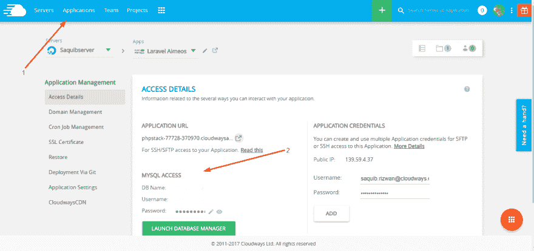
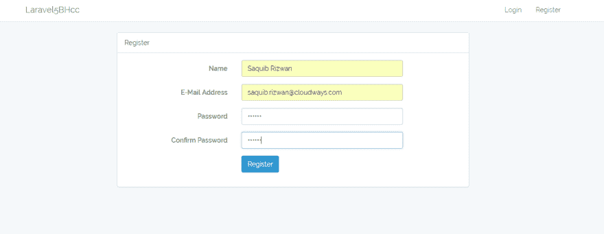
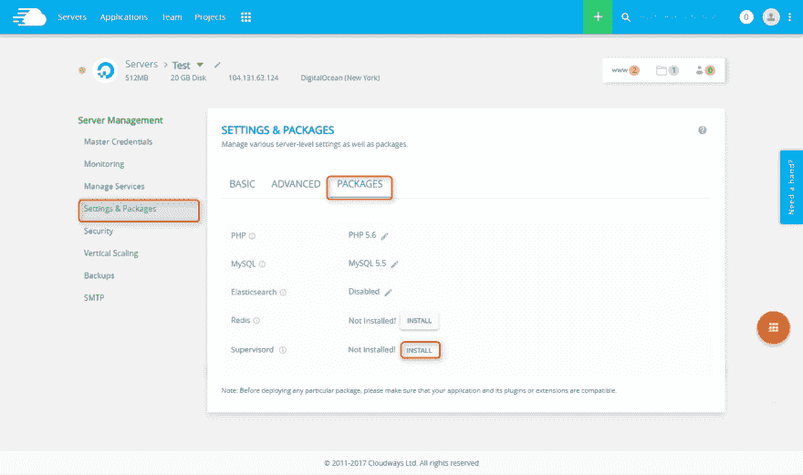
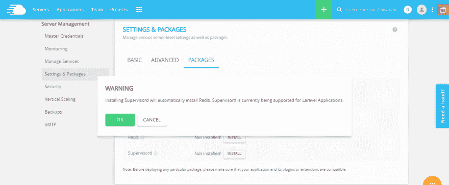
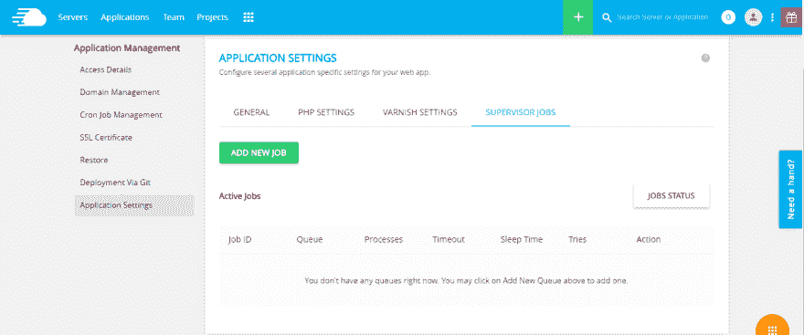
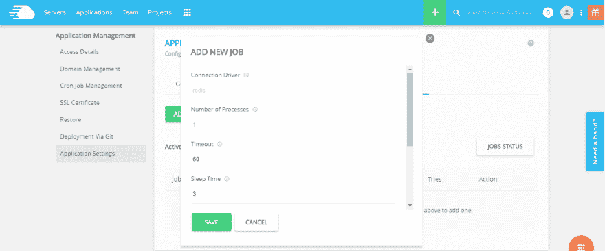
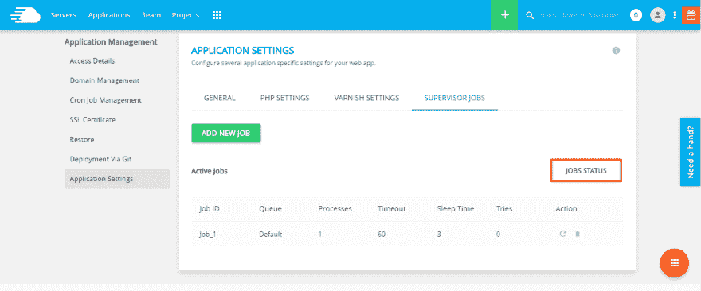
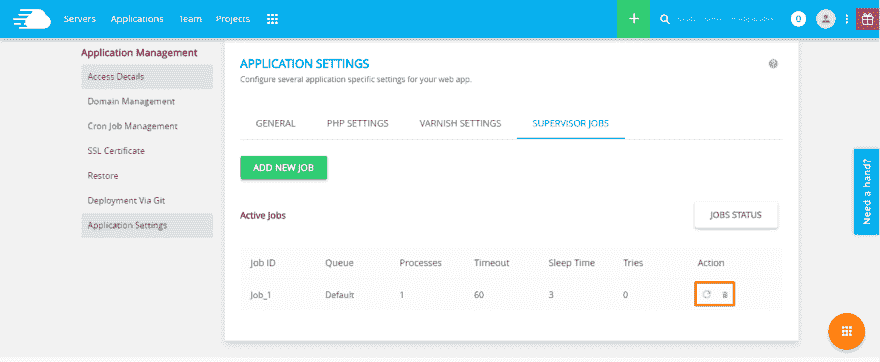

# 创建和管理用户注册系统与 Laravel 队列和主管

> 原文:[https://dev.to/rizwan_saquib/create-管理-用户-注册-系统-排队-主管-nl](https://dev.to/rizwan_saquib/create--manage-user-registration-system-with-laravel-queues--supervisor-nl)

随着 Laravel 5.5 和 Laravel Horizon 的最新发布，该框架现在提供了队列管理。Laravel 队列允许您将耗时的任务(例如发送电子邮件)推迟到以后处理。这加快了应用程序的 web 请求处理速度。

在本文中，我将创建一个用户注册系统，它向用户发送一封验证邮件。为了演示 Laravel 队列的功能及其对应用程序速度的影响，我将让它管理电子邮件发送过程。以便应用程序执行得更快。

出于本教程的目的，我将使用 Cloudways 平台，因为它为 Laravel 应用程序提供了受监督的队列管理器。首先，我将启动一个安装了 Laravel 应用程序的 Cloudways 服务器。

PS:如果你在注册和服务器启动过程中需要帮助，这里有一个方便的 GIF:

[T2】](https://res.cloudinary.com/practicaldev/image/fetch/s--32b1rqH0--/c_limit%2Cf_auto%2Cfl_progressive%2Cq_66%2Cw_880/http://www.cloudways.com/blog/wp-content/uploads/Laravel-Gif.gif)

## 配置。环境文件

现在您已经安装了 Laravel 应用程序，下一步是数据库配置。

我将使用 Gmail 向[发送验证邮件](http://www.cloudways.com/blog/send-email-in-laravel/)。在 Cloudways 平台中打开**应用**选项卡。在* *应用程序访问* *详细信息中，您将看到数据库路径和凭据。

[T2】](https://res.cloudinary.com/practicaldev/image/fetch/s--HTKbywlX--/c_limit%2Cf_auto%2Cfl_progressive%2Cq_auto%2Cw_880/https://www.cloudways.com/blog/wp-content/uploads/image2-64.png)

现在转到**。env** 文件(位于应用程序的公共根文件夹中)并在那里添加凭证:

```
 QUEUE_DRIVER=database

DB_CONNECTION=mysql

DB_HOST=127.0.0.1

DB_PORT=3306

DB_DATABASE= your.database.name                                                                                                                            

DB_USERNAME= your.database.username                                                                                                                             

DB_PASSWORD= your.database.password

MAIL_DRIVER=smtp

MAIL_HOST=smtp.gmail.com

MAIL_PORT=587

MAIL_USERNAME=Saquib.gt@xyz.com

MAIL_PASSWORD=

MAIL_ENCRYPTION=tls

MAIL_FROM_ADDRESS=Saquib.gt@xyz.com

MAIL_FROM_NAME="Saquib Rizwan” 
```

<svg width="20px" height="20px" viewBox="0 0 24 24" class="highlight-action crayons-icon highlight-action--fullscreen-on"><title>Enter fullscreen mode</title></svg> <svg width="20px" height="20px" viewBox="0 0 24 24" class="highlight-action crayons-icon highlight-action--fullscreen-off"><title>Exit fullscreen mode</title></svg>

## 创建 Laravel 授权

要创建用户注册系统，我需要做的第一件事是使用:
创建一个 Laravel auth

```
 php artisan make:auth 
```

<svg width="20px" height="20px" viewBox="0 0 24 24" class="highlight-action crayons-icon highlight-action--fullscreen-on"><title>Enter fullscreen mode</title></svg> <svg width="20px" height="20px" viewBox="0 0 24 24" class="highlight-action crayons-icon highlight-action--fullscreen-off"><title>Exit fullscreen mode</title></svg>

## 更新用户表

让我们首先为用户更新现有的迁移文件。打开用户表迁移文件(位于 database/migrations 文件夹中)，并在其中添加两个新列，一个用于电子邮件令牌，另一个用于检查用户是否已经过验证。

以下是用户表的更新模式:

```
 Schema::create(‘users’, function (Blueprint $table) {

$table->increments(‘id’);

$table->string(‘name’);

$table->string(‘email’)->unique();

$table->string(‘password’);

$table->tinyInteger(‘verified’)->default(0);

$table->string(‘email_token’)->nullable();

$table->rememberToken();

$table->timestamps();

}); 
```

<svg width="20px" height="20px" viewBox="0 0 24 24" class="highlight-action crayons-icon highlight-action--fullscreen-on"><title>Enter fullscreen mode</title></svg> <svg width="20px" height="20px" viewBox="0 0 24 24" class="highlight-action crayons-icon highlight-action--fullscreen-off"><title>Exit fullscreen mode</title></svg>

## 为队列创建表格

我现在将添加队列作业和失败作业的表。为此，运行以下 Artisan 命令:

```
 php artisan queue:table

php artisan queue:failed-table 
```

<svg width="20px" height="20px" viewBox="0 0 24 24" class="highlight-action crayons-icon highlight-action--fullscreen-on"><title>Enter fullscreen mode</title></svg> <svg width="20px" height="20px" viewBox="0 0 24 24" class="highlight-action crayons-icon highlight-action--fullscreen-off"><title>Exit fullscreen mode</title></svg>

## 迁移表格

现在我已经有了所有需要的表，我将使用下面的 Artisan 命令来迁移它:

```
php artisan migrate 
```

<svg width="20px" height="20px" viewBox="0 0 24 24" class="highlight-action crayons-icon highlight-action--fullscreen-on"><title>Enter fullscreen mode</title></svg> <svg width="20px" height="20px" viewBox="0 0 24 24" class="highlight-action crayons-icon highlight-action--fullscreen-off"><title>Exit fullscreen mode</title></svg>

[T2】](https://res.cloudinary.com/practicaldev/image/fetch/s--yqELrN43--/c_limit%2Cf_auto%2Cfl_progressive%2Cq_auto%2Cw_880/https://thepracticaldev.s3.amazonaws.com/i/4mdqqrv3njd7pf3m8gx7.png)

一旦命令完成，所有的表都将生成。

## 创建邮件并查看邮件验证

既然我已经设置了 SMTP 来发送电子邮件，现在是时候创建一个 email 类，它将返回视图和令牌，以便随电子邮件一起发送。运行以下 Artisan 命令创建电子邮件设置:

```
php artisan make:mail EmailVerification 
```

<svg width="20px" height="20px" viewBox="0 0 24 24" class="highlight-action crayons-icon highlight-action--fullscreen-on"><title>Enter fullscreen mode</title></svg> <svg width="20px" height="20px" viewBox="0 0 24 24" class="highlight-action crayons-icon highlight-action--fullscreen-off"><title>Exit fullscreen mode</title></svg>

该命令完成后，将在 app 文件夹中创建一个名为 Mail 的新文件夹以及* * EmailVerification * *类文件。我将在发送电子邮件时调用此文件。

## [T1】更新 EmailVerification 类](#update-the-emailverification-class)

这个类有两个方法。第一个是**构造函数()，**，第二个是**构建函数()，**，它们将完成大部分工作。它将视图与电子邮件绑定在一起。

我将随视图一起发送一个用户令牌，以便可以验证用户。为此，在类中添加一个名为 **$user** :
的新受保护变量

```
 protected $user; 
```

<svg width="20px" height="20px" viewBox="0 0 24 24" class="highlight-action crayons-icon highlight-action--fullscreen-on"><title>Enter fullscreen mode</title></svg> <svg width="20px" height="20px" viewBox="0 0 24 24" class="highlight-action crayons-icon highlight-action--fullscreen-off"><title>Exit fullscreen mode</title></svg>

现在，在构造函数中添加一个新的 **$user** 参数，并将其传递给类变量 **$user** 。

```
 public function __construct($user)

{

//.

$this->user = $user;

}

Next, update the **build()** method so that it can return a view along with the user token.

public function build()

{

return $this->view(‘email.email’)->with([

‘email_token’ => $this->user->email_token,

]);

} 
```

<svg width="20px" height="20px" viewBox="0 0 24 24" class="highlight-action crayons-icon highlight-action--fullscreen-on"><title>Enter fullscreen mode</title></svg> <svg width="20px" height="20px" viewBox="0 0 24 24" class="highlight-action crayons-icon highlight-action--fullscreen-off"><title>Exit fullscreen mode</title></svg>

## 创建邮件模板

为了创建电子邮件模板，在**视图**文件夹内创建一个名为**电子邮件、**的新文件夹，然后在该文件夹内创建一个名为【email.blade.php】T4 的新文件。这个文件将包含以下简单的模板:

```
<h1>Click the Link To Verify Your Email</h1>

Click the following link to verify your email {{url(‘/verifyemail/’.$email_token)}} 
```

<svg width="20px" height="20px" viewBox="0 0 24 24" class="highlight-action crayons-icon highlight-action--fullscreen-on"><title>Enter fullscreen mode</title></svg> <svg width="20px" height="20px" viewBox="0 0 24 24" class="highlight-action crayons-icon highlight-action--fullscreen-off"><title>Exit fullscreen mode</title></svg>

电子邮件的视图现在已经完成。接下来，我将创建一个新队列，向注册用户发送电子邮件。

## 创建 SendVerficationEmail 队列作业

现在运行下面的 Artisan 命令来创建一个新的队列作业

```
php artisan make:job SendVerificationEmail 
```

<svg width="20px" height="20px" viewBox="0 0 24 24" class="highlight-action crayons-icon highlight-action--fullscreen-on"><title>Enter fullscreen mode</title></svg> <svg width="20px" height="20px" viewBox="0 0 24 24" class="highlight-action crayons-icon highlight-action--fullscreen-off"><title>Exit fullscreen mode</title></svg>

当该命令完成时，名为 **Jobs** 的新文件夹与 **SendVerificationEmail** 作业类一起出现在 app 文件夹中。我现在将编辑这个文件，以便它可以用来发送电子邮件。

首先，在其中添加 Mail 和 EmailVerification 名称空间。

```
use Mail;

use App\Mail\EmailVerification; 
```

<svg width="20px" height="20px" viewBox="0 0 24 24" class="highlight-action crayons-icon highlight-action--fullscreen-on"><title>Enter fullscreen mode</title></svg> <svg width="20px" height="20px" viewBox="0 0 24 24" class="highlight-action crayons-icon highlight-action--fullscreen-off"><title>Exit fullscreen mode</title></svg>

现在创建一个新的受保护变量， **$user** (也是在 **EmailVerification** 类中创建的)。接下来，在**构造函数()**中添加一个新参数 **$user** ，并将其值传递给类 **$user** 变量:

```
 protected $user;

public function __construct($user)

{

$this->user = $user;

}

Next, I will set up email sending process inside the **handle()** method.

public function handle()

{

$email = new EmailVerification($this->user);

Mail::to($this->user->email)->send($email);

} 
```

<svg width="20px" height="20px" viewBox="0 0 24 24" class="highlight-action crayons-icon highlight-action--fullscreen-on"><title>Enter fullscreen mode</title></svg> <svg width="20px" height="20px" viewBox="0 0 24 24" class="highlight-action crayons-icon highlight-action--fullscreen-off"><title>Exit fullscreen mode</title></svg>

**handle * *函数创建一个电子邮件验证模板的实例，该实例被传递给**Mail** 用于向用户发送电子邮件。

## 更新授权注册流程

在开始之前，在**用户**模型的 **$fillable** 数组中添加“ **email_token** ”。

```
 protected $fillable = [

‘name’, ‘email’, ‘password’,’email_token’

]; 
```

<svg width="20px" height="20px" viewBox="0 0 24 24" class="highlight-action crayons-icon highlight-action--fullscreen-on"><title>Enter fullscreen mode</title></svg> <svg width="20px" height="20px" viewBox="0 0 24 24" class="highlight-action crayons-icon highlight-action--fullscreen-off"><title>Exit fullscreen mode</title></svg>

现在打开**RegisterController.php**文件(位于 Controller/Authfolder 内)。

首先添加以下名称空间:

```
 use Illuminate\Auth\Events\Registered;

use Illuminate\Http\Request;

use App\Jobs\SendVerificationEmail; 
```

<svg width="20px" height="20px" viewBox="0 0 24 24" class="highlight-action crayons-icon highlight-action--fullscreen-on"><title>Enter fullscreen mode</title></svg> <svg width="20px" height="20px" viewBox="0 0 24 24" class="highlight-action crayons-icon highlight-action--fullscreen-off"><title>Exit fullscreen mode</title></svg>

现在修改 **create()** 方法，并在其中添加 **email_token** 。

```
 protected function create(array $data)

{

return User::create([

‘name’ => $data[‘name’],

‘email’ => $data[‘email’],

‘password’ => bcrypt($data[‘password’]),

‘email_token’ => base64_encode($data[‘email’])

]);

} 
```

<svg width="20px" height="20px" viewBox="0 0 24 24" class="highlight-action crayons-icon highlight-action--fullscreen-on"><title>Enter fullscreen mode</title></svg> <svg width="20px" height="20px" viewBox="0 0 24 24" class="highlight-action crayons-icon highlight-action--fullscreen-off"><title>Exit fullscreen mode</title></svg>

对于电子邮件令牌，我对用户的电子邮件地址使用了 base64 编码。接下来，我在其中添加了以下两个新函数:

```
 /**

* Handle a registration request for the application.

*

* @param \Illuminate\Http\Request $request

* @return \Illuminate\Http\Response

*/

public function register(Request $request)

{

$this->validator($request->all())->validate();

event(new Registered($user = $this->create($request->all())));

dispatch(new SendVerificationEmail($user));

return view(‘verification’);

}

/**

* Handle a registration request for the application.

*

* @param $token

* @return \Illuminate\Http\Response

*/

public function verify($token)

{

$user = User::where(‘email_token’,$token)->first();

$user->verified = 1;

if($user->save()){

return view(‘emailconfirm’,[‘user’=>$user]);

}

} 
```

<svg width="20px" height="20px" viewBox="0 0 24 24" class="highlight-action crayons-icon highlight-action--fullscreen-on"><title>Enter fullscreen mode</title></svg> <svg width="20px" height="20px" viewBox="0 0 24 24" class="highlight-action crayons-icon highlight-action--fullscreen-off"><title>Exit fullscreen mode</title></svg>

我所做的是覆盖* * register()* *父方法，并在其中添加两行。

```
dispatch(new SendVerificationEmail($user));

return view(‘verification’); 
```

<svg width="20px" height="20px" viewBox="0 0 24 24" class="highlight-action crayons-icon highlight-action--fullscreen-on"><title>Enter fullscreen mode</title></svg> <svg width="20px" height="20px" viewBox="0 0 24 24" class="highlight-action crayons-icon highlight-action--fullscreen-off"><title>Exit fullscreen mode</title></svg>

这样，电子邮件被发送到队列中。我不会直接登录用户，而是将他重定向到另一个页面，该页面会要求他验证其电子邮件以便继续。接下来，我创建了一个新的 **verify()** 方法来验证用户和令牌。

接下来，我将创建我在这两个方法中调用的视图。

在 views 文件夹中创建一个名为**emailconfirm.blade.php**的新文件，并将以下代码粘贴到其中。

```
 @extends(‘layouts.app’)

@section(‘content’)

<div class="container”>

<div class="row”>

<div class="col-md-8 col-md-offset-2">

<div class="panel panel-default”>

<div class="panel-heading”>Registration Confirmed</div>

<div class="panel-body”>

Your Email is successfully verified. Click here to <a href="{{url(‘/login’)}}”>login</a>

</div>

</div>

</div>

</div>

</div>

@endsection 
```

<svg width="20px" height="20px" viewBox="0 0 24 24" class="highlight-action crayons-icon highlight-action--fullscreen-on"><title>Enter fullscreen mode</title></svg> <svg width="20px" height="20px" viewBox="0 0 24 24" class="highlight-action crayons-icon highlight-action--fullscreen-off"><title>Exit fullscreen mode</title></svg>

在视图文件夹中创建另一个名为**verification.blade.php**的文件。将以下代码粘贴到其中。

```
 @extends(‘layouts.app’)

@section(‘content’)

<div class="container”>

<div class="row”>

<div class="col-md-8 col-md-offset-2">

<div class="panel panel-default”>

<div class="panel-heading”>Registration</div>

<div class="panel-body”>

You have successfully registered. An email is sent to you for verification.

</div>

</div>

</div>

</div>

</div>

@endsection 
```

<svg width="20px" height="20px" viewBox="0 0 24 24" class="highlight-action crayons-icon highlight-action--fullscreen-on"><title>Enter fullscreen mode</title></svg> <svg width="20px" height="20px" viewBox="0 0 24 24" class="highlight-action crayons-icon highlight-action--fullscreen-off"><title>Exit fullscreen mode</title></svg>

此时，代码已经完成，可以使用了。让我们试一试。

在**web.php**文件中添加以下路线供用户验证:

```
 Route::get(‘/verifyemail/{token}’, ‘Auth\RegisterController@verify’); 
```

<svg width="20px" height="20px" viewBox="0 0 24 24" class="highlight-action crayons-icon highlight-action--fullscreen-on"><title>Enter fullscreen mode</title></svg> <svg width="20px" height="20px" viewBox="0 0 24 24" class="highlight-action crayons-icon highlight-action--fullscreen-off"><title>Exit fullscreen mode</title></svg>

## 测试邮件验证流程

在命令行中，执行以下命令开始监听队列。

```
php artisan queue:work 
```

<svg width="20px" height="20px" viewBox="0 0 24 24" class="highlight-action crayons-icon highlight-action--fullscreen-on"><title>Enter fullscreen mode</title></svg> <svg width="20px" height="20px" viewBox="0 0 24 24" class="highlight-action crayons-icon highlight-action--fullscreen-off"><title>Exit fullscreen mode</title></svg>

保持命令行窗口打开，并在另一个选项卡中打开注册页面。填写表格并注册一个新用户。

[T2】](https://res.cloudinary.com/practicaldev/image/fetch/s--mUJJU3_d--/c_limit%2Cf_auto%2Cfl_progressive%2Cq_auto%2Cw_880/https://thepracticaldev.s3.amazonaws.com/i/lhttwsrfwrnmzw5dsonq.png)

单击 Register 按钮后，您会注意到注册确认页面会很快打开，因为它会被分派到队列中。

[T2】](https://res.cloudinary.com/practicaldev/image/fetch/s--dZyxMswD--/c_limit%2Cf_auto%2Cfl_progressive%2Cq_auto%2Cw_880/https://thepracticaldev.s3.amazonaws.com/i/5hsre4cenc4l39poydq7.png)

现在看看命令行:一个新的作业已经成功处理。

[T2】](https://res.cloudinary.com/practicaldev/image/fetch/s--j8S4tOUF--/c_limit%2Cf_auto%2Cfl_progressive%2Cq_auto%2Cw_880/https://thepracticaldev.s3.amazonaws.com/i/26inthrcdglnpd8yx3o2.png)

这意味着已经向用户发送了一封电子邮件。

[T2】](https://res.cloudinary.com/practicaldev/image/fetch/s--644XyRwn--/c_limit%2Cf_auto%2Cfl_progressive%2Cq_auto%2Cw_880/https://thepracticaldev.s3.amazonaws.com/i/dy1ouuexps3mfni9dr7y.png)

当用户点击链接时，他/她将被验证:

[T2】](https://res.cloudinary.com/practicaldev/image/fetch/s--UPvk9fYX--/c_limit%2Cf_auto%2Cfl_progressive%2Cq_auto%2Cw_880/https://thepracticaldev.s3.amazonaws.com/i/kyxddt257qopejyt34ww.png)

一旦关闭终端，队列将停止工作。如果您希望队列继续工作，您需要使用受监督的队列管理器。

## 安装监控程序

进入**服务器管理>T3】设置&套餐>T6】套餐**。单击超级用户旁边的* *安装* *按钮开始安装过程。

[T2】](https://res.cloudinary.com/practicaldev/image/fetch/s--yp-Grcgk--/c_limit%2Cf_auto%2Cfl_progressive%2Cq_auto%2Cw_880/https://thepracticaldev.s3.amazonaws.com/i/901qywjxwjcsugx7f0f5.jpg)

在这个过程开始之前，将要求您在服务器上安装 Redis(如果尚未安装的话)，因为 Laravel 队列需要它。等待安装过程完成。

[T2】](https://res.cloudinary.com/practicaldev/image/fetch/s--c4kxVCND--/c_limit%2Cf_auto%2Cfl_progressive%2Cq_auto%2Cw_880/https://thepracticaldev.s3.amazonaws.com/i/d4oe5zg3an1tpfmpkkyc.png)

注意:您可以从**管理服务**部分查看 Supervisord 服务状态。如果需要，您甚至可以重新启动服务。

## 添加新工作

在**应用管理**下，进入**应用设置* *并选择* *主管工作**选项卡。单击添加新职务按钮为主管添加职务。

[T2】](https://res.cloudinary.com/practicaldev/image/fetch/s--sdq2_KcD--/c_limit%2Cf_auto%2Cfl_progressive%2Cq_auto%2Cw_880/https://thepracticaldev.s3.amazonaws.com/i/9hi3clil3d8ommpfp035.png)

[T2】](https://res.cloudinary.com/practicaldev/image/fetch/s---LduvkgI--/c_limit%2Cf_auto%2Cfl_progressive%2Cq_auto%2Cw_880/https://thepracticaldev.s3.amazonaws.com/i/7loam3we2cilzijc8fkk.png)

**注意:**一旦创建了作业，Supervisord 将使用平台默认的 Artisan 路径，该路径应该是**/home/master/applications/public _ html/Artisan**。

## 作业状态等选项

可以通过单击作业状态按钮来检查作业状态。

[T2】](https://res.cloudinary.com/practicaldev/image/fetch/s--wIf5WJOB--/c_limit%2Cf_auto%2Cfl_progressive%2Cq_auto%2Cw_880/https://thepracticaldev.s3.amazonaws.com/i/u4kf51a1vsx7e3uek559.png)

这将显示作业的状态和其他相关信息，包括正常运行时间。

如果要重新启动任何作业，请单击它前面的图标。还可以通过单击删除图标来删除任何作业。

[T2】](https://res.cloudinary.com/practicaldev/image/fetch/s--W8seszSW--/c_limit%2Cf_auto%2Cfl_progressive%2Cq_auto%2Cw_880/https://thepracticaldev.s3.amazonaws.com/i/xmvu1094mfax99dseo8m.png)

这将监督您的 Laravel 队列并保持它们正常运行。

## 结论

在本文中，我演示了如何通过构建一个用户注册系统来使用 Laravel 队列。此外，我还展示了如何在主管的帮助下保持流程正常运行。如果您需要任何帮助，请发表评论。