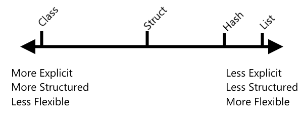

# 雷电结构

> 原文:[https://dev.to/rpalo/thunder-struct-c5p](https://dev.to/rpalo/thunder-struct-c5p)

我刚刚发现 Ruby 中这个超级方便的内置类叫做`Struct`，我想分享一下。

## 什么是结构

简单地说，`Struct`是一个数据对象，它模拟了一种快速声明类的方法。程序中的一个常见需求是将一堆相关的数据粘在一起。你可以把我们的选择看作是一种连续体。

[T2】](https://res.cloudinary.com/practicaldev/image/fetch/s--Rk9Xjiko--/c_limit%2Cf_auto%2Cfl_progressive%2Cq_auto%2Cw_880/https://assertnotmagic.com/img/struct-continuum.png)

例如，假设您有一个想要跟踪的学生成绩。您可以定义一个类来显式地展示您的数据结构。

```
class Grade
  attr_reader :assignment, :number_grade, :letter_grade

  def initialize(assignment, number_grade, letter_grade)
    @assignment = assignment
    @number_grade = number_grade
    @letter_grade = letter_grade
  end
end

jerrys_grade = Grade.new("Physics Quiz #3", 85, "B") 
```

或者，看到所有的打字，你可能会激烈地反应过度，走向相反的方向。

```
jerrys_grade = ["Physics Quiz #3", 85, "B"] 
```

对于这样一个简单的数据对象，还没有真正的方法来定义，我想很多人的第一个想法是尽量处于中间位置。

```
jerrys_grade = {
  assignment: "Physics Quiz #3",
  number_grade: 85,
  letter_grade: "B"
} 
```

但是还有另一种更棒的方式(是的，我说过了):那就是`Struct`。

```
Grade = Struct.new(:assignment, :number_grade, :letter_grade)

jerrys_grade = Grade.new("Physics Quiz #3", 85, "B") 
```

## 我用它做什么？

很酷，因为它们在你如何访问和使用数据方面给了你很大的灵活性，而不放弃任何明确性。

```
jerrys_grade.assignment
# => "Physics Quiz #3"
jerrys_grade["number_grade"]
# => 85
jerrys_grade[:letter_grade]
# => "B"

# Jerry must have done some extra credit
jerrys_grade.number_grade += 10
jerrys_grade["letter_grade"] = "A" 
```

它们还预先构建了一些特性，如果您使用实际的`class`定义，您必须自己构建这些特性。

```
# Equality
doras_grade = Grade.new("Physics Quiz #3", 95, "A")
doras_grade == jerrys_grade
# => true

# Can be enumerated
jerrys_grade.each { |datapoint| puts datapoint }
# => Physics Quiz #3
# => 95
# => A

# Or enumerated like a hash with key and value
doras_grade.each_pair { |key, value| puts "#{key}: #{value}" }
# => assignment: Physics Quiz #3
# => number_grade: 95
# => letter_grade: A

# Can be converted to an array or hash
jerrys_grade.to_a
# => ["Physics Quiz #3", 95, "A"]
doras_grade.to_h
# => {assignment: "Physics Quiz #3", number_grade: 95, letter_grade: "A"} 
```

如果您需要自己的方法，您可以在创建它们时通过块添加它们。

```
Grade = Struct.new(:assignment, :number_grade) do
  def letter_grade
    case number_grade
    when (0..64)
      "F"
    when (65..69)
      "D"
    when (70..79)
      "C"
    when (80..89)
      "B"
    when (90..100)
      "A"
    else
      "WTF"
    end
  end
end 
```

整洁，对不对？我敢打赌，现在，你觉得…难以置信？

[T2】](https://res.cloudinary.com/practicaldev/image/fetch/s--ZNQmpz4M--/c_limit%2Cf_auto%2Cfl_progressive%2Cq_66%2Cw_880/https://assertnotmagic.com/img/waka-waka.gif)

但是现在，你可能会有和我一样的问题。

## 有什么好处？

为什么我要使用`Struct`而不是`Class`或`Hash`？什么时候一个比另一个好？这完全取决于你想做什么。

### 静态与动态属性

你不能轻易地给一个`Struct`添加属性，所以在你的键/属性需要是动态的或者你事先不知道它们是什么的应用程序中(想想“单词计数器”)，你可能更适合使用一个`Hash`。另一方面，如果您确切地知道您将需要什么键，基于对象的“点访问”看起来不错，并且拥有一个构造函数可以节省您大量的键入时间。这可以是一个很好的，干净的方式来表达你的设计意图。定义良好的属性的一个很好的例子就是处理地址。

```
# This is nice and clear, and you don't have to retype the keys
# for every new address
Address = Struct.new(:street, :city, :postal_code, :country)

the_worlds_greatest_place = Address.new(
  "211 Main St.",
  "Savanna, IL",
  61074,
  "USA"
)

# This is ok, but more typing, harder to discern intent,
# and more prone to typos and misinterpretation
more_typing = {
  street: "211 Main St.",
  city: "Savanna, IL",
  postal_code: 61074,
  country: "USA"
} 
```

### 不易出错

倾向于更加严格，这有助于避免错误和未被发现的错别字。

```
whoops_i_made_a_typo = {
  stroot: "211 Main St.",
  # Forgot that I commented out this one: city: "Savanna, IL",
  postal_code: 61074,
  country: "USA"
}
# And no errors get thrown
whoops_i_made_a_typo["street"] = "309 Main St."

# And if I access a key that doesn't exist
whoops_i_made_a_typo["city"]
# => nil

# But if we construct an Address with too many keys:
big_ole_error = Address.new(
  "123 Fake St.",
  "Fake, FK",
  12345,
  "USA",
  "BLARGLFLURB"
)
# => ArgumentError: Struct size differs

# And if we try to access a key that doesn't exist?
the_worlds_greatest_place["potato"]
# => NoMethodError: undefined method 'potato' 
```

### 他们速度很快

创建起来也比散列快得多。

```
require 'benchmark'

Benchmark.bm 10 do |bench|
  bench.report "Hash" do
    1_000_000.times do { name: "Ryan", coolness: 27 } end
  end

  bench.report "Struct" do
    Dev = Struct.new(:name, :coolness)
    1_000_000.times do Dev.new("Ryan", 27) end
  end
end

#                  user     system      total        real
# Hash         0.750000   0.010000   0.760000 (  0.762069)
# Struct       0.270000   0.000000   0.270000 (  0.272200) 
```

### 它们很紧凑

*和*，因为它们没有`Hashes`提供的所有方法，所以最终使用的内存更少。这并不是一笔巨大的节省，但是如果您在一个受限的环境中工作或者有大量的数据点，这可能是值得的。

```
require 'objspace'

Dev = Struct.new(:name, :age)
p = Dev.new("Ryan", 25)
q = { name: "Ryan", age: 25 }

puts ObjectSpace.memsize_of(p)
# => 40
puts ObjectSpace.memsize_of(q)
# => 232 
```

然而，如果你需要其中的一些方法，也许用`Hash`会更好。

## 但不要发疯

如果您有许多方法和自定义功能，或者如果对象是您的应用程序的一个较大部分，那么最好还是使用我们的老朋友，类。虽然`Structs`的优势在于它们快速且易于动态创建，但这也是它们的劣势。拥有太多的`structs`——或者说太大的`structs`——可能很难阅读，并且可能会错过以正常的、惯用的方式定义一个类的好处。就像编程中的大多数事情一样，这都归结为权衡。

## 最后一件事:OpenStructs

我想我应该把这个加进去，因为当我开始研究的时候，我认为`OpenStructs`和常规的`structs`是一样的。一些 StackOverflow 答案可能会产生误导。`OpenStructs`以与普通邮件相似的方式创建，除了它们本质上是匿名的。

```
require 'ostruct'

me = OpenStruct.new(name: "Ryan", blog: "assert_not magic?") 
```

主要区别在于，您可以动态地向这种类型添加属性。

```
me.favorite_food = "chorizo breakfast burrito" 
```

[T2】](https://res.cloudinary.com/practicaldev/image/fetch/s--ada-PW28--/c_limit%2Cf_auto%2Cfl_progressive%2Cq_auto%2Cw_880/https://assertnotmagic.com/img/struct-chorizo.jpg)

如果你用常规的`struct`来尝试，你会得到一个`NoMethodError`。

这里的权衡是什么？你不能给它起名字。此外，OpenStructs】非常慢，而且占用大量内存。查看[这些基准](https://stackoverflow.com/a/5440064/4100442)。

## 总结

原来如此。我认为这是一个超级方便的工具——有点像 Python 中的`NamedTuple`,但是语法更好！现在我们离精通 Ruby 又近了一步！

**更多资源**:

*   [类与结构](https://stackoverflow.com/questions/25873672/ruby-class-vs-struct)
*   [哈希与结构](https://stackoverflow.com/questions/3275594/when-to-use-struct-instead-of-hash-in-ruby)
*   [OpenStruct 与 Struct](https://stackoverflow.com/questions/1177594/when-should-i-use-struct-vs-openstruct)
*   [使用结构-菲利普·布朗](http://culttt.com/2015/04/15/working-with-structs-in-ruby/)

* * *

*原帖 [`assert_not magic?`](https://assertnotmagic.com/2017/11/27/thunder-struct/)*