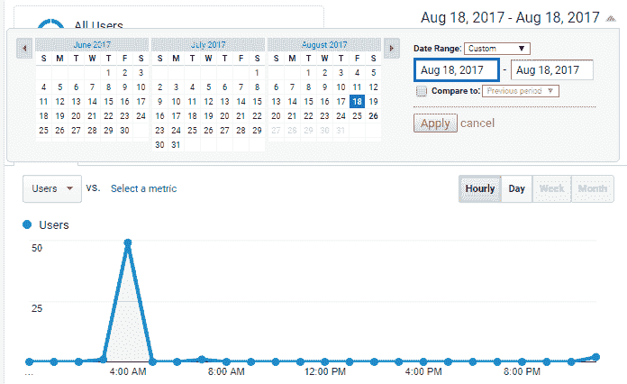
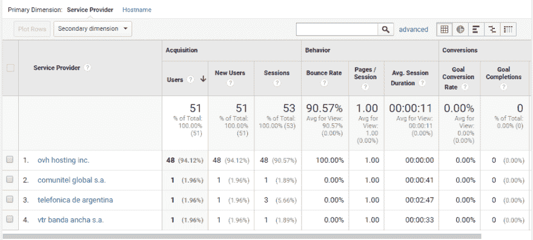
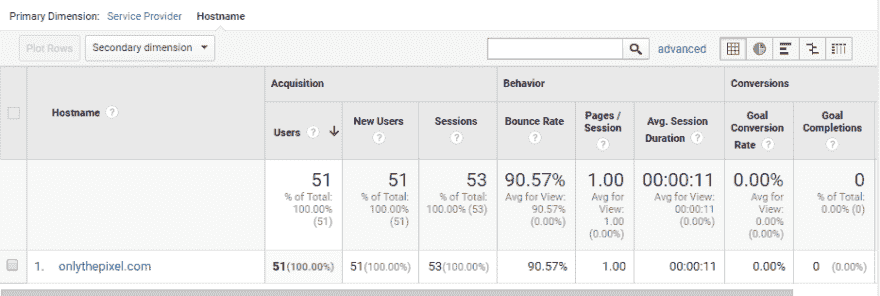
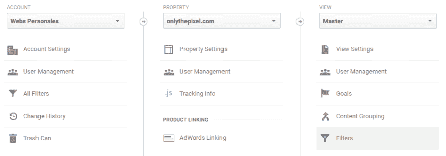
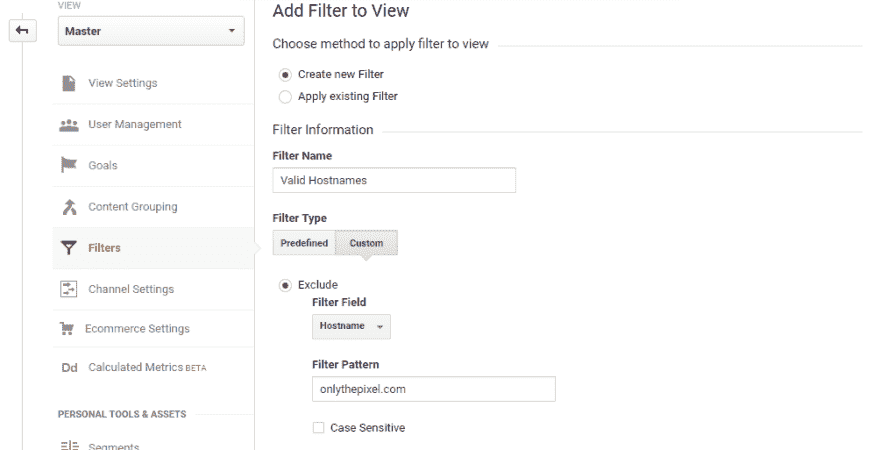
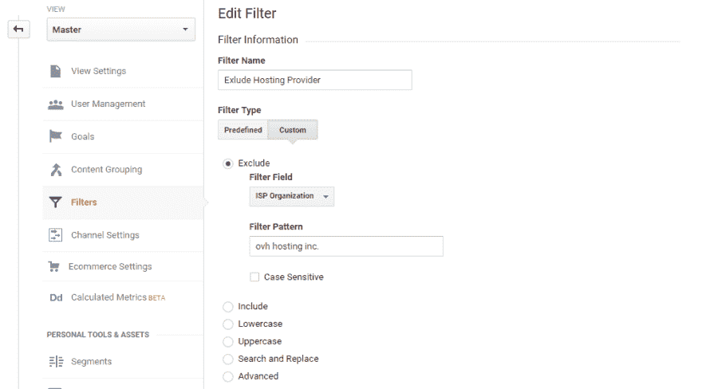
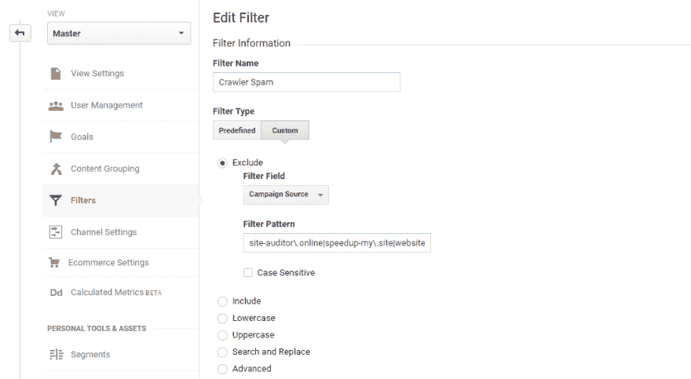

# 清理谷歌分析指标

> 原文:[https://dev . to/albertofdzm/clean-Google-analytics-metrics-ej6](https://dev.to/albertofdzm/clean-google-analytics-metrics-ej6)

事情是这样的。我去了我的分析小组，查看了我每月的访问量。我看到了什么？

[T2】](https://res.cloudinary.com/practicaldev/image/fetch/s--gEPi9XFf--/c_limit%2Cf_auto%2Cfl_progressive%2Cq_auto%2Cw_880/http://onlythepixel.com/conteimg/2017/08/Monthly_Analytics.PNG)

那个峰值让我很恼火，所以我决定调查一下。

## 用过滤器发现分析异常

我对**所做的是确定为什么我在分析**中有那个峰值，这是通过使用分析动态过滤器来隔离它。

### 按日期过滤

首先通过隔离日期。如果不是这样，有更多的方法可以隔离它，我将在后面介绍。

[ ](https://res.cloudinary.com/practicaldev/image/fetch/s--ZZQ9Nnd3--/c_limit%2Cf_auto%2Cfl_progressive%2Cq_auto%2Cw_880/http://onlythepixel.com/conteimg/2017/08/One_Day_Analytics_Graph.PNG) *原来你是小混蛋*

在这种情况下，异常似乎发生在一天中非常特殊的时刻，就像有人在很短的时间内向 web 发出大量请求。

### 按城市或国家过滤

现在看一下按城市过滤的指标表，有一个特殊的城市有很多请求。

[ ](https://res.cloudinary.com/practicaldev/image/fetch/s--RUul6FEz--/c_limit%2Cf_auto%2Cfl_progressive%2Cq_auto%2Cw_880/http://onlythepixel.com/conteimg/2017/08/City_Filtered_Analytics_Table.PNG) *乌克兰扎波罗热*

这可能是我博客的一个很好的追随者，但我会有点不情愿，多调查一点。

### 按网络过滤

为了确保这些乌克兰访问是可靠的，我将查看左侧面板中“观众”和“技术”下的“网络”部分。

[T2】](https://res.cloudinary.com/practicaldev/image/fetch/s--j53_Qmd4--/c_limit%2Cf_auto%2Cfl_progressive%2Cq_auto%2Cw_880/http://onlythepixel.com/conteimg/2017/08/Service_Provider_Filtered_Analytics_Table.PNG)

看着表格，我的乌克兰访问似乎是由`ovh hosting inc.`提供的，这很奇怪，因为那是我实际的主机提供商。看看这些访问的跳出率是 100%,这将扰乱指标，改变真实的用户跳出率。

为了确保这是我的机器，我检查了主机名维度(链接在表的顶部)。

[T2】](https://res.cloudinary.com/practicaldev/image/fetch/s--ZTf86DZ5--/c_limit%2Cf_auto%2Cfl_progressive%2Cq_auto%2Cw_880/http://onlythepixel.com/conteimg/2017/08/Hostname_Filtered_Analytics_Table.PNG)

这里只出现了我的主机名。有时这些异常是由垃圾邮件机器人或爬虫引起的，您可以在此视图中识别它们。这次似乎是我的主机提供商出了问题。

## 过滤分析以获得干净的指标

现在，我已经概括了很多关于指标的信息，我可以创建一些过滤器，以确保下次检查时指标是干净的。

第一件事是创建一个“主”视图，将所有的过滤器避免垃圾邮件流量和恼人的东西，我会离开原来的视图重命名为“未过滤”，以比较其流量时间与“主”。

创建视图的方法是在管理部分点击`VIEW`选择框选择属性，然后点击“创建新视图”。创建完成后，可以通过单击 filters 部分来应用过滤器。

[T2】](https://res.cloudinary.com/practicaldev/image/fetch/s--3qVfDjq0--/c_limit%2Cf_auto%2Cfl_progressive%2Cq_auto%2Cw_880/http://onlythepixel.com/conteimg/2017/08/Analytics_Admin_Panel.PNG)

### 在谷歌分析中创建过滤器

Google Analytics 提供了大量的方法来过滤我们的指标，不仅可以清理它们，还可以拥有一个自定义类型的视图，可以用于不同的目的。

我需要的第一个过滤器是排除所有可能来自未知主机名的流量。

[T2】](https://res.cloudinary.com/practicaldev/image/fetch/s--Lj6Q45Au--/c_limit%2Cf_auto%2Cfl_progressive%2Cq_auto%2Cw_880/http://onlythepixel.com/conteimg/2017/08/Creating_Google_Analytics_Filter.PNG)

然后是我讨厌的主机提供商的过滤器。

[T2】](https://res.cloudinary.com/practicaldev/image/fetch/s--Js_vyuxX--/c_limit%2Cf_auto%2Cfl_progressive%2Cq_auto%2Cw_880/http://onlythepixel.com/conteimg/2017/08/Creating_Google_Analytics_Filter_For_ISP.PNG)

最后，为了确保爬虫不会污染我的度量标准，给它们一个。

[T2】](https://res.cloudinary.com/practicaldev/image/fetch/s--FvRVKbZx--/c_limit%2Cf_auto%2Cfl_progressive%2Cq_auto%2Cw_880/http://onlythepixel.com/conteimg/2017/08/Creating_Google_Analytics_Filter_For_Crawlers.PNG)

这里有我对爬虫使用的表达:

```
site-auditor\.online|speedup-my\.site|website-analytics\.online 
```

<svg width="20px" height="20px" viewBox="0 0 24 24" class="highlight-action crayons-icon highlight-action--fullscreen-on"><title>Enter fullscreen mode</title></svg> <svg width="20px" height="20px" viewBox="0 0 24 24" class="highlight-action crayons-icon highlight-action--fullscreen-off"><title>Exit fullscreen mode</title></svg>

你可以在介绍的获取部分找到它们。

***注意:**过滤器不会清除你过去的指标信息，所以它们会在你应用它们的时候开始工作。*

## 保持干净！

就这些，现在就靠你来改进了。你可以阅读更多关于[谷歌分析过滤器文档](https://support.google.com/analytics/topic/1032939)