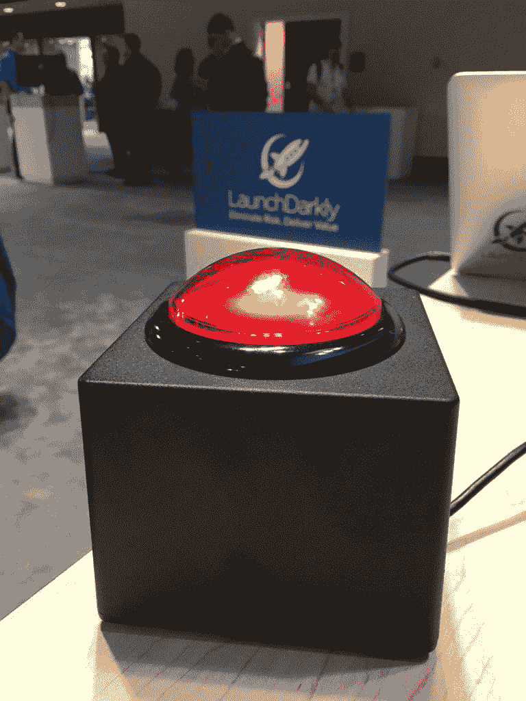

# 测量两次，发射一次

> 原文:[https://dev . to/wired ferret/measure-twice-launch-once-3kn-9f 09](https://dev.to/wiredferret/measure-twice-launch-once-3kn-9f09)

[T2】](https://res.cloudinary.com/practicaldev/image/fetch/s--VKvxQShp--/c_limit%2Cf_auto%2Cfl_progressive%2Cq_auto%2Cw_880/https://cdn-images-1.medium.com/max/800/1%2AX3AZL38e8zWBeXpZXxW0lQ.jpeg)

您希望您的所有开发人员都能够访问要部署的代码主干——这就是基于主干的开发的要点。重要的是，他们可以随时发布他们的代码，并迭代他们的项目。然而，你并不总是希望开发人员在没有某种扭转过程的方法的情况下打开那些会对客户产生影响的特性。

安全激活是功能管理中不被重视的部分。您的开发人员可以随时部署代码——但是当需要从外部测试代码或向所有人开放代码时，您可以使用设置来确保只有特定的一组人有权限这样做。应对所有激活变更进行跟踪和审核，以确保所有激活都有责任链。

在 LaunchDarkly，我们发现对谁可以使用和创建功能标志持宽容态度，对谁可以激活它们持限制态度是有好处的。如果您试图开始过渡到更广泛地使用特性标志，您可能想要考虑如何实现一个可重复的过程。您可能还希望利用 launch crystally 的“标签”功能来帮助组织和自定义角色，以帮助进行委托和访问。

您希望有权更改您的用户体验的人具备以下素质:

*   理解做出改变的商业原因
*   拥有技术知识或顾问，知道代码何时可以投入使用
*   是否有适当的流程来进行更改，然后进行测试

你不希望只有一个人能做到这一点，因为他们将不可避免地成为瓶颈。确保您的流程可以保持发布，即使关键团队成员不可用。

在开始时，你可能希望围绕每一个变化建立一个过程，然后在这个过程中寻找优化。然而，随着时间的推移，您应该考虑确定什么级别的变更值得进行，什么可以更容易地执行。在某些情况下，这甚至可能允许个别工程师批准或执行小的变更。通常，与金钱、用户数据收集或用户流程变化有关的功能应该有一个正式的批准流程。对后端操作的更改可能会更安静，因此需要更少的正式流程，并且更加依赖自动化测试和同行评审。

[T2】](https://res.cloudinary.com/practicaldev/image/fetch/s--zITqns2X--/c_limit%2Cf_auto%2Cfl_progressive%2Cq_auto%2Cw_880/https://cdn-images-1.medium.com/max/800/1%2AnHhZDpjUiqdsuGZoCxFPfg.jpeg)

考虑一下您当前的部署流程。如果有人过早发布某个东西会怎么样？你如何防范这种情况？你将如何把这种控制移植到 launch crystally 提供的访问控制上？如果某个东西不能正常启动，失败的情况是什么？

特性标志很容易在代码中实现，但是在整个组织中很好地管理它们需要一些计划和深谋远虑。