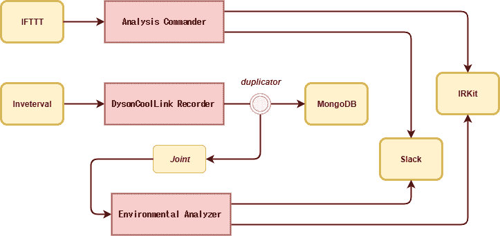

# Transgate 是 Node.js 的基于代理的任务流框架

> 原文:[https://dev . to/til fin/transgate-is-agent-based-task flow-framework-for-nodejs-58b](https://dev.to/tilfin/transgate-is-agent-based-taskflow-framework-for-nodejs-58b)

我在 Node.js 中做了 [Transgate](https://github.com/tilfin/transgate) 基于 Agent 的任务流框架。

## 我为什么要做？

因为在我写程序操作我的家用电器时，各种流程被弄乱了。它们将定期从戴森酷派风扇获取温度和湿度，将其保存在数据库中，并处理来自 Google Home / Assistant + IFTTT 的消息和操作 [IRKit](http://getirkit.com/) 。根据温度，我还想通过 IRKit 自动操作空调。你是怎么写的？

## 什么东西？

突然，我想让你想象一下行李分类，比如机场。代理从登机口接收物品，处理它们，然后将它们发送到另一个登机口。代理不知道门的另一边发生了什么。当代理出现一个空项目时，它就完成了工作。框架架构的形象看起来是这样的。

代理可以从登机口接收物品，并向另一个登机口发送新的物品。Item 是一个简单的对象。代理可以专注于自己的任务。因此，即使上一个进程或下一个进程的数量增加或减少，如果项目的模式不变，它也不会出现问题。输入/输出很简单，所以单元测试很容易。因为代理不知道门的实质，所以可以很容易地用输入源门作为存根，输出目的地门作为模拟来代替。

## 此框架中的演员

*   **门**是输入/输出的端点。例如，文件存储、数据库、队列或 API 服务。
*   **代理**是一个在输入/输出门之间处理一个项目的工人，不知道门对面的任何事情。
*   **项**是作为每个任务目标的实体，要在 gates 之间交换，以及一个对象或 JSON。`null`表示终结者。

## 举个例子

让我们通过触发制作这个框架的家庭控制程序来解释。顺便说一下，这个程序在我的鞋盒里的 Raspberry PI 上作为守护程序运行。

### 流程图

[T2】](https://res.cloudinary.com/practicaldev/image/fetch/s--ldtzRc_L--/c_limit%2Cf_auto%2Cfl_progressive%2Cq_auto%2Cw_880/https://thepracticaldev.s3.amazonaws.com/i/020w1fcbe1e5vpqpg33g.png)

### 主程序(main.js)

```
const {
  Agent,
  HttpClientGate,
  HttpServerGate,
  IntervalGate,
  JointGate,
  StdoutGate,
  duplicator,
  mixer,
} = require('transgate');

const pino = require('pino')();
const config = require('konfig-yaml')();

const MongoGate = require('./lib/mongo_gate');
const IRKitGate = require('./lib/irkit_gate');

// Agent
const AnalysisCommander = require('./lib/analysis_commander');
const DysonCoolLinkRecorder = require('./lib/dyson/cool_link_recorder');
const EnvironmentalAnalyzer = require('./lib/environmental_analyzer');

// Gate
const slackGate = new HttpClientGate({ endpoint: config.slack.webhook_url });
const iftttGate = new HttpServerGate({ port: config.port });
const irkitGate = new IRKitGate(config.irkit.endpoint);
const intervalGate = new IntervalGate(60);
const mongoGate = new MongoGate(config.mongodb.endpoint, config.mongodb.collection);
const drToEaGate = new JointGate();

(async () => {
  try {
    await Agent.all(
      new AnalysisCommander(iftttGate, { irkitGate, slackGate }),
      new DysonCoolLinkRecorder(intervalGate, duplicator(mongoGate, drToEaGate)),
      new EnvironmentalAnalyzer(drToEaGate, { irkitGate, slackGate }),
    );
  } catch(err) {
    pino.error(err);  
    await iftttGate.close();
    await mongoGate.close();
  }

  intervalGate.clear();
})()
.catch(err => {
  pino.error(err);
}); 
```

<svg width="20px" height="20px" viewBox="0 0 24 24" class="highlight-action crayons-icon highlight-action--fullscreen-on"><title>Enter fullscreen mode</title></svg> <svg width="20px" height="20px" viewBox="0 0 24 24" class="highlight-action crayons-icon highlight-action--fullscreen-off"><title>Exit fullscreen mode</title></svg>

### 7 门

*   **slackGate** 给 slack 发了一条短信。即使没有特别实现，也会是 HttpClientGate 的一个实例。JSON 项为`{ "text": "<text message>" }`。
*   **ifttgate**使用从 IFTTT 的 webhook 接收的 JSON 作为项目。JSON 项为`{ "target": "TV", "text": "<speaking words>" }`。
*   **伊尔基特盖特**用 HTTP 接口指示红外发射器。JSON 项为`{ "command": "celling_light_off" }`。
*   **intervalGate** 定期创建项目。项目为`{" time ": <Date instance>}`。在这种情况下，每分钟运行一次代理处理。
*   **mongoGate** 注册发送到 MongoDB 指定集合的物品。
*   **drToEaGate** 是从**dysoncollinkrecorder**(稍后描述)到**环境分析仪**的联合项目流。

### 3 名特工

*   **AnalysisCommander** 从 IFTTT webhook 接收 JSON 作为项，指定要从操作目标和文本发送给 IRKit 的红外信号。当 slack 无法解释措辞时发布它。
*   **dysoncollinkrecorder**每 1 分钟从 Dyson PureCoolLink 风扇获取温度和湿度，并将其发送到 gate，gate 成为接头，并通过复印机写入 MongoDB。
*   当**环境分析仪**通过接头超过温度阈值时，它请求 IRKit 运行空调。自动操作时，在 slack 中记录。

### 代理实现

创建**代理**的子类。编写代码，在 main 方法中处理接收到的项，并将一个新项发送到指定的 gate。我们在这里使用前/后钩子方法来控制(启动/停止)初始化进程和另一个进程(例如 headless chrome)。

下面是 **EnvironmentalAnalyzer** 的一个实现示例。当室温变为 17 摄氏度或更低时，打开空调。

```
const { Agent } = require('transgate');

module.exports = 
class EnvironmentalAnalyzer extends Agent {
  async before() {
    this._preTemp = null;
    this._airconAlive = false;
  }

  async main(item, { irkitGate, slackGate }) {
    const curTemp = item.temp;

    if (this._preTemp && this._preTemp > 17 && curTemp <= 17) {
      if (!this._airconAlive) {
        await irkitGate.sendAll({ command: 'aircon_on' });
        this._airconAlive = true;
        await slackGate.send({ text: `Turn on aircon because temp is down to ${curTemp}` });          
      }
    }

    this._preTemp = curTemp;
  }
} 
```

<svg width="20px" height="20px" viewBox="0 0 24 24" class="highlight-action crayons-icon highlight-action--fullscreen-on"><title>Enter fullscreen mode</title></svg> <svg width="20px" height="20px" viewBox="0 0 24 24" class="highlight-action crayons-icon highlight-action--fullscreen-off"><title>Exit fullscreen mode</title></svg>

之所以隐藏构造函数和输入门，是为了实现代理接收 null 时，向下一个门发送 null，自己结束的规范。

## 特性

*   适用于复杂的守护进程和批处理程序。
*   不适合处理大容量，因为不假设同一代理正在并行运行。
*   出现的门和代理以及项目的任务流可以在主程序中定义。因此，只有它才能把握整体。
*   代理的处理可以以伪方式与 async / await 同步编写。即使代理数量增加，也不会像线程化那样繁重。
*   因为替换门很容易，所以编写代理的单元测试和确认部分执行也很容易。

## 预测问题的答案

### 引用的服务会不会都是 gates？

不行，大门之间只能单向通行。代理不知道大门的详细规格。换句话说，你不能抛出一个请求并得到一个响应。有可能是循环的，而不是往返的，因为响应是无状态的，所以响应是为请求确定的。门变成了触发代理的部分和代理发送结果的部分。

### 流的系列结束如何通知踢球者？

当任务完成时，队列系统需要发送一个完成通知。在这种情况下，您可以通过给出项目的上下文来改变流程。确保最后一个入口负责发送完成通知。

### 登录器应该是门吗？

如果日志本身就是输出，那么应该对它们进行门控。然后，您可以轻松地用稍后将连接到代理的东西来替换 gate，然后从那里将它扔给日志分析服务。

### 门里能包含多少逻辑？

大门应该尽可能简单。该代理旨在使其更易于测试。但是如果你把逻辑放在门本身，你就不能替换输入/输出目的地并测试它。但是，如果它很简单，并且是项目中的常见逻辑，它可能会在 gate 中实现。如果它很复杂，你应该为它做一个代理，通过一个联合门连接代理。

如果你对 [Transgate](https://github.com/tilfin/transgate) 感兴趣，我会很高兴。

[日文版](http://tilfin.hatenablog.com/entry/2017/11/23/210540)