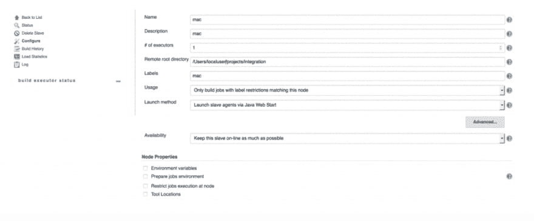
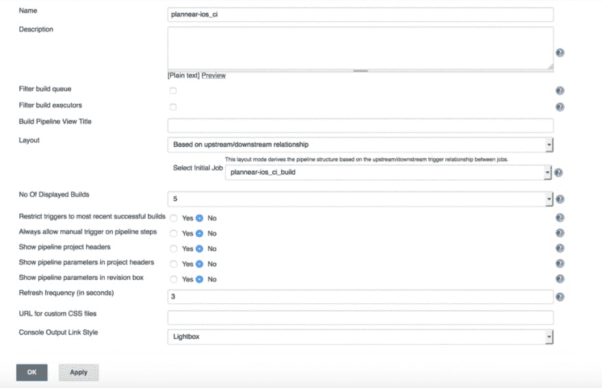
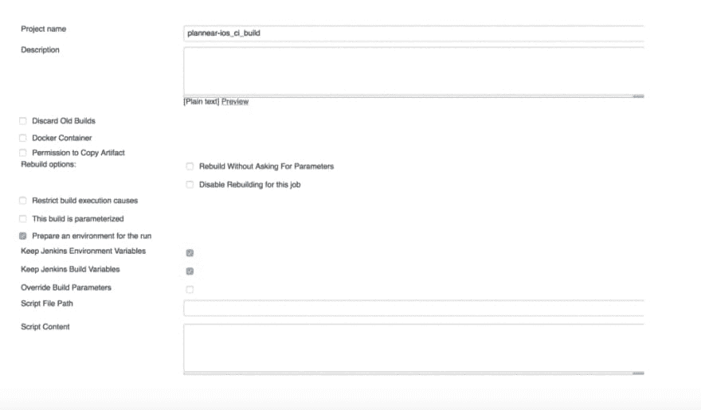
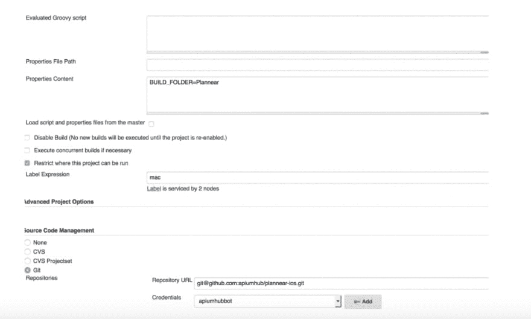
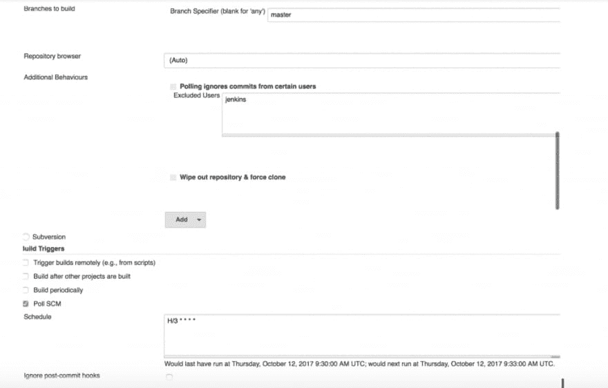
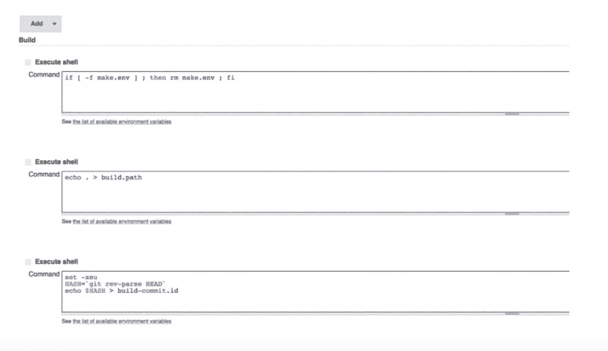
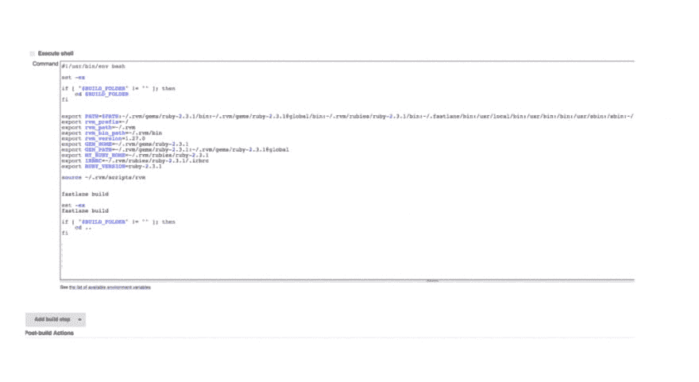

# iOS 与浪子&詹金斯的持续集成

> 原文:[https://dev . to/Apium _ hub/IOs-continuous-integration-with-fast lane-Jenkins-19n](https://dev.to/apium_hub/ios-continuous-integration-with-fastlane--jenkins-19n)

Apiumhub 的基本支柱之一是我们对客户的承诺，即始终以最高的质量水平交付 T2 工作软件。为了做到这一点，我们与[持续集成](https://apiumhub.com/tech-blog-barcelona/benefits-of-continuous-integration/)合作，这使我们能够为他们提供、测试、使用他们的应用程序版本，并且可以尽快将其投入生产。今天，我们将更详细地了解如何与浪子和詹金斯进行 iOS 持续集成。

为了完成这项任务，我们通过一系列 Jenkins 插件开发了一个 DSL，它允许我们在通过集成测试、功能测试和 QA 测试后拥有最新的软件版本，并在客户需要时准备和验证分发它们。这使得我们可以在短时间内开发出有价值的产品，并且最终用户可以非常快地对添加到客户端应用程序中的任何新特性做出反馈。

得益于多年来与[多家客户](/software-projects-barcelona/)合作的经验以及积累的丰富知识，我们认为是时候将新平台融入我们的持续集成系统了。在这种情况下，我们将讨论如何使用浪子工具和 [Jenkins 持续集成系统](https://dev.to/apium_hub/advantages-of-jenkins-12)将 iOS 平台添加到我们的系统中。

## iOS 与浪子持续整合

[浪子](https://docs.fastlane.tools/)是一个管理 Android 和 iOS 持续集成周期(打包和部署)的工具。它是由[菲利克斯·克劳斯](https://krausefx.com/about/)基于 ruby 开发的。

创建这种风格的工具的需求源于为移动设备打包应用程序的漫长、重复和复杂的过程，首先是在 iOS 中，然后是对 Android 的支持。

浪子的根本基础是，它允许我们创建一种被称为“通道”的“脚本”，在那里执行一系列被称为“T0”动作“T1”的预编程“命令”。默认情况下，工具中有一系列操作，允许我们管理[移动应用](https://apiumhub.com/mobile-app-development-barcelona/)生命周期的不同方面。正如我们之前所讨论的，这些动作可以被分组到多个通道中，这些通道允许我们根据我们想要覆盖应用程序生命周期的需求来创建定制脚本。

车道示例:

```
lane :beta do
      increment_build_number
      gym # Build your app
      testflight # Upload to TestFlight
end 
```

这条通道被称为 beta，它的作用是:增加构建的数量，对应用程序进行打包(生成 iPA ),并将其发送到 Testflight。

我们不打算谈论它和解释浪子是如何工作的，因为所有的文件都很好地收集在[的网站](https://docs.fastlane.tools/)上，网络上有许多例子。

为了能够安装浪子，我们必须考虑一些事情:

**1。**拥有合适版本的 ruby，为此我们将执行命令

*   终端中的 ruby -v

控制 ruby 版本是很重要的，因为默认情况下 OSX 使用 2.0 版本，这给浪子带来了很多问题，所以我们建议安装 ruby rvm 的版本管理系统。如果你对 ruby 版本有问题，你可以去这样的教程或者在谷歌上快速搜索(“更新 osx ruby 版本”)。

**2。**安装 xcode 工具

*   xcode-选择安装

**浪子可以通过:**安装

*   家庭酿造(酿造桶安装快速通道)
*   构造
*   像宝石一样的 ruby(sudo gem install-n/usr/local/bin fast lane–verbose)

一旦在机器上安装了浪子，我们必须转到我们想要添加浪子的项目文件夹并执行命令:

fast lane init

什么将创建所有依赖项并配置项目以支持浪子。一旦这个过程完成，你的项目应该包含一个名为 fastlane 的文件夹，里面应该有 2 个重要的文件:

*   **Appfile** :包含项目和设备的标识，apple id 用于管理凭证和与 iTunes 的连接。
*   **快速文件**:这是定义车道的地方。默认情况下，它通常会带来最常见的测试版和发布版。这个文件是配置应用程序生命周期和部署的所有过程的地方，也是完成所有管理的地方。

在 [Apiumhub](/) 中，我们配置了 2 个通道，其中一个我们称之为 build。它使用动作扫描通过测试，然后使用动作健身房来打包应用程序。另一个我们称之为释放。它所做的是将应用程序发送到 Apple Store 进行发布。

车道构建:

```
lane :build do
      scan(scheme: "Plannear")
      gym(scheme: 'Plannear', export_method: 'app-store')
end

Lane release
      lane :release do
      deliver(force: true)
end 
```

如果客户希望在将应用程序发送给 Apple 之前对其进行内部测试，我们使用另一个名为 preprod 的通道，将应用程序发送给 testflight，并自动分发给所有添加为测试人员的用户。

## iOS 与 Jenkins 持续集成:配置

一旦我们有了浪子工具设置并测试了项目中的工作，我们所做的就是配置 Jenkins 来自动执行工具的任务(在这个例子中，我们所做的是将一个用户的本地机器配置为测试机器，但这可以用同样的方式在任何安装了 OSX 并正确配置了浪子的计算机上完成)。

[T2】](https://apiumhub.com/wp-content/uploads/2017/11/Screen-Shot-2017-11-23-at-12.08.56.png)

远程节点将通过 web start 执行。所以在执行远程节点的机器上，我们必须安装 java 和 web start 工具。远程根目录部分是安装包含浪子的 iOS 项目的文件夹。

下一步是定义我们的管道(必须安装插件 [build](https://plugins.jenkins.io/build-pipeline-plugin) pipelines ),它具有以下配置:

[T2】](https://apiumhub.com/wp-content/uploads/2017/11/Screen-Shot-2017-11-23-at-12.10.59.png)

在这种情况下，我们必须完成的部分是初始作业，这是我们将告诉 Jenkins 我们希望它在管道中执行哪些作业的地方。

最后，我们来到 Jenkins 配置中最重要的部分，在这里，我们定义了每次启动管道任务时将在远程机器上执行的作业。

这个作业的配置对 Jenkins 来说是相当标准的，在这里会定义首先应该下载 github 项目，然后执行浪子的适当车道。配置将类似于以下内容:

[T2】](https://apiumhub.com/wp-content/uploads/2017/11/Screen-Shot-2017-11-23-at-12.12.46.png)

[T2】](https://apiumhub.com/wp-content/uploads/2017/11/Screen-Shot-2017-11-23-at-12.21.21.png)

[T2】](https://apiumhub.com/wp-content/uploads/2017/11/Screen-Shot-2017-11-23-at-12.23.23.png)

[T2】](https://apiumhub.com/wp-content/uploads/2017/11/Screen-Shot-2017-11-23-at-12.24.38.png)

[T2】](https://apiumhub.com/wp-content/uploads/2017/11/Screen-Shot-2017-11-23-at-12.25.32.png)

在这种情况下，最重要的部分是最终的 shell 脚本。这个脚本的特殊性在于，必须正确配置 ruby 环境变量，这样浪子的远程执行才能正常工作。

一旦我们定义了管道→任务→作业的集合，我们就已经实现了整个流程的自动化，只需通过 Jenkins 中的时间表配置执行，我们就可以自动执行应用生命周期中的任何流程。

在我们的案例中，我们通常为构建定义一个管道，为发布定义一个管道，我们可以很快地遵循 Jenkins 中的流程，如下所示:

[T2】](https://apiumhub.com/wp-content/uploads/2017/11/Screen-Shot-2017-11-23-at-12.26.15.png)

这也有助于如果客户请求，我们可以在他或她的设施中配置一台机器来执行整个过程，因为在我们的情况下，所有的 jenkins 配置都保存在一个可以版本化的 groovy 文件中，这允许在任何具有相同特征的持续集成环境中快速部署。

如果你对 ios 持续集成或移动开发感兴趣，我强烈推荐你点击[此处](http://eepurl.com/cC96MY)订阅我们的每月简讯。

## 如果你觉得这篇关于 iOS 持续集成的文章很有趣，你可能会喜欢…

[iOS 中的 MVP 模式](https://dev.to/apium_hub/mvp-pattern-in-ios-98f)

[iOS Objective-C app:成功案例研究](https://dev.to/apium_hub/protected-ios-objective-c-app-cornerjob-successfull-case-study-89e)

[年度移动应用开发趋势](https://dev.to/apium_hub/mobile-app-development-trends-of-the-year)

[Banco Falabella 可穿戴设备案例研究](https://apiumhub.com/tech-blog-barcelona/banco-falabella-wearable-ios-android/)

[移动开发项目](https://apiumhub.com/software-projects-barcelona/)

[面向 iOS 应用的 Viper 架构优势](https://apiumhub.com/tech-blog-barcelona/viper-architecture/)

iOS 与浪子&詹金斯持续整合的帖子最早出现在 [Apiumhub](https://apiumhub.com) 上。