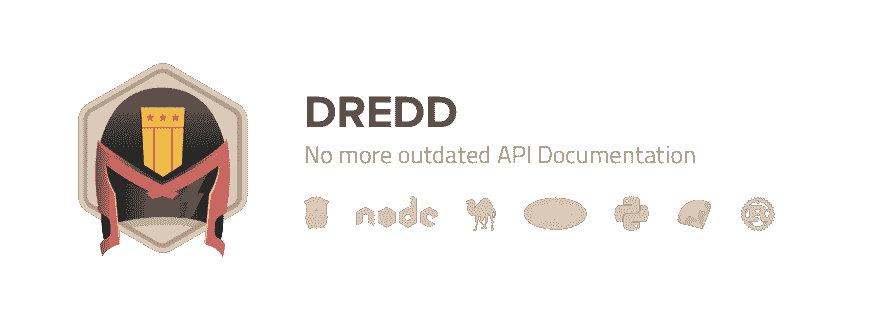
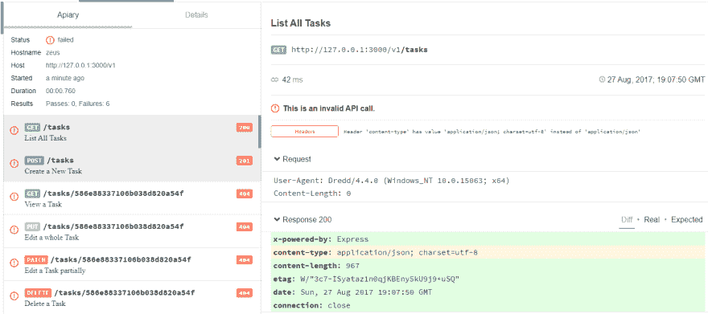
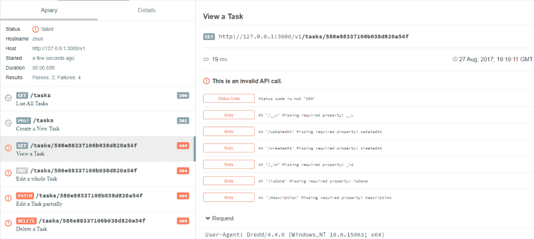
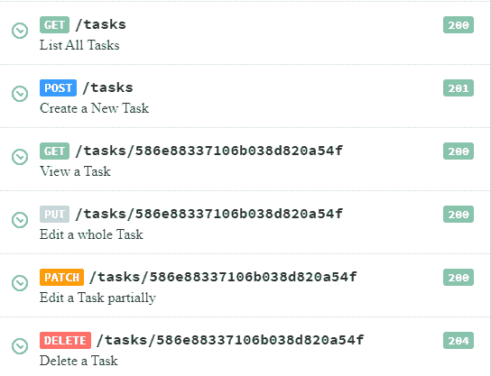

# 根据 API 的文档测试 API

> 原文:[https://dev . to/albertofdzm/testing-an-API-against-documentation-6cl](https://dev.to/albertofdzm/testing-an-api-against-documentation-6cl)

本文介绍了如何使用 Dredd 测试工具，基于 API 文档，针对用 API 蓝图记录的 Express NodeJS API 运行测试。

***注:**这是关于**用 Express** 构建 API 系列帖子的**第 5 篇**。基于我上一篇关于 [**用 API 蓝图**](https://dev.to/albertofdzm/documenting-your-api-with-api-blueprint-e0m) 记录 API 的文章，我将继续开发[生成的代码](https://github.com/AlbertoFdzM/another-todo-api/tree/post/04)。*

上次我使用 [API 蓝图](https://apiblueprint.org/)记录了另一个 TODO API，现在我将利用它对 API 进行一些**测试，以确保文档与实际的 API 代码**保持一致。对于这个任务，我将使用 [Dredd](https://github.com/apiaryio/dredd) 。

## [千代子](#dredd)

[T2】](https://res.cloudinary.com/practicaldev/image/fetch/s--4HkJV08U--/c_limit%2Cf_auto%2Cfl_progressive%2Cq_auto%2Cw_880/http://onlythepixel.com/conteimg/2017/08/dredd.png)

Dredd 是一个使用 API 自己的文档测试 API 的工具。

### 本地安装 Dredd

要为此使用案例安装 Dredd，需要安装:

*   [节点 j](https://nodejs.org/)
*   [NPM](https://npmjs.com)

然后在终端上:

```
npm i -g dredd 
```

<svg width="20px" height="20px" viewBox="0 0 24 24" class="highlight-action crayons-icon highlight-action--fullscreen-on"><title>Enter fullscreen mode</title></svg> <svg width="20px" height="20px" viewBox="0 0 24 24" class="highlight-action crayons-icon highlight-action--fullscreen-off"><title>Exit fullscreen mode</title></svg>

现在 Dredd 可以作为 CLI 工具使用。

### 配置 Dredd

这些 Dredd 家伙是如此的神奇，以至于开始使用 Dredd 唯一需要做的事情就是运行下一行代码:

```
dredd init

? Location of the API description document docs/main.apib
? Command to start API backend server e.g. (bundle exec rails server) npm start
? URL of tested API endpoint http://127.0.0.1:3000/v1
? Programming language of hooks nodejs
? Do you want to use Apiary test inspector? Yes
? Please enter Apiary API key or leave empty for anonymous reporter
? Dredd is best served with Continuous Integration. Create CircleCI config for Dredd? No

Configuration saved to dredd.yml

Run test now, with:

  $ dredd 
```

<svg width="20px" height="20px" viewBox="0 0 24 24" class="highlight-action crayons-icon highlight-action--fullscreen-on"><title>Enter fullscreen mode</title></svg> <svg width="20px" height="20px" viewBox="0 0 24 24" class="highlight-action crayons-icon highlight-action--fullscreen-off"><title>Exit fullscreen mode</title></svg>

这里做了一些笔记。Dredd 在项目的根目录下创建了一个`dredd.yml`文件，其中包含了一系列基于收到的回复的属性。

#### `dredd.yml`

```
# https://dredd.readthedocs.io/en/latest/usage-cli.html#configuration-file
dry-run: null  
hookfiles: null  
language: nodejs  
sandbox: false  
server: npm start # Command to start the API server 
server-wait: 3  
init: false  
custom:  
  apiaryApiKey: ''
names: false  
only: []  
reporter: apiary  
output: []  
header: []  
sorted: false  
user: null  
inline-errors: false  
details: false  
method: []  
color: true  
level: info  
timestamp: false  
silent: false  
path: []  
hooks-worker-timeout: 5000  
hooks-worker-connect-timeout: 1500  
hooks-worker-connect-retry: 500  
hooks-worker-after-connect-wait: 100  
hooks-worker-term-timeout: 5000  
hooks-worker-term-retry: 500  
hooks-worker-handler-host: 127.0.0.1  
hooks-worker-handler-port: 61321  
config: ./dredd.yml # Source of Dredd config file 
blueprint: docs/main.apib # The API Blueprint file to get API definitions 
endpoint: 'http://127.0.0.1:3000/v1' # The base URL where the test will run 
```

<svg width="20px" height="20px" viewBox="0 0 24 24" class="highlight-action crayons-icon highlight-action--fullscreen-on"><title>Enter fullscreen mode</title></svg> <svg width="20px" height="20px" viewBox="0 0 24 24" class="highlight-action crayons-icon highlight-action--fullscreen-off"><title>Exit fullscreen mode</title></svg>

我已经注释了我认为对这一步最重要的行，但是所有的信息都可以在 [Dredd 配置文件文档](https://dredd.readthedocs.io/en/latest/usage-cli.html#configuration-file)中找到。

### 用 Dredd 运行测试

现在项目有了一个配置文件，Dredd 知道如何运行服务器，这是下一个要执行的命令(我想你已经知道了):

```
dredd 
```

<svg width="20px" height="20px" viewBox="0 0 24 24" class="highlight-action crayons-icon highlight-action--fullscreen-on"><title>Enter fullscreen mode</title></svg> <svg width="20px" height="20px" viewBox="0 0 24 24" class="highlight-action crayons-icon highlight-action--fullscreen-off"><title>Exit fullscreen mode</title></svg>

当执行测试时，会出现一个关于 Dredd 发现了什么的报告:

```
info: Configuration './dredd.yml' found, ignoring other arguments.  
warn: Apiary API Key or API Project Subdomain were not provided. Configure Dredd to be able to save test reports alongside your Apiary API project: https://dredd.readthedocs.io/en/latest/how-to-guides/#using-apiary-reporter-and-apiary-tests  
info: Starting backend server process with command: npm start  
info: Waiting 3 seconds for backend server process to start

...

info: Beginning Dredd testing...  
GET /v1/tasks 200 13.427 ms - 1450  
fail: GET (200) /tasks duration: 58ms

...

info: Displaying failed tests...  
fail: GET (200) /tasks duration: 58ms  
fail: headers: Header 'content-type' has value 'application/json; charset=utf-8' instead of 'application/json'

request:  
method: GET  
uri: /tasks  
headers:  
    User-Agent: Dredd/4.4.0 (Windows_NT 10.0.15063; x64)
    Content-Length: 0

body:

expected:  
headers:  
    Content-Type: application/json

body:  
[
  {
    "__v": 0,
    "updatedAt": "2017-01-05T17:53:37.066Z",
    "createdAt": "2017-01-05T17:53:37.066Z",
    "_id": "586e88217106b038d820a54e",
    "isDone": false,
    "description": "test"
  },
  ...
]
statusCode: 200

actual:  
statusCode: 200  
headers:  
    x-powered-by: Express
    content-type: application/json; charset=utf-8
    content-length: 1450
    etag: W/"5aa-Oh/N4fD/Is1M3QO9MzB/QQaYxDU"
    date: Fri, 01 Sep 2017 15:36:43 GMT
    connection: close

body:  
[{"_id":"59a2fe039c2adf0e90acca12","updatedAt":"2017-08-27T17:14:43.564Z","createdAt":"2017-08-27T17:14:43.564Z","__v":0,"isDone":false,"description":"Buy milk"},{"_id":"59a2fe0f852c331148011df3","updatedAt":"2017-0
8-27T17:14:55.731Z",...  
}]

...

complete: 0 passing, 6 failing, 0 errors, 0 skipped, 6 total  
complete: Tests took 815ms  
DELETE /v1/tasks/586e88337106b038d820a54f 404 1.128 ms - 539  
complete: See results in Apiary at: https://app.apiary.io/public/tests/run/423b37ad-1dd8-499c-9124-4320ea0f7911  
info: Backend server process exited 
```

<svg width="20px" height="20px" viewBox="0 0 24 24" class="highlight-action crayons-icon highlight-action--fullscreen-on"><title>Enter fullscreen mode</title></svg> <svg width="20px" height="20px" viewBox="0 0 24 24" class="highlight-action crayons-icon highlight-action--fullscreen-off"><title>Exit fullscreen mode</title></svg>

同样，在最后，如果 dredd 配置文件的`reporter`为`apiary`，将会有一个链接(类似于`https://app.apiary.io/public/tests/run/123456`)指向这个页面:

[T2】](https://res.cloudinary.com/practicaldev/image/fetch/s--bzHSeSHn--/c_limit%2Cf_auto%2Cfl_progressive%2Cq_auto%2Cw_880/http://onlythepixel.com/conteimg/2017/08/Apiary_Dredd_Test.PNG)

***注意:**提供的链接是临时页面，过一会儿就会被移除。*

在这个面板中有很多关于测试进行情况的信息。另一个 TODO API 在文档中有一些错误，其中之一是`content-type`的定义。[让我们修复](https://github.com/AlbertoFdzM/another-todo-api/commit/0e4663f45b0e064b6cd8573acda77d6d4b1f270b)并再次运行测试。

在更改和运行`dredd`之后，这是新的报告:

[T2】](https://res.cloudinary.com/practicaldev/image/fetch/s--xfrN572P--/c_limit%2Cf_auto%2Cfl_progressive%2Cq_auto%2Cw_880/http://onlythepixel.com/conteimg/2017/08/Apiary_Dredd_Test_1.PNG)

这一次，一些端点得到了验证，但不是全部。需要任务 ID 才能工作的**端点返回`404`响应并导致测试失败**。这是因为 API 文档中指定的任务 id 只是作为一个例子公开的，并不真正存在于数据库中。这时[德莱德钩子](https://dredd.readthedocs.io/en/latest/hooks-nodejs.html)派上了用场。

### [钻钩](#dredd-hooks)

钩子允许在每个测试用例之间、之前或之后执行一些代码。这一次，我将使用一个钩子来获取在“创建新任务”定义中创建的任务的 ID，以便将创建的任务用于需要一个 *taskId* 来工作的测试。

#### `docs/hooks.js`

```
// Import the hooks library to work with them (injected by dredd)
const hooks = require('hooks')  
// Create some shorthand functions for the hooks
const after = hooks.after  
const before = hooks.before

// Because the action is going to be the same in all the hooks lets create a function
const replaceUrlForCreatedTaskId = function (transaction) {  
  // Gets the taskId from the response object
  let taskId = JSON.parse(responseStash['Tasks > Tasks Collection > Create a New Task'].body)._id
  // Gets the predefined request url
  let url = transaction.fullPath

  // Replaces the wrong taskId with the correct one
  transaction.fullPath = url.replace('586e88337106b038d820a54f', taskId)
}

// Instantiates an object to store the responses
let responseStash = {}

// Sets a hook to be executed after creating a task to store the response
after('Tasks > Tasks Collection > Create a New Task', function (transaction) {  
  // Stores the response inside the temporary object
  responseStash[transaction.name] = transaction.real
})

// Sets hooks before the requests are made to replace the URLs
before('Tasks > Task > View a Task', replaceUrlForCreatedTaskId)  
before('Tasks > Task > Edit a whole Task', replaceUrlForCreatedTaskId)  
before('Tasks > Task > Edit a Task partially', replaceUrlForCreatedTaskId)  
before('Tasks > Task > Delete a Task', replaceUrlForCreatedTaskId) 
```

<svg width="20px" height="20px" viewBox="0 0 24 24" class="highlight-action crayons-icon highlight-action--fullscreen-on"><title>Enter fullscreen mode</title></svg> <svg width="20px" height="20px" viewBox="0 0 24 24" class="highlight-action crayons-icon highlight-action--fullscreen-off"><title>Exit fullscreen mode</title></svg>

设置挂钩后，需要修改`dredd.yml`文件。

#### `dredd.yml`

```
# https://dredd.readthedocs.io/en/latest/usage-cli.html#configuration-file
dry-run: null  
hookfiles: ./docs/hooks.js # Here, we are telling dredd where are the hooks files 
language: nodejs  
sandbox: false  
... 
```

<svg width="20px" height="20px" viewBox="0 0 24 24" class="highlight-action crayons-icon highlight-action--fullscreen-on"><title>Enter fullscreen mode</title></svg> <svg width="20px" height="20px" viewBox="0 0 24 24" class="highlight-action crayons-icon highlight-action--fullscreen-off"><title>Exit fullscreen mode</title></svg>

现在再次运行测试:

```
info: Displaying failed tests...  
fail: PATCH (200) /tasks/586e88337106b038d820a54f duration: 11ms  
fail: body: Can't validate. Expected body Content-Type is application/json; charset=utf-8 but body is not a parseable JSON: Parse error on line 1:  
+ Attributes (Task)
^
Expecting 'STRING', 'NUMBER', 'NULL', 'TRUE', 'FALSE', '{', '[', got 'undefined' 
```

<svg width="20px" height="20px" viewBox="0 0 24 24" class="highlight-action crayons-icon highlight-action--fullscreen-on"><title>Enter fullscreen mode</title></svg> <svg width="20px" height="20px" viewBox="0 0 24 24" class="highlight-action crayons-icon highlight-action--fullscreen-off"><title>Exit fullscreen mode</title></svg>

它在抱怨`main.apib`文件的第 118 行:

```
+ Response 200 (application/json; charset=utf-8) + Attributes (Task) 
```

<svg width="20px" height="20px" viewBox="0 0 24 24" class="highlight-action crayons-icon highlight-action--fullscreen-on"><title>Enter fullscreen mode</title></svg> <svg width="20px" height="20px" viewBox="0 0 24 24" class="highlight-action crayons-icon highlight-action--fullscreen-off"><title>Exit fullscreen mode</title></svg>

响应字段使用了一个*数据结构*，但是它缩进了 8 个空格，对于 API 蓝图文档，这意味着一段代码，所以通过[将它减少到 4 个](https://github.com/AlbertoFdzM/another-todo-api/commit/dd6a4b1f0f61aa18a98bbc27f907cc39e8ad5b9d)并再次运行测试:

```
info: Beginning Dredd testing...  
info: Found Hookfiles: 0=E:\develop\another-todo-api\docs\hooks.js  
GET /v1/tasks 200 14.604 ms - 5636  
pass: GET (200) /tasks duration: 69ms  
POST /v1/tasks 201 26.640 ms - 160  
pass: POST (201) /tasks duration: 48ms  
GET /v1/tasks/59a9a413bfa907076857eae2 200 4.018 ms - 160  
pass: GET (200) /tasks/586e88337106b038d820a54f duration: 110ms  
PUT /v1/tasks/59a9a413bfa907076857eae2 200 7.289 ms - 159  
pass: PUT (200) /tasks/586e88337106b038d820a54f duration: 21ms  
pass: PATCH (200) /tasks/586e88337106b038d820a54f duration: 15ms  
PATCH /v1/tasks/59a9a413bfa907076857eae2 200 2.659 ms - 164  
pass: DELETE (204) /tasks/586e88337106b038d820a54f duration: 30ms  
complete: 6 passing, 0 failing, 0 errors, 0 skipped, 6 total  
complete: Tests took 579ms  
DELETE /v1/tasks/59a9a413bfa907076857eae2 204 3.519 ms - -  
complete: See results in Apiary at: https://app.apiary.io/public/tests/run/ca648983-2438-4b7b-b720-352bc00a79c8  
info: Backend server process exited 
```

<svg width="20px" height="20px" viewBox="0 0 24 24" class="highlight-action crayons-icon highlight-action--fullscreen-on"><title>Enter fullscreen mode</title></svg> <svg width="20px" height="20px" viewBox="0 0 24 24" class="highlight-action crayons-icon highlight-action--fullscreen-off"><title>Exit fullscreen mode</title></svg>

*像黄油一样光滑*

[T2】](https://res.cloudinary.com/practicaldev/image/fetch/s--GGI6rq3G--/c_limit%2Cf_auto%2Cfl_progressive%2Cq_auto%2Cw_880/http://onlythepixel.com/conteimg/2017/09/Apiary_Dredd_Test_OK.PNG)

### NPM 测试脚本

到目前为止，我一直在我的全局安装中使用 Dredd，但是将它作为一个开发依赖项包含进来并创建一个 npm 测试脚本是一个更好的主意。

```
npm i -D dredd 
```

<svg width="20px" height="20px" viewBox="0 0 24 24" class="highlight-action crayons-icon highlight-action--fullscreen-on"><title>Enter fullscreen mode</title></svg> <svg width="20px" height="20px" viewBox="0 0 24 24" class="highlight-action crayons-icon highlight-action--fullscreen-off"><title>Exit fullscreen mode</title></svg>

#### `package.json`

```
...  "scripts":  {  "lint":  "eslint **/*.js",  "start":  "set DEBUG=another-todo:* && node bin/www",  "test":  "dredd"  },  ... 
```

<svg width="20px" height="20px" viewBox="0 0 24 24" class="highlight-action crayons-icon highlight-action--fullscreen-on"><title>Enter fullscreen mode</title></svg> <svg width="20px" height="20px" viewBox="0 0 24 24" class="highlight-action crayons-icon highlight-action--fullscreen-off"><title>Exit fullscreen mode</title></svg>

## 结论

Dredd 是一个很好的工具来**维护你的 API 文档更新，并使 [DDD(文档驱动开发)](https://gist.github.com/zsup/9434452)** 。

反正你可以在 GitHub 上查看[生成的代码。](https://github.com/AlbertoFdzM/another-todo-api/tree/post/05)

快乐编码< 3！