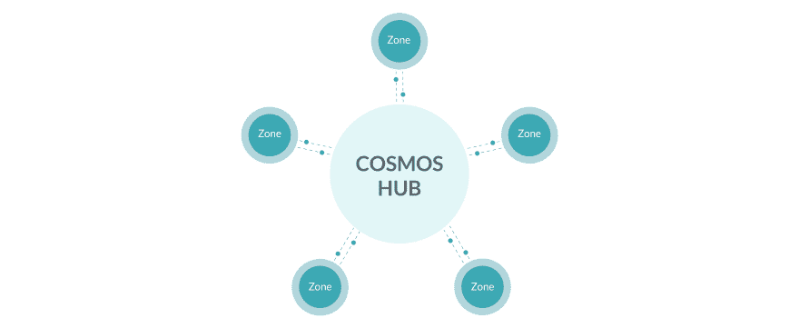

# 区块链互联网

> 原文:[https://dev.to/galyna_chekan/internet-of-blockchains-2d0f](https://dev.to/galyna_chekan/internet-of-blockchains-2d0f)

几年前，在区块链的早期，许多人都被多功能链的想法所吸引，所有交易都可以在多功能链上处理。

在 2014 年以太坊推出后，它的倡导者们正声嘶力竭地谈论该平台带来的变革机遇。他们预测，从那时起，去中心化的应用程序，以及所有种类的价值转移将只在以太坊上执行，不再需要其他网络。

然而，这种想法并没有持续很久:专家们看到主要网络在试图增加用户群时面临可扩展性问题，而且他们还看到了频繁的黑客攻击。

过了一段时间，只有少数人支持“一个强大的链”的概念。

现在，该行业的大多数领导者相当明智地接受了区块链多元化的理念。他们鼓励并经常慷慨资助开发出有前途和创新的区块链技术的开发者，并反复强调使这些网络具有互操作性的必要性。

有几个项目，看到市场合适，关心自己带来“区块链互联网”的生活。今天，我们将讨论其中的几个。

## 为什么单个区块链不够用

有人认为以太坊上的去中心化不应该被称为去中心化。尽管区块链上存在模块化，这源于它启用的智能合约功能，但区块链用户仍然受到单一网络的保护。如果在治理方面有任何失败(看看道事件，看看我们在说什么)，人们可能会遭受灾难性的损失。

以太坊也有严格的规则和保持一致的持续需求。因此，它的开发者没有试验的自由；他们无法快速实施变革，也无法通过即时反馈测试他们的创新。

比特币也是低效治理可能导致长期停滞的一个典型例子。网络，曾经被期望重塑我们的整个经济，多年来一直遭受缺乏有意义的改进应用于它。

## 那么，什么是“区块链互联网”？

正如我们前面提到的，区块链领域现在有几个项目正在计划使分布式分类账更加紧密。据创始人称，他们希望推出个体和可互操作链的网络，这将使程序员能够创新，允许快速的价值转移和无缝的可扩展性。

**区块链宇宙的互联网**

[T2】](https://res.cloudinary.com/practicaldev/image/fetch/s---2ydqT0N--/c_limit%2Cf_auto%2Cfl_progressive%2Cq_auto%2Cw_880/https://perfectial.com/wp-content/uploads/2017/11/Cosmos.jpg)

我们在这里必须提到的第一个这样的项目是 Cosmos，它最近做了一个 ICO，在大约 30 分钟内筹集了 1700 多万美元。

正如该项目的白皮书所述，它的主旨是引入通过宇宙枢纽连接起来的区域(独立的区块链)。

这些区域是以一种标准化的方式建立的，有点像网页，由于它们可以互操作，硬币和代币可以毫不费力地跨链转移。

宇宙区块链将全部使用股份证明。验证者需要缴纳保证金，恶意行为者将受到惩罚，并可能失去他们的保证金。

Cosmos 背后的基本机制是 tender mint——通用区块链共识引擎，也是由 Cosmos 船员开发的。本质上，Tendermint 是一个开发工具包；一个模板，如果你愿意，拜占庭容错(BFT)区块链可以在上面快速制造。

另一方面，宇宙中心是将各个区域粘合在一起的区块链；他们有效地管理子链之间的通信，并协调它们的相互作用。

帖子[区块链互联网:分布式分类账网络将如何实现可扩展性和跨链价值交换](https://perfectial.com/blog/internet-of-blockchains/)首先出现在[软件开发公司 perfecial](https://perfectial.com)上。