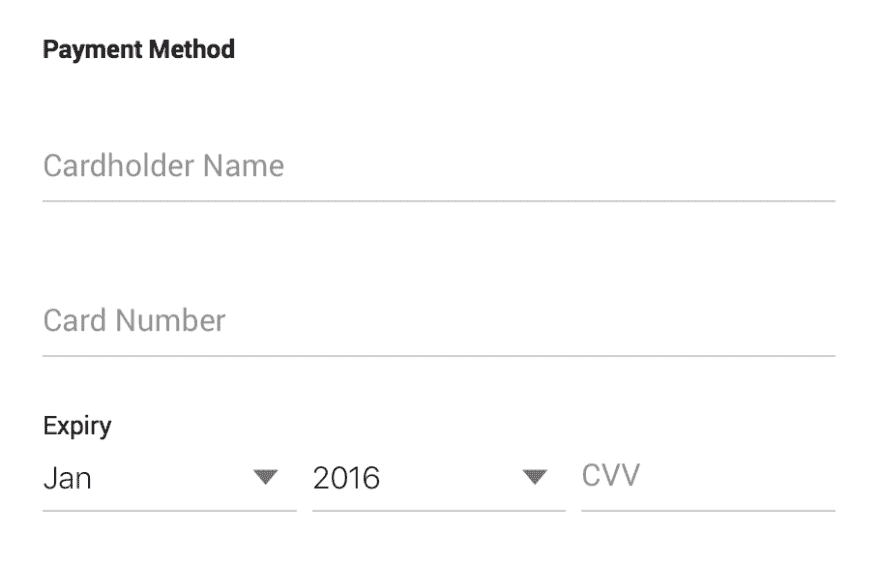
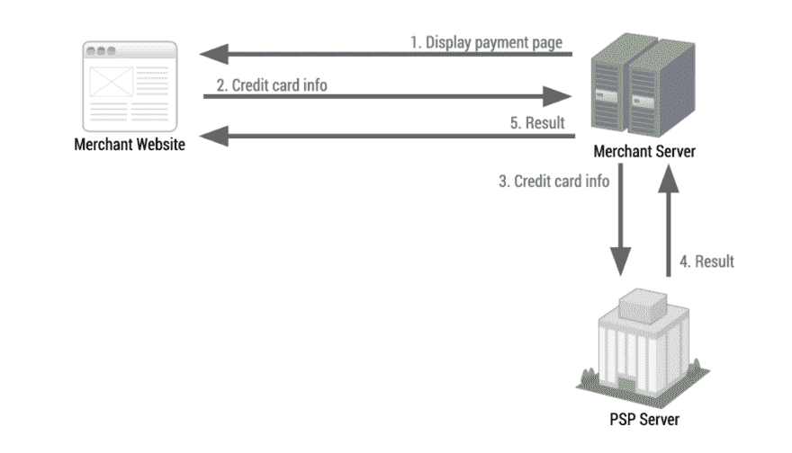
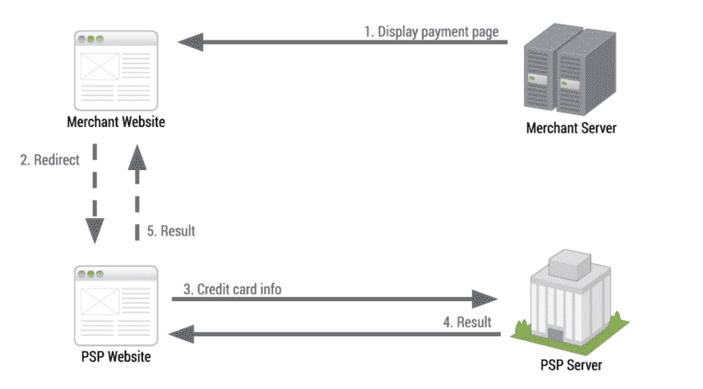
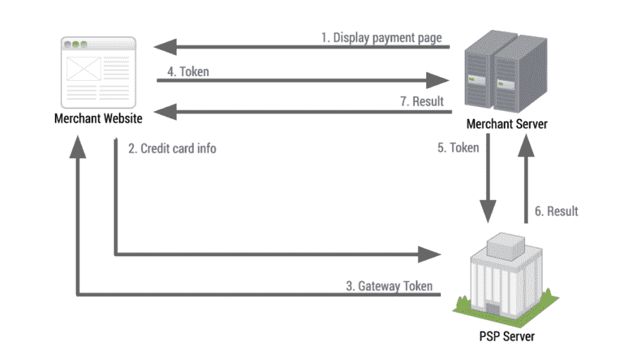
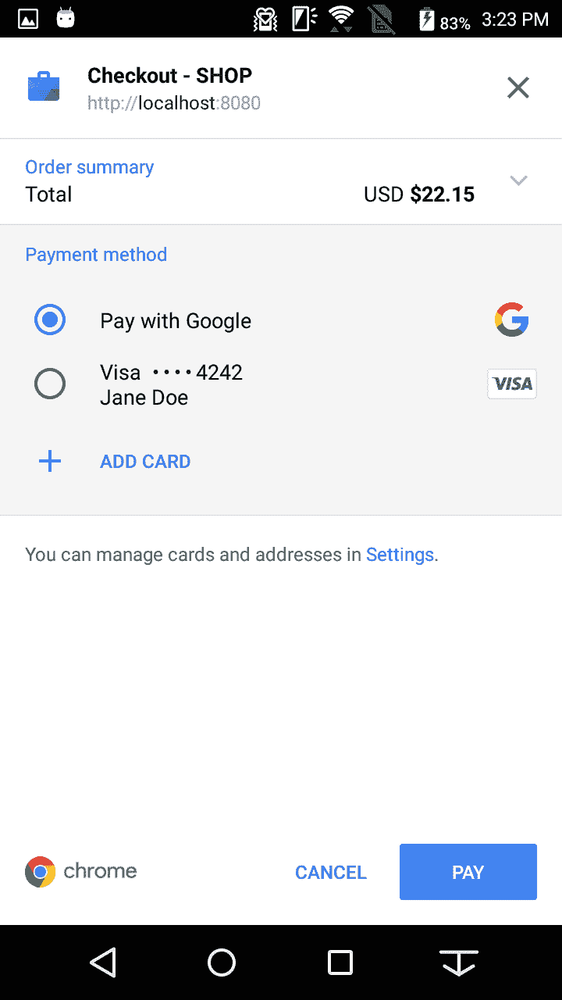

# 将支付请求 API 与支付服务提供商集成

> 原文:[https://dev . to/agektmr/integrating-the-payment-request-API-with-a-payment-service-provider-62f](https://dev.to/agektmr/integrating-the-payment-request-api-with-a-payment-service-provider-62f)

有了支付请求 API，网上支付大大简化了。UX 可以跨网站保持一致，使用户更容易输入和重复使用他们的个人信息，如送货地址或付款细节。它还支持[各种网络支付方式](https://dev.to/agektmr/how-payment-methods-work-in-the-payment-request-api-5ie)。

让我快速回顾一下重要的支付概念:

**基本卡** —一种在所有支持支付请求 API 的浏览器(Chrome、Samsung Internet、Edge)上原生实现的支付方式。卡信息通常与表单自动填充数据共享，并作为纯文本从付款申请 API 返回。

**支付应用** —提供以 URL 字符串表示的支付方式的 web 应用或本地应用。[用 Google](https://developers.google.com/payments/) 支付， [Apple Pay](https://www.apple.com/apple-pay/) ， [Samsung Pay](https://www.samsung.com/us/samsung-pay/) ，[支付宝](https://intl.alipay.com/)就是很好的例子。卡信息被安全地存储，并且通常作为令牌化的文本从支付请求 API 返回。

支付请求 API 改变了整个生态系统，但它并不是解决端到端支付(包括处理)的灵丹妙药。这是一个非常普遍的误解，但是你仍然需要和支付服务提供商打交道。

谷歌的支付请求 API 文档详细描述了该 API，但没有触及与 PSP 部分的集成。在这篇文章中，我想给你一些如何集成 PSP 的想法。

为了简单起见，在本文中我将集中讨论信用卡支付(基本卡)的情况。本文可能不适用于其他支付方式，如使用 Google、Apple Pay、Samsung Pay 和支付宝支付。

### **现在的支付体验和整合是怎样的？**

当您尝试使用信用卡在线支付时，您通常会看到这样的 web 表单:

[T2】](https://res.cloudinary.com/practicaldev/image/fetch/s--nse8jrFb--/c_limit%2Cf_auto%2Cfl_progressive%2Cq_auto%2Cw_880/https://cdn-images-1.medium.com/max/910/1%2AXRsUdSjXcmAirfaho38PNA.png)

该表单包括持卡人姓名、卡号、到期年份/日期和 CVC 代码等字段。通过提交该表单，商家将接收这些信息，以代表用户处理支付。

在幕后，大多数商家将这些信息发送到支付网关或支付处理器(本文中的 PSP，支付服务提供商)，以便处理支付并开始实际的资金转账。

一般来说，有三种集成模式可供你选择来连接 PSP。让我们看看他们每个人的样子。

#### API 类型集成

第一种集成模式称为 API 类型。这很简单，但需要相对较高的技术技能来实现。

一个商家通过一个表单向他们自己的服务器提交信用卡信息。然后服务器通过他们的 API 将信息转发给 PSP。PSP 通常提供服务器端 SDK 来帮助实现这些集成。

[T2】](https://res.cloudinary.com/practicaldev/image/fetch/s--ODsONJz0--/c_limit%2Cf_auto%2Cfl_progressive%2Cq_auto%2Cw_880/https://cdn-images-1.medium.com/max/1024/1%2A7yfPpNHgFGEQc-ny1jvFVw.png)

#### 链接式集成

链接类型是三者中最容易与 PSP 整合的方式。虽然设计的灵活性和用户体验并不复杂，但即使是非技术型的网站管理员也可以使用这种类型来集成 PSP。

当用户准备付款时，商家会将用户转到 PSP 托管的页面，页面上有一个接受信用卡信息的表单。用户通过表单提交的付款信息将直接传递给 PSP 并由它处理。然后，用户将被带回商家网页，(希望)发现付款已完成。

[T2】](https://res.cloudinary.com/practicaldev/image/fetch/s--dVmPiBrp--/c_limit%2Cf_auto%2Cfl_progressive%2Cq_auto%2Cw_880/https://cdn-images-1.medium.com/max/1024/1%2AG8E3EvtJh4OVhMWkYLTr8w.png)

#### 标记化式整合

这三种方法中最现代的是标记化类型。这种集成允许商家同时获得安全性、便利性和设计灵活性。

与链接类型不同，表单显示在商家托管的页面中，但它实际上是通过 iframe 从 PSP 的域中提供的。用户提交的卡信息将被直接传递到 PSP 的服务器，结果商家将收到一个令牌。然后，商家可以通过他们的服务器进行验证，并要求 PSP 处理付款。

这里的要点是，大多数这些操作都是由 PSP 的客户端 SDK 处理的，它允许商家在不接触用户信用卡号码的情况下处理支付。

[T2】](https://res.cloudinary.com/practicaldev/image/fetch/s--PSEAfWyC--/c_limit%2Cf_auto%2Cfl_progressive%2Cq_auto%2Cw_880/https://cdn-images-1.medium.com/max/1024/1%2Ap2atYiiS0sfIKEc2K-VbTg.png)

### 这如何应用于付款申请 API？

好了，现在让我们考虑如何将这些模式应用于支付请求 API。下面是您将用来调用 API 的一段代码:

```
let request = new PaymentRequest(methods, details, options);
request.show().then(paymentResponse => {
  // process payment
}); 
```

[T2】](https://res.cloudinary.com/practicaldev/image/fetch/s--Wva_ncB_--/c_limit%2Cf_auto%2Cfl_progressive%2Cq_auto%2Cw_880/https://cdn-images-1.medium.com/max/720/1%2A6MJpjVQ-wc3nRo0cFBq2-A.png)

当用户按下“支付”时，支付请求将被解决，您将收到一个支付响应和支付信息。如果用户选择使用[一张](https://dev.to/agektmr/how-payment-methods-work-in-the-payment-request-api-5ie) [基本卡作为支付方式](https://dev.to/agektmr/how-payment-methods-work-in-the-payment-request-api-5ie)，付款方式如下:

```
{
  "methodName": "basic-card",
  "details": {
    "cardholderName": "Jane Doe",
    "cardNumber": "4242424242424242",
    "expiryMonth": "12",
    "expiryYear": "2020",
    "cardSecurityCode": "111",
    "billingAddress": { ... }
  },
  "shippingAddress": null,
  "shippingOption": null,
  "payerName": null,
  "payerPhone": null,
  "payerEmail": null
} 
```

然后，您可以使用其中的付款信息部分(详细信息)来处理付款。

让我们将这些信息应用到我前面描述的集成模式中。

#### API 类型

这种模式相当简单。只需将支付信息发送到服务器，解析它，然后将其发送到 PSP 的 API。

这里重要的警告是，您需要 [PCI compliance](https://www.pcisecuritystandards.org/) 来使用这种类型进行集成，因为您显然是在处理原始的信用卡信息。 [PCI SAQ A](https://www.pcisecuritystandards.org/documents/PCI-DSS-v3_2-SAQ-A.pdf) 不会出线，你要有 [PCI SAQ A-EP](https://www.pcisecuritystandards.org/documents/PCI-DSS-v3_2-SAQ-A_EP.pdf) 或者 [PCI DSS](https://www.pcisecuritystandards.org/) 。如果你不知道我在说什么，咨询你的 PSP。除非你的公司足够大，花钱并努力遵守 PCI，否则你没有资格选择这个选项(一些不优先考虑 [PCI DSS](https://www.pcisecuritystandards.org/) 的国家除外)。

#### 链接类型

你可以很容易地想象，链接类型的目的是将支付系统从一个商家网站中分离出来。这意味着将付款申请 API 与链接类型集成一起使用在理论上是不可能的。您必须将支付请求 API 调用推迟到您的 PSP。

#### 标记化类型

标记化类型模式是一个有趣的模式。通过这种集成，您可以向 PSP 服务器发送支付信息，以获得令牌作为回报。这允许您的服务器不完全处理原始信用卡信息，使您不需要 PCI 合规性——不幸的是，这是错误的。

在客户端处理信用卡信息不需要遵循 PCI 规范，这是 PCI 3.1 之前的事情。 [**PCI DSS 3.2 澄清了**](https://blog.spreedly.com/2017/02/08/pci-compliance-best-practices-making-e-commerce-more-secure/) **如果在客户端处理原始信用卡信息，需要 PCI SAQ A-EP 或 PCI DSS。**事实上，令牌化类型如此复杂的原因是为了与 PCI (SAQ A)的最简单选项保持一致，并且永远不要让商家接触此类敏感信息，但仍要让他们能够与自己的系统集成。

好吧，那么，这对你意味着什么？这意味着，为了用基本卡实现支付请求 API，商家应该是 PCI 兼容的，否则就把它委托给 PSP。

事实上，一些 PSP 已经开始支持支付请求 API，作为他们在谷歌支持下[支付的一部分(例如:](https://developers.google.com/payments/) [Stripe](https://stripe.com/docs/stripe-js/elements/payment-request-button) ， [Braintree](https://developers.braintreepayments.com/guides/pay-with-google/client-side/javascript/v3) )。

### 结论

为了引入付款申请 API 并让用户在您的网站上看到付款申请单，您有两种选择:

*   如果您符合 PCI 规范(PCI SAQ A-EP 或 PCI DSS)，请使用 API 类型集成自行实施付款申请 API。
*   如果您没有 PCI 合规性(或 PCI SAQ A)，请等待您的 PSP 支持支付请求 API，并通过链接类型集成或通过他们的 SDK 将其用作令牌化类型集成。

有些人可能会失望地发现，PCI 合规性仍然是实现支付请求 API 的一个要求。但是考虑到这是一条通向光明未来的道路。

在下一篇文章中，我将描述 basic card 的定位，为什么需要它，什么是支付应用以及未来会是什么样子。

*特别感谢我的同事们和来自 Stripe 的* [*丹尼尔赫弗南*](https://twitter.com/danielshi) *审阅这篇帖子。*

* * *