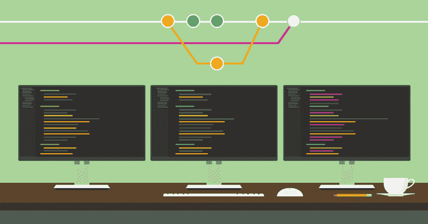

# Jenkins(软件)什么是 Jenkins，为什么您应该使用它？

> 原文:[https://dev . to/bugfenderapp/what-is Jenkins-and-why-you-be-use-it-2pe](https://dev.to/bugfenderapp/what-is-jenkins-and-why-should-you-be-using-it-2pe)

[T2】](https://res.cloudinary.com/practicaldev/image/fetch/s--Vs1g5Cne--/c_limit%2Cf_auto%2Cfl_progressive%2Cq_auto%2Cw_880/https://bugfender.com/wp-content/uploads/2017/11/bugfender-what-is-jenkins.jpg)

*这篇文章最初发表在我们的[博客](https://bugfender.com/blog/what-is-jenkins-and-why-should-you-be-using-it/)上。*

许多 devops 团队的一个常见问题是工作流支离破碎。效率低下会令人恼火。

你知道这是怎么回事:团队中的个人倾向于独立工作。单独编码时，工程师经常在版本控制之外创建大段代码。一旦开发人员“完成”，他们就将他们的工作添加到基础代码中。然后另一个团队手动运行测试来验证构建。

多年来，许多团队都发现这种分工令人讨厌且有问题。

当多个开发人员分别向版本控制提交较大的更改时，他们会创建复杂的错误，增加耗时的修复，并增加进行更多手动测试的时间。一切都慢了下来。

这用冗长的调试堵塞了你的构建周期，拖慢了生产时间，最终降低了你公司的利润。

## 什么是持续集成？

持续集成(CI)是一个旨在通过允许开发人员从共享的版本控制存储库中编译团队代码来减少构建周期低效的过程。CI 还允许您自动化测试，因此您可以设置系统来自动运行单元测试或集成测试。

CI 自动监控每个工程师的提交。这简化了代码的构建和验证，使得测试没有那么高的风险。这是软件开发社区公认的最佳实践。

CI 运行在共享服务器上，这增加了可见性，因此项目中的所有工程师每天都知道基础代码的变化。此外，您可以配置服务器，在开发人员提交失败的代码时向他们发出警告，以便他们可以修复他们引入的任何错误。

使用 CI 自动化可以让你**缩短开发发布周期**和**提高产品质量**。CI 本质上让您的团队使用机器做他们最擅长的事情，因此人类可以做为公司带来更多价值的事情。这一切都可以根据您的项目和需求进行定制。

CI 环境可以提供各种级别的测试自动化。

CI/CD 服务器，包括 [Jenkins](https://jenkins.io/) ，允许您的团队设置您需要运行的测试。

您可以实现不同级别的测试。最基本的测试是代码是否能真正编译。还可以对代码进行“linted”或风格检查。您的团队可以编写更复杂的测试来涵盖其他基础，包括单元、集成、压力、回归测试等。

[T2】](https://res.cloudinary.com/practicaldev/image/fetch/s--G1du8ZB9--/c_limit%2Cf_auto%2Cfl_progressive%2Cq_auto%2Cw_880/https://bugfender.com/wp-content/uploads/2017/11/jenkins-1-2-ci.jpg)

## 持续集成和持续交付有什么不同？

CI 服务编译和测试一个完整的应用程序(可能通过在模拟器中运行应用程序)。连续交付也将这个编译好的应用程序推送到一个存储库中，例如，供 alpha 测试人员使用并提供早期反馈。CD 版本可自动部署到生产环境中，也可用于更广泛的 beta 测试。

CD 的目标是精益物流:从添加新代码到验收测试的自动化过程。CD 自动化了所有的步骤，这样您的构建就[可以部署了](https://codeship.com/continuous-integration-essentials)。

*   持续交付:除了构建应用程序并在其上运行测试之外，应用程序也是“交付的”，这通常意味着将其放在服务器上，让某人对其进行手动测试，或者通过电子邮件发送给测试用户组(例如，通过电子邮件发送的移动应用程序)。
*   对于生产版本，交付意味着为最终用户部署应用程序。

这允许更快、更小地部署您的产品，从而降低部署风险。定期的、较小的、较瘦的分娩比一年只发生一两次的大分娩风险更小。

## 持续集成/交付如何帮助开发团队？

许多人谈论 CI，因为它被认为是一种最佳实践，即在每次提交时自动验证所有代码，定期运行测试，并持续部署——原因如上所述。

该过程检查每个开发人员的贡献是否能够很好地协同工作。尽早发现这些问题可以更容易、更快地修复错误。

正如您可能猜到的那样，实施 CI/CD 将导致您的团队发生文化转变。你必须变得更加敏捷和集成。

创建 CI 是为了让您的团队停止浪费人力时间去尝试手动解决新代码的冲突部分、触发构建或运行测试。相反，它鼓励在代码中添加小的、增量的变化，这样你就不会有巨大的、复杂的错误需要修复。这加快了构建周期，潜在地简化了部署和生产。

记住这一点很有帮助——生产是你的企业真正赚钱的地方。

此外，有趣的是，对于一个多开发人员的远程团队来说，CI 非常有助于实现，因为它将所有人聚集在一起，并不断地组合您的工作，因此无论地理位置如何，你们都在同一页面上。

> Jenkins 帮助构建远程团队的构建周期。

CI 如何帮助 Bugfender 团队:

*   运行 Jenkins 允许我们不断检查代码是否编译，并运行一组基本测试，这些测试是我们在每次提交后为验证基础代码而编写的。
*   我们自动将合并后的代码部署到一个集成环境中，这个环境可以用于手工测试(这个位叫做“连续交付”)。
*   我们还使用它来生成和部署生产构建。我们的部署很复杂，因为我们不是在更新一台机器:我们是在更新整个机器集群。我们必须确保以不中断服务的方式执行更新。如果由人工完成，在这种环境下的部署很容易出错

[T2】](https://res.cloudinary.com/practicaldev/image/fetch/s--bIO69Tnv--/c_limit%2Cf_auto%2Cfl_progressive%2Cq_auto%2Cw_880/https://bugfender.com/wp-content/uploads/2017/11/jenkins-1-3-jenkins.jpg)

## 詹金斯介绍

Jenkins 是一个用 Java 编写的 CI 服务器的开源实现，它可以作为一个自托管的选项，自动化任何项目的构建周期。它可以与任何编程语言一起工作，并适用于多种平台，包括 Windows、Linux 和 macOS。据[詹金斯](https://jenkins.io)网站报道:

> Jenkins 最初成立于 2006 年，名为“Hudson ”,是目前领先的自动化服务器之一。使用可扩展的、基于插件的架构，开发人员已经创建了数百个插件来使 Jenkins 适应大量的构建、测试和部署自动化工作负载。2015 年，Jenkins 的已知安装次数超过 100，000 次，成为部署最广泛的自动化服务器。

Jenkins 的一个主要好处是，它是一个拥有大量社区支持的知名工具，有许多可用的[插件](https://plugins.jenkins.io)(包括像 Slack、GitHub、Docker、Build Pipeline + more 这样的知名名称)，并且该项目由一个大型开发人员社区维护良好。

有很多关于 CI/CD 和 Jenkins 项目的讨论。但即使到了 2017 年，仍有数量惊人的团队不使用或维护他们的系统，因为**运行 CI 环境的成本很高，无论是时间还是金钱，通常都是**。

那么，为什么还要为它们费心呢？我们来看看这个问题。

## 詹金斯的利弊

Jenkins 是一个用户界面不友好的老工具。*

(*好消息是，Jenkins 项目刚刚发布了[蓝海](https://jenkins.io/projects/blueocean/)，一个旨在显著改善 UI 的持续交付软件。一如既往，它是 100%开源的。)

当您的团队考虑持续集成的选项时，注意到 Jenkins 必须在服务器上运行(成本)是有帮助的，因此它通常需要具有系统管理技能的人的关注(时间)。你不能只设置它，然后期望它自己运行-系统需要经常更新和维护。

然而，Jenkins 是开源的，是为您的 devops 团队实现 CI/CD 的最好和最广泛使用的免费工具之一。

大多数团队进入的主要障碍是初始设置、拖延或之前失败的尝试。人们倾向于知道这是一个最佳实践，但是许多团队在更紧急的编码工作中忽略了它。也许你的团队中有人试图在某个时候实现 Jenkins，但是没有成功地维护它。也许这种徒劳的努力给你的老板留下了不好的印象。

事实上，人们不实施 CI 服务器的原因通常是非常实际的。

一个主要原因是:竞争情报系统经常崩溃。如果项目中的设置发生变化，通常需要重新调整 CI 系统的配置。如果 CI 系统没有被团队视为高度有价值的，他们倾向于把它放在一边，坏掉，所以它停止交付价值。

不使用 CI 的另一个原因是您需要编写测试。编写测试是大多数开发人员想要做的事情(即最佳实践)，但是他们经常找不到时间去做。可以理解的是，对业务来说，编写实际的软件通常比更多的管理任务更重要。

另外，测试中断，意味着当测试下的功能改变时，它需要更新。如果它们没有更新，它们就停止传递价值，就像上面的例子一样。您必须自己优先维护基础设施，否则它将不起作用。

总之，设置它需要时间，并且需要大量的持续工作来保持它的更新。但是你的团队可以调整系统的维护和测试来提高效率。

当然，有托管 SaaS 替代詹金斯，这可能是有益的，如果你愿意支付一点额外的其他人来维护软件。当企业需要比 Jenkins 提供的更好的 UI 时，他们倾向于选择这个选项。但是自托管的一个主要好处是您可以更好地控制自己的数据安全。

实施 CI 需要文化上的转变，尤其是从管理上。他们必须留出时间来完成这些“非生产性的事情”，而其他一些日常任务则被搁置。

尽管如此，短暂的时间牺牲转化为整个公司的长期利益。有了 Jenkins，您的代码更容易维护，更少的 bug 潜入产品中。你的团队变得更加一体化。构建花费的时间更少。您的企业可以更快地出货，并跟上客户不断变化的需求。

所有这些都需要心态的转变:

CI 不是一项支出，而是一项投资。实施的投资回报可以通过节省时间、避免错误和更轻松地向客户交付更高质量的产品来体现。

请每周回来查看后续步骤！

* * *

这篇文章由 Sarabeth Flowers Lewis 编辑，她是一名自由作家，也是 Lewis 商业写作的联合创始人，专门从事 SEO 和直接回应内容创作。她目前和她的姜黄色丈夫一起远程工作，为科技、非营利组织和房地产写作。点击这里查看更多她的作品。

*这篇文章最初发表在我们的[博客](https://bugfender.com/blog/what-is-jenkins-and-why-should-you-be-using-it/)上。*