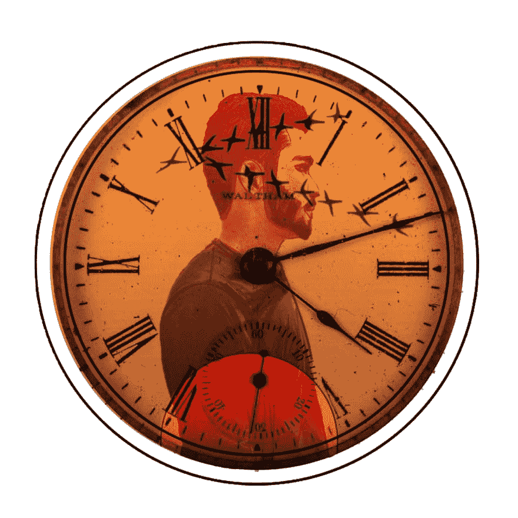
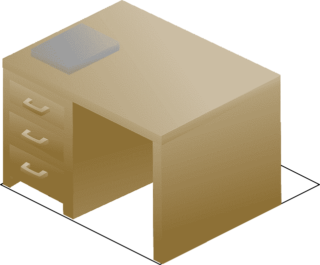

# 明智投资工程时间的最佳策略

> 原文:[https://dev . to/lpas qualis/best-strategies-to-invest-your-engineering-time-wise-6el](https://dev.to/lpasqualis/best-strategies-to-invest-your-engineering-time-wisely-6el)

这篇文章最初发表在 [CoderHood](https://coderhood.com) 上，被称为[明智投资工程时间的最佳策略](https://www.coderhood.com/best-strategies-to-invest-your-engineering-time-wisely/)。CoderHood 是一个致力于软件工程人类层面的博客。

[T2】](https://www.coderhood.com/best-strategies-to-invest-your-engineering-time-wisely/)

当我在 1984 年开始编码时，语言和技术的选择并不多。Basic，C 和 Pascal 是主要的。只有几本关于这个话题的书，互联网也不存在。在如此有限的选择下，决定如何利用我的学习时间成为一名软件开发人员并不困难。分心不是问题，网络也不是一个很好的选择。

这些年来，事情发生了巨大的变化。今天你有令人难以置信的一系列选项和信息可供选择。决定在哪里度过你的时间是令人生畏的。你应该成为一个多面手，什么都懂一点吗？还是专科，而且很懂一件事？此外，你应该学习写代码吗？你是想创业，还是想学编程？你的目标是什么？

在本文中，我将从商业和工程的角度探讨“明智地投资时间”的概念。

## 在目标上

[T2】](https://res.cloudinary.com/practicaldev/image/fetch/s--uPtu8q9E--/c_limit%2Cf_auto%2Cfl_progressive%2Cq_auto%2Cw_880/https://thepracticaldev.s3.amazonaws.com/i/zwafl8tmjxhysc0a9me1.jpg)

答案很大程度上取决于你想要达到的目标。学习构建软件是你的目标吗？或者你的目标是创建一个企业，一个网站或者一个软件来投放市场？换句话说，成为一名工程师(或者更好的工程师)是你正在努力做的吗？还是在尝试创业做科技？想一想；这两件事非常不同。

如果你想做的是创办一家科技企业，你应该考虑一下你的选择。工程道路可能不是实现你目标的最快和最容易的方式。

马克·扎克伯格先学会了写代码，后来建立了脸书。比尔·盖茨也走了一条类似的路，早期以开发人员起家，后来创建了微软。这些都是以工程为中心的企业家的例子，他们学习了构建软件的技术，并围绕他们的发明创造了企业。

其他人，比如史蒂夫·乔布斯，从来不是工程师，但他们创造了了不起的公司和产品，发展了一套不同的技能。他们有想法，并找到技术合作伙伴来实现这些想法。

让我给你一个非技术性的例子来说明这种区别。

# 得到一张书桌

[T2】](https://res.cloudinary.com/practicaldev/image/fetch/s--yWiDGs9P--/c_limit%2Cf_auto%2Cfl_progressive%2Cq_auto%2Cw_880/https://thepracticaldev.s3.amazonaws.com/i/okwhp5efrzuvh26lmxhi.png)

假设你的新办公室需要一张桌子。你知道根据你的可用空间需要多大，你也知道你想要在左边放三个抽屉，就像你的旧桌子一样。这一愿景相当清晰，并且有许多实现的途径。

## 许多选项有不同的权衡

你有很多选择来实现你的愿景。每一种都需要不同程度和不同形式的时间和金钱投资。

### 选项 1——在某处购买

选择之一是在商店里买；这是一个简单的解决方案，因为它能以最少的工作量快速、廉价地满足您的需求。

你所要做的就是浏览商品目录，找到最近的商店去取货。如果桌子对你的车来说太大了，你必须在网上订购或者租一辆卡车。租一辆卡车增加了复杂性。你必须去一个租车的地方，租一辆卡车，把卡车开到商店，买下桌子，把它放在卡车里，送到你的办公室，把卡车还给租车的地方，回到办公室，把桌子放在一起。

如果你以这种方式购买书桌，从一开始就能很好地理解它的质量和成本。在购买之前，你可以看到桌子，你可以触摸它，坐在它前面，你知道从特定商店购买东西的利弊。你也可以阅读该商品的评论，如果不满意可以退货。

### 选项 2 -定制订单

或者，你可以从商业家具制造商那里订购这张桌子。这个选项让您有机会根据自己的具体要求进行设计。

要往这个方向走，你得画一个你想要的计划，包括所有的措施，材料和细节。然后，你必须与供应商协商材料的类型和质量、时间和成本。当作品准备好了，你必须安排送到你的办公室。

结果的质量取决于你的选择、你的谈判技巧和你的预算。一般来说，如果你只想要一张桌子，这不是一个很好的选择，除非你需要一张特别的桌子。

### 选项 3 -构建它

另一种选择是自己建造。如果你想用木头做桌子，并且你已经有了工具和木工技术，你可以节省大量的时间和金钱。

但是，如果你对木工一窍不通，入门费时又费钱。你必须清空你的车库来创建一个木工车间，参加木工课程，购买工具，并在尝试制作书桌之前在一些废料上练习。一张桌子可能是一个有问题的开始项目，所以你可能必须先建造更简单的部分。

结果可能很好，也可能很糟糕，或者介于两者之间。这取决于你的专业水平、奉献精神、天赋、投入的时间以及你所购买工具的质量。

### 选项 4 -设置店铺

最后，你可以决定雇佣一群木工，开个店，让他们给你做桌子。这将需要大量的时间和金钱的初始投资，只有当你打算建造比这一张桌子更多的东西时才有意义。

作为回报，你会得到一张完全符合你规格的桌子，以及任何你将来想要打造的家具。如果你大量生产，每件产品的价格会随着时间的推移大幅下降。

除非你很富有，只有当你想进入家具行业时，这个选择才是经济上可行的。这是一个非常不同的问题要解决，而不仅仅是为你的办公室买一件，但它仍然是一个选择。

## 选择技术

[T2】](https://res.cloudinary.com/practicaldev/image/fetch/s--t6bRNtK1--/c_limit%2Cf_auto%2Cfl_progressive%2Cq_auto%2Cw_880/https://thepracticaldev.s3.amazonaws.com/i/e923jj8enit36pogtdzu.jpg)

当科技企业家需要实现一个软件时，他们面临类似的问题和选择。一个项目从一个目标和几种可能的方法开始，每种方法都有不同的优缺点:

1.  使用现成的产品。这种选择在选择、价格和质量方面给你有限但明显的选择。在大多数情况下，朝这个方向走是唯一划算的解决方案。
2.  雇佣一家工程商店为你建造它。这个选择开启了许多可能性，但这需要时间和努力。你必须找到一个你信任的供应商，准确地描述你想要什么和你想怎么做，协商价格和条款，并在整个过程中指导供应商，以确保他们在做正确的事情。您可能必须将结果与现有系统集成，这可能是一件复杂且昂贵的事情。
3.  自己动手打造。如果您是一名工程师，已经知道构建它的可行技术，并且有构建类似应用程序的经验，那么这是一个很好的选择。否则，这将是一条非常缓慢且昂贵的道路。你必须学习你选择使用的任何技术，并获得必要的软件工具。然后，你必须构建软件，并处理这样一个事实，如果你对特定的问题和技术没有任何专业知识，你就不能把它做好。此外，您需要做好准备在其生命周期内维护它，这是一项长期成本。
4.  雇佣一组人为你建造它。在这种情况下，你需要知道如何雇佣工程师，培训和组织团队来开发你设想的产品，并管理团队。换句话说，你需要开一家开发店；这是一个经济可行的解决方案，只有当你开始或经营一家企业。

## 警惕常见谬误

[T2】](https://res.cloudinary.com/practicaldev/image/fetch/s--706zWpe9--/c_limit%2Cf_auto%2Cfl_progressive%2Cq_auto%2Cw_880/https://thepracticaldev.s3.amazonaws.com/i/2v5y60tf1627vqf9vc21.jpg)

在评估选项时，你应该警惕那些将你引入歧途的常见谬误。评估如何投资你的时间是你能完全控制的少数变量之一；做出明智的决定是浪费时间和做最重要的事情的区别。

### “我建造它是因为我能”的谬论

软件工程师知道如何构建软件；他们就是这么做的。当他们面对一个他们不知道如何解决的问题时，他们会努力去解决它。无论哪种方式，他们的偏好都是从头开始创建解决方案，并按照他们喜欢的方式构建它们。

虽然这是可以理解的，但从头构建软件并不总是最具成本效益的解决方案。只有在以下情况下才有意义:

*   为了练习，学习一套特定的技能。虽然对于工程师来说，学习新事物是一件好事，但区分实践项目和真实项目是非常重要的。我建议不要把一个重要的项目作为实践项目来开始。如果你确信你不熟悉的技术是正确的选择，先在小规模实验中实践。
*   如果你需要的东西还不存在，而你从中获得的价值证明了构建和维护它的成本是值得的。
*   如果市场上有你需要的东西，但是太贵了或者很难买到。
*   如果你需要的软件是你业务的核心，并且你自己构建它增加了你公司的知识产权。

在所有其他情况下，组织通过获得容易获得的软件而变得更好。

### “一旦我建造了它，我就拥有它”的谬论

的确，一旦你开发了一个软件，你就拥有了它。如果在那个时候，你可以卖掉它，永远使用它，而不需要额外的投资，那就太好了。然而，软件永远不会“完成”一旦你建立了它，为了保持它的活力，你必须维护它。

如果你停止维护它，最终它会停止工作，因为它周围的一切都会改变。操作系统在发展，你集成的系统在变化，互联网也在变化。一切都变了。你投资的软件最终会开始出现问题，迟早会停止工作。

构建软件就像在你的花园里种植植物。你的植物越多，你每年需要做的维护就越多。成本会增加，最终，它会占用你所有的时间。

如果你和三个开发人员开了一家公司，他们会在一段时间内一直忙于开发新东西。最终，他们所有的时间都将消耗在维护他们所创造的东西上。这时候你知道你需要扩大团队和成长。建的越多，需要支持的就越多。积累你负责管理的软件需要一个不断增长的团队和不断增加的维护成本。这就是为什么现在许多软件公司转向了 SAAS 模式，在这种模式下，客户为了获得受支持软件的好处，继续每年付费。

### “我必须学习一切”的谬论

一天中没有足够的时间，一周中没有足够的时间，一个月中没有足够的时间，一年中没有足够的时间去学习所有你能学到的酷的东西。有太多的技术、语言、框架、资源、教程、技巧、趋势、算法、观点需要考虑，问题需要解决。

工程师就像好奇的人走过一个满是激动人心的书籍的书店。读哪个？如何选择在哪里投入时间？分心的可能性是无穷无尽的。

这些问题有很多答案，但是什么都学不是可行的。如果你必须在两个不受欢迎的极端之间做出选择，精通一种语言和框架比什么都懂一点要好。也就是说，极端很少是好例子，现实比这更微妙。

## 为生活而建软件，你的时间投资在哪里

[T2】](https://res.cloudinary.com/practicaldev/image/fetch/s--vd2J2Tay--/c_limit%2Cf_auto%2Cfl_progressive%2Cq_auto%2Cw_880/https://thepracticaldev.s3.amazonaws.com/i/3fmve0nr8c394rvsprt8.jpg)

如果你决定要成为一名软件开发者，你应该知道学习永无止境，无论你如何接近它。那么，在你未来的终身学习过程中，投入时间的最佳方式是什么呢？

### 论广度(通才)vs .深度(专家)

让我们做一个智力练习。让我们想象一下，两个开发人员，一个通才(Gus)和一个专家(Sally)，被要求构建同一个需要前端和后端工作的系统。

Gus 知道 Ruby on Rails、Python Django 和 Java Spring。他从未掌握过这些技术中的任何一项，但他知道如何应对。莎莉只知道 Python 和 Django，但是她很了解他们。

#### 谁的境遇更好？

在这种情况下，在项目的最开始，Gus 具有优势，因为他可以在几种语言和框架之间做出明智的决定。假设他选择 Java 和 Spring。

另一方面，Sally 的工具箱里只有一个选项，她打算选择 Python。一旦做出了最初的选择，Gus 就开始用中级 Java 开发人员的技能进行编码，Sally 开始用专业 Python 开发人员的能力进行编码。

即使 Gus 认为 Java 是这个项目更好的选择是正确的，Sally 也有可能更快地产生结果。她对 Python 和 Django 驾轻就熟，而且她很容易上手。

然而，事情并没有那么简单。过了一段时间，Gus 在多种技术方面的经验得到了回报，并给他带来了更好的设计和解决方案的灵感。他可能不像莎莉理解姜戈那样理解春天，但在他走的时候，不难找到他需要的东西。

所以，问题来了:谁更好？格斯还是莎莉？答案是:这取决于你如何衡量成功。

*   Gus 做出更好的技术决策；这对企业的长期发展更有利。
*   莎莉立即行动，这在短期内更好。
*   在项目开始时，格斯行动缓慢，因为他需要时间来学习使用他选择的技术。
*   Sally 从一开始就行动迅速，建立了一个遵循特定生态系统中最佳实践的系统。
*   Gus 将他在其他技术方面的经验应用于设计更强大的解决方案，并提出解决问题的创造性方法。
*   在项目进行到一半时，Sally 开始体验到她所选择的技术的局限性。性能、特定特性的缺乏和开发工具的弱点阻碍了她的发展。
*   格斯反而倾向于加速。他早期的技术决策得到了回报；因此，他碰到的问题更少了。
*   在项目接近尾声时，与现有系统的集成需要 Sally 扩展她的舒适区，并使用一些她不熟悉的其他技术。
*   Gus 与现有系统的集成没有问题。他熟悉相关的技术，并且轻松地通过了那个阶段，没有任何问题。
*   项目完成后，Sally 所做的工作遵循最佳 Python 实践，其他 Python 开发人员很容易维护它。然而，与现有系统的集成存在很多问题。此外，她缺乏广度和经验，导致她的代码效率低于预期。
*   Gus 代码不是最好的 Java 和 Spring 他从项目本身的工作中学到了很多。虽然他的工作正常，但并不像它应该的那样容易维护。然而，他与现有系统的集成从第一天起就非常好。

### 在成为专家和成为多面手之间找到平衡

[T2】](https://res.cloudinary.com/practicaldev/image/fetch/s--Lkw_ysGG--/c_limit%2Cf_auto%2Cfl_progressive%2Cq_auto%2Cw_880/https://thepracticaldev.s3.amazonaws.com/i/pgdn7fku3acvkmsxl2dj.jpg)

格斯和萨莉的故事只是一个例子，说明了很难说格斯(多面手)和萨莉(专家)谁更成功。有利有弊，最终的裁决需要更多的细节。由于我编造了这些情况，我可以很容易地把这个例子往任何一个方向推。

在实践中，你不必选择成为像 Gus 那样不是任何一门技术大师的纯通才，也不必选择成为像 Sally 那样只懂一门的绝对专才。两种选择都有局限性。

#### 你需要广度和深度

相反，我建议掌握几种不同的技术，并与许多其他人一起玩。在你的职业生涯中，你应该深入一门技术，并成为这方面的专家。然后，你应该换个方向，深入做别的事情。当我说“成为一名专家”时，我的意思是你应该专注于该技术至少两到三年，并使用它构建重要的产品。

例如，你可以花几年时间研究 Java 和 Java 框架。然后，您可以切换到 Ruby on Rails，并深入该领域。几年后，你可以转向 Python，深入研究。在那段时间里，你还应该肤浅地“玩”其他技术，只是为了模糊地熟悉它们，但不要在它们身上投入大量时间。

在我的职业生涯中，我是好几种语言的“专家”:Pascal、Basic、汇编 80×88、Java、SQL、C、C++、Ruby on Rails。我也尝试过许多其他的语言和技术，但是我从来没有感觉到我达到了精通的程度。例如 Python、PHP、Perl、Prolog、JavaScript 和其他一些语言。

当你掌握了一项技术，转而做其他事情时，你会对你以前不想做的技术感到生疏。别担心。如果你需要的话，重新学习并不难，而且你永远不会失去你所学的一切。这些概念和解决问题的技巧将永远伴随着你。它们成为你的一部分，在看似不相关的情况下，它们会帮助你。

技术确实会随着时间的推移而变化，所以如果你回到你放弃的东西上，你可能不得不补上你错过的东西。然而，你在不同领域多次深入所获得的知识和经验将使你成为一个更强的开发者。随着每一次深入，你将巩固你的解决问题的技能，你将学习新的模式和技术，这将使你的技术发展更上一层楼。

另一方面，如果你永远坚持一种技术，你永远不会超越那个水平。你将成为我所说的“高三学生”，也就是在有限的知识领域有多年经验的人。这通常被称为“被分类”，这不是一个很好的成长方式。

## 结论

*   如果你想创业，可以考虑购买已经制作好的软件，或者找人为你制作软件。
*   如果你选择做工程师，做软件，那就一遍又一遍地深入学习。把你的大部分时间集中在一项技术上。在每次深潜中花几年时间，并掌握它。不要担心忘记过去学过的东西。重要的事情会一直伴随着你。
*   同时，探索和尝试各种其他技术，以避免被孤立。

* * *

### 如果你喜欢这篇文章，请保持联系！

*   在 CoderHood 上找到我所有的帖子。
*   在 LinkedIn 上加入我的职业网络。
*   在推特上关注我。
*   加入我的脸书主页。
*   最后，请在 dev.to 上关注我！