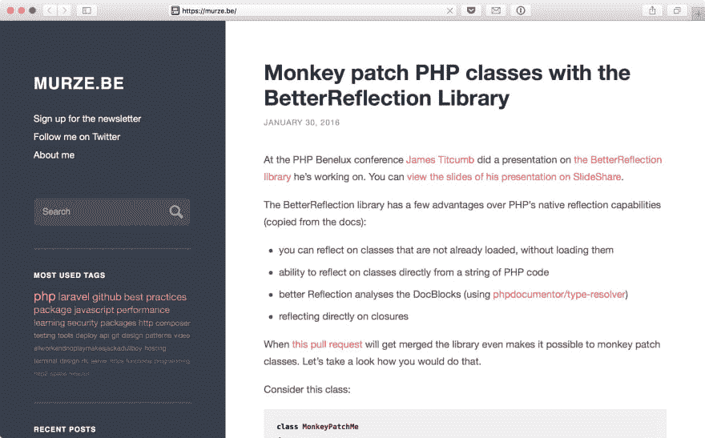
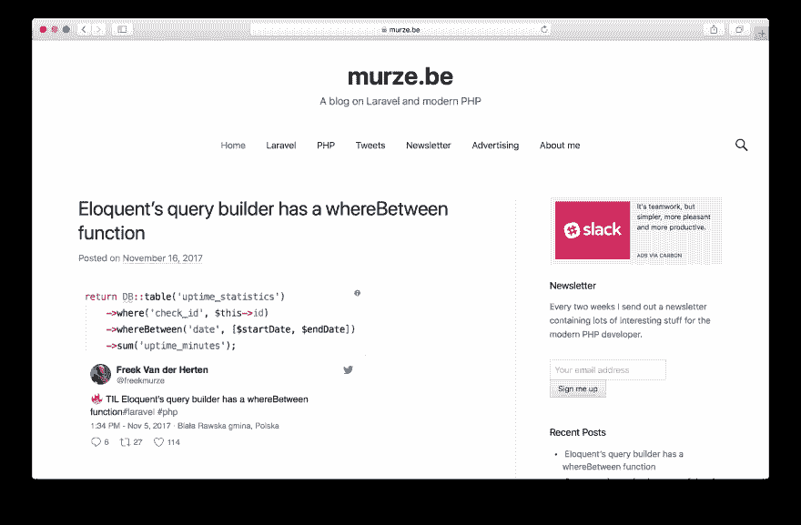
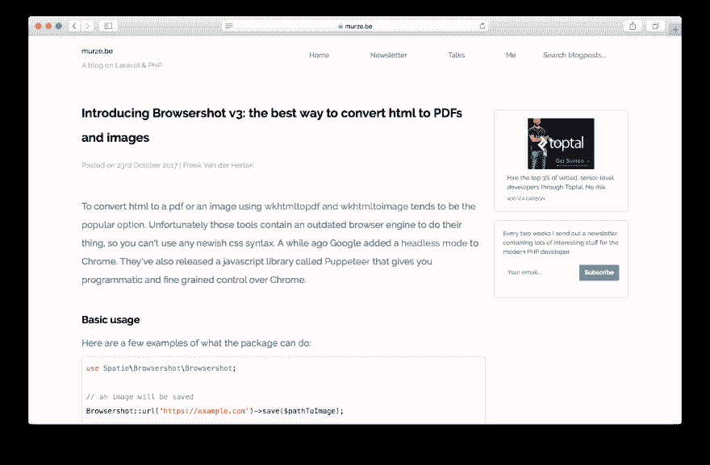
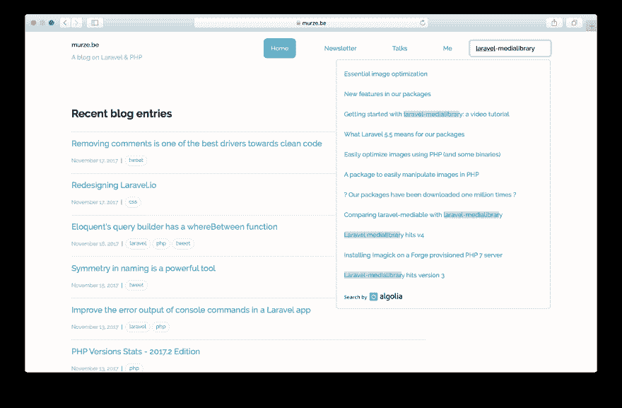
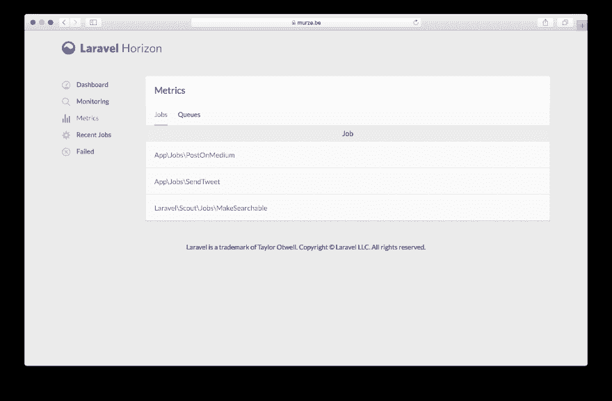
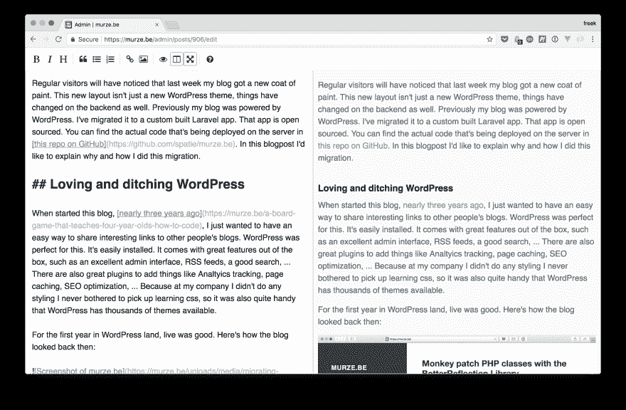
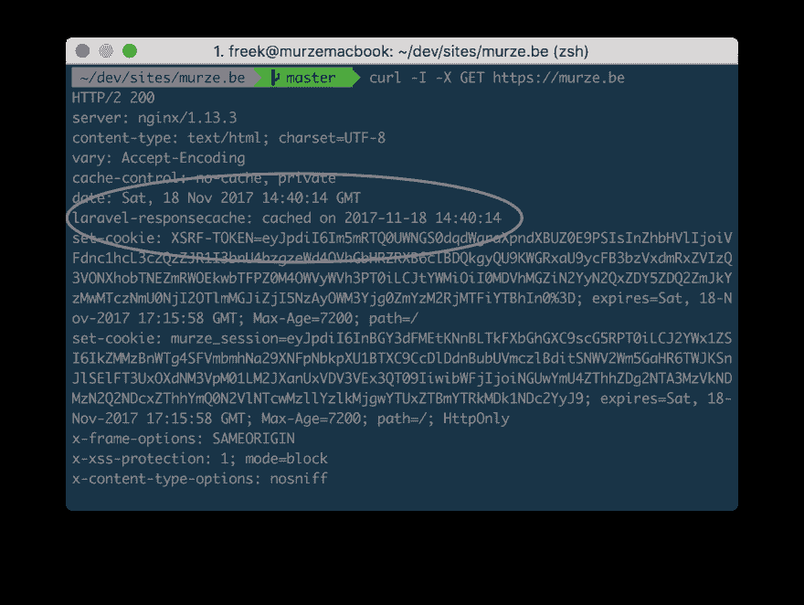

# ★将我的博客从 WordPress 迁移到 Laravel 应用程序

> 原文:[https://dev . to/freekmurze/on-migrating-my-blog-from-WordPress-to-a-laravel-application-4kk 0](https://dev.to/freekmurze/on-migrating-my-blog-from-wordpress-to-a-laravel-application-4kk0)

定期的访问者会注意到，上周这个博客有了一层新的油漆。这个新的布局不仅仅是一个新的 WordPress 主题。后端的情况也发生了变化。以前我的博客是由 WordPress 支持的。我已经把它移植到一个定制的 Laravel 应用程序上了。那个应用是开源的。你可以在 GitHub 的【repo 中找到部署在服务器上的实际代码。

在这篇博文中，我想解释一下我为什么以及如何进行这次迁移。

## 热爱并抛弃 WordPress

当我开始写博客时，[大约三年前](https://freek.dev/a-board-game-that-teaches-four-year-olds-how-to-code)，我只是想有一个简单的方法来分享有趣的链接到其他人的博客。WordPress 非常适合这一点。它很容易安装。它提供了开箱即用的强大功能，比如出色的管理界面、RSS 提要、良好的搜索，...还有一些很棒的插件可以添加分析跟踪、页面缓存、seo 优化等功能，...因为在我的公司，我不做任何样式设计，我也从不费心去学习 css，所以 WordPress 有数以千计的主题可供选择，这也很方便。

在 WordPress 的第一年，生活是美好的。以下是这个博客当时的样子:

[T2】](https://res.cloudinary.com/practicaldev/image/fetch/s--DB78wsjl--/c_limit%2Cf_auto%2Cfl_progressive%2Cq_auto%2Cw_880/https://freek.dev/uploads/media/migrating-wordpress/murze1.jpg)

与此同时，我开始在开源领域工作，并和我的团队 [一起制作了一些包](https://packagist.org/packages/spatie/)。我不再仅仅在我的博客上分享其他人内容的链接，而是开始为这些包写介绍性的帖子。因为博客开始吸引更多的访问者，我决定花点力气让博客看起来更好。我只是安装了一个新的主题(由我的同事[威廉](https://twitter.com/willemvbockstal)稍微调整了一下)。

我想对所有内容的放置进行更多的定制，但是作为一个非 WordPress 开发人员，摆弄 WordPress 代码库可能会令人望而生畏。我习惯于使用现代 PHP 代码。我在一些 php 文件中做了一些肮脏的修改。那感觉不太好，但是很有效。作为用户，我喜欢 WordPress，但作为开发者，我有点讨厌它。

有一段时间，我再次对博客的外观感到满意。这是从 2016 年 10 月到几天前的截图。

[T2】](https://res.cloudinary.com/practicaldev/image/fetch/s--xLeBTn0i--/c_limit%2Cf_auto%2Cfl_progressive%2Cq_auto%2Cw_880/https://freek.dev/uploads/media/migrating-wordpress/murze2.png)

今年夏天，Adam Wathan [宣布](https://adamwathan.me/css-utility-classes-and-separation-of-concerns/)他和一些朋友正在开发一个新的开源 css 框架，叫做 [Tailwind](https://tailwindcss.com) 。如上所述，我从来没有花时间学习 css，我认为这是我的致命弱点。对我来说，Tailwind 可能是 css 世界中一个有趣的切入点。如果我能在一个具体的项目中使用新知识，我总是更有动力去学习一些东西。这就是为什么[我决定](https://twitter.com/freekmurze/status/926779416658587648)用 Tailwind、Laravel 和几个我们自己的软件包重建我的博客。

在没有任何 css 知识的情况下，我完成了优秀的顺风文档。我读了亚当和顺风公司联合创始人史蒂夫·舒格写的[这篇博文](https://freek.dev/redesigning-laravelio)。[这个关于重建](https://www.youtube.com/watch?v=ZrRRMBaz5Z0) [Laravel.io](https://laravel.io/) 的视频也很有帮助。我尝试了一下顺风。开始这个项目时，我脑子里没有具体的设计。你现在看到的最终设计，是我学习的一个偶然的结果。

[T2】](https://res.cloudinary.com/practicaldev/image/fetch/s--rXx3YPIH--/c_limit%2Cf_auto%2Cfl_progressive%2Cq_auto%2Cw_880/https://freek.dev/uploads/media/migrating-wordpress/murze3.png)

## 幕后

如上所述，我的博客现在是一个 Laravel 应用程序。你可以在 GitHub 的 [this repo 中查看完整的源代码。让我们强调几个有趣的部分。](https://github.com/spatie/murze.be)

### 搜索博客帖子

搜索博客是由一个超快的搜索服务公司 [Algolia](https://www.algolia.com/) 支持的。使用 [Laravel Scout](https://laravel.com/docs/5.5/scout) 将所有博客文章从数据库传输到 Algolia。安装 Scout 后，你得到一个 Artisan 命令来执行数据库表到 Algolia 的初始传输。Scout 还提供了一个`Searchable`特征，应用于模型的[将确保新的记录和对现有记录的更新也被发送到 Algolia 索引。](https://github.com/spatie/murze.be/blob/09a1d275d1f29d13b81858dc10e9230086a9dab1/app/Models/Post.php#L24)

[T2】](https://res.cloudinary.com/practicaldev/image/fetch/s--0ujwrwX7--/c_limit%2Cf_auto%2Cfl_progressive%2Cq_auto%2Cw_880/https://freek.dev/uploads/media/migrating-wordpress/murze4.png)

现在您已经知道了文章是如何传输到 index 的，让我们来看看这些文章是如何被检索的。如果你试着搜索博客帖子，你很可能会注意到搜索结果几乎会立即出现。搜索请求没有到达我自己的服务器。整个搜索操作发生在客户端。[这个 Vue 组件](https://github.com/spatie/murze.be/blob/2734ddc/resources/assets/js/front/components/SearchPosts.vue)负责呈现搜索字段和结果。它使用 [Algolia 的 JavaScript API](https://www.algolia.com/doc/api-client/javascript/getting-started/) 来执行搜索请求。

我应该提到的是，Algolia 不是免费服务，但是，除非你真的希望有很多搜索请求，否则他们的免费等级足以在个人博客上使用。

### 导入 WordPress 帖子

当然，我不想失去所有的旧内容，所以必须想出一个办法把 WordPress 的帖子转移到我的新 Laravel 应用程序中。幸运的是，这并不困难。这里是从 WordPress 数据库导入文章和标签的 artisan 命令。为了处理标签，我使用了[我们自己开发的标签包](https://docs.spatie.be/laravel-tags/v2/introduction)。这个包使得[很容易将标签与雄辩的模型](https://github.com/spatie/murze.be/blob/2734ddcf7c442c36618be0f6c1d52cb19228a6c2/app/Console/Commands/ImportWp.php#L90)联系起来。

### 处理已更改的 URL

当使用 WordPress 时，一篇文章的出版年份和月份被用在 url 中，例如:`https://freek.dev/2017/06/building-realtime-dashboard-powered-laravel-vue-2017-edition/`。对于我的新博客，我想去掉时间部分，使用更短的链接作为`https://freek.dev/building-realtime-dashboard-powered-laravel-vue-2017-edition`。旧的 WP 网址在谷歌索引里。如果不处理，所有通过谷歌搜索来我博客的访问者都会看到一个 404 页面。

[我们的 laravel-missing-page-redirector 包](https://github.com/spatie/laravel-missing-page-redirector)就是为了解决这个问题而构建的。导入命令还[填充一个`redirect`表](https://github.com/spatie/laravel-missing-page-redirector)。重定向器包支持创建自己的重定向器来指定重定向的源(如数据库表)。这里是[读取`redirects`表的重定向器](https://github.com/spatie/murze.be/blob/2734ddcf7c442c36618be0f6c1d52cb19228a6c2/app/Services/MissingPageRedirector/DatabaseRedirector.php)。

有了这些，我博客的所有旧网址都被重定向到新页面。请访问`https://freek.dev/2017/06/building-realtime-dashboard-powered-laravel-vue-2017-edition`试试吧

### 提供 RSS 源

我通过阅读大量博客来了解我所在行业的最新动态。分别访问每个博客会花费很多时间，这就是为什么我更喜欢[订阅 RSS 源](https://freek.dev/stay-up-to-speed-with-php-by-reading-these-feeds)并在[我更喜欢的 RSS 阅读器](http://reederapp.com/mac/)中阅读所有内容。

当然，重新设计的 murze.be 应该有一个 RSS 提要。WordPress 自带对 RSS 提要的支持。在 Laravel 的土地上，你可以使用另一个自制的软件包: [laravel-feed](https://github.com/spatie/laravel-feed) 。这个包使得在你的博客上添加一个或多个 feed 变得非常容易。这里是[将一篇文章转换成提要条目](https://github.com/spatie/murze.be/blob/2734ddcf7c442c36618be0f6c1d52cb19228a6c2/app/Models/Post.php#L121-L130)的函数。

提要本身可以在[https://freek.dev/feed](https://freek.dev/feed)(包含所有帖子)和[https://freek.dev/feed/php](https://freek.dev/feed/php)(只包含被标记为`php`的帖子)上找到。

### 交叉发布内容

每当我在我的 WordPress 博客上发布一个新帖子，就会有一条推文被发送出去，内容被交叉发布到 Medium 上。这都是由两个插件处理的。我当然想保持这种行为。幸运的是，Twitter 和 Medium API 都很容易使用，所以我自己编写了一个解决方案，不依赖任何包。

这里是`Post`模型中的[代码，调度](https://github.com/spatie/murze.be/blob/87b672e/app/Models/Post.php#L78-L97) [`SendTweet`](https://github.com/spatie/murze.be/blob/87b672e6d18390e440e722a82c73cc516334e026/app/Jobs/SendTweet.php) 和 [`PostOnMedium`](https://github.com/spatie/murze.be/blob/87b672e6d18390e440e722a82c73cc516334e026/app/Jobs/PostOnMedium.php) 作业。

在我以前的 WP 博客上，发布一篇文章总是需要几秒钟，因为与 Twitter 和 Medium 沟通需要一段时间。在我新的 Laravel 博客上发布东西非常快，因为那些`SendTweet`和`PostOnMedium`的帖子在排队。事实上，所有上述与 Algolia 的同步也在排队。 [Horizon](https://laravel.com/docs/5.5/horizon) 用于处理和监控所有排队的作业。

[T2】](https://res.cloudinary.com/practicaldev/image/fetch/s--oJNsDGfE--/c_limit%2Cf_auto%2Cfl_progressive%2Cq_auto%2Cw_880/https://freek.dev/uploads/media/migrating-wordpress/horizon.png)

## 杂项

### 写减价

为了写文章，我建立了一个基本的管理界面。我喜欢写 Markdown 而不是普通的 html。我尝试了几个 JS 支持的 markdown 编辑器，最终使用了 [SimpleMDE](https://simplemde.com/) 。

[T2】](https://res.cloudinary.com/practicaldev/image/fetch/s--hrq-DgDK--/c_limit%2Cf_auto%2Cfl_progressive%2Cq_auto%2Cw_880/https://freek.dev/uploads/media/migrating-wordpress/markdown.png)

在前面的网站，降价内容必须呈现为 html。我已经将这个方法添加到了`Post`模型中。

```
public function getTextAttribute($original)
{
    return (new Parsedown())->text($original);
} 
```

这将确保每当视图中使用`$post->text`时，文章的内容都从 Markdown 转换为 html。

### 提高性能

Laravel 应用程序已经非常快了，但我们可以做得更好。过去，我的一些帖子在黑客新闻中排名相当靠前。当这种情况发生时，会有很多并发读者，博客应该能够处理。在 WordPress 中，我使用了 [WP 超级缓存](https://wordpress.org/plugins/wp-super-cache/)插件。这将把呈现的页面作为文件保存在磁盘上。下次再次请求相同的页面时，它将只提供该文件中保存的内容，而不是从头开始重新构建页面。

在 Laravel 中，完全相同的事情可以通过使用我们的另一个包来实现: [laravel-responsecache](https://github.com/spatie/laravel-responsecache) 。如果你想了解更多关于这个包的信息，请阅读[关于它的介绍性博客](https://freek.dev/speed-up-a-laravel-app-by-caching-the-entire-response)。

如果您查看这个博客的回复标题，您可以看到这个包正在工作。注意`laravel-responsecache`标题。

[T2】](https://res.cloudinary.com/practicaldev/image/fetch/s--k_QF1rlO--/c_limit%2Cf_auto%2Cfl_progressive%2Cq_auto%2Cw_880/https://freek.dev/uploads/media/migrating-wordpress/responsecache.png)

### 发送简讯

每两周，我会将博客上所有新内容的摘要发送给时事通讯的订阅者。可以在这里订阅[。几个月前，为了减少开支，我放弃了 MailChimp，转而选择了 T2 熊智娟 T3。你可以在 Mattias Geniar](https://freek.dev/newsletter) 的博客[中找到更多关于瑞士去熊智娟的信息。](https://ma.ttias.be/mailchimp-sendy-saved-600-year/)

以前，我必须手动收集所有的标题，链接和摘录，以包括在简讯中。对于我每一期大约需要 30 到 45 分钟的时事通讯。在我的新博客上，我添加了一些代码来自动获取所有的内容，并构建新闻简报的 html。

### 部署新版本

我是[特使](https://laravel.com/docs/5.5/envoy)的忠实粉丝，这是一个在远程服务器上轻松运行命令的工具。我的博客 repo 包含[一个特使脚本](https://github.com/spatie/murze.be/blob/8c48ff2/Envoy.blade.php)，它可以执行类似 Capistrano 的部署，几乎不停机。

## 在关闭

我希望你喜欢我博客的代码库之旅。您可以随意派生代码，并将其用于您自己的博客。请记住，回购中的代码不是一个成熟的 CMS，而只是一个简单的应用程序，适合我的需求。

我从学习顺风中获得了很多乐趣。在没有任何 css 知识的情况下，我成功地快速构建了一个我满意的设计。当事情没有按预期进行时，也会有一些挫败感。但我把这归咎于我自己缺乏 css 技能。幸运的是，当我陷入困境时，我的团队和社区中一些很棒的人帮助了我一点。

如果你喜欢 Laravel，一定要看看包含源代码的回购:[https://github.com/spatie/murze.be](https://github.com/spatie/murze.be)