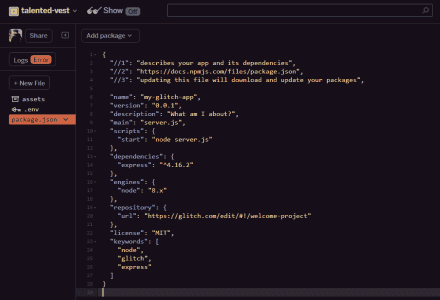
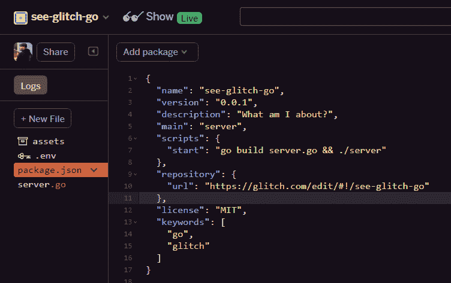

# 看格林奇去！

> 原文：<https://dev.to/shindakun/see-glitch-go-5j>

我的一个朋友最近为他的学习围棋提出了一个有趣的案例。他碰巧在日常工作中使用了很多容器，因为 [Kubernetes](https://github.com/kubernetes/kubernetes) 、 [Docker](https://github.com/docker/cli) 和 [HashiCorp](https://github.com/hashicorp) 的大部分程序都是用它编写的，所以他认为这可能值得了解。在交谈中，我感叹我错过了真正学习围棋的机会——对此他正确地回应道，“永远不会太晚！”。

毕竟，学习新的东西永远不会太晚，虽然我确实不时地使用容器，但我并不经常使用它们——不管怎样，掌握一些 Go 的基本技能还是很好的，毕竟，Go 不仅仅是针对容器的。考虑到这一点，我们将重新访问我整理的一个小型 Go 应用程序和 Glitch 站点。

*请记住，Glitch 目前不“支持”Go，但是，实例确实安装了 Go 版本 1.7.5。*

我们将首先创建一个新的故障应用程序，并删除除了`package.json`之外的所有文件。

[T2】](https://res.cloudinary.com/practicaldev/image/fetch/s--Hx862_Vo--/c_limit%2Cf_auto%2Cfl_progressive%2Cq_auto%2Cw_880/https://shindakun.glitch.me/conteimg/2017/11/go01.png)

这将有效地“打破”当前的应用程序，所以你会在日志按钮上看到“错误”,没关系，我们将很快修复它。现在，我们将专注于我们想做的事情。既然 Glitch 在网站托管方面表现得如此出色，那么我们建立一个非常基本的网络服务器是有意义的。

点击`New File`并输入`server.go`，然后点击`Add File 👍`。典型的第一个编程示例是创建一个“hello world”应用程序，让我们开始吧。这是我们完整的代码，我们将在后面逐步介绍。

```
package main

import (  
  "fmt"
  "net/http"
)

func handler(w http.ResponseWriter, r *http.Request) {  
    fmt.Fprintf(w, "Hello Go!")
}

func main() {  
    http.HandleFunc("/", handler)
    http.ListenAndServe(":3000", nil)
} 
```

Enter fullscreen mode Exit fullscreen mode

* * *

每个 Go 程序都是从所谓的包声明开始的。软件包可以帮助你组织和重用代码，我们使用`main`是因为它将是这个程序的“主要”可执行文件，并且它不会作为一个库被共享——它似乎也是 Go 程序的标准。

```
package main 
```

Enter fullscreen mode Exit fullscreen mode

* * *

为了创建我们的 Go web 服务器，需要导入一些已经存在的标准库。fmt 是 Go 的输入/输出库之一，它为我们提供了将信息呈现给用户的方法。典型的“hello world”程序将简单地打印到屏幕上，在我们的例子中，我们希望打印到 web 浏览器上。为此，我们将导入 [net/http](https://golang.org/pkg/net/http/) 。这为我们提供了创建监听 TCP 端口的服务器所需的工具，以及通过 HTTP 接收和响应的能力。这里链接的 net/http 包页面有几个非常简单的服务器的不同例子。

```
import (  
  "fmt"
  "net/http"
) 
```

Enter fullscreen mode Exit fullscreen mode

* * *

接下来，我们声明一个名为`handler`的函数，稍后我们可以将它传递给 http 库。这个函数将接收 HTTP 请求和 HTTP 响应编写器，这样我们就可以响应浏览器。这里我们打印字符串“Hello Go！”在本例中我们将其命名为“w”。

```
func handler(w http.ResponseWriter, r *http.Request) {  
    fmt.Fprintf(w, "Hello Go!")
} 
```

Enter fullscreen mode Exit fullscreen mode

* * *

每个围棋程序都包含一个`main`函数。这是程序执行时调用的函数。对于这个例子，在启动时，我们将通过调用 [`http.HandleFunc`](https://golang.org/pkg/net/http/#HandleFunc) 来注册我们的`handler`函数，并将我们想要响应的路径和处理请求的函数名传递给它。以这种方式使用`/`意味着我们服务器上的每条路径都将响应“Hello Go！”，没什么应该 404。

注册了处理程序后，我们就可以创建实际的服务器本身了。`http.ListenAndServe`将启动 HTTP 服务器监听端口 3000。Glitch 在我们的服务器和公共互联网之间有一个层，它会将这个转换为端口 80(或 443)，所以我们不需要担心路由这一部分。

```
func main() {  
    http.HandleFunc("/", handler)
    http.ListenAndServe(":3000", nil)
} 
```

Enter fullscreen mode Exit fullscreen mode

* * *

到目前为止一切顺利！这是棘手的部分。与 node.js 不同，Go 是一种编译语言，所以我们需要考虑到这一点，因为它不能简单地通过调用`node`和启动脚本来启动。Glitch 确实为我们提供了所需的工具，尽管它使用了`package.json`文件来启动节点站点，但我们只是先对它进行修改，以编译我们的节点应用程序。

要从命令行编译 Go 二进制文件，您可以调用 build，如下所示，我们使用`server.go`,因为这是我们在开始时创建的新文件的名称。

```
go build server.go 
```

Enter fullscreen mode Exit fullscreen mode

这将构建我们的可执行文件，但我们也需要运行它。`package.json`的启动脚本部分的功能或多或少类似于命令行。因此，我们可以将脚本更新为

```
"scripts": {
    "start": "go build server.go && ./server"
  }, 
```

Enter fullscreen mode Exit fullscreen mode

这将编译我们的应用程序，然后运行它。你可以在下面的图片中或者在 [Glitch 本身](https://glitch.com/edit/#!/see-glitch-go?path=package.json:)上看到我完整的包文件。

[T2】](https://res.cloudinary.com/practicaldev/image/fetch/s--evRHyMB5--/c_limit%2Cf_auto%2Cfl_progressive%2Cq_auto%2Cw_880/https://shindakun.glitch.me/conteimg/2017/11/go02.png)

关于这个项目的最后一个注意事项——当您对`server.go`文件进行更改时，它不会重新构建。您需要对`package.json`文件进行更改，或者等待服务器超时并重启。出于额外的好奇，我有一个扩展的例子，有一些不同的路线和一些在[https://glitch.com/edit/#!/go-example](https://glitch.com/edit/#!/go-example)的解析。它还包括一个`watch.json`文件来设置自动重建。

* * *

| 喜欢这篇文章吗？ |
| --- |
| 给我买杯咖啡怎么样？ |

* * *