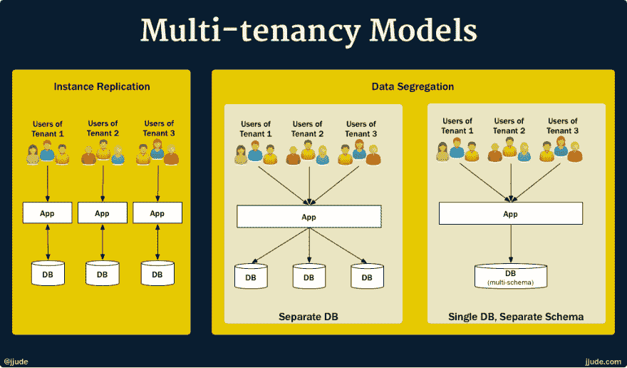
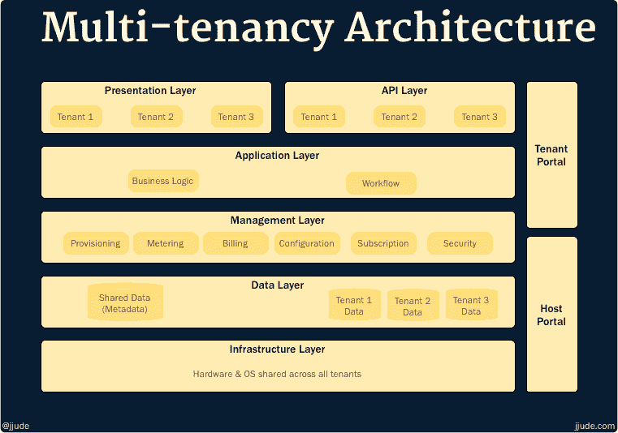

# 什么是多租户系统？

> 原文：<https://dev.to/jjude/what-is-a-multi-tenant-system-bpd>

*这篇文章最初发表在我的[博客](https://prudentdevs.club/mts/)T3 上*

软件系统的设计者被称为架构师并不是巧合。软件架构师从土木工程中借用了相当多的概念。多租户就是这样一个从土木工程中借鉴来的概念。与土木工程非常相似，软件**多租户优化了资源利用，但提供了定制的灵活性**。

让我们先从土木工程来理解这个概念。

我出生在一个独立的房子里。小房子，但独立。我们想怎么做就怎么做。我们把房子一分为二，一边是牛棚，另一边是生活空间。我们不需要征得邻居的同意就可以这么做。我们有在自己的土地上做任何我们想做的事情的自由。自由是有代价的。如果我们在任何公共设施(比如水)上有任何问题，我们必须自己解决。

上大学的时候，我住在招待所。我们每个人都有一个独立的房间。我们可以带自己的家具。我们中的一些人带了最少的东西来度过四年，而很少有富家子弟带了奢华的家具。学院负责维护和修理。虽然我们被允许带自己的家具，但我们不能改变房间，甚至不能改变墙壁的颜色。**房间不代表我们**。

工作几年后，我买了一套公寓。200 名业主中的每一位都有相同的布局，但我们每个人都用自己风格的家具填满了自己的家。他们中的一些人对做了进一步的定制。他们有隔音室可以录音！像我们的旅馆一样，维护和修理是由一个共同的机构进行的。

现在让我们从软件工程的角度来理解这个概念。

让我们用软件行业的例子来谈谈。

假设我想托管自己的电子邮件和文档服务器。经过一番搜索，我选择了[own cloud](https://owncloud.com/)[1](#fn1)。我把它安装在我自己的服务器上。我为自己创建了一个帐户并使用它。这是一个**单用户、单租户系统**。我既是用户，也是租户。我可以对系统做任何我想做的修改。

想在一个单独的域上托管它吗？检查。
什么改变系统中的颜色？检查。
挑选什么模块？检查。

当我习惯了这个系统，我想和我的妻子和家人分享这个日历。我为他们每个人都建立了个人账户。现在系统变成了**多用户，但仍然是单租户**。每个用户可以定制一些功能，比如日历名称，但他们不能挑选功能。如果我妹妹想将这个日历与她的 gmail 日历同步，她不能。为什么？因为如果我启用它，它将为所有人启用，我不想用一个新选项来迷惑我的父亲。没有只为一个用户或一组用户启用它的选项。

现在，我的同事马丁和鲍勃对我管理家庭日程的方式印象深刻，他们也想这样做。我可以在他们自己的服务器上安装 owncloud。他们将获得自由来定制他们想要的方式。但是，他们不想为管理和监控服务器而头疼。所以他们让我替他们管理。他们还告诉我，他们不想与任何人分享他们的数据。他们问我是否可以为他们建立独立的数据存储。它不会停止。马丁只想要日历设备，并想通过 schedules.martinfamily.com 访问系统。另一方面，Bob 希望从 familyroom.bob.com 访问系统。如 url 所示，除了使用日历之外，他还想存储家庭文档。他希望 AWS S3 公司成为他的数据仓库。我可以设置所有这些，因为 Owncloud 支持多租户。他们对系统的设置很满意，并邀请所有家庭成员使用该系统。他们决定为我的服务付钱。我是按照使用量收费的，而不是统一的价格。(我希望我能像童话故事那样结束这个故事:从此我在夏威夷幸福地生活在一起:-)。这个设置现在是一个多用户、多租户系统。

正如您所理解的，并非所有的 web 应用程序都必须是多用户系统，也并非所有的多用户 web 应用程序都必须是多租户系统。所有解决方案都是上下文相关的。架构师必须为一组给定的需求选择正确的方法。

构建多租户系统比构建多用户系统更复杂。构建多租户系统有两种模型:实例复制和数据隔离。

[T2】](https://res.cloudinary.com/practicaldev/image/fetch/s--zk9OgYP5--/c_limit%2Cf_auto%2Cfl_progressive%2Cq_auto%2Cw_880/https://cdn.jjude.com/mt-models.png)

在**实例复制模型**中，系统为每个租户旋转一个新实例。这很容易开始，但是很难扩展。当 100 多个租户注册时，这就成了一场噩梦。

在**数据隔离模型**中，应用程序在租户之间共享，但每个租户的数据存储在单独的数据存储中。独立的数据存储可以是独立的数据库，也可以是同一数据库中的独立模式。

为了支持这种数据分离，系统架构中必须有一个额外的**管理层**，以便在每次租户注册时提供一个单独的数据存储。多租户包括为每个租户定制的用户界面、选择性服务订阅和计量计费。管理层负责所有这些功能。

[T2】](https://res.cloudinary.com/practicaldev/image/fetch/s--qkSXqE2y--/c_limit%2Cf_auto%2Cfl_progressive%2Cq_auto%2Cw_880/https://cdn.jjude.com/mt-layers.png)

到目前为止，很明显多租户系统并不适合每个 web 应用程序。对于 B2C(企业对客户)web 应用程序来说，多用户架构已经足够了。对于 B2B(企业对企业)应用程序，应该考虑多租户架构。

尽管多租户架构很复杂，但像 GDPR 这样的数据隐私法规将迫使大多数 B2B SAAS 应用成为多租户系统。如果您正在构建一个新的 B2B SAAS 应用程序，您最好从多租户架构开始。

* * *

1.  我和 owncloud 没有联系。这只是一个例子。 [↩](#fnref1)