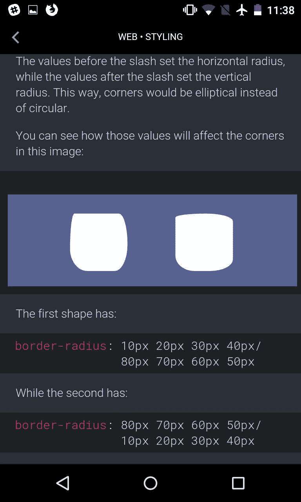
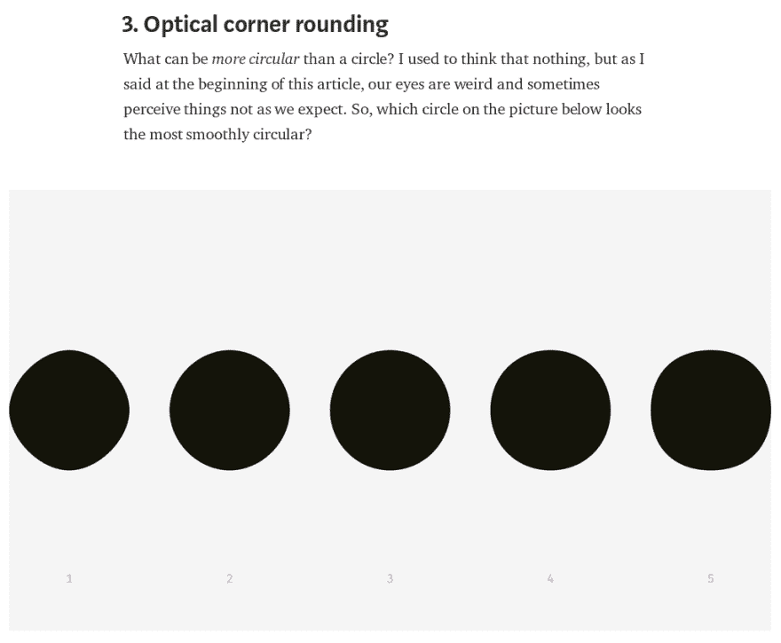

# 网络能做的事情

> 原文:[https://dev.to/christiankaindl/things-the-web-can-do-afl](https://dev.to/christiankaindl/things-the-web-can-do-afl)

有时我偶然发现一个很少被讨论的特性，或者看一个只有 451 次浏览的 CSS 演讲，或者我正在 MDN 上寻找一个特定的特性，看到一些很棒的 JavaScript API。我喜欢这些时光，探索我还不知道的新事物的感觉棒极了。但与此同时，我总是想:“为什么我以前没有听说过这个”或“哇，每个人都应该知道这个！”或者两者都有。

所以，这正是这篇文章的内容。我认为很少被提及的出色功能:

*HTML*

*   `output`标签
*   `ins`标签

*CSS*

*   `element()`功能
*   `border-radius`斜线(`/`)-语法

*JS*

*   `Intl`对象
*   `Performance`界面

* * *

让我们从...

### `Performance`界面

是的，你没看错。该浏览器有一个本机界面，让您可以进行精确的性能测量。重要的部分是**精确的**，因为它可以让你进行普通 JS 方法(如`Date.now()`)根本不可能的测量。它可以让你测量时间到*微秒*。微秒。不是毫秒，而是一千毫秒！

你也可以做各种各样的事情，像`marks`和`highResTimeStamp` s，给你一个更好的选择，用`Performance.now()`代替`Date.time()`。绝对值得一看！

[接口`Performance`的 MDN 文档](https://developer.mozilla.org/en-US/docs/Web/API/Performance)

* * *

### `Intl`物体

有没有做过这样的项目:你必须处理数字输入，或者必须以正确的格式显示日期？嗯，JavaScripts `Intl` object 就是为你准备的。

> Intl 对象是 ECMAScript 国际化 API 的命名空间，它提供了区分语言的字符串比较、数字格式以及日期和时间格式。

[对象`Intl`的 MDN 文档](https://developer.mozilla.org/en-US/docs/Web/JavaScript/Reference/Global_Objects/Intl)

* * *

### `border-radius`【斜线】(`/`)-语法

当我第一次看到这个的时候，我简直不敢相信自己的眼睛！我在用 Enki 进行日常知识锻炼，然后:

[T2】](https://res.cloudinary.com/practicaldev/image/fetch/s--GkUHF_1q--/c_limit%2Cf_auto%2Cfl_progressive%2Cq_auto%2Cw_880/https://thepracticaldev.s3.amazonaws.com/i/v7bg9r2coutcsy8m14hb.jpg)

您可以独立地弯曲拐角的 x 轴和 y 轴。太棒了。为什么？我立刻想起了不久前读过的一篇文章(我很高兴地把它收藏了起来！)关于视错觉:

 
(出自【https://medium.muz.li/optical-effects-9fca82b4cd9a】)

再往下一条评论写道:

> [...]在过去的日子里，我们必须将边角图像切片，并在元素上使用大量的圆角标记，然后边界半径使它变得容易得多，现在要获得视觉上正确的圆角，我们必须回到复杂的标记和背景图像。

但是也许我们可以使用这个斜杠语法来创建这些看起来也是圆的“圆角”！(*编辑:遗憾的是，斜线语法是不可能的，但无论如何这很有趣*)

[MDN on the border-radius`/`-语法](https://developer.mozilla.org/en-US/docs/Web/CSS/border-radius)

* * *

### `element()`功能

这是 CSS 的另一个惊人的特性。

文森特·德·奥利维拉写道:

> 简单来说，这个功能将网站的任何部分渲染成一个活的图像。a .活下去。形象！当您在浏览器中看到一个 DOM 元素时，您将得到它的图像。对该元素的每一个更改都会立即在图像中实时看到，甚至是文本选择。

`element()`可能实现的一些功能是缩略图/预览和类似镜子的效果。遗憾的是，这个 CSS 特性只在 Firefox 中有效，因此不能用于生产目的。希望其他浏览器厂商在将来的某个时候会效仿 Firefox 的早期努力！

[T2】](https://res.cloudinary.com/practicaldev/image/fetch/s--5JSLFoMt--/c_limit%2Cf_auto%2Cfl_progressive%2Cq_auto%2Cw_880/https://thepracticaldev.s3.amazonaws.com/i/z6gjnfh3t25xk2lu50pq.png)

*(信贷文森特·德·奥利维拉)*

[阅读文森特·德·奥利维拉的完整文章](https://iamvdo.me/en/blog/css-element-function)

* * *

### `ins`标签

HTML `ins`标签表示插入到当前文档中的内容。

来自 MDN:

> HTML `<ins>`元素表示已经添加到文档中的文本范围。

如果你对你的标记很挑剔，这是一个有用的标签(你应该如此！)因为您可以将它与附加的`cite`和/或`datetime`属性一起使用。`cite`让我们添加一个解释变更的 URI，让我们添加一个变更发生时的时间戳。

[关于 MDN](https://developer.mozilla.org/en-US/docs/Web/HTML/Element/ins) 上`ins`元素的更多信息

* * *

### `output`标签

与`ins`类似，`output`应该用于等式结果的内容。没什么特别的，但还是很酷！

[关于 MDN](https://developer.mozilla.org/en-US/docs/Web/HTML/Element/output) 上`output`元素的更多信息

* * *

*就是这样！感谢阅读:)*