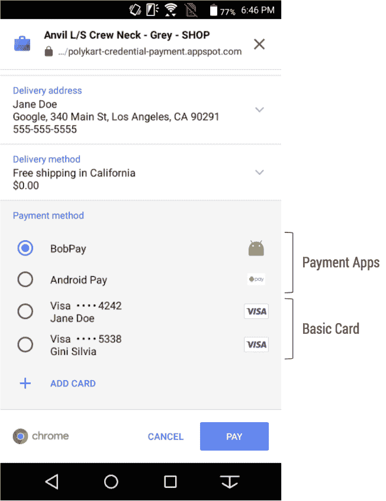
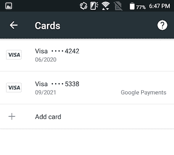
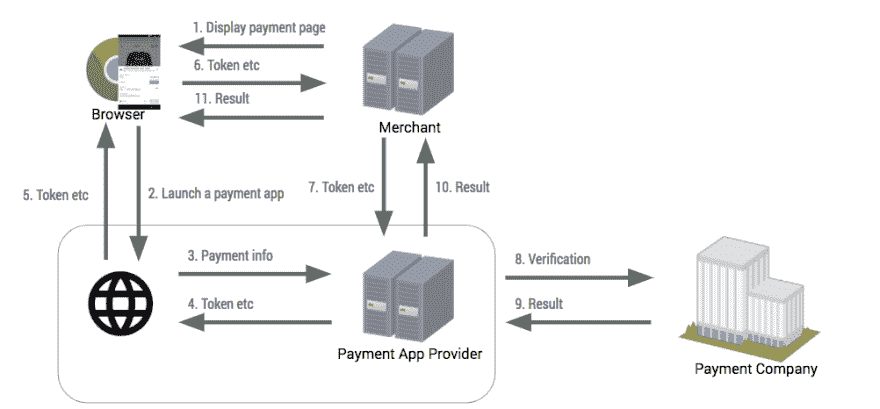

# 解决关于付款申请 API 的常见误解

> 原文:[https://dev . to/agektmr/addressing-common-misconcepts-about-the-payment-request-API-b89](https://dev.to/agektmr/addressing-common-misconceptions-about-the-payment-request-api-b89)

这是[中的一个十字柱](https://medium.com/dev-channel/addressing-common-misconceptions-about-the-payment-request-api-4d0db51dae75)。

* * *

支付请求 API 于 2016 年 7 月首次在 Android 平台的 Chrome 生产浏览器中推出。这是第一个完全专注于“支付”的开放网络功能，预计将在未来几年内演变整个网络平台及其生态系统。

在本文中，我将指出一些关于 API 的常见误解，并尝试尽可能全面地解决它们。如果你对支付请求 API 一无所知，你可能应该先阅读[这](http://g.co/PaymentRequestAPI) [页](http://g.co/PaymentRequestAPI)。

## Web 支付 API？Chrome 支付 API？谷歌支付 API？

这些都不正确；叫做“支付请求 API”(PR API)。这不仅仅是谷歌或 Chrome 的事情，它是一个开放的标准规范，现在和将来都可以在不同的浏览器中使用。该 API 目前在以下系统中受支持:

*   安卓版 Chrome 浏览器
*   桌面版 chrome(Mac、Windows、Linux)
*   微软 Edge
*   三星互联网浏览器

这将会是:

*   iOS 版 Chrome
*   苹果 Safari
*   Mozilla Firefox

## 有了支付请求 API，浏览器将负责处理支付，因此开发者不必做任何事情

这是不对的。即使使用 PR API，开发人员仍然必须将用户提供的支付信息发送到支付网关或支付处理器，以便进行处理和转账。

请将 PR API 视为使用 JavaScript 实现的表单的替代品。当用户点击“支付”按钮时，网站的 JavaScript 将接收用户的支付信息，这样你就可以随心所欲地处理了。通常，您会将其直接转发到支付网关以获得令牌，然后从您的服务器处理支付。

## Chrome 上的支付请求 API 将使用与我的谷歌账户相关的支付信息，对吗？

这可能是真的，但并不总是如此。目前定义了两种支付方式，“基本卡”和“支付应用”。

[T2】](https://res.cloudinary.com/practicaldev/image/fetch/s--fZAb2S6I--/c_limit%2Cf_auto%2Cfl_progressive%2Cq_auto%2Cw_880/https://thepracticaldev.s3.amazonaws.com/i/b8jnfpd413vuz9cb6byb.png)

有了“基本卡”，Chrome 的支付请求表将向您显示来自

1.  本地存储的支付信息
2.  与用户的 Chrome 档案相关联的谷歌账户中存储的支付信息

[T2】](https://res.cloudinary.com/practicaldev/image/fetch/s--GbKoO6G3--/c_limit%2Cf_auto%2Cfl_progressive%2Cq_auto%2Cw_880/https://thepracticaldev.s3.amazonaws.com/i/dh9hekizv574klh4mqs8.png)

你可以在 Chrome 的自动填充设置页面查看 PR API(以及表单)有什么可用的。

标有“谷歌支付”的是从你的谷歌账户中提取的。(请注意，本地添加的信息不会被上传并存储在 Chrome 中。)

另一种支付方式是“支付应用”，它们不一定代表信用卡。它们可以是电子货币、加密货币或银行账户(这里不要太兴奋，这些类型的支付方法还没有普遍可用)。这取决于支付应用的实现，它处于一个孤立的世界，这意味着支付应用可以与 Chrome 或谷歌分开提供。

其他浏览器也是如此，取决于它们的实现。例如，在 Microsoft Edge 中，支付请求 API 连接到 Microsoft Wallet，并且可以访问与用户的 Microsoft 帐户相关联的支付信息。在三星互联网浏览器中，支付请求 API 仅在您使用三星设备时存储信用卡信息。

## 支付请求 API 可以很好地处理信用卡，但不能处理其他形式的支付

这也是不正确的。支付请求 API 旨在处理几乎任何类型的支付方式，包括银行转账、加密货币、电子货币、积分等。

支付请求 API 基本上是浏览器和支付方式之间的中介。它的设计足够灵活，允许任何原生应用程序或 web 应用程序成为一种支付方法，因此从技术上讲，任何人都可以开发自己的支付应用程序，以提供一种独特的支付方法。

[T2】](https://res.cloudinary.com/practicaldev/image/fetch/s--yfsrbFMg--/c_limit%2Cf_auto%2Cfl_progressive%2Cq_auto%2Cw_880/https://thepracticaldev.s3.amazonaws.com/i/fevudvp1dakhkno4yq15.png)

## 有了付款申请 API，我的网站就不需要 PCI 合规性了

这也是错误的；需要符合 PCI 规范。以下是您应该检查的内容。

如果你的网站符合 PCI DSS 或 PCI SAQ A-EP T1，你可能在一家相对较大的公司工作，只要你安全地实现它，就没什么好担心的。

如果你的站点符合 PCI SAQ 协议，请小心。与 PCI SAQ A，你不应该直接处理原始信用卡信息。这意味着使用带有“基本卡”的支付请求 API 作为支付方法不符合 PCI SAQ A v3.2 标准。

我将在另一篇文章中写更多关于这个主题的内容，但是请咨询您的支付网关，以了解如何在他们当前的设置中利用支付请求 API。或者你甚至可以要求他们支持支付请求 API！

* * *

如有任何问题，请留言。对于较大的主题，我将在后续文章中给出答案。