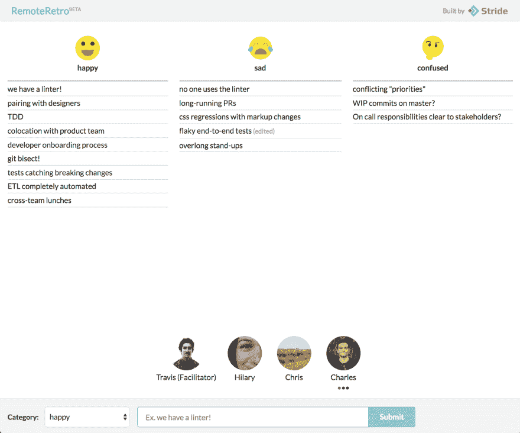

# 作为事后日落，远程复古上升:引入远程复古

> 原文:[https://dev . to/stride/as-事后-sunsets-remote retro-rises-introducing-remote retro-dk4](https://dev.to/stride/as-postfacto-sunsets-remoteretro-rises-introducing-remoteretro-dk4)

[T2】](https://www.stridenyc.com/blog/postfacto-sunsets-remoteretro-rises)

Pivotal 已经宣布，自 2017 年 12 月 4 日起，Postfacto.io 将关闭。

虽然我们很难过看到事后的离去，但 Stride 自豪地宣布 [RemoteRetro](https://remoteretro.org/) 的公测！RemoteRetro 是一个实时应用程序，用于与分布式团队一起进行回顾。RemoteRetro 为技术团队提供了直观、安全、有趣的体验，在回顾过程中提供指导，并自动化许多常见的促进任务，包括参与跟踪、项目排序和行动项目分发。

测试版在[remoteretro.org](https://remoteretro.org/)上线，代码是开源的，可以在[https://github.com/stride-nyc/remote_retro](https://github.com/stride-nyc/remote_retro)获得。

常见问题:

问:看起来很酷，但是...什么是复古？

A.Retro 是 retrospective 的缩写。回顾是敏捷仪式的核心之一。团队使用回顾来反思他们过去迭代的事件，目的是确定他们可以改进的地方，并生成将帮助他们进行这些改进的行动项目。

问:谁可以使用 RemoteRetro？

A.任何拥有谷歌账户的人都可以参加回顾展！

问:我的团队完全在同一个地方。我们应该使用 RemoteRetro 吗？答:当然可以，但我们不推荐，因为没有什么可以替代面对面的交流。使用白板！请阅读我们的指南，了解如何开展集中回顾。

问:为什么 RemoteRetro 是开源的？

A.整个软件开发社区都站在巨人的肩膀上，Stride 也不例外。我们对此进行了讨论，并一致同意回馈开源社区。

问:我可以从哪里了解计划中的功能和更新？

A.我们的积压在 GitHub 问题中，可以通过精彩的 ZenHub Chrome 扩展按优先顺序查看。

问:有多少人应该参加复古活动？

A.理想情况下，回顾会的人数不超过 10 人。超过 10 点，人们就会退房，因为他们觉得自己可能会被忽视。如果可以的话，尽量保持低数字！

问:我如何提交对我的体验的反馈？

A.用户在第一次追溯结束时会收到一份调查。此外，可以通过 GitHub issues 在[https://github.com/stride-nyc/remote_retro/issues/new](https://github.com/stride-nyc/remote_retro/issues/new)或者通过电子邮件在[remote_retro@stridenyc.com](mailto:remote_retro@stridenyc.com)提交错误和功能请求