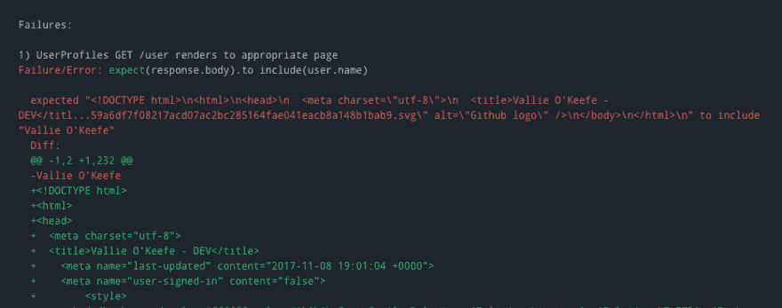

# 神秘的瓦里·奥基夫案

> 原文:[https://dev.to/maestromac/a-rather-annoying-edgecase-6l0](https://dev.to/maestromac/a-rather-annoying-edgecase-6l0)

有时候，当一个测试失败时，我的第一反应会是立即重新运行我们的持续集成套件，而不是花费时间去评估失败的规范。这是我想克服的一个习惯。为了证明我自己，我这样做是因为当这个问题反复发生，足以让我恼火时，我最终会承认这个问题。我们经常全神贯注于一个不同的任务，并且放慢速度来彻底检查一个随机的不相关的失败规格是很难做到的。

最近，我们的 CI 套件中有一两个测试会随机失败，我会看到类似如下的消息:

[T2】](https://res.cloudinary.com/practicaldev/image/fetch/s--dywFXMRe--/c_limit%2Cf_auto%2Cfl_progressive%2Cq_auto%2Cw_880/https://thepracticaldev.s3.amazonaws.com/i/8zziniklijauujx1xf1x.png)

对于那些不熟悉 RSpec 的人来说，它说的是在响应中找不到`Vallie O'Keefe`,但它清楚地显示在那里。我立即重新运行规范，90%的情况下它会通过。但问题是它会回来，并在这里和那里随机出没。

大约 2 周后，这个随机失败的规范(它一直出现在我们的请求规范中，只是出于某种原因出现在我身上)，我对自己说“好吧，到底发生了什么？”。我在本地运行了几次可能失败的规范，它似乎通过了。我立即意识到这是一种罕见的边缘情况，如果我重复运行规范 50 次以上，我就会遇到这种情况。所以，我迅速拿出一个剧本，耐心地坐着盯着它。

在第 20 次尝试时，规范最终失败了。

[T2】](https://res.cloudinary.com/practicaldev/image/fetch/s--fsA-WinS--/c_limit%2Cf_auto%2Cfl_progressive%2Cq_auto%2Cw_880/https://thepracticaldev.s3.amazonaws.com/i/jkv4n03dq2jr6hi6n4st.png)

原来，每当随机生成测试数据的[gem](https://github.com/stympy/faker)创建包含撇号的输出时，撇号就会在 HTML 中被编码/转义。当这种情况发生时，`Vallie O'Keefe`将无法与`Vallie O&#39Keefe`匹配。让我困惑的是，当在 CI 套件上呈现时，响应的内容是不转义的。为了补救这一点，我必须对我想要匹配的响应进行转义。下面举个例子:

`expect(response.body).to eq CGI.escapeHTML(@thing.name)`

我希望在我们开始写需求规格之前就知道这些。但更重要的是，我希望我能放慢速度并研究它，这样我就可以对所有未来的需求规格采取预防措施。取而代之的是，我现在不得不在 CI 上手动发现失败的请求规格，并随时更新。