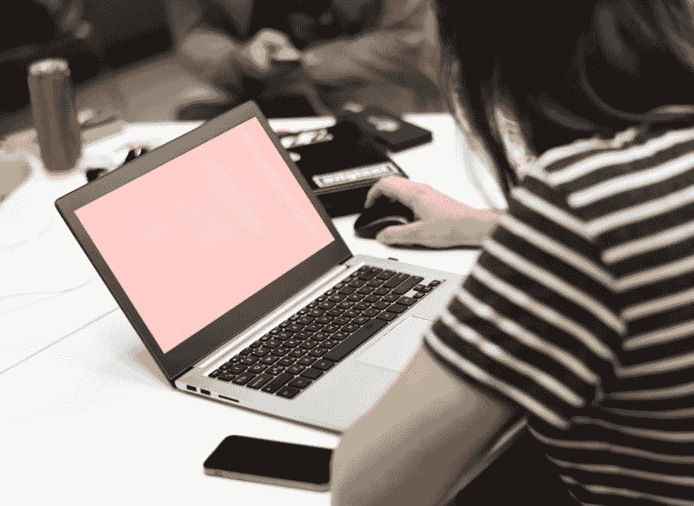

# 利用现有资源做更多事情

> 原文:[https://dev.to/brightdevs/do-more-with-what-you-have-4n3](https://dev.to/brightdevs/do-more-with-what-you-have-4n3)

让我们假设我们勤奋工作。但这也意味着我们工作有效率吗？我们是否每天花八、七或(至少)六、五个小时认真地做我们的项目？如果有人问**我们是否带着把工作做得最好的意图来工作，我们的答案会永远是肯定的吗？**

经济学家将生产率描述为每单位投入的产出量。我自己认为输入是我们完成任务的努力——不是尽我们所能——而是以我们期望他们做的方式。产量呢？产出是公司的成长、收入和发展以及员工的发展。结论很简单——你的投入越大，你期望的产出就越大。令人沮丧的是，统计数据显示，如今员工的生产率增长比过去慢得多。事实上，在许多情况下，它根本没有增长，而是直线下降。

[T2】](https://res.cloudinary.com/practicaldev/image/fetch/s--_H1Vp7Le--/c_limit%2Cf_auto%2Cfl_progressive%2Cq_auto%2Cw_880/https://thepracticaldev.s3.amazonaws.com/i/pnq4wgocydcxyoeeo998.jpg)

简而言之，在工作中富有成效并不意味着尽善尽美，而是更多地提升自己。这是关于提高你自己、你的团队和你的客户的满意度。当然，这不是花时间盲目地完成任务。我们不应该把精力和时间浪费在毫无用处、与我们的工作没有必然联系的事情上，而是应该停下来想一想，我们的工作如何才能做得更有效率。以及我们可以做些什么来提高我们的生产力和竞争力。没错，就是我们自己。没有什么比在彻底检查我们是否真的把工作做到最好之前，在其他人(或事物)身上寻找我们缺乏效率的责备更糟糕的了。

我们有大量的精力可以用来改善我们的日常工作。但似乎我们并没有以一种我们可能从中受益最多的方式使用它们。拥有高效的态度不是一件容易的事情，但是回报是巨大的。研究人员指出，最好的公司是具有生产力思维的公司。这些公司的生产率比其他公司高 40%，利润率比其他公司高 30-40%。背后的想法很简单——如果你想让你所在的公司快速发展，就让它快速发展。

[T2】](https://res.cloudinary.com/practicaldev/image/fetch/s---ntsTUNv--/c_limit%2Cf_auto%2Cfl_progressive%2Cq_auto%2Cw_880/https://thepracticaldev.s3.amazonaws.com/i/6whsu8iprxqumocozsgx.jpg)

通过阅读、工作、发展、实践、投入时间来提高你的能力，让自己变得更好，获得更多。一切都取决于你。如果你想成为普通人，你就会成为普通人，但如果你想，你也可以成为明星球员。如何利用你的天赋、精力和时间是你自己的决定。而且工作有没有效率也是你自己的决定。
有人可能会问，那么生产力规则是什么呢？我想说没有一个完美的解决方案或建议。通常，我们必须自己去寻找或创造它们。然而，有一些提示我个人觉得特别有用。

*   如果某件事不是必须做的，那就不要做
*   提前准备好每天的目标(比如早上)，然后按照你计划的去做
*   你在下午 1 点效率很高，在下午 1 点做最重要和要求最高的任务
*   不要让别人分散你的注意力或打击你的积极性
*   告诉你的队友，你需要一些不受干扰的时间
*   当你已经有了你需要的所有信息时，不要浪费时间在不必要的犹豫不决上。仔细考虑，然后开始行动。
*   截止日期是焦点。他们应该被满足。他们应该帮助你保持正轨。
*   把你的任务分成重要的和紧急的
*   深入了解您使用的流程。也许他们只是第一眼看上去很有效率。
*   **记住关于帕累托，20%有时比 80%更好。**

所有这些建议能保证你在工作中成为高产的超级明星吗？不。但是他们可能会帮助你找到你自己的路。每个人可能有不同的规则，这将有助于他们保持正轨。我们可以是拖延者，我们可以是懒惰的或者极度缺乏条理的，但是这永远不应该阻止我们高效和成功。我们只需要明智地选择我们的优先事项，遵守纪律并尊重他人。

最后但肯定不是最不重要的，当我们得到报酬去做一件工作时，无论发生什么事情，我们都应该把它做好，而且我们应该永远比别人做得更好。

最初发表于 2017 年 9 月 13 日 [brightinventions.pl](https://brightinventions.pl/blog/) 。

作者 Urszula Stankiewcz，社交媒体和雇主品牌女孩@光明发明

[邮箱](ula.stankiewicz@brightinventions.pl)， [LinkedIn](https://www.linkedin.com/in/urszula-stankiewicz-7bb10577/)