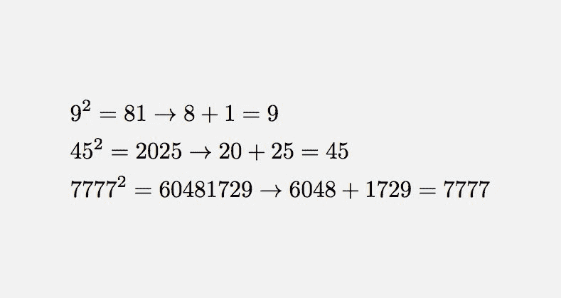

# 挑战:找到“Kaprekar 数”

> 原文:[https://dev.to/peter/challenge-find-kaprekar-numbers-14m](https://dev.to/peter/challenge-find-kaprekar-numbers-14m)

我在周末看到了这条推特—

> 费尔马图书馆@费尔马图书馆卡普雷卡尔数是这样的数，它们在那个基数上的平方可以被分成两部分，这两部分加起来就是原来的数2017 年 11 月 12 日下午 14:20

通过“T0”维基百科(t1)——

> 在数学中，给定底数的 Kaprekar 数是一个非负整数，其平方在该底数中的表示可以分为两部分，其中一部分或两部分可以包含前导零，这两部分加起来就是原始数。例如，45 是一个 Kaprekar 数，因为 452 = 2025，20 + 25 = 45。

## 挑战

使用您选择的语言，编写一个脚本来查找前 8 个 Kaprekar 数字。`1, 9, 45, 55, 99, 297, 703, 999`

两个澄清通过 [@ripsup](https://dev.to/ripsup) [这里](https://dev.to/peter/challenge-find-kaprekar-numbers-14m/comments/1ao8):

> 第一个问题是分割数字的第二部分必须是正数(没有零)。第二部分是，如果长度是奇数，在前面加一个零。

在下面的评论中发表你的解决方案吧！