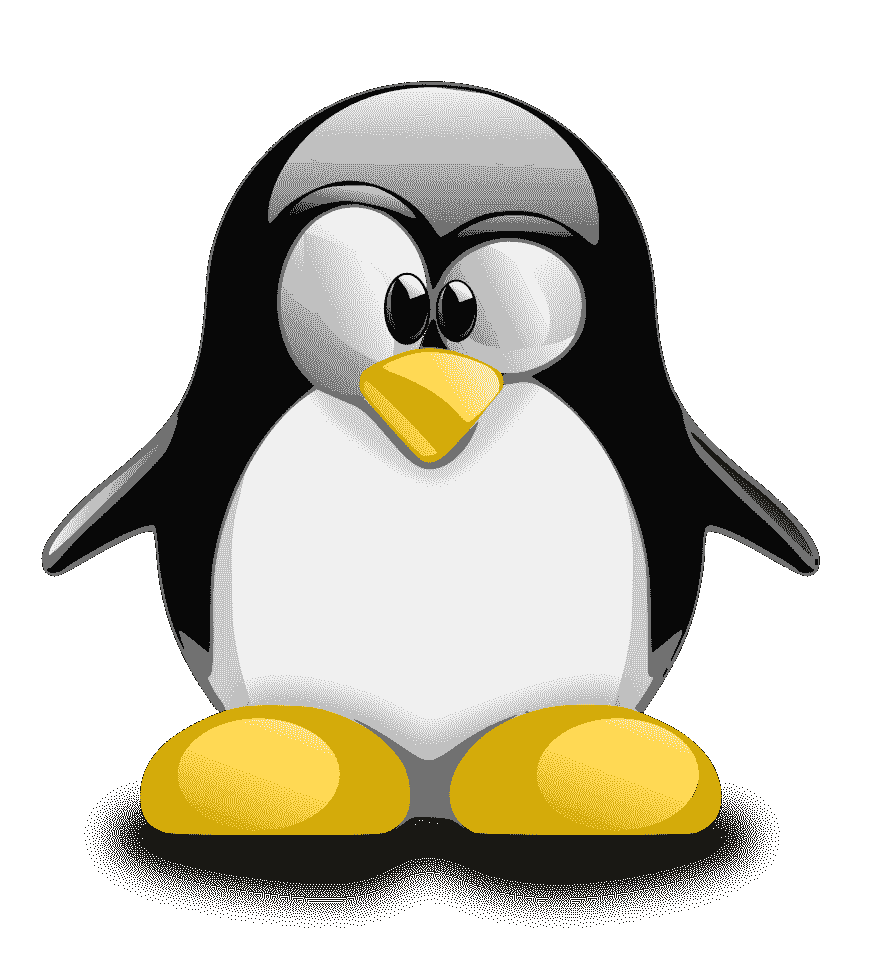

# 将您的工作流程迁移到 Linux

> 原文:[https://dev . to/andreanidouglas/moving-your-workflow-to-Linux-1ae](https://dev.to/andreanidouglas/moving-your-workflow-to-linux-1ae)

一直以来，我都是 Windows 用户，对其他操作系统几乎一无所知。但是我总是发现在 Windows 环境中开发有点棘手，因为如果你不在 Visual Studio 环境中，事情会更复杂。

经过一段时间考虑是否要换到 MacOSX 环境，我决定尝试 Linux，因为它是免费的，可以在(大多数)运行 Windows 的任何硬件上运行。

[T2】](https://res.cloudinary.com/practicaldev/image/fetch/s--xa4mwSN8--/c_limit%2Cf_auto%2Cfl_progressive%2Cq_auto%2Cw_880/https://upload.wikimedia.org/wikipedia/commons/thumb/6/66/TUX_G2.svg/2000px-TUX_G2.svg.png)

**如何**:

首先，您需要选择一个适合您需求的 Linux 发行版(版本)。我喜欢向新用户推荐 [Ubuntu Mate](https://ubuntu-mate.org/download/) 有几个原因:

*   它拥有 Linux 世界上最常用的发行版之一的支持和特性，以及与其他操作系统有很多共同点的优秀 UI (Mate)。

只需使用[蚀刻机](https://etcher.io/)将图像刻录到 u 盘中，并在启动前插入电脑。您的 BIOS/UEFI 必须设置为从 USB 读取。按照屏幕上的说明安装操作系统(首先备份任何相关数据，因为这将擦除您的硬盘)。

**语言支持**:

大多数 Linux 发行版对编程语言都有很大的支持，从 C 到 GO，你只需要为你的发行版找到正确的包。首先，只需运行命令`sudo apt install build-essential`即可获得最常用的 C/C++编译工具链，这将有助于安装许多其他开发软件，如:

*   Python: `sudo apt install python2 python3 python3-pip`
*   Java: `sudo apt install jdk8-openjdk`
*   JavaScript/节点:`sudo apt install nodejs npm`

*PS: `apt`是帮助将软件包安装到系统中的命令行工具，像 brew for MacOSX 或者 choco for Windows，Debian like systems (Debian，Ubuntu，Mint)使用的。您可以在 [`man apt`](http://manpages.ubuntu.com/manpages/zesty/man8/apt.8.html)* 了解更多信息

**文本编辑**:

大多数常见的文本编辑器都可以轻松工作，如 Atom、Visual Studio Code、Sublime。甚至有些专属的编辑器，像 Kate，Gedit，Geany，KDevelop 都可以让你的生活变得更轻松。

**试一试**:

如果您不愿意将整个系统迁移到 Linux 环境，您仍然可以尝试使用一些虚拟机环境，如 VMWare Workstation 或 Oracle VirtualBox。你可以自己看看是否适合自己，能从中学到什么。

**结论**:

Linux 系统非常强大，完全可以成为你的下一个开发环境，只是要记住它与 Windows 或 MacOSX 不是一回事，你应该以开放的心态对待它。

**记住**谷歌是你的朋友。不要害怕搜索一些愚蠢的东西，比如:*如何从目录中转移文件*或者*如何在 Linux 上安装 sublime*。你正在重新学习一切，一些简单的事情不应该阻止你。