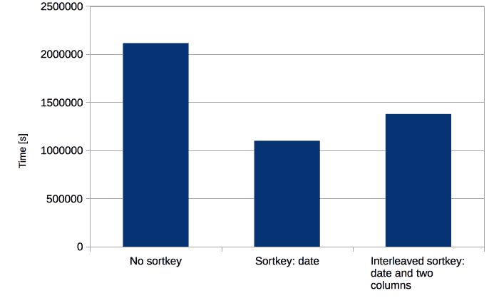

# 快速红移的几个步骤

> 原文:[https://dev.to/brightdevs/few-steps-to-fast-redshift-c2c](https://dev.to/brightdevs/few-steps-to-fast-redshift-c2c)

你认为一个直接与 Amazon Redshift 通信并显示表格、图表、数字的 web 仪表盘——一般的统计数据——能工作得很好吗？我们相信它可以，只要仪表板被少数用户使用。由于这是我们的情况，我们决定尝试一下。

随着我们开发仪表板，添加更多的统计数据，更多的细节和更多的功能，它变得越来越慢。然后这一天来了，一个“提高性能”的任务出现了，人们开始怀疑网页和红移是否能有效地协同工作。

第一个想法是添加另一个层，作为在红移基础上构建的 OLAP 立方体，或者作为包含最新数据的行数据库。令人惊讶的是，我的研究表明，人们实际上确实直接用红移构建了高效的仪表板，没有任何中间层。关键是适当设计数据库，充分利用红移。

在这篇博文中，我将告诉你我做了什么来显著提高系统性能。总的来说，我采取了三个步骤:

*   添加具有最常查询的数据的预聚集表，
*   为表选择距离键和排序键，
*   应用其他小的改进。

首先让我们看看它以前是什么样子的。我们使用带有两个事实表和几个维度表的 Kimball 启动模式。每个维度表都有一个作为主键的代理键和一个作为属性的自然键。在其他优点中，值得一提的是跟踪历史数据和存储在不同表中的不同事件。

查询速度慢的主要问题是:

*   两个事实表的联合来显示大部分统计数据，
*   当按维度表的自然关键字分组时，需要使用窗口函数或同一个表的多重连接，
*   每个维度的自然键出现在 WHERE 和 GROUP BY 子句中。

**预汇总表**

预聚集表是数据集市的一种非常原始的形式，但对我来说已经足够好了。该表的主要特点:

*   数据取自两个事实表，用一列来区分数据——不需要联合，
*   聚合数据以确保所需的最小粒度，
*   包括尺寸元素的最新名称-不需要窗口功能。这一步骤确保了约 50%的性能提升。听起来很好听，不是吗？这种解决方案有什么缺点吗？当然——存储使用率。预聚集表使用整个红移表存储的 10%。很贵吗？看情况。我们的数据库仍然远远低于任何存储阈值，所以对我来说这是完全可以接受的。

**发行方式和密钥**

按照 Amazon 的说明: <cite>[在过滤后的结果集中选择一个基数高的列。](http://docs.aws.amazon.com/redshift/latest/dg/c_best-practices-best-dist-key.html)</cite> ，选择事件的日期作为分布键是显而易见的，因为只有一个表，不需要连接。

**分类键**

用户可以在复合排序关键字和交错排序关键字之间做出选择，并选择一列或多列来组成关键字。亚马逊的 dosc 对此做了最好的描述。

<cite>复合关键字由排序关键字定义中列出的所有列组成，按照它们列出的顺序排列。当查询的筛选器应用使用排序关键字前缀的条件(如筛选器和连接)时，复合排序关键字最有用。当查询仅依赖于辅助排序列而不引用主列时，复合排序的性能优势会降低。复合是默认的排序类型。</cite>

<cite>交错排序对排序关键字中的每一列或列的子集赋予相同的权重。如果多个查询使用不同的列作为过滤器，那么您通常可以通过使用交叉排序样式来提高这些查询的性能。当查询在辅助排序列上使用限制性谓词时，与复合排序相比，交叉排序可以显著提高查询性能。</cite>

尽管 Amazon 的文档是一个很好的知识来源，但是如果你真的想理解交错和复合排序键背后的思想，请阅读这篇由两部分组成的文章

记住所有这些，我决定尝试两种不同的方法:

*   作为排序关键字的日期——它是每个查询中出现的唯一一列，
*   由日期和两列组成的交错排序关键字最常出现在 WHERE 子句中。

我运行了一批查询(90 组 10 个查询，由一个具有不同 WHERE 子句的仪表板使用),这些查询针对的是具有如上定义的排序关键字的表。结果如下:

[T2】](https://res.cloudinary.com/practicaldev/image/fetch/s--56IYclF2--/c_limit%2Cf_auto%2Cfl_progressive%2Cq_auto%2Cw_880/https://thepracticaldev.s3.amazonaws.com/i/w2p5r5hvpjnusuq8u06l.png)

最简单的解决方案被证明是最好的。它的性能比没有排序键时高 50%，比交错排序键时高 20%。

**其他小事**

另一篇对我帮助很大的[文章](https://aws.amazon.com/blogs/big-data/top-10-performance-tuning-techniques-for-amazon-redshift/)来自 AWS 大数据博客，描述了十种性能调优技术。

我已经熟悉了大部分技巧，只有两个适用于我的情况。然而，这是一篇伟大的文章，指出了重要的改进，并附有如何检查是否需要它们以及如果需要如何应用它们的说明。

我发现在我的案例中有用的问题:不正确的列编码(问题# 1)——按照说明，我应用了正确的列编码。具有非常大的 VARCHAR 列的表(问题# 5)-所有 VARCHAR 列的默认长度为 256B，而实际上最长的列不超过 50B，大约一半的列短于 10B。

**总结**

应用上面提到的所有改进使系统比以前快了 80%以上。我应该为如此巨大的改进而自豪，还是应该责怪自己在设计数据库时没有应用所有这些？我个人认为有些事情是你无法预见的，开发是一个设计、实施和持续改进的过程。

最初发表于 2017 年 10 月 6 日 [brightinventions.pl](https://brightinventions.pl/blog/) 。

软件工程师@光明发明
[电子邮件](//agnieszka.olszewska@brightinventions.pl)