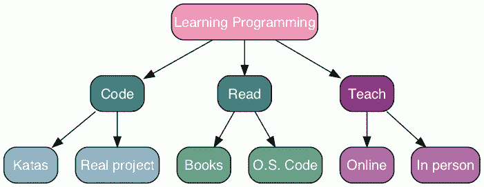

# 学习编程时的 25 个陷阱

> 原文:[https://dev . to/acanjiano/25-陷阱-何时学习编程-1lm2](https://dev.to/acangiano/25-pitfalls-when-learning-to-program-1lm2)

我将与你分享我所看到的学习编程(或努力掌握编程)时的“25 个”常见陷阱。这些要点对初学者和专业人士都有影响——包括我自己。

0。忘记了**编程是关于人的**。是的，机器会执行你的代码，但编程是为人们解决问题，将他们的需求转化为代码，由其他人(或你自己)阅读、维护和修改。

**1。** **没有花足够的时间编程**。根据你的工作或日程安排，你可能会花很多时间在与编程相关但实际上不是编程本身的任务上。

**2。** **停留在你正在学习的特定技术的表面**。对掌握了足以完成工作的基础知识感到满意，而无需进一步探索或深入幕后。

**3。** **学习编程的喜鹊方法**。你开始学习 Rails，进行到一半时，你意识到 Phoenix 就在那里，哦，你还需要学习 JavaScript，所以你也可以使用 Node.js。但是等等... [TJ 切换到 Go](https://medium.com/@tjholowaychuk/farewell-node-js-4ba9e7f3e52b) ，等一下……铁锈呢？很快你的浏览器历史就会有，“web 开发或数据科学职业”，“Clojure 死了吗？”、“Clojure vs Elixir”、“Crystal 是否足够成熟”、“Golang 有什么好的框架”、“Phoenix vs Buffalo”、“Kotlin for web development”都在同一个星期。:)

**4。**在网上看书和看课程，但是**没有练习过**展示的技能，因此很快就忘记了。

**5** 。**跳绳基础**。因此，您最终了解了延续传递风格(CPS ),但没有对象关系映射器，您仍然无法执行 SQL 连接。

**6。** **没有足够的耐心**或纪律来进步通过学习掌握任何技术所需的过程和步骤。

**7。** **当你在日常编程中应对更紧迫的挑战时，没有清晰的地图或时间表来通过可用的资源继续学习**。

**8。** **分析瘫痪**，浪费了太多时间在各种框架和库(如 Angular、React 和 Vue)中选择，而不是只挑选一个，使用它，并在你确实需要时切换到其他东西。基本上是一个[最大化者而不是满足者](https://www.psychologistworld.com/cognitive/maximizers-satisficers-decision-making)。

**9。拒绝现代编程的多语言特性。在大多数领域，期望一种编程语言最适合所有问题是不合理的。同样地，**把自己过多地认定为 X 或 Y 程序员**，而不仅仅是一个偏爱 X 或 Y 的程序员**

10。 **害怕试验新技术**。不要只是阅读某些新兴技术(例如，区块链或 T4 的聊天机器人 T5)，而是实际启动一个虚拟机，亲自尝试一下，即使这涉及到使用你不熟悉的编程语言或 API。

**11。** **期望事先知道一切**。在通过谷歌找到解决方案的方法后感到失望，因为你没有完全依靠自己想出一个优雅的解决方案，并在想“我应该自己想到这一点”时踢自己。

**12。** **学习时不创造许多小的形**、练习和项目。

13。 **害怕与他人分享代码**或者得到代码评审，以免自己被评判。

**14。** **不向更有经验的开发人员寻求一对一的指导**。

15。期望用**不切实际的时间表**一次性学会所有东西(例如，在一个月内掌握 iOS 开发)。

16。对于更有企业家头脑的人来说，**不会探索很酷的项目，因为他们没有清晰的创收途径**。

**17。**不向**提问，害怕给人的印象是愚蠢的**或者比你实际情况更菜鸟。

18。如果你用高级语言将高级库粘合在一起，而不是用更复杂的语言编写“核心”算法，你会觉得自己不是真正的程序员。我把这个**戏称为低级编程羡慕**。

**19。** **让学习最佳实践的欲望阻碍你掌握给定语言或技术的基础**。例如，在开始创建项目之前，感觉需要学习一整本书的设计模式或掌握 TDD/BDD。

20。完美主义。**让完美成为足够好的敌人。**从不发货，停留在“最后润色”阶段。(但是平衡很重要，不要为了出货而出货破得可怕的软件。)

**21。**与上一点相关，**忽略进展:让它工作，让它更快，让它干净**。相反，从一开始就期待一个完美的解决方案。重要的是要接受第一次迭代将是一个需要改进的草稿。

**22。** **冒名顶替综合症**。觉得自己不够好。如果你不符合当前开发人员的刻板印象，这是非常糟糕的，因为缺乏你能与之相关的角色模型可能会错误地证实你的怀疑。这也是为什么女性和少数族裔在科技领域的代表性如此重要的部分原因。

**23。**写代码，从书上学习编程，但是**从来不看别人的代码**。开源给了我们一个惊人的资源，可以大大加快我们对编程和最佳实践的理解。

**24。** **没有接触到其他范例或领域**。如果你是一个 web 开发人员，不了解其他类型的开发。如果你懂面向对象编程，而不是学函数式编程。

**25。** **不把自己学的东西教给别人**。没有什么比试图向他人解释更能巩固你所学的东西了。即使只是带着教书的目的去学习，也会增加你的学习能力。

现在你知道了… *25* 陷阱。哦，不要忘记一个接一个的错误。；)

### 结论

这一切都是为了说:

> 你已经够好了。你一定能做到。小心这些陷阱，制定一个计划，致力于它，然后一步一步来。

在学习编程的时候(或者提高你目前对它的掌握程度)，我推荐代码/读/教的方法。编写一个真实的项目，在你学习的过程中编写许多小的练习。看书还要看别人的代码。最后，在网上和亲自教授你所学的东西。要做到这一点，你不需要成为专家。

[T2】](https://res.cloudinary.com/practicaldev/image/fetch/s--8ZQK8Hkq--/c_limit%2Cf_auto%2Cfl_progressive%2Cq_66%2Cw_880/https://i0.wp.com/programmingzen.com/wp-content/uploads/2017/11/learning-to-program.gif%3Fresize%3D701%252C271%26ssl%3D1)

希望这有点用。如果是的话，请在网上分享链接。这是我自己打算偶尔重读一遍的清单。

最初，我将这些关于学习编程的想法作为一系列推文分享，但是 Twitter 的 UI 在将它们显示为单条线程时遇到了一些问题。所以我把它们作为一个帖子重新发布在这里。

帖子[学习编程时的 25 个陷阱](https://programmingzen.com/pitfalls-when-learning-to-program/)最早出现在[编程禅](https://programmingzen.com)上。