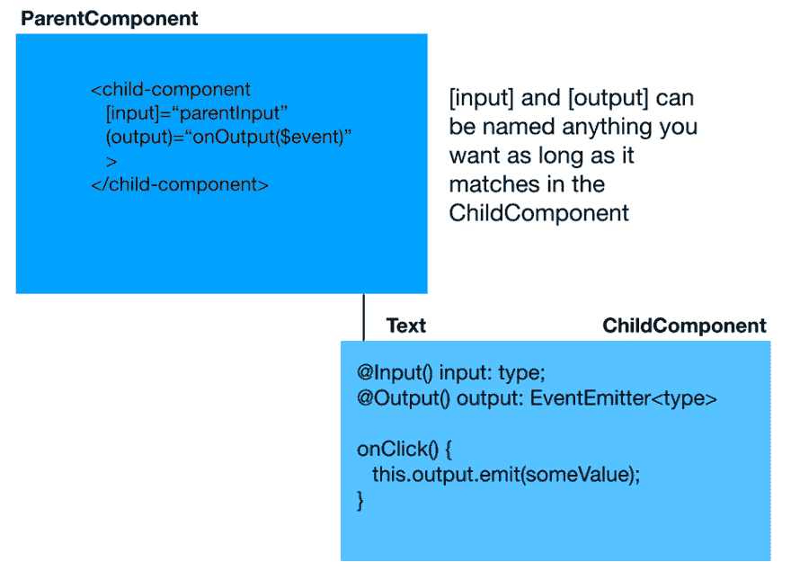
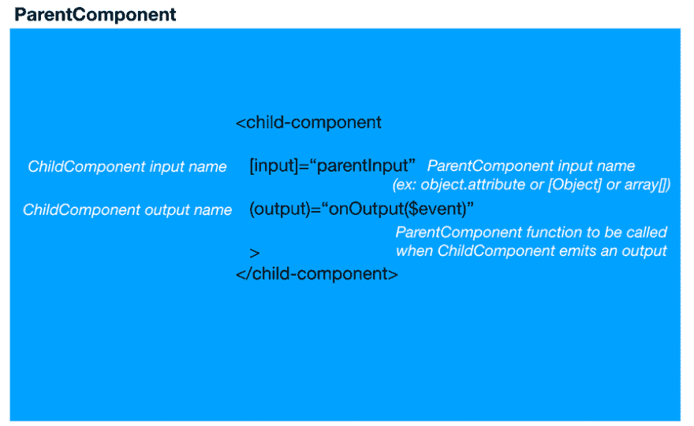
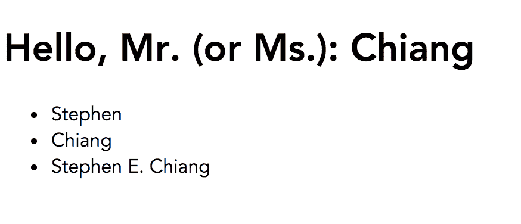

# 使用角度在嵌套组件之间传递数据

> 原文:[https://dev . to/chiangs/passing-data-between-nested-components-with-angular-50cm](https://dev.to/chiangs/passing-data-between-nested-components-with-angular-50cm)

从 AngularJS 到 Angular (2+)的最大变化之一是远离双向数据绑定。双向数据绑定的问题是潜在的意想不到的级联效应，而且项目越大越难推理。随着 Angular 中对单向数据绑定的更改，数据通过组件向下传递，如果某个操作需要更改，它会被发送回实际进行更改的顶部，因为 Angular 应用程序是由组件层次结构组成的。

这是通过定义父组件 html 中子元素的输入和输出属性以及子组件的`@Input`和`@Output`来实现的。

> 作为组件的 API 的输入和输出

换句话说，一个组件可以从它的父组件接收数据，只要接收组件已经被明确定义(或公开)了接收数据的方式，就像 API 的工作方式一样。类似地，组件可以通过触发父组件侦听的事件向其父组件发送数据。

这里有一个父子关系的图解:

[](https://res.cloudinary.com/practicaldev/image/fetch/s--pmeI8EOg--/c_limit%2Cf_auto%2Cfl_progressive%2Cq_auto%2Cw_880/https://i0.wp.com/www.chiangs.ninja/blog/wp-content/uploads/2017/11/Screen-Shot-2017-11-09-at-12.50.55-copy.png%3Fresize%3D932%252C683%26ssl%3D1)

请记住，在 ParentComponent.html 中定义 ChildComponent 时，子属性在左边，父属性在右边，这有点像当您声明一个变量并为其赋值时，变量在`=`的左边，值在右边。

[T2】](https://res.cloudinary.com/practicaldev/image/fetch/s--NxMcj7W1--/c_limit%2Cf_auto%2Cfl_progressive%2Cq_auto%2Cw_880/https://i0.wp.com/www.chiangs.ninja/blog/wp-content/uploads/2017/11/Screen-Shot-2017-11-09-at-12.51.03-copy.png%3Fresize%3D896%252C551%26ssl%3D1)

重要的是要注意，对于超过 1 或 2 层的嵌套组件或者跨相同级别的组件这样做可能会变得复杂和相当混乱。集中这些数据的更好的方法是使用服务，我将在下一篇文章中讨论。

这里，我将创建一个 ParentComponent 和 ChildComponent，在 ParentComponent 中实例化一个 Stephen 类(模型)的新对象，然后向 ChildComponent 传递 Stephen 对象的特定属性数组。之后，我将定义一个输出，当其中一个属性被单击时，ParentComponent 确认该事件并更改对我的称呼:Mr . Stephen | Chiang | Stephen e . Chiang。

### 使用 CLI 创建一个新的 Angular 项目，如果您还没有设置的话:`$ ng new parent-child`

*   创建嵌套在父组件中的父组件和子组件。

-创建一个简单的类，在本例中，我只是为自己创建了一个模型`stephen.model.ts`

```
$ ng g c parent
$ ng g c parent/child
$ ng g class stephen 
```

<svg width="20px" height="20px" viewBox="0 0 24 24" class="highlight-action crayons-icon highlight-action--fullscreen-on"><title>Enter fullscreen mode</title></svg> <svg width="20px" height="20px" viewBox="0 0 24 24" class="highlight-action crayons-icon highlight-action--fullscreen-off"><title>Exit fullscreen mode</title></svg>

在模型中，我将添加以下属性:

```
export class Stephen {
    firstName: string = 'Stephen';
    lastName: string = 'Chiang';
    fullName: string = 'Stephen E. Chiang';
} 
```

<svg width="20px" height="20px" viewBox="0 0 24 24" class="highlight-action crayons-icon highlight-action--fullscreen-on"><title>Enter fullscreen mode</title></svg> <svg width="20px" height="20px" viewBox="0 0 24 24" class="highlight-action crayons-icon highlight-action--fullscreen-off"><title>Exit fullscreen mode</title></svg>

在`app.component.html`文件中，我们将删除默认填充符并添加 ParentComponent 元素:`<app-parent></app-parent>`

### 在`parent.component.ts`文件中，我们要制作一个对象的实例:

*   导入 Stephen 类。
*   声明对象，并在构造函数中实例化一个新实例。
*   将 first name 属性声明为构造 ParentComponent 时显示的默认值，以表明您已经正确地实例化了该对象。
*   定义 ChildComponent 输入名`[stephen]`以接受 ParentComponent 的`stephen: Stephen`对象。
*   定义名为`(onNameSelected)`的 ParentComponent 输出，并将其分配给 ParentComponent 中的一个操作，该操作通过调用 ParentComponent 的`updateName`函数来更新`selectedName`。
*   定义`updateName`函数，根据将由 ChildComponent 通过输出发出的字符串设置新名称。
*   因为这个例子非常简单，所以没有必要将`parent.component.html`和`parent.component.ts`代码分开，所以我们要内联完成。
*   还要注意的是，如果从 ParentComponent 内部对`selectedName`进行更新，则需要订阅该属性来更新更改，但在这种情况下，更改通知将从外部(ChildComponent)发送，因此 ParentComponent 已经在监听更改。

```
import { Component, OnInit, ViewEncapsulation } from '@angular/core';
import { Stephen } from '../stephen.model';

@Component({
    selector: 'app-parent',
    template: `

        Hello, Mr. (or Ms.): {{ selectedName }}

`,
styleUrls: ['./parent.component.css'],
    encapsulation: ViewEncapsulation.None
})

export class ParentComponent implements OnInit {
    stephen: Stephen;
    selectedName: string;

    constructor() {
        this.stephen = new Stephen();
        this.selectedName = this.stephen.firstName;
    }

    ngOnInit() {
    }

    updateName(selectedName: string): void {
    console.log('in parent');
    this.selectedName = selectedName;
    }

} 
```

<svg width="20px" height="20px" viewBox="0 0 24 24" class="highlight-action crayons-icon highlight-action--fullscreen-on"><title>Enter fullscreen mode</title></svg> <svg width="20px" height="20px" viewBox="0 0 24 24" class="highlight-action crayons-icon highlight-action--fullscreen-off"><title>Exit fullscreen mode</title></svg>

如果你现在运行`$ ng serve`，你会看到:

[](https://res.cloudinary.com/practicaldev/image/fetch/s--mAvgm6_r--/c_limit%2Cf_auto%2Cfl_progressive%2Cq_auto%2Cw_880/https://i0.wp.com/www.chiangs.ninja/blog/wp-content/uploads/2017/11/Screen-Shot-2017-11-09-at-17.00.22.png%3Fresize%3D960%252C302%26ssl%3D1)

### 在 ChildComponent:

*   导入 Input、Output 和 EventEmitter 以及 Stephen 或任何您命名的模型类。
*   制作一个简单的无序列表，对于每个列表项，字符串插入每个属性。
*   每个列表项都有一个调用`clicked`函数并传递属性的`(click)`事件。
*   声明`@Input() named as` stephen `以匹配其在 ParentComponent html 元素中的定义方式。
*   声明`@Output() named as` onNameSelected `以匹配并将其设置为发出字符串的 EventEmitter 类型。
*   在构造函数中实例化一个新的`EventEmitter`，并将其设置为声明为@Output()的 EventEmitter。
*   定义`clicked`函数，该函数接受一个字符串并调用输出 EventEmitter 将该字符串发送回父对象。
*   有更有效的方法来显示信息，例如，让 name 属性成为一个 string[]，然后使用`*ngFor`迭代并创建一个

元素，这将减少重复的代码，但是对于这个快速简单的例子来说，它工作得很好。

–这里你可以看到我们没有实例化一个新的 Stephen 对象，但是我们能够访问属性。如果您愿意，也可以传入对象的特定属性，而不是整个对象的属性。

```
import { Component, OnInit, ViewEncapsulation, Input, Output, EventEmitter } from '@angular/core';
import { Stephen } from '../../stephen.model';

@Component({
    selector: 'app-child',
    template: `

        {{ stephen.firstName }}
        {{ stephen.lastName }}
        {{ stephen.fullName }}
        `,
    styleUrls: ['./child.component.css'],
    encapsulation: ViewEncapsulation.None
})

export class ChildComponent implements OnInit {
    @Input() stephen: Stephen;
    @Output() onNameSelected: EventEmitter;

    constructor() {
        this.onNameSelected = new EventEmitter();
    }

    ngOnInit() {
    }

    clicked(name: string): void {
        this.onNameSelected.emit(name);
    }
} 
```

<svg width="20px" height="20px" viewBox="0 0 24 24" class="highlight-action crayons-icon highlight-action--fullscreen-on"><title>Enter fullscreen mode</title></svg> <svg width="20px" height="20px" viewBox="0 0 24 24" class="highlight-action crayons-icon highlight-action--fullscreen-off"><title>Exit fullscreen mode</title></svg>

此时，你的应用程序应该工作了，当你点击其中一个名字时，它会更新父项:

[](https://res.cloudinary.com/practicaldev/image/fetch/s--0nAbyzlY--/c_limit%2Cf_auto%2Cfl_progressive%2Cq_auto%2Cw_880/https://i0.wp.com/www.chiangs.ninja/blog/wp-content/uploads/2017/11/Screen-Shot-2017-11-09-at-17.20.42.png%3Fresize%3D874%252C376%26ssl%3D1)

这里有一个图表，并排显示了父母和孩子，以进一步说明如何将所有细节联系在一起。

child component 向 ParentComponent 发出反馈，并让父组件决定如何处理事件。这有助于将逻辑放在更少、更合理的位置，而不是整个应用程序中每个组件的复杂逻辑中。
T3[T5](https://res.cloudinary.com/practicaldev/image/fetch/s--rd51guj2--/c_limit%2Cf_auto%2Cfl_progressive%2Cq_auto%2Cw_880/https://i0.wp.com/www.chiangs.ninja/blog/wp-content/uploads/2017/11/parent-child.png%3Fresize%3D981%252C753%26ssl%3D1)

使用这种方法跨组件传递数据或者在高度嵌套的组件(超过 3 层)中传递数据可能会令人困惑。如果您发现自己需要经常传递特定的数据，那么可能是时候考虑将它集中起来并使用一个**服务**，我将在下一篇文章中使用相同的示例来讨论这一点，这将在接下来的几天内进行，因为我们现在随时都会有一个小女孩，我最好现在就发表下一篇文章，否则可能要几周或几个月！

请不要犹豫发送您的问题、评论、批评，并关注我这里或我的任何社交媒体账户。

谢谢！

斯蒂芬