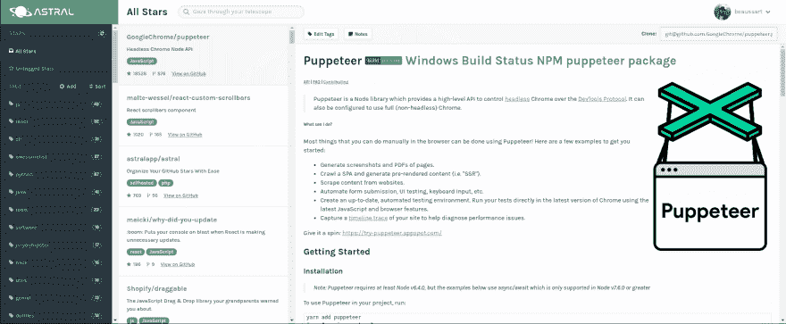

# 所以我一直在整理我的 Github 星星

> 原文:[https://dev . to/beaussart/so-ive-being-sorting-my-github-stars-a20](https://dev.to/beaussart/so-ive-been-sorting-my-github-stars-a20)

<small>这篇文章最初写在[我的博客](https://nbe.io/so-ive-been-sorting-my-github-stars/)上。</small>

我是 github stars 的忠实粉丝，如果需要的话，我会用它来保存项目，比如一个很酷的库，或者一个我想尝试的软件。这是一个存储项目的好方法，而且它赋予了项目价值！

但是 github 的做法非常简单:你可以进行基本的搜索，对它们进行排序，就这样！当你有很多这样的人时，事情就变得更复杂了...

我有 453 颗 github 星星，我想找到一种方法将它们按文件夹和类别分类，这时我在 github 趋势系统上找到了 [Astral](https://astralapp.com) 。

Astral 是一个挂在 github 上的工具，可以让你给它们添加标签，而且它也是开源的！:D

[T2】](https://res.cloudinary.com/practicaldev/image/fetch/s--XZM4VmJE--/c_limit%2Cf_auto%2Cfl_progressive%2Cq_auto%2Cw_880/https://thepracticaldev.s3.amazonaws.com/i/eztlojbb220oauo6ypdu.png)

一个新特性是能够根据存储库中的语言进行语言排序，而且效果很好！

多亏了它，找到你一年前开始的项目变得更加容易，这样你就可以最终测试它了！你呢，你用什么来管理你想尝试的项目？