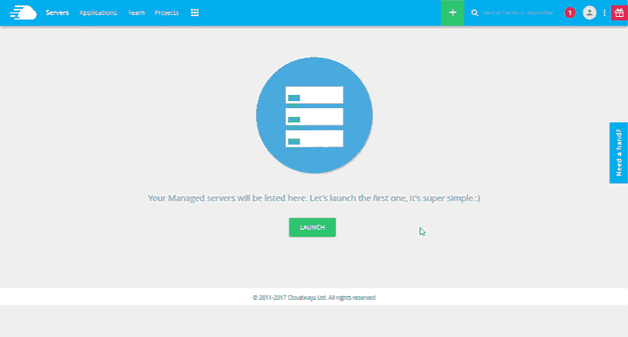
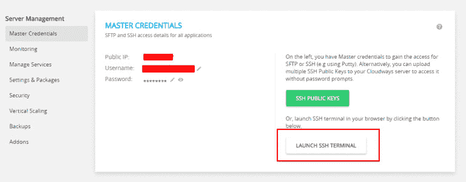
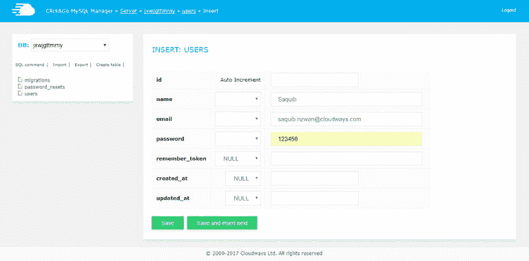
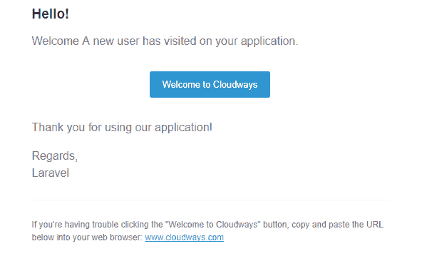
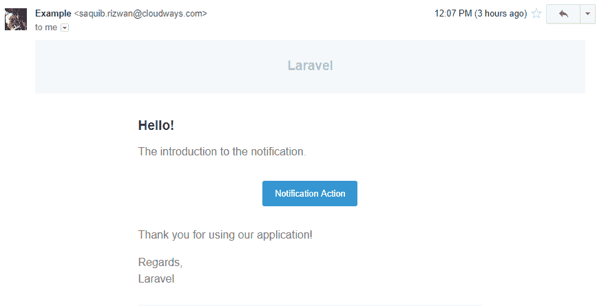
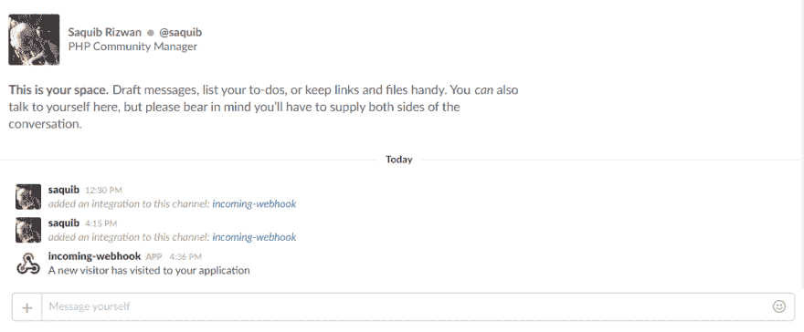

# 创建 Laravel 通知系统

> 原文：<https://dev.to/rizwan_saquib/creating-a-laravel-notification-system-6mb>

Laravel 流行的一个重要原因是，它为常见的开发问题提供了可行的解决方案，如身份验证、联系表单、会话、队列、路由和缓存等。

Laravel 项目中一个常见的项目需求是通知生成。在本文中，我将通过创建一个 Laravel 通知系统来介绍解决方案。在这个系统中，无论用户何时访问该页面，都会通过电子邮件向您发送通知。为了增加交易的趣味性，我还将集成 Slack 来设置 Slack 通道的通知。

Laravel 通知系统实现起来很简单，因为它通过为每个通知设置一个类来生成通知。这个类定义了如何使用特定的通道通知用户消息。

## 安装 Laravel 应用程序

为了快速设置一个 Laravel 应用程序，我在 Cloudways 使用 [Laravel 托管](https://www.cloudways.com/en/laravel-hosting.php)。只需在 Cloudways 注册并免费点击几下就可以安装 Laravel 应用程序。

[T2】](https://res.cloudinary.com/practicaldev/image/fetch/s--32b1rqH0--/c_limit%2Cf_auto%2Cfl_progressive%2Cq_66%2Cw_880/http://www.cloudways.com/blog/wp-content/uploads/Laravel-Gif.gif)

## 创建用户表

安装完成后，创建一个用户表。启动 SSH 终端，并使用主凭据(在服务器管理选项卡中提供)登录到您的服务器..

[T2】](https://res.cloudinary.com/practicaldev/image/fetch/s--sH21P44F--/c_limit%2Cf_auto%2Cfl_progressive%2Cq_auto%2Cw_880/https://thepracticaldev.s3.amazonaws.com/i/z977yi76358g72tk7ddw.png)

现在，通过键入以下命令转到应用程序的根目录:

```
 cd applications

cd applicationname/public_html

php artisan migrate 
```

Enter fullscreen mode Exit fullscreen mode

现在数据库中创建了用户表。

现在让我们向其中添加一些记录，以便系统可以向该用户发送通知。转到数据库管理器，在表中添加一个简单的记录。请确保添加有效的电子邮件 id，因为系统会将通知发送到此电子邮件地址。

[T2】](https://res.cloudinary.com/practicaldev/image/fetch/s--yeuch_S7--/c_limit%2Cf_auto%2Cfl_progressive%2Cq_auto%2Cw_880/https://thepracticaldev.s3.amazonaws.com/i/034ofh79i2zs4tobr897.png)

既然已经创建了用户模型，让我们来看看它。转到 **app/User.php** ，它有以下代码:

```
 <?php

namespace App;

use Illuminate\Notifications\Notifiable;

use Illuminate\Foundation\Auth\User as Authenticatable;

class User extends Authenticatable

{

   use Notifiable;

   protected $fillable = [

       'name', 'email', 'password',

   ];

   protected $hidden = [

       'password', 'remember_token',

   ];

} 
```

Enter fullscreen mode Exit fullscreen mode

如果你仔细观察，**可通知的**特征被使用。无论何时你想让你的模型可通知，你所要做的就是导入**使用 Illuminate \ Notifications \ notified；**你的模型中的特征。

请注意，某些通知通道期望在可通知的。例如，邮件通道希望模型有一个“e mail”属性，这样它就知道哪个电子邮件地址发送通知。

## 邮件通知

回到 SSH，转到应用程序的根目录，执行下面的命令:

```
 php artisan make:notification Newvisit 
```

Enter fullscreen mode Exit fullscreen mode

现在，进入**app/Notifications/new visit . PHP .**在这个文件中你会发现下面的代码:

```
 <?php

namespace App\Notifications;

use Illuminate\Bus\Queueable;

use Illuminate\Notifications\Notification;

use Illuminate\Contracts\Queue\ShouldQueue;

use Illuminate\Notifications\Messages\MailMessage;

class Newvisit extends Notification

{

   use Queueable;

   public function __construct()

   {

       //

   }

   public function via($notifiable)

   {

       return ['mail'];

   }

   public function toMail($notifiable)

   {

       return (new MailMessage)

                   ->line('The introduction to the notification.')

                   ->action('Notification Action', url('/'))

                   ->line('Thank you for using our application!');

   }

   public function toArray($notifiable)

   {

       return [

           //

       ];

   }

} 
```

Enter fullscreen mode Exit fullscreen mode

让我们来理解这个代码。首先，它有构造函数，任何相关的数据都将被注入其中。

```
public function via($notifiable)

   {

       return ['mail'];

   } 
```

Enter fullscreen mode Exit fullscreen mode

然后，它具有 via()方法，该方法允许您选择通知方法，该方法将用于向每个单独的实例发送通知。
然后，它有* * to mail()* *方法，返回三个属性。第一个是 line，它指定了电子邮件的开始正文。然后它有 action，指定按钮名称和按钮将重定向到的 URL。最后，它还有 line，指定了邮件的结尾段落。下面是一个示例输出:

```
 ->line('The introduction to the notification.')

       ->action('Notification Action', 'https://laravel.com')

       ->line('Thank you for using our application!'); 
```

Enter fullscreen mode Exit fullscreen mode

[T2】](https://res.cloudinary.com/practicaldev/image/fetch/s--p8f-zkzt--/c_limit%2Cf_auto%2Cfl_progressive%2Cq_auto%2Cw_880/https://thepracticaldev.s3.amazonaws.com/i/8a7otaaspszdgp83uq0f.png)

## 通过电子邮件发送通知

转到 **routes/web.php** 并将以下代码粘贴到文件中:

```
 <?php

use App\Notifications\Newvisit;

Route::get('/', function () {

$user = App\User::first();

$user->notify(new Newvisit("A new user has visited on your application."));

   return view('welcome');

}); 
```

Enter fullscreen mode Exit fullscreen mode

您必须使用 App\Notifications\Newvisit 通过**导入通知类；**然后在 route 函数中，我调用了由** $user = App\User::first()插入的用户表中的第一条记录；。**接下来，我使用**notify** 函数发送通知，并在 Newvisit 实例中发送通知，代码如下:**$ user->notify(new new visit("一个新用户访问了您的应用程序。"));**

现在打开**app \ Notifications \ new visit . PHP**并在其中添加以下代码。

```
 <?php

namespace App\Notifications;

use Illuminate\Bus\Queueable;

use Illuminate\Notifications\Notification;

use Illuminate\Contracts\Queue\ShouldQueue;

use Illuminate\Notifications\Messages\MailMessage;

class Newvisit extends Notification

{

   use Queueable;

   protected $my_notification; 

   public function __construct($msg)

   {

       $this->my_notification = $msg; 

   }

   public function via($notifiable)

   {

       return ['mail'];

   }

   public function toMail($notifiable)

   {

       return (new MailMessage)

                   ->line('Welcome '.$this->my_notification)

                   ->action('Welcome to Cloudways', url('www.cloudways.com'))

                   ->line('Thank you for using our application!');

   }

   public function toArray($notifiable)

   {

       return [

           //

       ];

   }

} 
```

Enter fullscreen mode Exit fullscreen mode

下一次打开**。env** 文件并设置数据库凭证和邮件程序函数。查看 [Laravel Email](https://www.cloudways.com/blog/send-email-in-laravel/) 文章了解这一步的细节。**。env** 文件应该如下所示:

```
 DB_CONNECTION=mysql

DB_HOST=127.0.0.1

DB_PORT=3306

DB_DATABASE=zzjudekqvs

DB_USERNAME=zzjudekqvs

DB_PASSWORD=

BROADCAST_DRIVER=log

CACHE_DRIVER=file

SESSION_DRIVER=file

QUEUE_DRIVER=sync

REDIS_HOST=127.0.0.1

REDIS_PASSWORD=null

REDIS_PORT=6379

MAIL_DRIVER=smtp

MAIL_HOST=smtp.gmail.com

MAIL_PORT=587

MAIL_USERNAME=saquib.gt@gmail.com

MAIL_PASSWORD=

MAIL_ENCRYPTION=tls

PUSHER_APP_ID=

PUSHER_APP_KEY=

PUSHER_APP_SECRET= 
```

Enter fullscreen mode Exit fullscreen mode

现在一切准备就绪。转到 Cloudways 平台中的 Application 选项卡，然后单击 Launch Application 按钮。我们会通过电子邮件通知您。

[T2】](https://res.cloudinary.com/practicaldev/image/fetch/s--YkDSMn_O--/c_limit%2Cf_auto%2Cfl_progressive%2Cq_auto%2Cw_880/https://thepracticaldev.s3.amazonaws.com/i/9bkwmfdweodb3dpgdzlm.png)

[T2】](https://res.cloudinary.com/practicaldev/image/fetch/s--sMy2_HIz--/c_limit%2Cf_auto%2Cfl_progressive%2Cq_auto%2Cw_880/https://thepracticaldev.s3.amazonaws.com/i/an4refcwpw0zrqptnqc7.png)

## 通过 Laravel 中的 Slack 发送通知

要创建和发送 Slack 通知，您需要通过 Composer 安装 Guzzle。启动 SSH，在应用程序的根目录下运行以下命令:

```
 composer require guzzlehttp/guzzle

php artisan make:notification Newslack 
```

Enter fullscreen mode Exit fullscreen mode

您将需要一个新的松弛通知类。为此，请转到**app/Notifications/news lack . PHP**并粘贴以下代码。

```
 <?php

namespace App\Notifications;

use Illuminate\Bus\Queueable;

use Illuminate\Notifications\Notification;

use Illuminate\Contracts\Queue\ShouldQueue;

use Illuminate\Notifications\Messages\MailMessage;

use Illuminate\Notifications\Messages\SlackMessage;

class Newslack extends Notification

{

   use Queueable;

   public function __construct()

   {

       //

   }

   public function via($notifiable)

   {

       return ['slack'];

   }

   public function toSlack($notifiable)

   {

       return (new SlackMessage)

           ->content('A new visitor has visited to your application . $this->user->first(1->name)');

   } 

} 
```

Enter fullscreen mode Exit fullscreen mode

这里，**via()* *方法定义了通知的媒介，**toSlack()** 方法将通知发送到 Slack。

## 设置传入的 Webhook

现在要接收时差通知，请前往[https://{ your team } . Slack . com/apps](https://%7Byourteam%7D.slack.com/apps)。选择“Incoming Webhook”类型并添加新配置。

[T2】](https://res.cloudinary.com/practicaldev/image/fetch/s--_mX8bIqr--/c_limit%2Cf_auto%2Cfl_progressive%2Cq_auto%2Cw_880/https://thepracticaldev.s3.amazonaws.com/i/v9rqscubgigpn1u0618o.png)

复制 Webhook URL 并返回到您的 Laravel 应用程序。

您的模型应该实现一个返回这个 webhook 的**routeNotificationForSlack()**方法。因此，转到 **app/User.php** 并在其中添加以下函数。

```
 public function routeNotificationForSlack()

   {

       Return 'your_webhook_url';

   } 
```

Enter fullscreen mode Exit fullscreen mode

现在转到 **routes/web.php** 并添加以下路由。

```
 Route::get('/slack', function () {

$user = App\User::first();

$user->notify(new Newslack());

   echo "A slack notification has been send";

}); 
```

Enter fullscreen mode Exit fullscreen mode

现在转到 Cloudways 平台中的 Application 选项卡，单击 Launch Application 按钮并在 url 中添加/slack。您将收到如下所示的时差通知:

[T2】](https://res.cloudinary.com/practicaldev/image/fetch/s--wpIeQBb---/c_limit%2Cf_auto%2Cfl_progressive%2Cq_auto%2Cw_880/https://thepracticaldev.s3.amazonaws.com/i/8upkhhc0alhq3cc86j0k.png)

## 最后的话

Laravel 通知系统是一个非常吸引人并且非常容易实现的特性，它为项目增加了很多价值。您可以使用这个示例来创建自己的通知系统，并将其集成到您的 Laravel 应用程序中，没有任何问题。如果需要帮助，可以在下面评论或者在 twitter 上 DM 我。快乐编码。