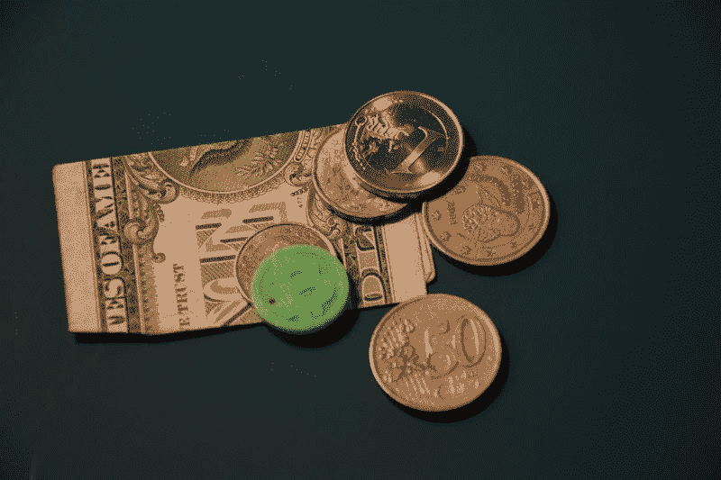
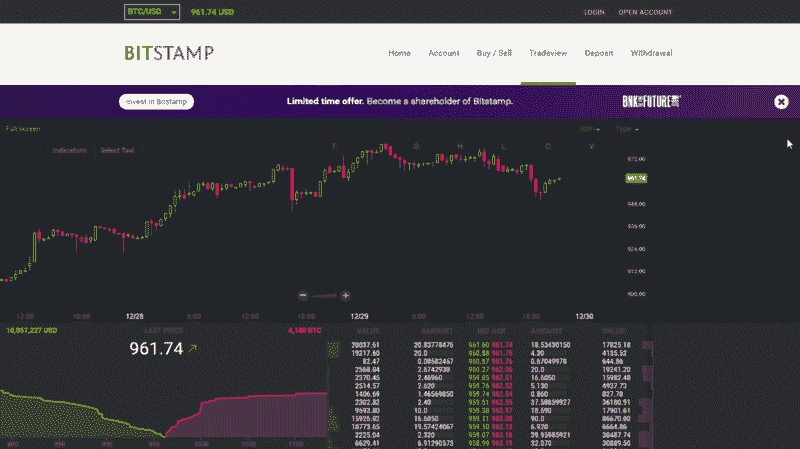

# 比特币

> 原文：<https://dev.to/terceranexus6/bitcoins-d00>

许多人听说过比特币，这种去中心化的虚拟货币，但尽管它可能很有名，但大多数人并不知道它到底是什么以及它是如何工作的，更不用说几乎没有使用过。

[T2】](https://res.cloudinary.com/practicaldev/image/fetch/s--KInXCnGw--/c_limit%2Cf_auto%2Cfl_progressive%2Cq_auto%2Cw_880/https://cdn-images-1.medium.com/max/800/1%2Aqw-LviZW16nuq2iSFj8OuQ.jpeg)

**比特币是什么？**

比特币是一种**去中心化的全球虚拟货币系统**。这是一个点对点的分布式系统，用户拥有一个密钥，通常存储在每个用户计算机上的数字钱包中，该密钥用于证明交易的所有权，解除价值锁定，并允许不同的所有者使用它。它是全球性的，因为它不基于任何特定的国家，虚拟的，因为没有代表它的实体硬币，分散的，因为货币是通过采矿“创造”的。基本上，挖掘比特币就是在比特币交易发生时找到问题的数学解决方案。每十分钟(aprox)就会有人验证交易，然后获得全新的比特币。

比特币主要是作为解决传统货币问题的替代方案出现的，比如对用户认证或中央系统本身的信任。尤其是第一个问题可以用加密数字签名和物理货币系统来解决，但是集中式系统仍然是不方便的，使得它更容易成为黑客的目标。

**如何使用比特币**

首先是拥有一个钱包。你可以选择适合你需要的钱包，有很多。在选择你的钱包时，你可以比较和决定其中的一些。一旦你安装了你的钱包，你会看到它需要密码和短语，这应该是(为了你自己)非常强。

你可以使用 Bitstamp(欧洲)或比特币基地(美国)或者提供比特币的产品和服务来获得比特币。比特币交易存在于一个所有权链中，在这个所有权链中，一定数量 BTC 的所有者可以部分或全部授予该数量，方法是签署该价值现在归另一方所有。一个事务基本上将一个值从“输入”移动到“输出”。另一种交易是许多小投入和一个产出，相当于把小货币换成更大的纸(和逆)。

[T2】](https://res.cloudinary.com/practicaldev/image/fetch/s--ZPGASOBR--/c_limit%2Cf_auto%2Cfl_progressive%2Cq_auto%2Cw_880/https://cdn-images-1.medium.com/max/800/1%2A_UMT2ifl7pFd9gjShYm2iA.png)

**钥匙和钱包**

BTC 的所有权是通过数字密钥建立的，这些密钥存储在所有者钱包的一个文件中，由软件生成，不需要互联网。但是，该货币只有在交易过程中被正确签名并包含在区块链中后才有效(还记得采矿吗？)其中驻留了分散的信任和加密。私有比特币密钥是一个完全随机的 256 位数字。公钥是使用单向函数(椭圆曲线乘法)从私有随机密钥生成的。同时，使用单向函数从公钥生成公共地址:

公钥-> HASH160 ->公钥哈希->比特币地址

最后一步(从公钥哈希到比特币地址)是使用 Base58Check(基于 Base64 系统)生成的。这是为比特币开发的基于文本的二进制编码格式，这种方法使用小写和大写字母、数字以及缺失的 0、O、l 和 I。

{ 123456789 abcdefghijkmnopqrstuvwxyzabcdefghjklmnoqrstuvwxyz }

**如今的比特币**

如今，BTC 仍然很少被使用。这是真的，有一些网上商店你可以花 BTC，也有一些实体的地方。但在合法购买时，用户首选的货币仍然是常规货币。比特币赋予用户的匿名性使其成为互联网上非法交易的热门资源，这无助于公众对它的看法。尽管虚拟货币的未来预期是积极的，但其用户信任和分散的性质使其成为集中式系统安全失败时的完美系统。

*(这个也贴在我的[中](https://medium.com/@HamletAgain/bitcoins-the-currency-of-the-future-a82d4ad69aef) )*