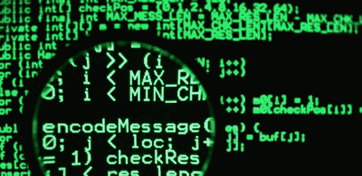
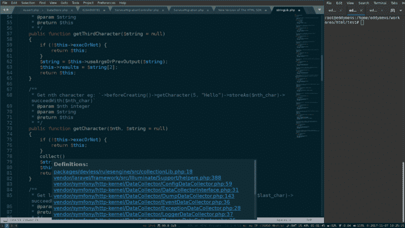

# 我怎么知道拉勒维尔是怎么工作的

> 原文:[https://dev.to/eddymens/how-i-learnt-how-laravel-works-a5c](https://dev.to/eddymens/how-i-learnt-how-laravel-works-a5c)

[T2】](https://res.cloudinary.com/practicaldev/image/fetch/s--if2-QVKC--/c_limit%2Cf_auto%2Cfl_progressive%2Cq_auto%2Cw_880/https://cdn-images-1.medium.com/max/800/1%2AK-3j2d__EGKgzKgtHZSj4w.jpeg)

对 21 世纪的开发者来说，最好的事情之一就是开源，至少对我来说是这样。深入了解一些关键软件的威力是巨大的。你不仅更好地理解了软件，你
也通过学习成为了一名更好的开发者。

【Laravel 入门。

在 Laravel 之前，我用 Yii、CakePHP 和 Slim
为我的 API 做了大部分 PHP 项目。然后 Laravel 的大肆宣传影响了我，所以在我的下一个项目中，我决定尝试一下，结果证明它的大肆宣传是有原因的。它有一些我想理解的有趣的
概念。

**超越文档的学习**

默认情况下，你可以在文档中找到任何一款
软件可以做的事情。我必须提到 Laravel 有非常好的
文档。但是事实的唯一来源是拉勒维尔密码
基地。文档是根据代码中的内容准备的，对我来说，代码比文档更容易理解。所以为什么不去查那个呢:)。你
可能认为这很难做到。这很容易。例子

假设您想使用 Laravel 的集合，这是使用数组
的一个好方法。要从数组中创建一个集合，你首先要收集它，例如
`collect(["name"=>"joe"])`现在，根据你使用的编辑器或 IDE，你应该
能够通过将光标放在它上面来定位收集方法所在的位置。

 
地方收藏关键字存在

在大多数 ide 中，将光标放在关键字上并按下 CTRL 或
命令会显示出这个关键字是在哪里实现的，有时还会显示出你曾经使用过它的地方。通过这个你可以看到这是如何实现的，以及
发现其他可调用的方法。

其他可调用的收集方法列表

对我来说，这是黄金，因为一眼就能看出我可以试验并知道我还能做什么
，以及了解这些事情是如何实现的。这为我节省了一个
的时间，我有代码来计算我的收藏。Count
只是 PHP `count`函数的一个包装器，所以我知道如果
集合最终是一个字符串，我会悄悄地返回`0`，所以我
很好地处理了这个问题，因为集合 Count 方法不会为我做这个。

**使用补锅匠。**

一旦我看到给定概念、类或
函数的所有选项，我会立即使用 tinker 尝试这些方法。Tinker 是默认的
REPL，它允许用户试用 Laravels 组件，而不必处理
视图。它类似于 rails 和 Django 控制台。

它也有一些很酷的特性，我不会详细介绍，但是正如我提到的，这是我尝试我在框架中发现的东西的最快方法之一。

。/工匠修补匠

从上面你会注意到它也给出了 collect 所属的名称空间。从那里，我还可以继续查找更多。

* *使用** `dd(debug_backtrace());`

好了，我们已经了解了如何为开发者发现 Laravel
中打包的一些东西。另一个重要的部分是理解 Laravel 如何处理请求/响应流。

对我来说，每当我需要理解任何 PHP 项目的流程时，我都会拿出
`die(var_dump(debug_backtrace()));`。我把它放在我理解的代码的任何部分，并再次运行应用程序，在我的浏览器中查看它，最后我得到了一个完整的执行堆栈，直到我放下它的地方。然后，我可以跟踪
并理解每个类/方法/文件如何处理请求并将
的执行移交给下一个。这让我理解了这个应用作为一个整体是如何工作的。有了 Laravel 更好，我们可以用 T3 代替 T1、T2，所以最终我们用 T4，这给了我们更多的视觉享受。

回溯

所以上面我有完整的执行路径，直到到达`ServiceController`
你可以看到请求来自
`Routing`包内的`Controller.php`文件。顺便说一下，laravel 框架本身是基于一个叫做 illuminate 的
包，你可以在
[Github](http://github.com/illuminate) 上找到它。过去在
中也有很多 symfony 部件。对于 Laravel 的每个新版本，我只运行`debug_backtrace`和
来查看请求/响应流中是否有任何变化。通过这样做，你会学到很多东西。同样，你可能需要一段时间才能准确理解每一点上发生了什么。

从其他 Laravel 项目中学习。

关于代码的一件有趣的事情是，甚至工具的作者也不能完全预测开发人员将如何使用他们创造的一些东西。

例如，一些开发人员使用 blade 编写脚本，而其他人则将其作为独立的
工具来创建[静态页面](https://github.com/themsaid/katana)。这是
框架内的事情也是如此。

了解这些东西的最好方法之一是阅读其他开发者的 Laravel 项目的源代码。我决定查看哪个项目的方法之一是通过 [Github PHP 趋势页面](https://github.com/trending/php) 这样我更有可能找到足迹较小的年轻 Laravel
项目。我现在可以跟踪这个
项目的进展，并在它成长的同时学习。我所做的一些贡献也是通过这个过程完成的。

**框架背后的人**

我采取的另一个重要步骤是寻找那些参与 Laravel 的
开发的人。这不仅让我跟上了
开发框架的状态。它也给我一种感觉，为什么一些东西存在
或被添加。我从学校里学会了这种方法，在学校里，我能够理解微积分之类的东西的唯一方法是了解牛顿的生平以及他如何偶然发现微积分。另外，PHP 之类的东西跟随着故事
让我明白了为什么我们有`strtoupper`和`str_replace`也就是
，因为实现是由两个不同的人完成的:)不管怎样？

这些是我想到的一些技巧。可能还有更多我没想到的，但希望你会发现这些技巧中的一些有用，并且在你试图理解 Laravel 的内部时应用它们。