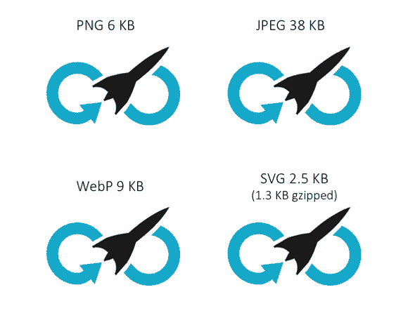
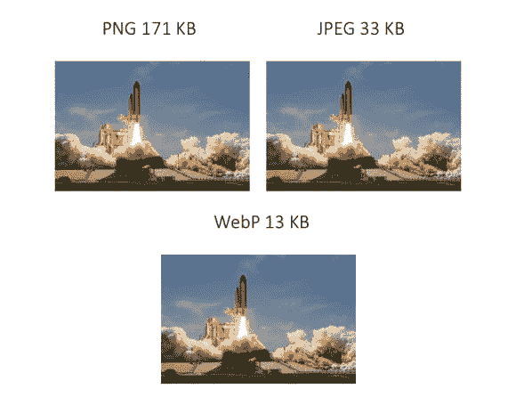
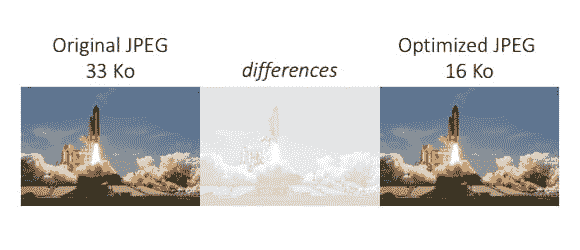
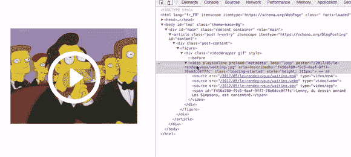
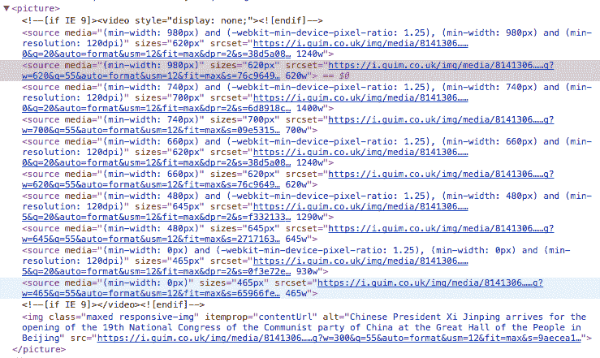

# 优化图像以减轻页面重量:文件格式、工具和 RWD

> 原文:[https://dev . to/borisschapira/optimize-images-to-reduce-page-weight-file-formats-tools-and-rwd-8 G2](https://dev.to/borisschapira/optimize-images-to-reduce-page-weight-file-formats-tools-and-rwd-8g2)

*这篇文章最初见于 [Dareboost 的博客](https://blog.dareboost.com/en/2017/10/optimize-images-to-reduce-page-weight-file-formats-tools-and-rwd/)。*

*“降低页面权重”:这是 Dareboost 报告中最常用的技巧之一。根据 HTTP Archive trends，无论是在桌面还是移动设备上查看，图像都占页面平均重量的 53%。当你想减轻网页的重量时，优化图片应该是你的首要任务。*

## 为每幅图像设定其格式

找到最合适的图像格式并不容易。以我们的标志为例。我们可以把它存成 PNG，JPEG，WebP 或者 SVG。图像的权重会非常不同。一个经验测试让我们可以将它形象化:

[T2】](https://res.cloudinary.com/practicaldev/image/fetch/s--n7V0ssIu--/c_limit%2Cf_auto%2Cfl_progressive%2Cq_auto%2Cw_880/https://thepracticaldev.s3.amazonaws.com/i/smqpwgo11d868cd6xjgv.png)

在这种情况下，最合适的格式似乎是 SVG，其次是 PNG。这确实是一个图像，它的颜色是简单的，非动画的，代表几何形状。所有这些因素都倾向于这两种格式。

让我们举第二个例子，这次是火箭起飞的照片。SVG 就是不能正确地表示这个图像(我们将进一步解释原因)。以下是我们对 JPEG、PNG 和 WebP 格式在同等视觉感受下得到的结果:

[T2】](https://res.cloudinary.com/practicaldev/image/fetch/s--oJm0_saS--/c_limit%2Cf_auto%2Cfl_progressive%2Cq_auto%2Cw_880/https://thepracticaldev.s3.amazonaws.com/i/4jf9l923qh8ieyyeyam9.jpg)

在这里，结果是完全不同的。为了表现一张照片的复杂性，WebP 格式显然很突出。不幸的是，它只在 Chrome 和 Opera 上受支持，所以我们一般更喜欢 JPEG 格式。

***提示:**对于你在 Dareboost 上的每一次 [web 性能测试，我们的工具都会系统地检查 PNG 格式是否被正确使用(或者你是否应该考虑使用另一种格式)。](https://www.dareboost.com/)*

当你想保存一个 JPEG 文件时，大多数软件都会询问要保留什么样的质量，因为这是一种有损编码格式。通过选择小于 100%的质量，可以通过仅校正图像的某些点来节省宝贵的字节。让我们试试我们的图像，质量设置为 80%。然后我们得到一个非常有趣的结果:体重减轻了 50%以上，而只有少数几个点的图像发生了深刻的变化。

[T2】](https://res.cloudinary.com/practicaldev/image/fetch/s--MX8PcunY--/c_limit%2Cf_auto%2Cfl_progressive%2Cq_auto%2Cw_880/https://thepracticaldev.s3.amazonaws.com/i/zz196ix3pzvzrxg79uo6.jpg)

如上所示，选择一种格式并不简单，也不是所有的格式都适合所有的图像。再解释一点吧…

## 如何选择合适的图像格式？

最终，所有的图像都以同样的方式出现在屏幕上:一个由几个不同颜色的点组成的矩形。但是图像不一定像那样记录在磁盘上。每种图像文件格式都依赖于不同的视觉信息编码技术。为了选择正确的文件格式，您需要问自己几个问题:

### 我的形象代表什么？

有些文件格式对图像的编码方式与它们在屏幕上出现的方式相同:比如彩色点阵。每个色点被编码在几个字节上，并根据其坐标定位在地图内。这就是为什么这些格式有时被称为“位图”。然后，各种压缩算法会减少这些信息在磁盘上占用的空间。对于这些格式，我们称之为“**光栅图形**”。他们的优势是:他们可以处理任何照片，其中一些，如 PNG 格式，带有高级功能，如调色板优化或透明度。

不幸的是，在定位这些点之前，这个编码过程必须首先定义矩阵的维数，也就是说图像的分辨率。因此，如果您放大现有的 **JPG** 、 **PNG** 或 **WebP** 光栅图形，您将大幅降低质量。

其他文件格式没有这个缺点，因为它们将图像编码为一组几何形状。它们通过组成图像的线、点和多边形来定义图像。每当要显示图像时，计算机就按照这个虚拟绘图规范重画图像。这些**矢量图形**非常适合渲染简单的形状、标识和数据图形。因为它们不依赖于分辨率，所以特别适合于响应式网页设计。 **SVG** 图像和图标字体都是矢量格式。另一方面:矢量图形不太适合照片。

### 通过牺牲信息来降低图像的权重

通过在此过程中丢失一些信息，可以进一步优化。当然，挑战在于只损失最基本的必需品，同时保持有趣的质量水平。这被称为有损优化阶段。

对于**矢量图形**， [svgo](https://github.com/svg/svgo) 是今天的一个参考工具。甚至还有一个在线界面: [svgomg](https://jakearchibald.github.io/svgomg/) 。该工具能够通过清除对显示无用的元数据(例如，有关用于生成文件的工具的信息)来减少代码量，还可以通过将几个几何形状或变换放在一起来减少代码量。要减轻图标字体的粗细，逻辑是相同的，只是您也可以通过仅选择用于构建自定义字符集的字符来缩小其作用范围。一些网站，比如 Icomoon T7，允许你创建自己的图标字体。

正如我们在火箭船的例子中看到的，有损(或非有损)优化在**光栅图形**上也是可能的。由于每种图像格式都有自己的特点(例如，PNG 支持的透明度)，因此每种算法都有不同的作用方式和特定的视觉影响。

这里有一些文件格式和一些合适的优化工具。其中一些包含在图形软件中，如 Photoshop 或 GIMP:

*   巴布亚新几内亚:Zopfli-png，PNGOUT，OptiPNG，AdvPNG，PNGCrush，PNQQuant
*   JPG: JPEGOptim、MozJPEG、Jpegtran、Guetzli

[file optimizer](http://nikkhokkho.sourceforge.net/static.php?page=FileOptimizer)(Windows)[ImageOptim](https://imageoptim.com/mac)(Mac)ou[Trimage](https://trimage.org/)(Linux)都是把几种算法结合在一个地方的软件。它们允许您在各种损失水平下测试这些优化，并直接导出优化的图像。他们甚至能够确定 PNG 图像何时可以保存在 PNG-8(PNG 的一种变体，具有 256 色调色板)而不是 PNG-24 中，以获得一些宝贵的字节。

### 为什么不谈 GIF？

GIF 是一种非常受约束的格式(它只能描述 256 种颜色)，支持透明和动画。GIF 被用来编码标识、象形图和小动画已经很多年了，让我们大声说出来，它需要永远退休了。

你可以在所有社交网络或即时通讯应用程序中找到标有“GIF”的功能，但事实并非如此。事实上，
许多这些服务使用视频格式，文件要轻得多！我们将在以后的文章中回到这个话题。

[T2】](https://res.cloudinary.com/practicaldev/image/fetch/s--7hwKRfNI--/c_limit%2Cf_auto%2Cfl_progressive%2Cq_66%2Cw_880/https://thepracticaldev.s3.amazonaws.com/i/6893tjqwt95x62w34ge0.gif)

如果你仍然需要 GIF 格式(*我在这篇 Dev.to post 中使用了它，例如*)，请注意还有一个压缩算法:gifsicle。它对于处理 GIF 内容非常有用:减少调色板、调整大小、剪切和裁剪...我有时会使用 Gifsicle 对我屏幕上的短视频进行编码，并将其整合到电子邮件中，因为许多邮件客户端无法阅读嵌入的视频。

## 根据上下文提供合适的文件大小

选择正确的文件格式不足以确保每次都能提供最佳图像。

假设您正在使用一个 2680 像素宽的图像来装饰一个为具有高分辨率显示器的计算机设计的站点的背景( <abbr title="Hight Dot Per Inch">HiDPI</abbr> ，包括 Retina)。在较低分辨率的移动设备上，在 3G 中，不仅浏览器会加载大量不必要的数据，而且浏览器还会使用其内部算法来调整图像的大小，以适合手机屏幕的宽度。最终结果将会降级，更不用说渲染延迟了...相反，您更愿意以不同的分辨率生成原始图像的多个版本，并让浏览器根据图像的执行上下文来选择要下载的图像。

**响应图像**是一个包含所有技术的名称，这些技术包括为网页的相同区域产生适合于可能的导航环境的若干图像。对于背景和装饰图像，您可以使用 CSS 媒体查询。

对于非装饰图像，**图片**规范已经在 2014 年为``元素增加了 ghe 属性`srcset`(是的，已经三年了！).`srcset`是指向同一张图片的多个版本的 URL 的集合，具有不同的分辨率(但仍然具有相同的宽高比)。它让浏览器负责根据当前上下文选择要下载的图像版本。不幸的是，如果没有从网页上下载 CSS 文件，浏览器就无法理解图像在窗口中所占的相对空间，因此还必须定义`sizes`属性。

如果除了优化的图像之外，您还想提供有限数量的浏览器(如 WebP)支持的格式，或者如果您想根据上下文管理不同的宽高比(艺术方向的问题)，您可以用一个`picture`元素和几个`source`元素来构建您的图像:

 

<figure>

<figcaption>响应图片的 HTML 标记，来自卫报网站</figcaption>

</figure>

有了所有可能的媒体、艺术方向选择、分辨率、像素密度和支持的格式，响应式图像的 HTML 标记会变得非常令人印象深刻。但是不要忘记，您的 HTTP 响应必须总是 gzipped。最后，这个标记和单个元素`img`之间的 500B 的差异将被所传递的图像的权重的减少大大抵消。

注意，即使对必要的 HTML 元素的支持是最近才出现的，一个可靠的、公认的库允许在旧的浏览器上支持: [picturefill](https://scottjehl.github.io/picturefill/) 。

### 自动化，自动化，自动化

选择正确的图像格式，生成缩略图，有时使用更适合上下文的替代格式(如 WebP ),从而再次生成一些缩略图...在大量高质量的主图像上手动执行这项工作是非常困难的。无论是 WCM 还是电子商务平台，很少有工具包含图像管理的高级功能。即使是数字资产管理解决方案(通常专用于可视化资产管理，响应迅速的图像管理应该是一项特权)也常常毫无用处。

然而，有些解决方案是存在的，比如[cloud inary](https://cloudinary.com/)——SaaS 中提供的第三方服务——或者 [Thumbor](http://thumbor.org/) (需要安装在网络上的设备)。与您的 web 开发团队讨论，以确定最佳工具，并记住向参与者解释问题，并培训他们使用所选的解决方案。不要忘记始终保留原始图像(质量最好的图像),并提前考虑要应用的优化，甚至是有损的优化。

比如一个电商网站，产品的照片比装饰图片更关键，所以你不会想损失太多质量。类似地，如果你在奢侈品市场，你的访问者期望一个无可挑剔的图像质量。您需要微调优化的配置。有时，正如 Flickr 的情况一样，正确的设置可能需要几个月的时间才能显现出来。

## 【懒人加载】能加载什么就加载什么(有没有视觉效果)

另一种提高网页性能的方法是在初始加载时避免不必要的图片。例如，您可以延迟加载所有不显示在网页可见区域的图像(延迟加载)。有许多 JS 库可以做到这一点，但其中一些将与您现有的代码不兼容:向您的开发团队寻求建议或建议一个独立的、普通的库，如 [Lozad](https://apoorv.pro/lozad.js/) 。Apache 和 nginx 上也有一个延迟加载特性: [ModPageSpeed Lazyload](https://www.modpagespeed.com/doc/filter-lazyload-images) 。

延迟加载的一个问题是图像突然显示，只有在加载之后。因此，有必要确定何时以及如何加载延迟图像，以便用户不会注意到这种现象。但是什么时候？网页初始加载( [onload](https://www.dareboost.com/fr/doc/test-performance-web/indicateurs/onload) )后？当用户滚动内容并且视口接近所考虑的区域时？懒惰加载需要与 UX 的设计师讨论，他们可能有关于如何动画图像的外观的想法，使它不那么粗糙。一些网站以品牌化的内容占领了这个区域。其他人使用图像的主色，甚至是 SVG 中实际图像的形状。

[T2】](https://res.cloudinary.com/practicaldev/image/fetch/s--YrDZhhGB--/c_limit%2Cf_auto%2Cfl_progressive%2Cq_66%2Cw_880/https://thepracticaldev.s3.amazonaws.com/i/nd3xmj6up4n5gjnk5gxk.gif)

## 用图像堆栈减少图像数量

在高延迟网络上，您可以通过减少要下载的图像数量来快速节省时间。可以将图像分组到单个文件中，而不是将每个图像包含在单独的图像文件中。图像精灵是这种技术应用于光栅图像的一个例子。图标字体和 SVG 符号是矢量图像的等效实现。

这个想法看起来有多吸引人，但它的实现可能很复杂。如果您真的使用加载资源的网页上的所有分组图像，使用图像精灵是一种有用的技术，这是非常罕见的。此外，如果您需要替换堆栈中的单个元素，请注意，您将需要从浏览器缓存中使整个 sprite 无效。

最后:延迟可能不是一个永恒的问题。随着 HTTP/2(一种优化连接以同时下载多种资源的协议)的出现，这项技术将失去意义。[理论上来说](https://blog.octo.com/en/http2-arrives-but-sprite-sets-aint-no-dead/)。

## 结束？

见鬼，不！(响应的)图像管理的艺术状态仍然远非完美。

例如，与其向浏览器发送大量信息并让它选择关于上下文的正确图像，为什么不要求浏览器在初始查询期间传递上下文并计算所有的上下文服务器端呢？这就是 What WG 的一些成员在“[客户端提示](http://httpwg.org/http-extensions/client-hints.html)”规范中所考虑的。支持仍然是[非常有限](http://caniuse.com/#feat=client-hints-dpr-width-viewport)，但是这个概念正在 IETF 中被标准化。这非常像 2010 年初的一个计划，叫做[响应式网页设计+服务器端组件，又名 RESS](https://www.lukew.com/ff/entry.asp?1392) ，它已经在尝试实现服务器端机制。

这次会成功吗？