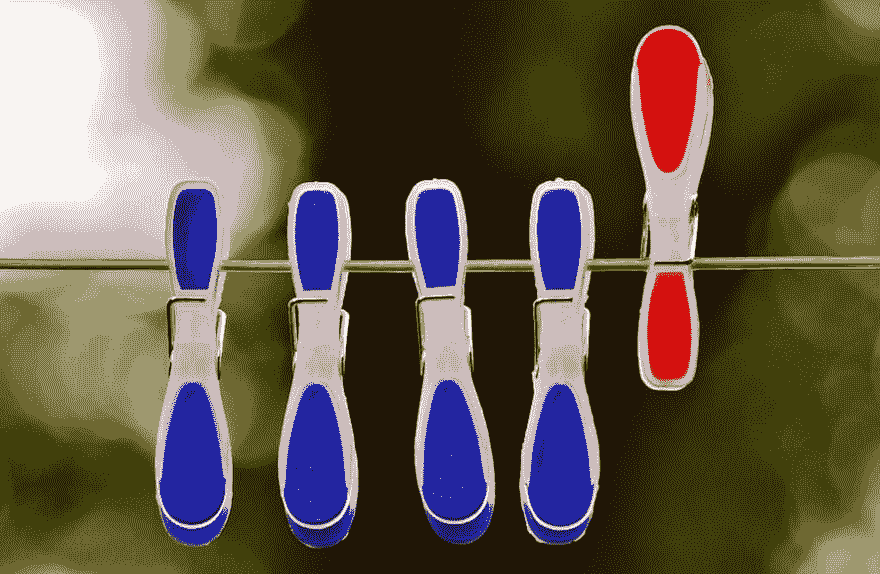
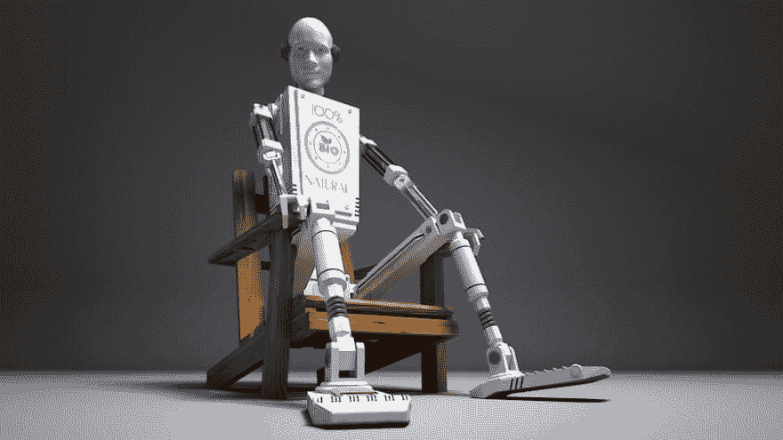
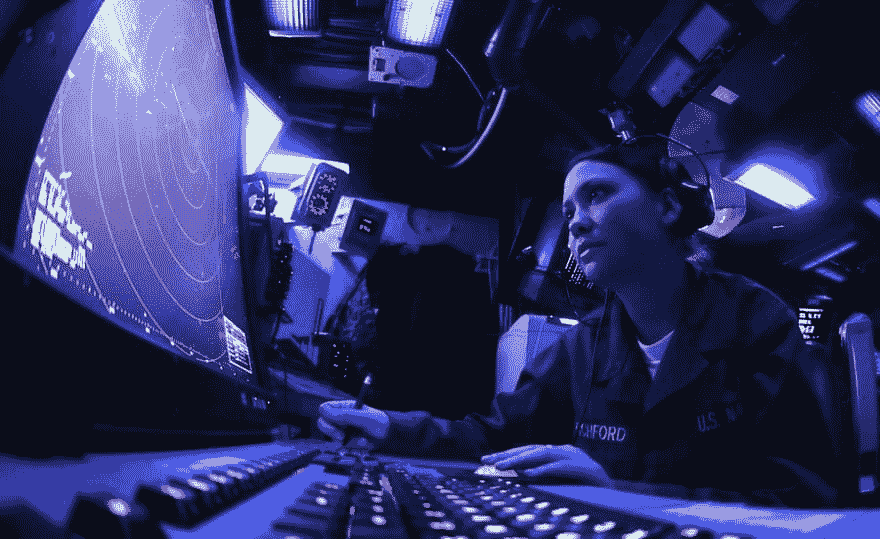

# 为什么千篇一律的面试不够好

> 原文:[https://dev . to/tw bartel/why-cookie-cutter-面试-不够好-182](https://dev.to/twbartel/why-cookie-cutter-interviews-are-not-good-enough-182)

最近，我读了一篇关于采访的 Cal Fussman 的采访，这让我陷入了思考。他的建议的实质是将每个候选人视为一个个体——这里没有争议——并且“找出人们的故事”。Fussman 希望在面试中了解人们，深入了解他们的生活和记忆。

Fussman 建议的具体问题是“哪首歌最能描述你？”以及“你最喜欢的电影是什么？”。

他问这种问题的主要动机之一是获得候选人之前没有排练过的答案。Fussman 认为，对于标准的面试问题，比如“你最大的优点和缺点是什么？”问题是，候选人期待他们，甚至在问题提出之前就已经准备好了答案。这样，你就不会了解这个人任何有意义的东西。

关于这个人最喜欢的电影的问题可能不那么令人期待。此外，它显示出对这个人真正的兴趣。这将建立信任，有利于交谈。

## 逆潮流而动

[T2】](https://res.cloudinary.com/practicaldev/image/fetch/s--rdsTUC5e--/c_limit%2Cf_auto%2Cfl_progressive%2Cq_auto%2Cw_880/https://thepracticaldev.s3.amazonaws.com/i/sbo6iuf93gblff6olddm.jpg)

Fussman 的建议在当前可重复、可比较的面试趋势中脱颖而出——你可以称之为千篇一律的面试，因为你无法区分不同的面试。

例如，Triplebyte 的人建议我们[问每个候选人同样的问题](https://triplebyte.com/blog/how-to-interview-engineers)以确保可比性。

媒体公布了他们的[评分标准](https://medium.engineering/engineering-interviews-grading-rubric-8b409bec021f)，他们用这个标准来衡量每一个候选人。

拉兹洛·博克的[工作规则！](https://www.amazon.com/gp/product/1455554790/ref=as_li_tl)强调结构化面试的价值。在谷歌，结构化面试的预测能力为 26%。这比非结构化面试高出很多，后者的预测能力为 14%。

结构化面试也消除了许多无意识的偏见，或者至少让它们更难潜入。如果你下意识地认为候选人符合你的要求，你可能会问更容易的问题，候选人会表现得更好。高大英俊的候选人通常会被给予较轻的问题，因为我们潜意识里希望他们成功。

一个结构化的、可重复的面试可以确保每个候选人都被问到相同的问题，从而使这些面试更加公平。

总而言之，目前的趋势是进行结构化的、可重复的、可比较的面试，每个候选人都被问到相同的问题，面试官使用一个明确的标准来给答案打分。

## 机器人面试？

[T2】](https://res.cloudinary.com/practicaldev/image/fetch/s--aX_GGeUU--/c_limit%2Cf_auto%2Cfl_progressive%2Cq_auto%2Cw_880/https://thepracticaldev.s3.amazonaws.com/i/j2d242stduse5vxhuubv.jpg)

如果你把这一点发挥到极致，你还不如进行一次全自动的面试。有一些供应商，如 [HireVue](https://www.hirevue.com/) 和 [Sonru](https://www.sonru.com/) ，他们的软件允许自动视频面试。为什么不直接使用它们，消除一些人为因素呢？这难道不会让面试更加公平，并消除更多无意识偏见的机会吗？

大概是的。

但是这对候选人来说会是一次好的经历吗？作为一个人，他们会感到被欣赏吗？

我们会愿意雇佣一个我们从来没有面对面交谈过的人吗？

我不这么认为。毕竟，人的因素在工作场所仍然至关重要。团队由合作和交流的人组成。如果团队成员之间的协作和沟通不畅，他们的产出和生产力就会下降。这对组织是不利的。

因此，我们在招聘时必须考虑人的因素。

我们必须弄清楚我们是否能与候选人共事。

我们必须弄清楚这个人的思维方式和价值体系是否与我们的组织和员工的思维方式和价值体系一致。

我们必须弄清楚把这个人加入团队是否会增加紧张的可能性。

换句话说:在面试过程中的短暂时间里，我们必须尽可能地了解候选人。

这正是富斯曼作为世界知名采访者所擅长的。了解对方是谁是他的既定目标。在他的职业生涯中，他采访了世界领导人和名人——米哈伊尔·戈尔巴乔夫、吉米·卡特、杰夫·贝索斯、理查德·布兰森、劳勃·狄·尼诺、布鲁斯·斯普林斯汀、穆罕默德·阿里，仅举几例——并让读者近距离了解他们的个性。他会问一些非常私人的问题，比如“你父亲给你上的最好的一课是什么？”，并从中获益匪浅。

## 不同的目标

尽管如此，你面试名人或世界领导人的目标和面试求职者的目标是不同的。你想发现这个人有趣的个人细节、事实和轶事。

他们是如何在哪里长大的？他们在家庭中的角色是什么？他们小时候想成为什么样的人？在他们成长的过程中，有哪些困难的挑战？他们喜欢学校吗？他们有讨厌的科目或老师吗？

没人关心你的名人采访是否公平或可比。人们不会说:“嘿，我注意到你问了巴拉克·奥巴马比阿尔·帕西诺更难的问题。可能有一些无意识的偏见在起作用。我建议你使用结构化面试，让它们更容易预测。”

当涉及名人采访时，无意识偏见不是大多数人所关心的。可预测性也不是。

Fussman 甚至说重复性和可预测性对一次好的面试是有害的:

> 面试官和被面试者都应该在某个时候**而不是**知道谈话的走向。它必须是有机的，才是真实的。”

他进一步指出，采访是一种艺术形式，需要合适的人来进行。这再次与可重复性和可比性背道而驰。

正如我所说，目标是不同的。作为一个名人的采访者，你不需要在事后预测她在某项工作上的表现。你可以完全专注于构思一个有趣的对话。

然而，作为求职者的面试官，你对工作表现的预测对公司来说是至关重要的。

## 化解矛盾

你如何解决这个冲突？一方面，你希望不偏不倚、公平的面试能够在候选人之间进行客观的比较。另一方面，你想充分了解这个人——这个人——来评估他们是否适合团队。

我认为有两种可能的出路。

**解决方案 1:不同类型的面试。**既然很难在一次面试中解决目标冲突，那就进行多次不同目标的面试吧。

一次或几次面试应该集中在技术主题上，并且尽可能地可重复和客观。

不过，有一次面试应该是这种“了解对方”的面试。你也可以称之为“软技能面试”，或者“个性面试”。

个性面试的规则比技术面试要宽松一些。例如，您不必严格遵循预先定义的问题列表。你可以自由地、自发地对候选人说的事情做出反应，让自己被突然出现的话题和新信息所吸引。

个性面试有一个重要的先决条件:面试官必须对对方真正感兴趣和好奇。如果她不是，受访者会注意到，谈话会显得不自然和尴尬。

使用这两种面试方式将导致对候选人的技术技能的评估，以及对这个人的团队适应性、他们的主要驱动力、他们的价值观和他们的个性的评估。如果两者中有一个不符合招聘经理的要求，她就不应该雇佣这个候选人。

你可以在个性面试中使用的问题包括:

*   你小时候想成为什么样的人？
*   他们说每个人心里都有一本书。你的书是关于什么的？
*   你必须克服的最大挑战是什么？
*   告诉我你为自己感到骄傲的一次经历。发生了什么事？
*   有哪些让你真正生气的情况？
*   你最后一次和谁争吵，是关于什么的？
*   你不得不放弃的最大梦想是什么？
*   谁激励你变得更好？
*   在什么情况或地方你会觉得最不合适？
*   你希望你的大脑更擅长做什么？
*   告诉我一个运气或巧合在你的生活中扮演重要角色的时候。
*   哪本书对你影响最大？

不过，提醒一句:了解你所在国家的法律！根据你所处的法律环境，有些问题可能是禁区。例如，关于个人偏好、爱好和与工作无关的活动的问题属于灰色地带，应该小心处理。

**解决方案 2:拥有社交雷达。如果你幸运的话，你的团队里有一个*社交雷达*。社交雷达是一个具有评估一个人个性的天赋的人，即使他们试图隐藏它。她能看穿别人的伪装，并注意到这个人是否在说实话。**

[T2】](https://res.cloudinary.com/practicaldev/image/fetch/s--Ymq9v4Ti--/c_limit%2Cf_auto%2Cfl_progressive%2Cq_auto%2Cw_880/https://thepracticaldev.s3.amazonaws.com/i/o8he9p80n5g5vrpiaxkz.jpg)

“原始”社交雷达——至少是我读到的第一个拥有这个头衔的人——是杰西卡·利文斯顿，她在 Y Combinator 担任这个“职位”。保罗·格拉厄姆[描述了她为他们的选拔过程做出的巨大贡献](http://www.paulgraham.com/jessica.html):

> 她是少有的对性格有透视能力的人之一。她几乎能立刻看穿任何一种骗子。她在 YC 的绰号是社会雷达，她的这种特殊力量对 YC 的发展至关重要。”

如果你有一个公认的社交雷达，把她加入到你的面试中，或者让她进行一次单独的面试。这当然可以是方法 1 中提到的人格面试。

关于社交雷达的坏消息是，根据我的经验，它们无法被训练。有些人可能不同意这一点，但我发现这是一种天赋和艺术，而不是一种你可以通过练习完全掌握的技能。

如果社交雷达对候选人有所怀疑，那么你应该非常谨慎地行事。通常，他们感觉到一些不会立即显现的东西，但从长远来看，这些东西会造成巨大的损害。

## 结论

千篇一律的面试——可重复、可比较的面试——有其价值，因为它们更公平，减少了无意识偏见在招聘决策中的作用。

然而，如果你只进行严格照本宣科的面试，你就错过了真正了解这个人的机会。要做到这一点，由真正的好奇心驱动的更自由形式的采访更为合适。考虑将两者结合起来，以预测绩效*和*个性。如果你的团队中有社交雷达，一定要考虑让她参与进来。

你用什么样的面试来评估候选人？可重复的，还是更自由的形式？两者都有？

我很想听听你的看法。