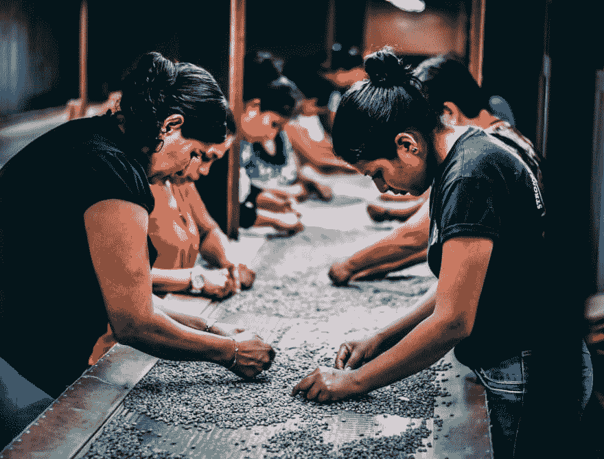
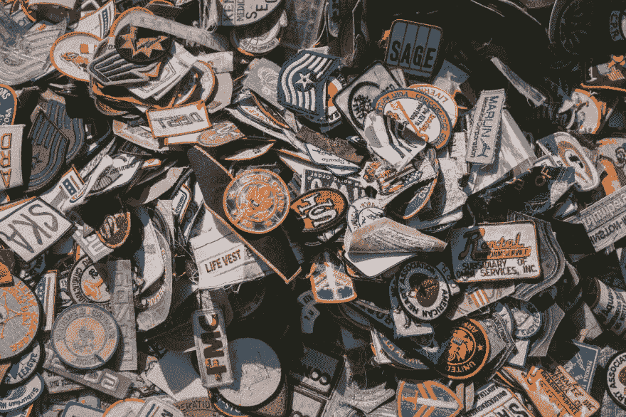

# go tools & git lab——如何像老板一样做持续集成

> 原文：<https://dev.to/chilladx/go-tools--gitlabhow-to-do-continuous-integration-like-a-boss-ckn>

*此文最初发布在[媒体](https://medium.com/pantomath/go-tools-gitlab-how-to-do-continuous-integration-like-a-boss-941a3a9ad0b6)T3 上*

# Go 工具&git lab——如何像老板一样做持续集成

[](https://res.cloudinary.com/practicaldev/image/fetch/s--8sl0npSS--/c_limit%2Cf_auto%2Cfl_progressive%2Cq_auto%2Cw_880/https://cdn-images-1.medium.com/max/2000/1%2At3A-s2eExektSb4S48r0FQ.jpeg) 
*照片由[托德·夸肯布什](https://unsplash.com/photos/IClZBVw5W5A?utm_source=unsplash&utm_medium=referral&utm_content=creditCopyText)上[下](https://unsplash.com/?utm_source=unsplash&utm_medium=referral&utm_content=creditCopyText)*

在 [Pantomath](https://pantomath.io/) ，我们使用 [GitLab](https://about.gitlab.com/) 进行所有的开发工作。本文的目的不是介绍 GitLab 和所有[它的特性](https://about.gitlab.com/features/)，而是介绍我们如何使用这些工具来缓解我们的生活。

那么这到底是怎么回事呢？自动化与您的开发项目相关的一切，让您专注于您的代码。我们将涵盖 [lint](https://en.wikipedia.org/wiki/Lint_(software)) 、[单元测试](https://en.wikipedia.org/wiki/Unit_testing)、[数据竞赛](https://en.wikipedia.org/wiki/Race_condition)、[内存消毒](https://clang.llvm.org/docs/MemorySanitizer.html)、[代码覆盖](https://en.wikipedia.org/wiki/Code_coverage)，并构建。

这篇文章中显示的所有代码都可以在 https://gitlab.com/pantomath-io/demo-tools 的[获得。因此，请随意获取存储库，并使用标签在其中导航。存储库应该放在您的`$GOPATH` :
的`src`文件夹中](https://gitlab.com/pantomath-io/demo-tools)

```
$ go get -v -d gitlab.com/pantomath-io/demo-tools
$ cd $GOPATH/src/gitlab.com/pantomath-io/demo-tools 
```

Enter fullscreen mode Exit fullscreen mode

### Go 工具

幸运的是，`Go`提供了很多有用的工具，来构建、测试和检查你的代码。事实上，都在那里。我们只需添加额外的工具将它们粘合在一起。但是在我们去那里之前，我们需要一个一个地带他们去，看看他们做什么。

#### 套餐列表

你的 go 项目是一个包的集合，正如[官方文件](https://golang.org/doc/code.html)中所描述的。下面的大部分工具都会附带这些包，因此我们需要的第一个命令是列出这些包的方法。但愿，`go`用`list`子命令掩护我们([阅读精美手册](https://golang.org/cmd/go/#hdr-List_packages)和戴夫·切尼的这篇[精彩帖子:](https://dave.cheney.net/2014/09/14/go-list-your-swiss-army-knife) 

```
$ go list ./.. 
```

Enter fullscreen mode Exit fullscreen mode

请注意，我们希望避免在外部资源上应用我们的工具，并将其限制在我们的代码上。所以我们需要去掉[供应商目录](https://golang.org/cmd/go/#hdr-Vendor_Directories) :

```
$ go list ./... | grep -v /vendor/ 
```

Enter fullscreen mode Exit fullscreen mode

#### [功能区](#lint)

这是我们在代码上使用的第一个工具:linter。它的作用是确保代码尊重代码风格。这听起来像是一个可选的工具，或者至少是一个“好东西”,但是它确实有助于在你的项目中保持一致的风格。

这个棉绒不是 go *本身*的一部分，所以你需要用手抓取并安装它(参见[官方文件](https://github.com/golang/lint))。

用法相当简单:你只需要在你的代码包中运行它(你也可以指向`.go`文件):

```
$ golint -set_exit_status $(go list ./... | grep -v /vendor/) 
```

Enter fullscreen mode Exit fullscreen mode

注意`-set_exit_status`选项。默认情况下，`golint`只打印样式问题，并返回(返回代码为 0)，因此 CI 从不认为有什么地方出错了。如果您指定了`-set_exit_status`，如果遇到任何样式问题，`golint`的返回代码将不同于 0。

#### 单元测试

这些是您可以在代码上运行的最常见的测试。对于每个`.go`文件，我们需要有一个关联的`_test.go`文件来保存单元测试。您可以使用下面的命令运行所有包的测试:

```
$ go test -short $(go list ./... | grep -v /vendor/) 
```

Enter fullscreen mode Exit fullscreen mode

#### 数据竞赛

这通常是一个很难涵盖的主题，但是`go`工具默认有它(但是只在`linux/amd64`、`freebsd/amd64`、`darwin/amd64`和`windows/amd64`上可用)。有关数据竞争的更多信息，请参见本文。同时，下面是如何运行它:

```
$ go test -race -short $(go list ./... | grep -v /vendor/) 
```

Enter fullscreen mode Exit fullscreen mode

#### 记忆消毒剂

Clang 有一个很好的未初始化读取检测器，叫做[内存初始化器](https://clang.llvm.org/docs/MemorySanitizer.html)。`go test`工具非常友好，可以与这个 Clang 模块进行交互(只要你在`linux/amd64`主机上并使用 Clang/LLVM ( `>=3.8.0`)的最新版本)。这个命令是如何运行的:

```
$ go test -msan -short $(go list ./... | grep -v /vendor/) 
```

Enter fullscreen mode Exit fullscreen mode

#### 代码覆盖率

这也是评估你的代码健康程度的一个必须要做的事情，看看哪部分代码在单元测试中，哪部分没有。罗布·派克写了一篇[关于这个话题的完整帖子](https://blog.golang.org/cover)。

为了计算代码覆盖率，我们需要运行下面的脚本:

```
$ PKG_LIST=$(go list ./... | grep -v /vendor/)
$ for package in ${PKG_LIST}; do go test -covermode=count -coverprofile "cover/${package##*/}.cov" "$package" ;
done
$ tail -q -n +2 cover/*.cov >> cover/coverage.cov
$ go tool cover -func=cover/coverage.cov 
```

Enter fullscreen mode Exit fullscreen mode

如果我们想要得到 HTML 格式的覆盖报告，我们需要添加下面的命令:

```
$ go tool cover -html=cover/coverage.cov -o coverage.html 
```

Enter fullscreen mode Exit fullscreen mode

#### 打造

最后但同样重要的是，一旦代码已经过全面测试，我们可能想要编译它，以确保我们可以构建一个工作的二进制文件。

```
$ go build -i -v gitlab.com/pantomath-io/demo-tools 
```

Enter fullscreen mode Exit fullscreen mode

### Makefile

*git 标签:* [init-makefile](https://gitlab.com/pantomath-io/demo-tools/tags/init-makefile)

[](https://res.cloudinary.com/practicaldev/image/fetch/s--MItWuX5r--/c_limit%2Cf_auto%2Cfl_progressive%2Cq_auto%2Cw_880/https://cdn-images-1.medium.com/max/1600/1%2AIp_q_6I-kNpUjuPMOutuTA.jpeg) 
*图片由[马特·阿特兹](https://unsplash.com/photos/qJE5Svhs2ek?utm_source=unsplash&utm_medium=referral&utm_content=creditCopyText)上传 [Unsplash](https://unsplash.com/?utm_source=unsplash&utm_medium=referral&utm_content=creditCopyText)*

现在我们有了在持续集成环境中可能用到的所有工具，我们可以将它们都包装在一个 [Makefile](https://gitlab.com/pantomath-io/demo-tools/blob/init-makefile/Makefile) 中，并以一致的方式调用它们。

这个文档的目的不是呈现`make`，但是你可以参考[官方文档](https://www.gnu.org/software/make/manual/make.html)来了解更多。

```
PROJECT_NAME := "demo-tools"
PKG := "gitlab.com/pantomath-io/$(PROJECT_NAME)"
PKG_LIST := $(shell go list ${PKG}/... | grep -v /vendor/)
GO_FILES := $(shell find . -name '*.go' | grep -v /vendor/ | grep -v _test.go)

.PHONY: all dep build clean test coverage coverhtml lint

all: build

lint: ## Lint the files
  @golint -set_exit_status ${PKG_LIST}

test: ## Run unittests
  @go test -short ${PKG_LIST}

race: dep ## Run data race detector
  @go test -race -short ${PKG_LIST}

msan: dep ## Run memory sanitizer
  @go test -msan -short ${PKG_LIST}

coverage: ## Generate global code coverage report
  ./tools/coverage.sh;

coverhtml: ## Generate global code coverage report in HTML
  ./tools/coverage.sh html;

dep: ## Get the dependencies
  @go get -v -d ./...

build: dep ## Build the binary file
  @go build -i -v $(PKG)

clean: ## Remove previous build
  @rm -f $(PROJECT_NAME)

help: ## Display this help screen
  @grep -h -E '^[a-zA-Z_-]+:.*?## .*$$' $(MAKEFILE_LIST) | awk 'BEGIN {FS = ":.*?## "}; {printf "\033[36m%-30s\033[0m %s\n", $$1, $$2}' 
```

Enter fullscreen mode Exit fullscreen mode

我们现在有什么？一个目标针对之前介绍的任何工具，另外三个目标针对:

*   依赖项的安装(`dep`)；
*   项目的内务管理(`clean`)；
*   一些漂亮闪亮的帮助(`help`)。

注意，我们还必须为代码覆盖工作创建一个脚本。这是因为在 Makefile 中实现文件循环是一件痛苦的事情。所以工作是在一个`bash`脚本中完成的，Makefile 只触发这个脚本。

您可以使用以下命令尝试 Makefile:

```
$ make help
$ make lint
$ make coverage 
```

Enter fullscreen mode Exit fullscreen mode

### 持续整合

*git 标签:* [init-ci](https://gitlab.com/pantomath-io/demo-tools/tags/init-ci)

[](https://res.cloudinary.com/practicaldev/image/fetch/s--gPT8ptyk--/c_limit%2Cf_auto%2Cfl_progressive%2Cq_auto%2Cw_880/https://cdn-images-1.medium.com/max/1600/1%2AWQ87XIRgONJ9dOKw8CxPAA.jpeg) 
*照片由 [Max Panamá](https://unsplash.com/photos/Gt1A0jNzzbM?utm_source=unsplash&utm_medium=referral&utm_content=creditCopyText) 上 [Unsplash](https://unsplash.com/?utm_source=unsplash&utm_medium=referral&utm_content=creditCopyText)*

现在工具已经就位，我们可以对我们的代码运行各种测试，我们希望在您的存储库中自动化这些测试。幸运的是，GitLab 为此提供了 [CI 管道](https://about.gitlab.com/features/gitlab-ci-cd/)。这种设置非常简单:您只需在存储库的根目录下创建一个`.gitlab-ci.yml`文件。

这个 Yaml 文件上的[完整文档](https://docs.gitlab.com/ee/ci/yaml/)提供了所有选项，但是您可以从这个`.gitlab-ci.yml` :
开始

```
image: golang:1.9

cache:
  paths:
    - /apt-cache
    - /go/src/github.com
    - /go/src/golang.org
    - /go/src/google.golang.org
    - /go/src/gopkg.in

stages:
  - test
  - build

before_script:
  - mkdir -p /go/src/gitlab.com/pantomath-io /go/src/_/builds
  - cp -r $CI_PROJECT_DIR /go/src/gitlab.com/pantomath-io/pantomath
  - ln -s /go/src/gitlab.com/pantomath-io /go/src/_/builds/pantomath-io
  - make dep

unit_tests:
  stage: test
  script:
    - make test

race_detector:
  stage: test
  script:
    - make race

memory_sanitizer:
  stage: test
  script:
    - make msan

code_coverage:
  stage: test
  script:
    - make coverage

code_coverage_report:
  stage: test
  script:
    - make coverhtml
  only:
  - master

lint_code:
  stage: test
  script:
    - make lint

build:
  stage: build
  script:
    - make 
```

Enter fullscreen mode Exit fullscreen mode

如果你分解文件，下面是对其内容的一些解释:

*   第一件事是选择将使用什么 Docker 映像来运行 CI。前往 [Docker Hub](https://hub.docker.com/) 为你的项目选择合适的图片。
*   然后，你指定这个图像的一些文件夹[被缓存](https://docs.gitlab.com/ee/ci/yaml/#cache)。这里的目标是避免多次下载相同的内容。作业完成后，列出的路径将被归档，下一个作业将使用相同的归档。
*   你定义不同的`stages`来分组你的工作。在我们的例子中，我们有两个[阶段](https://docs.gitlab.com/ee/ci/yaml/#stages)(将按此顺序处理):`test`和`build`。我们可以有其他阶段，如`deploy`。
*   `before_script` [部分](https://docs.gitlab.com/ee/ci/yaml/#before_script)定义了在工作实际完成之前要在 Docker 容器中运行的命令。在我们的上下文中，这些命令只是复制或链接部署在`$GOPATH`中的存储库，并安装依赖项。
*   然后是实际的[工作](https://docs.gitlab.com/ee/ci/yaml/#jobs)，使用`Makefile`目标。注意`code_coverage_report`的特殊情况，其中执行被限制在`master`分支(例如，我们不想从特性分支更新代码覆盖报告)。

当我们在存储库中提交/推送`.gitlab-ci.yml`文件时，CI 是[自动触发的](https://gitlab.com/pantomath-io/demo-tools/pipelines/13481935)。并且管道失效。怎么会这样

`lint_code` [作业](https://gitlab.com/pantomath-io/demo-tools/-/jobs/38690212)失败，因为它找不到`golint`二进制文件:

```
$ make lint
make: golint: Command not found
Makefile:11: recipe for target 'lint' failed
make: *** [lint] Error 127 
```

Enter fullscreen mode Exit fullscreen mode

所以，[更新](https://gitlab.com/pantomath-io/demo-toolscommit/17a0206eb626504e559f56773e2d81c7b5808dbe)你的`Makefile`来安装`golint`作为`dep`目标的一部分。

`memory_sanitizer` [工作](https://gitlab.com/pantomath-io/demo-tools/-/jobs/38690209)失败是因为`gcc`抱怨:

```
$ make msan
# runtime/cgo
gcc: error: unrecognized argument to -fsanitize= option: 'memory'
Makefile:20: recipe for target 'msan' failed
make: *** [msan] Error 2 
```

Enter fullscreen mode Exit fullscreen mode

但是记住我们需要使用 Clang/LLVM `>=3.8.0`来享受`go test`命令中的`-msan`选项。

我们有两个选择:

*   要么我们在工作中设置 Clang(使用`before_script`)；
*   或者我们使用默认安装了 Clang 的 Docker 镜像。

第一个选项很好，但是这意味着要为每一个作业都做这个设置**。这会持续很久，我们应该一劳永逸。所以我们更倾向于第二种选择，这是一种玩 [GitLab 注册表](https://docs.gitlab.com/ce/user/project/container_registry.html)的好方法。**

*git 标签:* [使用自锚](https://gitlab.com/pantomath-io/demo-tools/tags/use-own-docker)

我们需要为容器创建一个 [Dockerfile](https://gitlab.com/pantomath-io/demo-tools/blob/use-own-docker/Dockerfile) (像往常一样:阅读[官方文档](https://docs.docker.com/engine/reference/builder)以获得更多选项)；

```
# Base image: 
FROM golang:1.9
MAINTAINER Julien Andrieux <julien@pantomath.io>

# Install golint
ENV GOPATH /go
ENV PATH ${GOPATH}/bin:$PATH
RUN go get -u github.com/golang/lint/golint

# Add apt key for LLVM repository
RUN wget -O - 
 | apt-key add -

# Add LLVM apt repository
RUN echo "deb 
 llvm-toolchain-stretch-5.0 main" | tee -a /etc/apt/sources.list

# Install clang from LLVM repository
RUN apt-get update && apt-get install -y --no-install-recommends \
    clang-5.0 \
    && apt-get clean \
    && rm -rf /var/lib/apt/lists/* /tmp/* /var/tmp/*

# Set Clang as default CC
ENV set_clang /etc/profile.d/set-clang-cc.sh
RUN echo "export CC=clang-5.0" | tee -a ${set_clang} && chmod a+x ${set_clang} 
```

Enter fullscreen mode Exit fullscreen mode

从这个 docker 文件构建的容器将基于 [golang:1.9](https://hub.docker.com/_/golang/) 图像(在`.gitlab-ci.yml`文件中引用的那个)。

当我们这样做的时候，我们在容器中安装了`golint`,所以它是可用的。然后我们按照[官方方式](http://apt.llvm.org/)从 LLVM 库安装 Clang 5.0。

现在我们已经有了 docker 文件，我们需要构建容器映像并使它对 GitLab 可用:

```
$ docker login registry.gitlab.com
$ docker build -t registry.gitlab.com/pantomath-io/demo-tools .
$ docker push registry.gitlab.com/pantomath-io/demo-tools 
```

Enter fullscreen mode Exit fullscreen mode

第一个命令将您连接到 GitLab 注册表。然后构建 Dockerfile 文件中描述的容器映像。最后，将它推送到 GitLab 注册表中。

看看你的仓库的[注册表，你会看到你的图像，准备使用。要让 CI 使用您的图像，您只需要更新`.gitlab-ci.yml`文件:](https://gitlab.com/pantomath-io/demo-tools/container_registry)

```
image: golang:1.9 
```

Enter fullscreen mode Exit fullscreen mode

成为

```
image: registry.gitlab.com/pantomath-io/demo-tools:latest 
```

Enter fullscreen mode Exit fullscreen mode

最后一个细节:您需要告诉 CI 使用正确的编译器(即`CC`环境变量)，所以我们在`.gitlab-ci.yml`文件中添加了变量初始化:

```
export CC=clang-5.0 
```

Enter fullscreen mode Exit fullscreen mode

修改完成后，下一次提交将触发管道，现在管道工作了:

[https://git lab . com/panto math-io/demo-tools/pipelines/13497136](https://gitlab.com/pantomath-io/demo-tools/pipelines/13497136)

### 徽章

*git 标签:* [init-badges](https://gitlab.com/pantomath-io/demo-tools/tags/init-badges)

[](https://res.cloudinary.com/practicaldev/image/fetch/s--SPLlXG2c--/c_limit%2Cf_auto%2Cfl_progressive%2Cq_auto%2Cw_880/https://cdn-images-1.medium.com/max/1600/1%2A0pY_6oCiHZ_eLh0vfg5rDA.jpeg) 
*照片由[雅各布·欧文斯](https://unsplash.com/photos/ZBadHaTUkP0?utm_source=unsplash&utm_medium=referral&utm_content=creditCopyText)上[下](https://unsplash.com/?utm_source=unsplash&utm_medium=referral&utm_content=creditCopyText)*

现在工具已经准备好了，每次提交都会启动一个测试套件，你可能想展示它，这是合法的:)最好的方法是使用徽章，最好的地方是`README` [文件](https://gitlab.com/pantomath-io/demo-tools/blob/init-badges/README.md)。

编辑并添加以下 4 个徽章:

*   构建状态:`master`分支上最后一个管道的状态:

```
[](https://gitlab.com/pantomath-io/demo-tools/commits/master) 
```

Enter fullscreen mode Exit fullscreen mode

*   覆盖率报告:测试覆盖的代码的百分比

    [T2】](https://gitlab.com/pantomath-io/demo-tools/commits/master)

*   Go 报告卡:

    [T2】](https://goreportcard.com/report/gitlab.com/pantomath-io/demo-tools)

*   许可证:

    [T2】](https://img.shields.io/badge/License-MIT-brightgreen.svg)

覆盖报告需要一个特殊的配置。您需要告诉 GitLab 如何获得这些信息，考虑到 CI 中有一个作业在运行时会显示它。
有一个[配置](https://gitlab.com/help/user/project/pipelines/settings#test-coverage-parsing)为 GitLab 提供一个 regexp，用于任何作业的输出。如果正则表达式匹配，GitLab 认为匹配是代码覆盖率结果。

因此，转到您的存储库中的`Settings > CI/CD`，向下滚动到`General pipelines settings`部分的`Test coverage parsing`设置，并使用下面的 regexp:

```
total:\s+\(statements\)\s+(\d+.\d+\%) 
```

Enter fullscreen mode Exit fullscreen mode

你都准备好了！前往您的存储库的[概述，并查看您的`README`:](https://gitlab.com/pantomath-io/demo-tools/tree/init-badges)

### 结论

下一步是什么？可能会有更多的测试。您还可以查看 CD ( [连续部署](https://docs.gitlab.com/ee/ci/environments.html))来自动化您的构建的部署。文档可以使用 [GoDoc](https://godoc.org/-/about) 完成。注意，您使用`code_coverage_report`生成一个覆盖报告，但是不要在 CI 中使用它。您可以使用`scp`让作业将 HTML 文件复制到 web 服务器上(参见这个[文档](https://docs.gitlab.com/ee/ci/ssh_keys/README.html)关于如何使用 SSH 密钥)。

*非常感谢[查尔斯·弗朗索瓦丝](https://dev.to/loderunner)和[https://gitlab.com/pantomath-io/demo-tools](https://gitlab.com/pantomath-io/demo-tools)共同撰写本文。*

* * *

我们目前正在开发 Pantomath。Pantomath 是一款现代化的开源监控解决方案，专为提高性能而设计，能够弥合公司各个层面的差距。基础设施的良好运行是每个人的事。[跟上项目](http://goo.gl/tcxtXq)