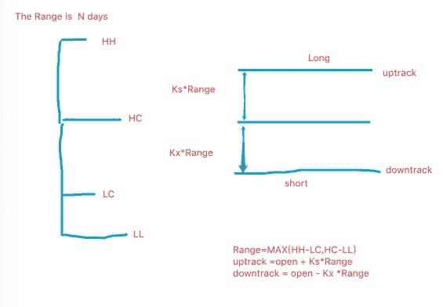

# 一个用来交易比特币的 JavaScript 程序

> 原文:[https://dev . to/little little dream/a-JavaScript-program-to-used-trade-bit coin-bg4](https://dev.to/littlelittledream/a-javascript-program-to-used-trade-bitcoin-bg4)

当天收盘时，计算两个值:最高价-收盘价，收盘价-最低价。然后取两个较大的，乘以 k 值，结果叫做触发值。

第二天，记录开盘价，然后在价格超过(开盘价+触发值)，或者价格低于(开盘价-触发值)后，立即卖空。

这个系统是一个没有单一止损的反转系统。也就是说反转信号也是平仓信号。

*   我画了一张图表

[T2】](https://res.cloudinary.com/practicaldev/image/fetch/s--DQZVDa_O--/c_limit%2Cf_auto%2Cfl_progressive%2Cq_auto%2Cw_880/https://thepracticaldev.s3.amazonaws.com/i/9vslzknoc69zo3m4ou3h.jpg)

源代码:

> [https://www.botvs.com/strategy/12101](https://www.botvs.com/strategy/12101)

因为我有一点编程基础，感觉策略应该很容易写，试着写几个策略，那就没那么简单了。有时候，一个很简单的逻辑，其实有很多问题，需要重复，需要结构化，需要写。看这个策略代码量不是很大，感谢 BotVS。双重推力是一个经典的策略，想法也很直接。它适合初学者学习，学习新的同学经常感到困惑，希望下面的代码可以帮助你掌握程序交易策略的发展。

*   代码:

```
var ChartCfg = {
    __isStock: true,
    title: {
        text: 'Dual Thrust 上下轨图'
    },
    yAxis: {
        plotLines: [{
            value: 0,
            color: 'red',
            width: 2,
            label: {
                text: '上轨',
                align: 'center'
            },
        }, {
            value: 0,
            color: 'green',
            width: 2,
            label: {
                text: '下轨',
                align: 'center'
            },
        }]
    },
    series: [{
        type: 'candlestick',
        name: '当前周期',
        id: 'primary',
        data: []
    }, {
        type: 'flags',
        onSeries: 'primary',
        data: [],
    }]
};

var STATE_IDLE = 0;
var STATE_LONG = 1;
var STATE_SHORT = 2;
var State = STATE_IDLE;

var LastBarTime = 0;
var UpTrack = 0;
var BottomTrack = 0;
var chart = null;
var InitAccount = null;
var LastAccount = null;
var Counter = {
    w: 0,
    l: 0
};

function _N(v) {
    return Decimal(v).toSD(4, 1).toNumber();
}

function GetPosition(posType) {
    var positions = exchange.GetPosition();
    for (var i = 0; i < positions.length; i++) {
        if (positions[i].Type === posType) {
            return [positions[i].Price, positions[i].Amount];
        }
    }
    return [0, 0];
}

function CancelPendingOrders() {
    while (true) {
        var orders = exchange.GetOrders();
        for (var i = 0; i < orders.length; i++) {
            exchange.CancelOrder(orders[i].Id);
            Sleep(Interval);
        }
        if (orders.length === 0) {
            break;
        }
    }
}

function Trade(currentState, nextState) {
    var pfn = nextState === STATE_LONG ? exchange.Buy : exchange.Sell;
    if (currentState !== STATE_IDLE) {
        exchange.SetDirection(currentState === STATE_LONG ? "closebuy" : "closesell");
        while (true) {
            var amount = GetPosition(currentState === STATE_LONG ? PD_LONG : PD_SHORT)[1];
            if (amount === 0) {
                break;
            }
            pfn(amount);
            Sleep(Interval);
            CancelPendingOrders();
        };
        var account = exchange.GetAccount();

        if (account.Stocks > LastAccount.Stocks) {
            Counter.w++;
        } else {
            Counter.l++;
        }

        LogProfit(_N(account.Stocks - InitAccount.Stocks), "收益率:", _N((account.Stocks - InitAccount.Stocks) * 100 / InitAccount.Stocks) + '%');
        LastAccount = account;
    }
    exchange.SetDirection(nextState === STATE_LONG ? "buy" : "sell");
    while (true) {
        var pos = GetPosition(nextState === STATE_LONG ? PD_LONG : PD_SHORT);
        if (pos[1] >= AmountOP) {
            Log("持仓均价", pos[0], "数量:", pos[1]);
            break;
        }
        pfn(AmountOP-pos[1]);
        Sleep(Interval);
        CancelPendingOrders();
    }
}

function onTick(exchange) {
    var records = exchange.GetRecords();
    if (!records || records.length <= NPeriod) {
        return;
    }
    var Bar = records[records.length - 1];
    if (LastBarTime !== Bar.Time) {
        var HH = TA.Highest(records, NPeriod, 'High');
        var HC = TA.Highest(records, NPeriod, 'Close');
        var LL = TA.Lowest(records, NPeriod, 'Low');
        var LC = TA.Lowest(records, NPeriod, 'Close');

        var Range = Math.max(HH - LC, HC - LL);

        UpTrack = _N(Bar.Open + (Ks * Range));
        DownTrack = _N(Bar.Open - (Kx * Range));
        if (LastBarTime > 0) {
            var PreBar = records[records.length - 2];
            chart.add(0, [PreBar.Time, PreBar.Open, PreBar.High, PreBar.Low, PreBar.Close], -1);
        } else {
            for (var i = Math.min(records.length, NPeriod * 3); i > 1; i--) {
                var b = records[records.length - i];
                chart.add(0, [b.Time, b.Open, b.High, b.Low, b.Close]);
            }
        }
        chart.add(0, [Bar.Time, Bar.Open, Bar.High, Bar.Low, Bar.Close]);
        ChartCfg.yAxis.plotLines[0].value = UpTrack;
        ChartCfg.yAxis.plotLines[1].value = DownTrack;
        ChartCfg.subtitle = {
            text: '上轨: ' + UpTrack + '  下轨: ' + DownTrack
        };
        chart.update(ChartCfg);
        chart.reset(PeriodShow);

        LastBarTime = Bar.Time;
    } else {
        chart.add(0, [Bar.Time, Bar.Open, Bar.High, Bar.Low, Bar.Close], -1);
    }

    LogStatus("Price:", Bar.Close, "Up:", UpTrack, "Down:", DownTrack, "Wins: ", Counter.w, "Losses:", Counter.l, "Date:", new Date());
    var msg;
    if (State === STATE_IDLE || State === STATE_SHORT) {
        if (Bar.Close >= UpTrack) {
            msg  = '做多 触发价: ' + Bar.Close + ' 上轨:' + UpTrack;
            Log(msg);
            Trade(State, STATE_LONG);
            State = STATE_LONG;
            chart.add(1, {x:Bar.Time, color: 'red', shape: 'flag', title: '多', text: msg});
        }
    }

    if (State === STATE_IDLE || State === STATE_LONG) {
        if (Bar.Close <= DownTrack) {
            msg = '做空 触发价: ' + Bar.Close + ' 下轨:' + DownTrack;
            Log(msg);
            Trade(State, STATE_SHORT);
            chart.add(1, {x:Bar.Time, color: 'green', shape: 'circlepin', title: '空', text: msg});
            State = STATE_SHORT;
        }
    }
}

function onexit() {
    var pos = exchange.GetPosition();
    if (pos.length > 0) {
        Log("警告, 退出时有持仓", pos);
    }
}

function main() {
    if (exchange.GetName() !== 'Futures_OKCoin') {
        throw "只支持OKCoin期货";
    }
    exchange.SetRate(1);
    exchange.SetContractType(["this_week", "next_week", "quarter"][ContractTypeIdx]);
    exchange.SetMarginLevel([10, 20][MarginLevelIdx]);

    if (exchange.GetPosition().length > 0) {
        throw "策略启动前不能有持仓.";
    }

    CancelPendingOrders();

    InitAccount = LastAccount = exchange.GetAccount();
    LoopInterval = Math.min(1, LoopInterval);
    Log('交易平台:', exchange.GetName(), InitAccount);
    LogStatus("Ready...");

    LogProfitReset();
    chart = Chart(ChartCfg);
    chart.reset();

    LoopInterval = Math.max(LoopInterval, 1);
    while (true) {
        onTick(exchange);
        Sleep(LoopInterval * 1000);
    }
} 
```

<svg width="20px" height="20px" viewBox="0 0 24 24" class="highlight-action crayons-icon highlight-action--fullscreen-on"><title>Enter fullscreen mode</title></svg> <svg width="20px" height="20px" viewBox="0 0 24 24" class="highlight-action crayons-icon highlight-action--fullscreen-off"><title>Exit fullscreen mode</title></svg>

这个策略在名为 OKEX 的 exchange 上运行，

如果适当调整参数，效果还可以，日周期策略就是日周期策略(其他 K 周期效果相对较差)，综上所述，日周期策略是一种工具，一种谨慎。