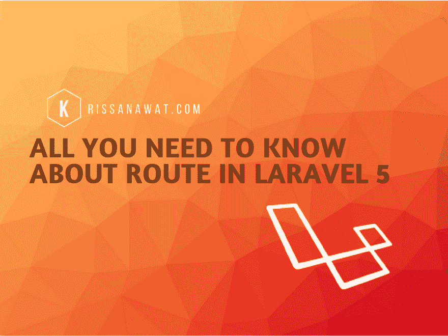
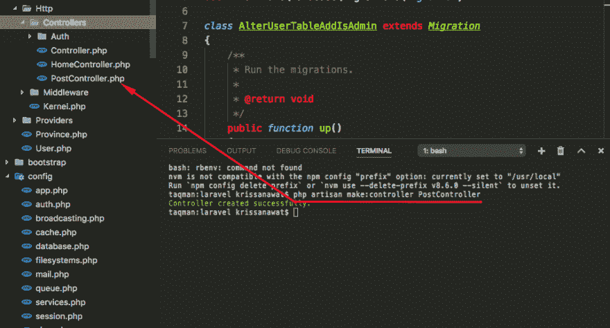
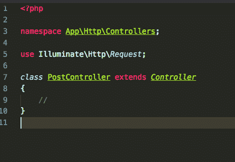
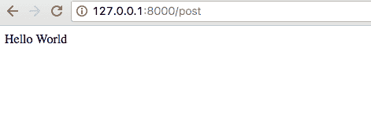
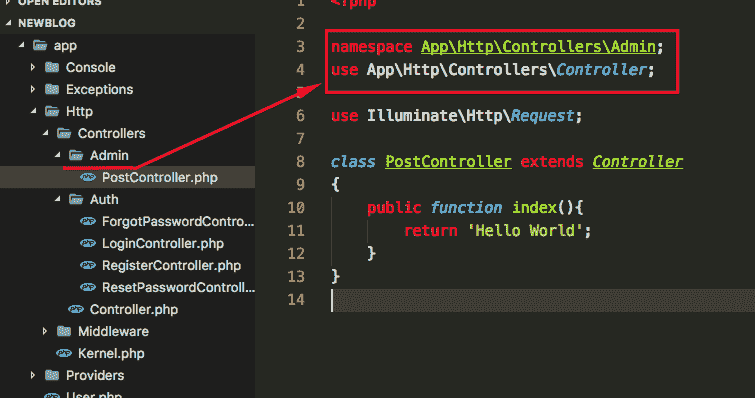

# 你所需要知道的关于拉弗尔 5 号公路的一切

> 原文:[https://dev . to/Kris/all-you-need-to-know-on-route-in-larave 15-d91](https://dev.to/kris/all-you-need-to-know-about-route-in-laravel5-d91)

[T2】](https://res.cloudinary.com/practicaldev/image/fetch/s--HZPj7LER--/c_limit%2Cf_auto%2Cfl_progressive%2Cq_auto%2Cw_880/https://cdn-images-1.medium.com/max/1024/0%2AEvImwRFRWs-JR-BX.png)

#### 路线解释

在 Laravel 中，提供处理多个路由类型我们有 *routes/web.php* 中的“web”路由和 *routes/api.php* 中的“API”路由以及 console.php 的 artisan 命令路由。Web 路由是那些将被用户访问的路由；API 路由是您的 API 的路由。在这篇文章中，我们将重点关注 *routes/web.php* 中的路线。

#### 基本路线定义

laravel 中的所有类都以静态方式声明，我们以键值格式传递参数；值可以在多个类型中使用，在示例中我们使用闭包样式

```
// routes/web.php 
Route::get('/', function () {       
        return 'Hello, World!';
}); 
```

<svg width="20px" height="20px" viewBox="0 0 24 24" class="highlight-action crayons-icon highlight-action--fullscreen-on"><title>Enter fullscreen mode</title></svg> <svg width="20px" height="20px" viewBox="0 0 24 24" class="highlight-action crayons-icon highlight-action--fullscreen-off"><title>Exit fullscreen mode</title></svg>

#### 什么是闭包？

闭包是匿名函数的对象表示。我们可以看到，上面代码中的匿名函数实际上返回了一个闭包对象，该对象被赋值给变量$string 并使用变量$ string 调用。你可以说闭包是一种使用匿名函数的面向对象的方式。

#### 为什么使用静态类

如果您有开发 PHP 的丰富经验，您可能会惊讶地看到 Route 类中的静态调用。这实际上不是一个静态方法，而是使用 Laravel 立面的服务位置

但是如果你不喜欢门面这种另类的方式

```
$router->get('/', function () {
    return 'Hello, World!';
 }); 
```

<svg width="20px" height="20px" viewBox="0 0 24 24" class="highlight-action crayons-icon highlight-action--fullscreen-on"><title>Enter fullscreen mode</title></svg> <svg width="20px" height="20px" viewBox="0 0 24 24" class="highlight-action crayons-icon highlight-action--fullscreen-off"><title>Exit fullscreen mode</title></svg>

#### 路线动词

您可能已经注意到，我们一直在使用 Route::get 我们的路由定义。这意味着当 HTTP 请求使用 GET 动作时，我们告诉 Laravel 只匹配这些路由。但是如果它是一个表单 POST，或者可能是一些发送 PUT 或 DELETE 请求的 JavaScript 呢？对于调用路由定义的方法，还有一些其他选项，

```
Route::get('/', function () { 
return 'Hello, World!'; 
});
Route::post('/', function () {});
Route::put('/', function () {});
Route::delete('/', function () {});
Route::any('/', function () {})
Route::match(['get', 'post'], '/', function () {}); 
```

<svg width="20px" height="20px" viewBox="0 0 24 24" class="highlight-action crayons-icon highlight-action--fullscreen-on"><title>Enter fullscreen mode</title></svg> <svg width="20px" height="20px" viewBox="0 0 24 24" class="highlight-action crayons-icon highlight-action--fullscreen-off"><title>Exit fullscreen mode</title></svg>

#### HTTP 方法

如果您不熟悉 HTTP 方法的概念，请继续阅读本文

#### 路线处理

闭包并不是解决路由动作的唯一方式，我们可以用这个例子
桥接控制器

```
Route::get('/user/list', 'UserController@list'); 
```

<svg width="20px" height="20px" viewBox="0 0 24 24" class="highlight-action crayons-icon highlight-action--fullscreen-on"><title>Enter fullscreen mode</title></svg> <svg width="20px" height="20px" viewBox="0 0 24 24" class="highlight-action crayons-icon highlight-action--fullscreen-off"><title>Exit fullscreen mode</title></svg>

这是告诉 Laravel 将请求传递到 App \ Http \ Controllers \ user controller 控制器的 list()方法的路径。该方法将被传递相同的参数，并以与闭包相同的方式处理。

#### 路线参数

如果路由在 URL 结构中有可变的参数段，那么在路由中定义它们并把它们传递给闭包就很简单了

```
Route::get('users/{id}/list', function ($id) { 
// 
}); 
```

<svg width="20px" height="20px" viewBox="0 0 24 24" class="highlight-action crayons-icon highlight-action--fullscreen-on"><title>Enter fullscreen mode</title></svg> <svg width="20px" height="20px" viewBox="0 0 24 24" class="highlight-action crayons-icon highlight-action--fullscreen-off"><title>Exit fullscreen mode</title></svg>

我们使用{id}接受参数，使用$id 将参数传递给闭包，但是如果我们没有传递参数，就会得到错误

我们还可以通过添加问号(？)在参数名后面，像这样

```
Route::get('users/{id?}/list', function ($id = 'fallbackId') { 
//
 }); 
```

<svg width="20px" height="20px" viewBox="0 0 24 24" class="highlight-action crayons-icon highlight-action--fullscreen-on"><title>Enter fullscreen mode</title></svg> <svg width="20px" height="20px" viewBox="0 0 24 24" class="highlight-action crayons-icon highlight-action--fullscreen-off"><title>Exit fullscreen mode</title></svg>

您可以使用正则表达式来定义一条路由应该只在参数满足特定要求时才匹配

```
Route::get('users/{id}', function ($id) { 
//
 })->where('id', '[0-9]+'); 
```

<svg width="20px" height="20px" viewBox="0 0 24 24" class="highlight-action crayons-icon highlight-action--fullscreen-on"><title>Enter fullscreen mode</title></svg> <svg width="20px" height="20px" viewBox="0 0 24 24" class="highlight-action crayons-icon highlight-action--fullscreen-off"><title>Exit fullscreen mode</title></svg>

如果您访问一个匹配路由字符串的路径，但是正则表达式与参数不匹配，它将不会被匹配，所以它将返回 404 Not Found 错误。

#### 路线名称

如果我们需要在其他地方使用路由，你可以通过 url 路径引用，并在 url()帮助器中输入参数，以简化视图中的链接，如下例所示。助手将在您的路由前加上您站点的完整域名。

```
<a href="<?php echo url('/'); ?>"> // outputs <a href="http://yoursite.com/"> 
```

<svg width="20px" height="20px" viewBox="0 0 24 24" class="highlight-action crayons-icon highlight-action--fullscreen-on"><title>Enter fullscreen mode</title></svg> <svg width="20px" height="20px" viewBox="0 0 24 24" class="highlight-action crayons-icon highlight-action--fullscreen-off"><title>Exit fullscreen mode</title></svg>

在以前的版本中，laravel 用别名方法给路由命名，但现在这个方法改为名称方法，但提供相同的功能，您可以调用路由而不使用完整路径，当改变 url 时，您不需要改变所有位置。

```
// in routes/web.php: 
Route::get('user/{id}', 'UsersController@show')->name('user.show');
// Link the route in a view with route() helper
 <a href="<?php echo route('user.show'); ?>"> 
```

<svg width="20px" height="20px" viewBox="0 0 24 24" class="highlight-action crayons-icon highlight-action--fullscreen-on"><title>Enter fullscreen mode</title></svg> <svg width="20px" height="20px" viewBox="0 0 24 24" class="highlight-action crayons-icon highlight-action--fullscreen-off"><title>Exit fullscreen mode</title></svg>

这个例子展示了一些新概念。首先，我们使用流畅的路由定义，通过链接 name()方法来添加名称。这种方法允许我们命名路由，使它成为动态使用的短别名，并可以在其他地方引用。

#### 将路线参数传递给助手

当您的路线有参数(例如，posts/{id})时，您需要在使用 route()助手生成路线链接时定义这些参数。

有几种不同的方法来传递这些参数。让我们设想一个定义为 posts/{ postId }/comments/{ comment id }的路由。如果用户 ID 是 3，评论 ID 是 7，那么让我们来看几个可用的选项:

**选项一:**

```
route('posts.comments.show', [3, 7]) 
// http://yoursite.com/posts/3/comments/7
route('posts.comments.show', ['postId' => 3, 'commentId' => 7]) 
// http://yoursite.com/posts/3/comments/7
// tips to pass query string
route('users.comments.show', ['postId' => 3, 'commentId' => 7, 'opt' => 'a']) 
// http://myapp.com/posts/1/comments/2?opt=a 
```

<svg width="20px" height="20px" viewBox="0 0 24 24" class="highlight-action crayons-icon highlight-action--fullscreen-on"><title>Enter fullscreen mode</title></svg> <svg width="20px" height="20px" viewBox="0 0 24 24" class="highlight-action crayons-icon highlight-action--fullscreen-off"><title>Exit fullscreen mode</title></svg>

#### 路线组

如果有路由共享某个身份验证、路径前缀或控制器名称空间。如果我们在每条路线上一次又一次地定义共享特征，不仅看起来是枯燥的任务，而且使你的应用程序没有条理。

但是路由组允许您将几个路由组合在一起，并一次性应用任何共享的配置设置，以减少这种重复。

该示例显示了如何使用路由组
对路由进行分组

```
Route::group([], function () {          
   Route::get('Hi', function () {            
      return 'taq';         
   });        
   Route::get('world', function () {         
         return 'World';
  });
}); 
```

<svg width="20px" height="20px" viewBox="0 0 24 24" class="highlight-action crayons-icon highlight-action--fullscreen-on"><title>Enter fullscreen mode</title></svg> <svg width="20px" height="20px" viewBox="0 0 24 24" class="highlight-action crayons-icon highlight-action--fullscreen-off"><title>Exit fullscreen mode</title></svg>

默认情况下，路由组实际上不做任何事情。此外，我们将把一些配置传递给第一个参数(如中间件、前缀、名称空间)

#### 路由组和中间件

中间件是我们希望在访客访问路由之前或之后进行的一些配置(例如，身份验证、检查),在这种情况下，我们应用中间件名称 auth 来检查访客访问。该组已对用户进行身份验证，如果您不进行身份验证，则无法访问仪表板或用户配置文件

```
Route::group(['middleware' => 'auth'], function () { 
     Route::get('dashboard', function () {
       return view('dashboard');     
     });      
     Route::get('profile', function () {   
       return view('profile');    
     }); 
}); 
```

<svg width="20px" height="20px" viewBox="0 0 24 24" class="highlight-action crayons-icon highlight-action--fullscreen-on"><title>Enter fullscreen mode</title></svg> <svg width="20px" height="20px" viewBox="0 0 24 24" class="highlight-action crayons-icon highlight-action--fullscreen-off"><title>Exit fullscreen mode</title></svg>

#### 路由组和路径前缀

如果你有一组共享一段路径的路由，例如，如果你的站点的管理区域以 admin 为前缀，你可以使用路由组来做这件事

```
Route::group(['prefix' => 'admin'], function () { 
        Route::get('/', function () {
           // Handles the path /admin 
         }); 
         Route::get('users', function () {
           // Handles the path /admin/users 
          }); 
}); 
```

<svg width="20px" height="20px" viewBox="0 0 24 24" class="highlight-action crayons-icon highlight-action--fullscreen-on"><title>Enter fullscreen mode</title></svg> <svg width="20px" height="20px" viewBox="0 0 24 24" class="highlight-action crayons-icon highlight-action--fullscreen-off"><title>Exit fullscreen mode</title></svg>

#### 路由组和命名空间前缀

如果你按路径前缀分组路由，它们的控制器有相似的 PHP 名称空间。在管理示例中，所有管理路由的控制器可能都在管理名称空间下。通过使用路由组名称空间前缀，如示例中所示，帮助我们避免长控制器引用

```
// not use route group
 Route::get('/report', 'Admin/ReportControllerB@index');      
 Route::get('/setting', 'Admin/SettingControllerB@index');
Route::group(['namespace' => 'Admin'], function () {

    Route::get('/report', 'ReportControllerB@index');      
    Route::get('/setting', 'SettingControllerB@index');
}); 
```

<svg width="20px" height="20px" viewBox="0 0 24 24" class="highlight-action crayons-icon highlight-action--fullscreen-on"><title>Enter fullscreen mode</title></svg> <svg width="20px" height="20px" viewBox="0 0 24 24" class="highlight-action crayons-icon highlight-action--fullscreen-off"><title>Exit fullscreen mode</title></svg>

#### 姓名前缀

您也可以用“as”示例
为 name()函数设置前缀

```
Route::group(['as' => 'posts.', 'prefix' => 'posts'], function () {     
  Route::group(['as' => 'comments.', 'prefix' => 'comments'], function () {     
  // you can use by in helper like route('posts.comments.list')               
  Route::get('{id}', function () { // })->name('list'); });
 }); 
```

<svg width="20px" height="20px" viewBox="0 0 24 24" class="highlight-action crayons-icon highlight-action--fullscreen-on"><title>Enter fullscreen mode</title></svg> <svg width="20px" height="20px" viewBox="0 0 24 24" class="highlight-action crayons-icon highlight-action--fullscreen-off"><title>Exit fullscreen mode</title></svg>

#### 路线和视图

您可以通过三种不同的方式直接在控制器中渲染视图。现在，您只需关注 view()，它是一个助手函数。

第一种方式使用闭包

```
Route::get('/', function () { 
return view('home'); 
}); 
```

<svg width="20px" height="20px" viewBox="0 0 24 24" class="highlight-action crayons-icon highlight-action--fullscreen-on"><title>Enter fullscreen mode</title></svg> <svg width="20px" height="20px" viewBox="0 0 24 24" class="highlight-action crayons-icon highlight-action--fullscreen-off"><title>Exit fullscreen mode</title></svg>

这个闭包加载*resources/views/home . blade . PHP*

第二通道参数

```
Route::get('users', function () {     
    return view('users.index')->with('users', User::all());
}); 
```

<svg width="20px" height="20px" viewBox="0 0 24 24" class="highlight-action crayons-icon highlight-action--fullscreen-on"><title>Enter fullscreen mode</title></svg> <svg width="20px" height="20px" viewBox="0 0 24 24" class="highlight-action crayons-icon highlight-action--fullscreen-off"><title>Exit fullscreen mode</title></svg>

这个闭包加载*resources/views/users/index . blade . PHP*并传递给它一个名为 tasks 的变量，该变量包含 User::all()方法的结果。

第三种方式使用视图组合器与每个视图共享变量有时一遍又一遍地传递相同的变量会成为重复。您可能希望站点中的每个视图都可以访问某个变量。

```
view()->share('user','somevalue'); 
```

<svg width="20px" height="20px" viewBox="0 0 24 24" class="highlight-action crayons-icon highlight-action--fullscreen-on"><title>Enter fullscreen mode</title></svg> <svg width="20px" height="20px" viewBox="0 0 24 24" class="highlight-action crayons-icon highlight-action--fullscreen-off"><title>Exit fullscreen mode</title></svg>

#### 路线和控制器

路由是控制器和视图之间的入口，在这一节中我们将讨论控制器使用路由的方法

因此，让我们创建一个控制器。我们使用 Artisan 命令来生成控制器模板

```
php artisan make:controller PostController 
```

<svg width="20px" height="20px" viewBox="0 0 24 24" class="highlight-action crayons-icon highlight-action--fullscreen-on"><title>Enter fullscreen mode</title></svg> <svg width="20px" height="20px" viewBox="0 0 24 24" class="highlight-action crayons-icon highlight-action--fullscreen-off"><title>Exit fullscreen mode</title></svg>

现在文件后控制器出现在/HTTP/Controllers 中

[T2】](https://res.cloudinary.com/practicaldev/image/fetch/s--NFxOmYus--/c_limit%2Cf_auto%2Cfl_progressive%2Cq_auto%2Cw_880/https://cdn-images-1.medium.com/max/958/1%2AUvu0BPVMStMDRQGa85Eu7w.png)

在这个文件中

[T2】](https://res.cloudinary.com/practicaldev/image/fetch/s--5wx31MeR--/c_limit%2Cf_auto%2Cfl_progressive%2Cq_auto%2Cw_880/https://cdn-images-1.medium.com/max/470/1%2AzP1JpTnNcj9kfxwlOhqQ_w.png)

如图所示修改该文件，创建一个名为 index 的新公共方法。我们将在那里返回一些文本。

示例 3–20。简单控制器示例

```
<?php
use App\Http\Controllers\Controller;
class PostController extends Controller {    
     public function index() {
      return 'Hello, World!';   
     }
 } 
```

<svg width="20px" height="20px" viewBox="0 0 24 24" class="highlight-action crayons-icon highlight-action--fullscreen-on"><title>Enter fullscreen mode</title></svg> <svg width="20px" height="20px" viewBox="0 0 24 24" class="highlight-action crayons-icon highlight-action--fullscreen-off"><title>Exit fullscreen mode</title></svg>

接下来创建路线

```
// routes/web.php 
Route::get('/post', 'PostController@index'); 
```

<svg width="20px" height="20px" viewBox="0 0 24 24" class="highlight-action crayons-icon highlight-action--fullscreen-on"><title>Enter fullscreen mode</title></svg> <svg width="20px" height="20px" viewBox="0 0 24 24" class="highlight-action crayons-icon highlight-action--fullscreen-off"><title>Exit fullscreen mode</title></svg>

就是这样。访问/路线，你会看到“你好，世界！”

[T2】](https://res.cloudinary.com/practicaldev/image/fetch/s--FICVKJ6z--/c_limit%2Cf_auto%2Cfl_progressive%2Cq_auto%2Cw_880/https://cdn-images-1.medium.com/max/471/1%2AslVQtHW4PlIu4n3GumUU4Q.png)

#### 控制器命名空间

如果我们需要将相关控制器分组并保存在某个文件夹中。我们需要知道，当我们有两个同名的类并保存在不同的文件夹中时，使用命名空间概念是为了防止类名冲突

我们需要在控制器后添加 admin 来更新名称空间，并再次包含控制器类

[T2】](https://res.cloudinary.com/practicaldev/image/fetch/s--tZaiatBH--/c_limit%2Cf_auto%2Cfl_progressive%2Cq_auto%2Cw_880/https://cdn-images-1.medium.com/max/755/1%2AwzS1f3UC9bvQZlLxOblopw.png)

和更新路线添加管理

[T2】](https://res.cloudinary.com/practicaldev/image/fetch/s--dKVQKIEb--/c_limit%2Cf_auto%2Cfl_progressive%2Cq_auto%2Cw_880/https://cdn-images-1.medium.com/max/549/1%2AYEa48bCJI1V7gIi7wzXj9A.png)

尝试刷新

[T2】](https://res.cloudinary.com/practicaldev/image/fetch/s--cYFgKqsY--/c_limit%2Cf_auto%2Cfl_progressive%2Cq_auto%2Cw_880/https://cdn-images-1.medium.com/max/435/1%2AdwlWXuzK-r5m-Puv9qEC8A.png)

#### 用发布路线获取输入

在控制器方法中执行的第二个最常见的操作是从用户那里获取输入并对其进行操作。我们有负责这次行动的路线哨所

```
// routes/web.php 
Route::post('post', 'PostController@store'); 
```

<svg width="20px" height="20px" viewBox="0 0 24 24" class="highlight-action crayons-icon highlight-action--fullscreen-on"><title>Enter fullscreen mode</title></svg> <svg width="20px" height="20px" viewBox="0 0 24 24" class="highlight-action crayons-icon highlight-action--fullscreen-off"><title>Exit fullscreen mode</title></svg>

现在我们将 post url 桥接到存储方法

```
// PostController.php
 public function store(Request $request) {
      $task = new App\Post; 
      $task->title = $request->get('title'); 
      $task->body = $request->get('body'); 
      $task->save();
      return redirect('post.index'); 
} 
```

<svg width="20px" height="20px" viewBox="0 0 24 24" class="highlight-action crayons-icon highlight-action--fullscreen-on"><title>Enter fullscreen mode</title></svg> <svg width="20px" height="20px" viewBox="0 0 24 24" class="highlight-action crayons-icon highlight-action--fullscreen-off"><title>Exit fullscreen mode</title></svg>

这个例子使用了 Post 模型和 redirect()帮助器，我们将在后面详细讨论它们，但是您可以看到我们在这里做了什么:我们创建了一个新的 Post，

#### 资源控制器

很多时候，命名控制器中的方法是编写控制器最困难的部分。但是，Laravel 对称为“资源控制器”的传统 REST 控制器的所有路由都有一些约定。此外，它附带了一个开箱即用的生成器和一个方便的路由定义，允许您一次性绑定整个资源控制器。

要查看 Laravel 期望资源控制器使用的方法，让我们从命令行生成一个新的控制器:

```
php artisan make:controller PostController --resource 
```

<svg width="20px" height="20px" viewBox="0 0 24 24" class="highlight-action crayons-icon highlight-action--fullscreen-on"><title>Enter fullscreen mode</title></svg> <svg width="20px" height="20px" viewBox="0 0 24 24" class="highlight-action crayons-icon highlight-action--fullscreen-off"><title>Exit fullscreen mode</title></svg>

现在打开*app/Http/Controllers/post controller . PHP*。你会看到它来了。

```
<?php

namespace App\Http\Controllers;

use Illuminate\Http\Request;

class PostController extends Controller
{
    /**
     * Display a listing of the resource.
     *
     * @return \Illuminate\Http\Response
     */
    public function index()
    {
        //
    }

    /**
     * Show the form for creating a new resource.
     *
     * @return \Illuminate\Http\Response
     */
    public function create()
    {
        //
    }

    /**
     * Store a newly created resource in storage.
     *
     * @param \Illuminate\Http\Request $request
     * @return \Illuminate\Http\Response
     */
    public function store(Request $request)
    {
        //
    }

    /**
     * Display the specified resource.
     *
     * @param int $id
     * @return \Illuminate\Http\Response
     */
    public function show($id)
    {
        //
    }

    /**
     * Show the form for editing the specified resource.
     *
     * @param int $id
     * @return \Illuminate\Http\Response
     */
    public function edit($id)
    {
        //
    }

    /**
     * Update the specified resource in storage.
     *
     * @param \Illuminate\Http\Request $request
     * @param int $id
     * @return \Illuminate\Http\Response
     */
    public function update(Request $request, $id)
    {
        //
    }

    /**
     * Remove the specified resource from storage.
     *
     * @param int $id
     * @return \Illuminate\Http\Response
     */
    public function destroy($id)
    {
        //
    }
} 
```

<svg width="20px" height="20px" viewBox="0 0 24 24" class="highlight-action crayons-icon highlight-action--fullscreen-on"><title>Enter fullscreen mode</title></svg> <svg width="20px" height="20px" viewBox="0 0 24 24" class="highlight-action crayons-icon highlight-action--fullscreen-off"><title>Exit fullscreen mode</title></svg>

现在我们可以将 post 控制器中的所有方法绑定到一个路径

```
Route::resource('post','PostController'); 
```

<svg width="20px" height="20px" viewBox="0 0 24 24" class="highlight-action crayons-icon highlight-action--fullscreen-on"><title>Enter fullscreen mode</title></svg> <svg width="20px" height="20px" viewBox="0 0 24 24" class="highlight-action crayons-icon highlight-action--fullscreen-off"><title>Exit fullscreen mode</title></svg>

如果您发现自己处于不知道有哪些可用的资源路径的情况，运行 php artisan route:list，您将获得所有可用路径的列表

[T2】](https://res.cloudinary.com/practicaldev/image/fetch/s--zNHmvgo9--/c_limit%2Cf_auto%2Cfl_progressive%2Cq_auto%2Cw_880/https://cdn-images-1.medium.com/max/888/1%2AjJAh_oWC-TaU4C1_afDlVA.png)

现在我们有多条路线来处理多种情况

#### 路由模型绑定

最常见的路由模式之一是，任何控制器方法的第一行都试图找到具有给定 ID 的资源，如示例
所示

```
Route::get('user/{id}', function ($id) {    
 $user = App\User::findOrFail($id); 
}); 
```

<svg width="20px" height="20px" viewBox="0 0 24 24" class="highlight-action crayons-icon highlight-action--fullscreen-on"><title>Enter fullscreen mode</title></svg> <svg width="20px" height="20px" viewBox="0 0 24 24" class="highlight-action crayons-icon highlight-action--fullscreen-off"><title>Exit fullscreen mode</title></svg>

Laravel 提供了一个简化这种模式的特性，称为“路由模型绑定”这允许您定义特定的参数名称(例如，{id})将向路径解析器指示它应该查找具有该 id 的雄辩记录，然后将其作为参数*传递，而不是仅传递 ID 的*。有两种类型模型绑定:隐式和自定义。

#### 隐式路由模型绑定

使用路由模型绑定的最简单的方法是将路由参数命名为该模型独有的名称(例如，将其命名为$user 而不是$id)，然后在闭包或控制器方法中键入该参数的提示，并在那里使用相同的变量名。展示比描述容易，所以看一下例子

```
Route::get('users/{user}', function (User $user) {
 return view('user.show')->with('user', $user);
 }); 
```

<svg width="20px" height="20px" viewBox="0 0 24 24" class="highlight-action crayons-icon highlight-action--fullscreen-on"><title>Enter fullscreen mode</title></svg> <svg width="20px" height="20px" viewBox="0 0 24 24" class="highlight-action crayons-icon highlight-action--fullscreen-off"><title>Exit fullscreen mode</title></svg>

每次访问这个路由时，应用程序都会假设传递给{user}的是一个应该用来查找用户的 ID，然后将得到的模型实例传递给第二个函数

#### 自定义路由模型绑定

要手动配置路由模型绑定，请将下面的示例复制到 App \ Providers \ RouteServiceProvider 中的 boot()方法。

```
public function boot(Router $router) { 
// run parent's boot() method  
parent::boot($router);
// init the binding 
$router->model('user', User::class); 
} 
```

<svg width="20px" height="20px" viewBox="0 0 24 24" class="highlight-action crayons-icon highlight-action--fullscreen-on"><title>Enter fullscreen mode</title></svg> <svg width="20px" height="20px" viewBox="0 0 24 24" class="highlight-action crayons-icon highlight-action--fullscreen-off"><title>Exit fullscreen mode</title></svg>

现在，您已经定义了每当路由定义中有一个名为{user}的参数时，路由解析器将返回一个带有该 URL 参数 ID 的 user 类实例。

#### 结论

Laravel 的 routes 提供了处理应用程序访问中每个时刻的方法，就像我们应用程序的大门一样，它提供了许多开箱即用的功能，如模型绑定、资源路由

在这篇文章中，涵盖了 route 的所有基本主题，希望你喜欢的不仅仅是文档

*原载于*[*krisanawat 博客*](http://krissanawat.com/2017/11/06/need-know-route-laravel-5/) *。*

* * *