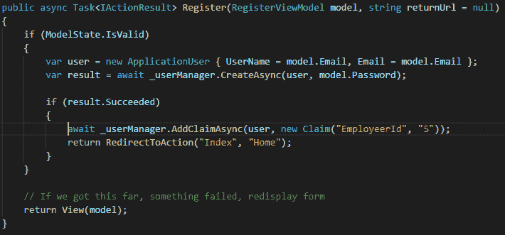

# 认证、授权和声明。在 ASP.NET 核心你需要知道的

> 原文:[https://dev . to/Rick ab 10/authenticate-authorization-and claim-all-you-need-to-know-in-aspnet-core-Ahn](https://dev.to/rickab10/authenticate-authorization-and-claim-all-you-need-to-know-in-aspnet-core-ahn)

当我们谈论身份验证和授权时，您的脑海中会出现一片混乱。

我们首先要知道的是:

*   认证是一个知道你是谁的过程。
*   授权就是知道自己能不能做自己想做的事情的过程。

现在更容易了。我将展示一个例子。

当你访问一个网站时，需要输入登录名和密码，这意味着你需要通过身份验证才能知道你是谁。

您访问站点，当您试图访问某个部分(如报告或管理模块)时，站点会提醒您缺少权限，这一过程称为授权。也就是说，你有身份验证，但没有授权。

构建一个兼顾身份验证和授权应用程序是非常困难的。但是对于那些和 ASP.NET 核心一起工作的人，建议使用一种叫做身份的东西。

身份是 ASP.NET 核心的一项功能，它简化了创建用户帐户、验证和用户权限(授权)的过程。

将身份与实体框架一起使用变得更漂亮，因为身份将使用实体框架的智慧来访问数据库。

但是，索赔从哪里开始呢？

保持冷静，我要解释。

总之，索赔是一个属性。一个人有很多说法，下面我解释一下比较好。

所有的人都有许多属性。一个人有名字、体重、身高、出生日期等等。这是索赔集。

每个声明都有一个发布者，即发布声明的人。当我说一个人有体重和身高的时候，他自己就是发行人。但是当我谈论一个人的社会号码时，发布者是联邦政府。

再比如。当你与脸书进行整合并获得个人数据时，发布者是脸书。你现在明白什么是索赔和发行人了吗？

如果我使用标识，如何使用声明呢？

当应用程序使用 Identity 对用户进行身份验证时，如下面的代码所示，该身份验证会创建一个“ClaimsPrincipal”类型的对象。

[T2】](https://res.cloudinary.com/practicaldev/image/fetch/s--0CdEbV1I--/c_limit%2Cf_auto%2Cfl_progressive%2Cq_auto%2Cw_880/http://www.stephanybatista.com/wp-content/uploads/2017/10/claim-img1.png)

对于那些不知道身份的人来说,“SigninManager”类用于使用用户名和密码对用户进行身份验证。但是请注意，我不需要访问数据库来查看用户是否存在，实体身份框架为我做了这些。

好了，从现在开始，任何控制器都有一个名为“User”的属性，类型为“ClaimsPrincipal”。例如，当在调试模式下使用时，我会验证用户的所有声明。

[T2】](https://res.cloudinary.com/practicaldev/image/fetch/s--_mi6X-wS--/c_limit%2Cf_auto%2Cfl_progressive%2Cq_auto%2Cw_880/http://www.stephanybatista.com/wp-content/uploads/2017/10/claim-img2.png)

如果你愿意，你可以添加其他人的要求。上面我通过对象“UserManager”添加了一个名为“Employeer”的声明。

[T2】](https://res.cloudinary.com/practicaldev/image/fetch/s--oQJiUg9v--/c_limit%2Cf_auto%2Cfl_progressive%2Cq_auto%2Cw_880/http://www.stephanybatista.com/wp-content/uploads/2017/10/claim-img3.png)

注意，在创建用户之后，通过方法“CreateAsync ”,我使用相同的对象为用户添加声明。

在这个示例中，我为插入的用户提供了这个属性，因此应用程序可以验证只有具有这个属性的用户才能访问系统的一部分。你还记得我说过授权吗？让我们现在做。

为了创建这种授权，我们必须在用 C#创建策略之前。在启动类的方法“ConfigureServices”中，我插入了一个策略。

[T2】](https://res.cloudinary.com/practicaldev/image/fetch/s--NBELK12n--/c_limit%2Cf_auto%2Cfl_progressive%2Cq_auto%2Cw_880/http://www.stephanybatista.com/wp-content/uploads/2017/10/claim-img4.png)

注意，我创建了一个名为“OnlyEmployees”的策略，为了满足这个要求，用户必须拥有这个属性。

创建了策略，现在应用程序可以在控制器中处理授权。在下面的代码中，我使用了一个名为“ManageController”的控制器，只有符合策略的人才能访问，否则，用户将被重定向到其他页面，访问被拒绝。

[T2】](https://res.cloudinary.com/practicaldev/image/fetch/s--Yay67c0v--/c_limit%2Cf_auto%2Cfl_progressive%2Cq_auto%2Cw_880/http://www.stephanybatista.com/wp-content/uploads/2017/10/claim-img5.png)

如您所见，属性和发布者的逻辑有助于在我们的应用程序中管理用户。

**结论**

身份便于开发需要用户帐户和授权的应用程序。但在此之前，我们必须了解一些基本概念，如身份验证、授权和声明。

你喜欢这篇文章吗？你会更了解。网芯？我在 Udemy 创建了一个价格便宜的课程。访问[https://www . udemy . com/aspnet-core-20-learn-concepts-and-creating-a-web-app](https://www.udemy.com/aspnet-core-20-learn-concepts-and-creating-an-web-app)