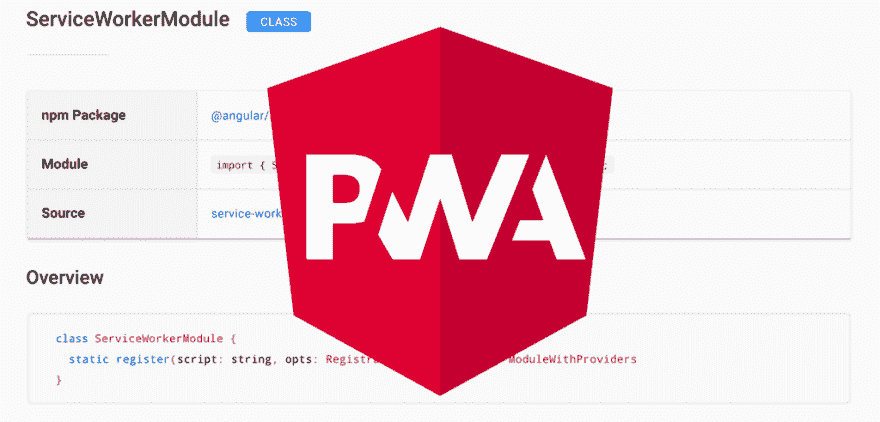

# 一个新的角度服务工作者——创建自动渐进式 web 应用程序。第 2 部分:实践

> 原文:[https://dev . to/web maxru/a-new-angular-service-worker-creating-automatic-progressive-web-apps-part-2-practice-365 o](https://dev.to/webmaxru/a-new-angular-service-worker-creating-automatic-progressive-web-apps-part-2-practice-365o)

[T2】](https://res.cloudinary.com/practicaldev/image/fetch/s--nE4Xnjbf--/c_limit%2Cf_auto%2Cfl_progressive%2Cq_auto%2Cw_880/https://cdn-images-1.medium.com/max/1024/1%2AeSADmhmxHcd4sr-TpZRZNw.png)

> 公告:[我将于 11 月 7 日星期二在伦敦 AngularConnect 会议上介绍 Angular 服务人员](https://www.angularconnect.com/2017/sessions/#s-662)。如果你想在现场视频流中跟随我，请在你的日历上标记:格林威治时间上午 11:20(紧接主题演讲之后)，主舞台。

距离本文第一部分发表还有一段时间，这种停顿是有意的——自最初出现以来，该功能只在几个候选版本之后才准备好投入实际使用。现在 Angular 5 发布了，Angular Service Worker(以下简称 NGSW)已经准备好接受探索了。

我们将再次使用我们的**p water**——微型 Twitter 客户端。源代码在 GitHub (分支 ngsw)上可以找到[。此外，我们需要一个简单的后端来提供 tweet feed 和处理推送通知。源代码和详细的设置说明也可以在 GitHub](https://github.com/webmaxru/pwatter) 的[上找到。](https://github.com/webmaxru/pwa-workshop-api)

因为这是一种实用的方法，所以让我们为 PWA 定义一些要求:

*   离线和在线模式下立即启动:我们需要一个**应用程序外壳**来实现这一点。
*   我们有一些**外部文件**(带有材质图标的网络字体)作为应用程序外壳的一部分。我们所说的“外部”是指这些资源不是我们的 dist 文件夹的一部分。
*   API 调用的优化网络(**运行时缓存**):我们可以在离线期间提供一些早期访问的数据，也可以通过提供这些缓存数据而不是网络往返来加速在线模式。
*   **推送通知**:订阅通知并显示。客户端应用程序必须提供启动订阅流的功能，并将订阅对象传递到后端(我们总是将订阅存储在后端)。另外，我们的后端会在每次有人发关于“javascript”的推文时生成一条推送消息，所以 Angular Service Worker 应该会得到这个事件并显示一条消息。让我们也添加一些额外的功能。首先，让我们给用户取消订阅 web 推送通知的可能性。其次，让我们演示一下，除了将通知显示为通知弹出窗口之外，我们还可以将通知传播到客户端应用程序。
*   应用程序外壳应该有规则的 PWAs“stale-while-re validate”**更新流程**:如果可能的话，我们总是提供最新的缓存版本(几乎立即显示给*)。同时，服务人员检查是否有更新版本的应用程序外壳。如果是，我们下载并缓存这个版本，以便在下一次应用程序运行时使用。此外，我们可能希望询问用户是否希望立即用应用程序重新加载当前选项卡。*

 *让我们一点一点来，但首先，我们必须做一些关于角 CLI 状态的笔记。

### Angular 服务人员的 Angular CLI 支持(即将推出)

目前，我们发布了 Angular CLI 1.5。不幸的是，目前还没有 NGSW 支持，计划在 1.6 中推出。但是通过探索相应的拉请求([到 CLI](https://github.com/angular/angular-cli/pull/8080) 和[到 DevKit](https://github.com/angular/devkit/pull/235) )，我们可以很容易地理解它将如何呈现和再现主要功能。让我们看看最近的未来。

#### 服务人员的新应用

该命令将如下所示:

ng 新 myApp - service-worker(或使用别名— -sw)

有了这个服务工作者标志，Angular CLI 1.6 将为我们实现一些自动化:

1.  将安装角度服务人员包
2.  将启用对 NGSW 的构建支持
3.  NGSW 将为您的申请注册
4.  将使用一些智能默认值创建 NGSW 配置文件

无论如何，即使在 CLI 1.6 发布之后，知道如何重现这些步骤也是很好的，因为我们必须手动执行它们来为现有的应用程序添加 NGSW 支持。我们去给 PWAtter 添加 Angular Service Worker 吧。

#### 向现有 app 添加 Angular 服务人员

让我们从上面手动执行同样的 4 个步骤:

1.  **安装 NGSW**

npm 安装@ angular/服务-工人-保存

**2。启用构建支持(仅适用于 Angular CLI 1.6，请参见下面的通知)**

ng set apps.0.serviceWorker=true

或者在中手动添加/编辑该参数。angular-cli.json 文件。

> 重要！目前，当我们使用 Angular CLI 1.5 时，请确保您的**中没有**这个属性。angular-cli.json，会导致构建错误。请参阅下面的如何在 Angular CLI 1.5 中模拟此步骤。

**3。在您的 AppModule 中注册 NGSW** 。这是它在 Angular CLI 1.6 中的外观:*