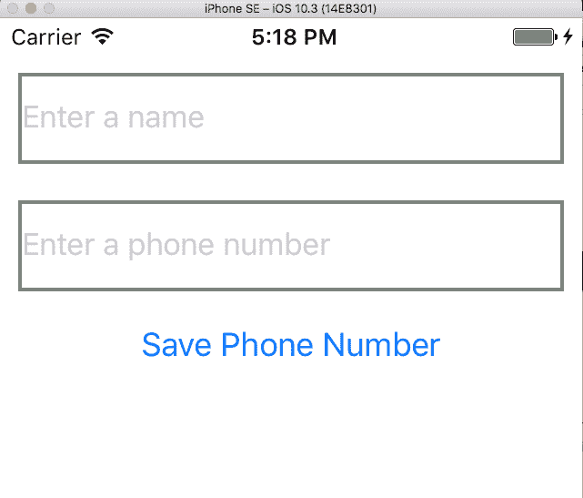
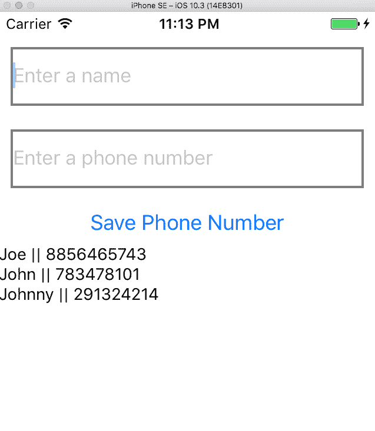

# 将 Meteor 后端连接到 React 本地应用程序

> 原文:[https://dev . to/damcosset/connecting-a-meteor-back-end-to-a-react-native-application-DBM](https://dev.to/damcosset/connecting-a-meteor-back-end-to-a-react-native-application-dbm)

## 简介

在过去的几周里，我对 React native 非常感兴趣。我不断看到越来越多像这样的文章 [one](https://dev.to/bitario/the-beauty-of-react-native-920) ，所以我决定更深入地研究 React Native 并真正使用它。

Meteor 是我在工作中使用的框架，我现在对它有了一些经验。我考虑将 React 本地应用程序与 Meteor 后端连接起来。这篇文章将告诉你如何开始。

### 创建流星 app

首先，我们将创建一个 Meteor 应用程序。

`meteor create serverMeteor`

目前，这就是我们所需要的。我们会回来的。

### 创建我们的 React 本地应用

我将使用非常有用的 *create-react-native-app* 工具。你可以得到更多的信息，查看这个[链接](https://facebook.github.io/react-native/docs/getting-started.html)。还会讲解如何使用世博客户端 app 看自己的作品，非常有用！

因此，我们运行这样的命令:

`create-react-native-app reactFront`

现在，您将有两个文件夹。一个名为*的 meteorServer* ，包含你的 Meteor 应用程序，另一个名为*的 reactFront* ，在那里你将找到你的 react-native 应用程序。

#### React-Native:创建简单的电话簿

为了简洁起见，我们将创建一些简单的东西。用户将拥有一个有两个输入的表单。第一个将接受一个名字，第二个将接受一个电话号码。

修改后，App.js 看起来是这样的:

```
import React from 'react';
import { StyleSheet, Text, View, TextInput, Button } from 'react-native';

export default class App extends React.Component {
  constructor(){
    super()
    this.state = {
      name: '',
      number: ''
    }
  }

  addPhoneNumber = () => {
    console.log(this.state)
    this.setState({
      number: '',
      name: ''
    })
  }

  render() {
    return (
      <View style={styles.container}>
        <TextInput
          style={styles.input}
          placeholder='Enter a name'
          onChangeText={name => this.setState( {name} )}
          value={this.state.name}/>
        <TextInput
          style={styles.input}
          keyboardType='numeric'
          placeholder='Enter a phone number'
          onChangeText={number => this.setState( {number} )}
          value={this.state.number}/> 
        <Button
          onPress={this.addPhoneNumber}
          title='Save Phone Number'/>
      </View>
    );
  }
}

const styles = StyleSheet.create({
  container: {
    flex: 1,
    backgroundColor: '#fff',
    marginTop: 20
  },
  input: {
    borderWidth: 2,
    borderColor: 'gray',
    height: 50,
    margin: 10
  }
}); 
```

我添加了两个 *TextInput* 元素和一个*按钮*元素。我还为输入添加了一些样式。在 React Native 中，我们使用 *StyleSheet.create({})* 来控制样式。或者您可以像 React 一样使用内联对象来设计样式。

在我的 iOS 模拟器上，它看起来像这样:

[T2】](https://res.cloudinary.com/practicaldev/image/fetch/s--4tT7y16p--/c_limit%2Cf_auto%2Cfl_progressive%2Cq_auto%2Cw_880/https://thepracticaldev.s3.amazonaws.com/i/zvsqd6isugemula837ko.png)

好的，现在，当我们点击按钮时。什么都没发生。它在控制台中记录这些值并重置它们。让我们转到后端。

#### 流星:准备方法和出版物

转到您的 Meteor 应用程序所在的文件夹。我的名字叫做*服务器流星*。

让我们创建一个 */imports* 文件夹，在这个 */imports* 里面，我们将添加一个 */api* 文件夹。只是为了遵循适当的流星惯例。

计划如下:我们将创建一个 Meteor 方法，当我们点击*保存电话号码*按钮时，React 本地应用程序将调用该方法。这个方法将把名字和号码保存到 Meteor mongo 数据库中。

然后，我们将创建一个我们的 React 本机应用程序将订阅的发布。它将简单地返回我们拥有的所有条目。我们走吧！

在 */imports/api/* 中，让我们创建一个 PhoneNumbers.js 文件来保存我们的*小型*后端逻辑。

```
export const PhoneNumbers = new Mongo.Collection( 'phoneNumbers' )

Meteor.methods({
  addPhoneNumber( data ){
    PhoneNumbers.insert({
      name: data.name,
      number: data.number
    }, err => {
      if (err){
        return err
      } else {
        return null
      }
    })
  }
})

Meteor.publish( 'getAllNumbers', () => {
  return PhoneNumbers.find({})
}) 
```

这里没什么特别的。我们创建了我们的集合，我们的方法 *addPhoneNumber* 和我们的出版物 *getAllNumbers* 。这就是流星。让我们让这两个应用程序相互对话。

#### 反应原生:添加反应原生-流星

返回 React 本地文件夹。我们将使用 *react-native-meteor* 包来连接两个应用程序。

`npm install --save react-native-meteor`

以下是我们需要做出的改变:

*   当我们点击按钮时，调用 *addPhoneNumber* 方法。
*   订阅我们的 *getAllNumbers* 出版物
*   在列表中显示数字
*   确保我们的 React 本机应用程序知道我们的 Meteor 应用程序。

让我们从方法调用开始。如果你以前用过 Meteor/React，这看起来会很熟悉:

```
// In our App component
addPhoneNumber = () => {
    const data = {
      number: this.state.number,
      name: this.state.name
    }

    Meteor.call('addPhoneNumber', data, err => {
      if( err ){
        console.log( err )
      } else {
        this.setState({
          number: '',
          name: ''
        })
      }
    })
  } 
```

接下来，让我们订阅我们的出版物。为此，我们将在 react-native-meteor 提供的 *createContainer* 中包装我们的应用程序组件。让我们将它导入到文件的顶部:

`import Meteor, {Â createContainer } from 'react-native-meteor'`

很好，现在我们将**而不是**导出我们的应用程序组件，而是 createContainer 包装器。像这样:

```
// The App Component will be defined above like so:
// class App extends React.Component{ ... } 

export default createContainer( () => {
  Meteor.subscribe('getAllNumbers')
  return {
    phoneNumbers: Meteor.collection('phoneNumbers').find({})
  }
}, App) // Need to specify which component we are wrapping 
```

好了，完成了。所以我们会得到一个很好的数组中的电话号码。我们将在列表中显示它们。没什么特别的，我们将使用 *FlatList* 组件。不要忘记从 react-native 导入 *FlatList* 。我们的渲染函数将看起来像这样:

```
// Still in the App component my friend
  render() {
    return (
      <View style={styles.container}>
        <TextInput
          style={styles.input}
          placeholder='Enter a name'
          onChangeText={name => this.setState( {name} )}
          value={this.state.name}/>
        <TextInput
          style={styles.input}
          keyboardType='numeric'
          placeholder='Enter a phone number'
          onChangeText={number => this.setState( {number} )}
          value={this.state.number}/> 
        <Button
          onPress={this.addPhoneNumber}
          title='Save Phone Number'/>

        <FlatList
          data={this.props.phoneNumbers}
          keyExtractor={(item, index) => item._id}
          renderItem={({item}) => (
            <View>
              <Text>{item.name} || {item.number}</Text>
            </View>
          )} />
      </View>
    );
  } 
```

*FlatList* 获取数据数组，并在 renderItem 函数中遍历该数组。我只是显示姓名和电话号码。 *keyExtractor* 用于为列表中呈现的每个元素创建密钥，就像 React 在 web 中的需求一样。每个键都将是从 MongoDB 返回的 ObjectID。

最后，让我们确保我们的 React 本地应用程序知道从哪里获得这些信息:

```
//I have only one component anyway...
  componentWillMount(){
    Meteor.connect('ws://localhost:3000/websocket')
  } 
```

我们使用 react-native-meteor 中的*连接*方法。

**注意:**因为我这里只使用 iOS 模拟器，所以可以使用 *localhost* 。如果你使用 android 模拟器，你将需要使用你的机器的 IP 地址(例如 192.168.xx.xx:3000/websocket)。

点击*保存电话号码*按钮将填充我们的 Meteor 应用程序中的数据库。我们订阅的出版物将检索信息并显示出来！

最后一张图展示了它在我的 iOS 模拟器上的样子:

[T2】](https://res.cloudinary.com/practicaldev/image/fetch/s--DiGRqGdq--/c_limit%2Cf_auto%2Cfl_progressive%2Cq_auto%2Cw_880/https://thepracticaldev.s3.amazonaws.com/i/6gta0skpf354tgeu1np3.png)

好了，你知道了。现在，您可以毫无问题地将 React 本机应用程序连接到 Meteor 应用程序。玩得开心！

**警告:**似乎将 npm5 与 create-react-native-app 一起使用是有 bug 的，不能正常工作。你应该使用 npm4 或者 yarn 来确保你现在不会遇到任何问题。