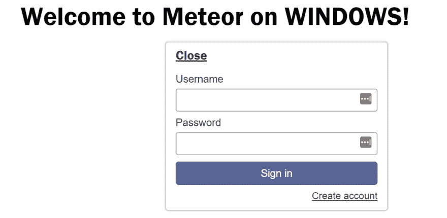

# 2017 年流星在 Windows 上的地位

> 原文:[https://dev . to/sammyisa/the-status-of-meteor-on-windows-in-11-2017-79j](https://dev.to/sammyisa/the-status-of-meteor-on-windows-in-november-2017-79j)

## 前提和失宠☄️

如果你不关心背景故事，跳到“然后我们就在这里了”。

如果你不了解[流星](https://www.meteor.com/)，建议你去看看他们网站上的官方俯仰。这篇文章更多的是关于它在今天的 Windows 上的状态。

对我来说，Meteor 是我真正进入 web 开发的原因。2015 年，在导师的推荐下，我在 Spiceworks 的暑期实习中大量使用了它。一个易于使用的全栈 Javascript 框架，模糊了前端和后端之间的界限？我恋爱了！

当然，它在 Windows 上有一些性能问题，但没什么大不了。那时，我真的不需要关心部署，因为我们正在处理一个演示。我们可以使用为 Meteor 应用程序提供的托管 MDG 的免费演示。

[从一开始](https://github.com/meteor/meteor/issues/18)，流星就一直把 Windows 当做旁门左道，从来没有给 Windows 真正的[移动支持。](https://github.com/meteor/meteor/issues/4155)

我甚至就此给当地的 ACM 分会做了几次演讲！做了一个演示部署，每个人都很惊讶，他们开始明白为什么流星是伟大的。流星是我的万能解决方案。

[](https://res.cloudinary.com/practicaldev/image/fetch/s--A_UIjKEI--/c_limit%2Cf_auto%2Cfl_progressive%2Cq_auto%2Cw_880/https://i.imgur.com/kVDwx1v.png) 
*来自我为 ACM 做的演讲*

快进到一个特别烦人的下午。几个朋友让我去参加一个关于流星的短期研讨会，让他们了解一下。我们甚至不能让流星在他们的机器上运行。安装程序会工作，它会创建起始项目，但是项目不会运行。经过一番挖掘和谷歌搜索，我们发现这是当前版本的 Windows 特有的问题。删除所有内容，用旧版本开始一个新项目，没有问题。

之后就是一期又一期。去年我决定用它来参加佐治亚理工学院的黑客马拉松，在那里我和我的朋友们决定创建 [FlavoredNews:一个新闻客户端，它会充满感情地分析新闻并给它们标上颜色代码](https://devpost.com/software/lacodinggranja_2016)。这是一个有趣的项目，让我高兴的是，在我们不得不部署之前,*一直运行得很完美。我们花了一个半小时弄清楚如何免费部署(如果我没有被剥夺睡眠的话，时间可能会更短)，最后决定将它部署到 [MDG 自己的星系](https://www.meteor.com/hosting)并承担成本。诚然，它最终最多只有几美元；但是我们预计总共花费零美元(就像我们通常在黑客马拉松中做的那样)。*

有时你只是想捆绑和部署到 Azure 和 AWS 这样的平台，在那里你要么是免费层，要么有学生学分。

我最近被指向[这篇文章，这篇文章给你一步一步地部署流星应用到 Heroku](https://medium.com/@leonardykris/how-to-run-a-meteor-js-application-on-heroku-in-10-steps-7aceb12de234) 的过程，我们今天将尝试一下。

在整个失败给我留下了不好的印象后，我放弃了 Meteor，希望将来当它有了更好的 Windows 支持时，我还能继续使用它。

TL；DR: Meteor 承诺了很多，只要你的开发机器不是 Windows

## 然后我们就在这里了！🏁

我们今天要尝试一些非常简单的东西。我的目标是安装 Meteor 创建一个应用程序，做一些小的修改，并使用上面提到的指南或类似的东西部署到 Heroku。

> 重要说明:
> 本文由原始出版物修改而来。在这篇文章公开后不久，我尝试了更多的东西，Meteor 按预期工作。像[给巧克力安装者更多的时间来完成](https://github.com/meteor/meteor-chocolatey-installer/issues/1)这样简单的事情就成功了。这一点之后的任何东西，对我发表后的发现都是比较准确的。
> 抱歉造成混乱！

作为参考，以下是我的操作系统信息:

```
PS C:\Users\Sammy-Surface> systeminfo | findstr /B /C:"OS Name" /C:"OS Version"
OS Name:                   Microsoft Windows 10 Pro
OS Version:                10.0.15063 N/A Build 15063 
```

### 安装💻

[如今安装似乎相当简单:](https://www.meteor.com/install)

[T2】](https://res.cloudinary.com/practicaldev/image/fetch/s--svGE5JbJ--/c_limit%2Cf_auto%2Cfl_progressive%2Cq_auto%2Cw_880/https://i.imgur.com/ID2VrJ6.png)

因此，在管理外壳上运行该命令，并等待一段时间，以便下载和安装过程完成。

如果你出错了，很有可能 choco 安装程序超时了。要增加超时时间，请改为运行:

```
PS C:\Users\Sammy-Surface> choco install meteor -y --execution-timeout 10000 
```

请记住，这个过程*需要一段时间*。

### 开始一个项目🚦

创建项目也很简单。在终端上，运行:

```
PS C:\Users\Sammy-Surface\Development> meteor create nothing-app 
```

这可能需要一段时间；Meteor 不是一个轻量级的平台。

在这一点上，有一些常见的错误会阻止你的进步。如果你在`create`过程中得到一个 NPM 错误，有可能你的环境在安装 Meteor 后没有被重置。尝试关闭所有打开的命令提示符和终端，然后重新打开。可能会出现一些其他错误，[希望你能在这里找到你的答案](https://github.com/meteor/meteor/issues/8585)。

### 🛠️发展

对于开发部分，我们将在样板应用程序中添加对用户的支持。首先，我们将添加流星包`accounts-ui`和`accounts-password`:

```
PS C:\Users\Sammy-Surface\Development\nothing-app> meteor add accounts-ui accounts-password

Changes to your project's package version selections:

...

accounts-ui: Simple templates to add login widgets to an app
accounts-password: Password support for accounts 
```

我们将在`client/main.js`为帐户包设置配置。如果你只有相关的文件，应该是这样的:

```
import { Template } from 'meteor/templating';
import { ReactiveVar } from 'meteor/reactive-var';
import { Accounts } from "meteor/accounts-base";

import './main.html';

Accounts.ui.config({
  passwordSignupFields: "USERNAME_ONLY",
}); 
```

在你 main.html 的某个地方，加上:

```
<div class="login">
    {{> loginButtons}}
</div> 
```

现在你的网站应该是这样的！

[T2】](https://res.cloudinary.com/practicaldev/image/fetch/s--OrUIcRWz--/c_limit%2Cf_auto%2Cfl_progressive%2Cq_auto%2Cw_880/https://i.imgur.com/NjsnRUA.png)

我们没有碰到任何障碍！为我们好，为这里的流星骄傲。安装包很容易，它的工作。

### 部署🚀

在本节中，我们将遵循[上面提到的](https://medium.com/@leonardykris/how-to-run-a-meteor-js-application-on-heroku-in-10-steps-7aceb12de234)十步指南。这意味着我们将部署到 Heroku，因此你需要[在 Heroku](https://signup.heroku.com/login) 上建立一个账户，并下载 [Heroku CLI](https://devcenter.heroku.com/articles/heroku-cli#windows)

这里有两个要点需要记住:

*   我们使用的是专门为 Meteor 定制的构建包。有很多这样的，这个是[更新的，目前正在维护](https://github.com/AdmitHub/meteor-buildpack-horse)。
*   我们使用的是远程 MongoDB 实例，而不是它的本地版本。

就是这样！去你的 Heroku 应用的网站，你会看到你的应用！

## 结论📓

最初设置 Meteor 是很痛苦的，但是一旦我们安装了这个应用程序，我们就没有障碍了。对 Windows 的支持还是边想边做，但做 Windows Meteor 开发者也不是不可以。然而，我不喜欢我们因为选择操作系统而遇到的障碍。作为一名开发人员，我花在设置和启动项目上的时间越少越好。

在 Heroku 上部署简单方便！希望 buildpack 能维持一段时间。

我是这些快速构建框架的粉丝，它们可以让你快速交付。我将(小心翼翼地)回到流星。

或者，如果有人知道类似于 Meteor 的框架，我总是在寻找新的方法来构建东西！

趁我有你的注意，看看👿EmojiPedia 上的条目。还有什么看起来...关了？