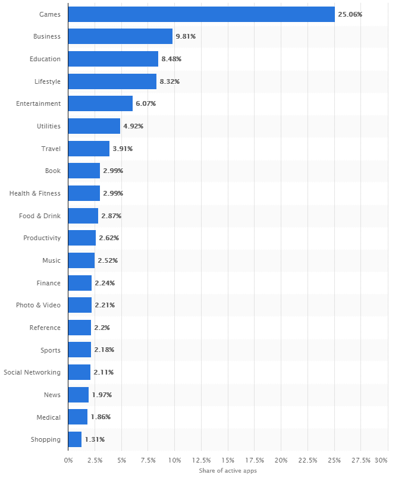

# 构建应用程序:趋势和技术

> 原文:[https://dev . to/galyna _ chekan/building-an-app-trends-and-technologies-1kn 5](https://dev.to/galyna_chekan/building-an-app-trends-and-technologies-1kn5)

谈到开发应用程序，我们不能过分强调今天[数字化转型](https://perfectial.com/blog/digital-transformation-strategy/)的重要性。每个人要么已经做了，要么正在做。没有人会对移动流量已经超过桌面流量感到惊讶。[移动优先](https://perfectial.com/blog/mobile-first-design-development/)如今是一个既定事实，我们必须接受并与之合作。在过去的几年里，云计算[已经成为主流](https://www.recode.net/2016/8/17/12519046/cloud-computing-as-utility-private-public-data-center)。物联网不仅改变着商业，也影响着我们的日常生活。人工智能、增强和虚拟现实、智能助手和其他技术的兴起证明，像以前那样做生意已经不再管用了。

为了让你了解移动应用世界的发展方向，我们决定快速了解一下事态，并缩小了近期最受欢迎的技术方向列表。

* * *

*截至 2017 年 10 月，苹果应用商店中排名前两位的类别是游戏(25.06 %)和商务(9.81%)。*

[点击推文](https://twitter.com/share?text=Top+two+categories+in+Apple+App+Store+as+of+October+2017+are+Games+%2825.06+%25%29+and+Business+%289.81%25%29.&via=perfectial&related=perfectial&url=https://perfectial.com/blog/building-an-app-trends-technologies/)

* * *

## App 界到底怎么了？

智能手机已经成为我们生活中不可或缺的一部分。很明显，这一趋势远未消退。我们将继续使用手机，新的应用程序将会出现在我们的应用程序商店中。现在我们淹没在应用程序中。根据[移动应用使用统计](https://www.statista.com/topics/1002/mobile-app-usage/)，app store 中有超过 200 万个应用。而这仅仅是开始。他们预测——到 2020 年，移动应用将通过应用商店和应用内广告获得[1890 亿美元的收入](https://www.statista.com/topics/1002/mobile-app-usage/)。下载率看起来也相当惊人。平均来说，我们已经在移动设备上安装了至少 [40 款应用](http://tweakyourbiz.com/technology/2015/05/22/app-frequently-uninstalled-users-heres/)。去年仅苹果应用商店的下载量就超过了 1000 亿次，这个数字预计还会翻倍。

[[Learn How Much Does it Cost to Develop Your Own Mobile App]](https://perfectial.com/mobile-app-development-cost/)

我们花费数字时间的主要类别是什么？根据[最新数据](https://www.statista.com/statistics/270291/popular-categories-in-the-app-store/)显示，截至 2017 年 10 月苹果 App Store 中排名前两位的类目是游戏(25.06 %)，其次是商务(9.81%)。整个列表如下:

[T2】](https://res.cloudinary.com/practicaldev/image/fetch/s--l3nDPKI4--/c_limit%2Cf_auto%2Cfl_progressive%2Cq_auto%2Cw_880/https://perfectial.com/wp-content/uploads/2017/11/top-app-categories.png)

[Most popular Apple App Store categories in October 2017](https://www.statista.com/statistics/270291/popular-categories-in-the-app-store/)

Another interesting observation pops up when it comes to millennials, one of the top users of mobile devices. If asked about the most popular mobile app, 9 out of 10 would probably say Facebook. And yes, [according to comScore](https://www.comscore.com/Insights/Presentations-and-Whitepapers/2015/The-2015-US-Mobile-App-Report), Facebook was the most essential app for Millennials in 2015 (for 21 % of users). In 2017, it’s actually [Amazon](http://www.businessinsider.com/best-apps-according-to-millennials-2017-8/#1-amazon-10) (35 % of users)

但是也有令人不安的统计数据。由于选择太多，我们很少使用应用程序。近[十分之八](http://www.businessofapps.com/data/app-statistics/)的人只用三个应用！废弃率也不乐观。一个普通的应用程序在发布三天后会失去超过四分之一的用户。而最常见的原因——“我很少用。”

那么，在我们这个时代，构建一个不仅仅是一个应用，而是一个成功的应用的秘密是什么？了解市场动态和实际需求是第一步。这就是统计学派上用场的地方。另一个重要的方面是[建立用户体验](https://blog.pixetic.com/ui-ux-design-explained/)不仅仅是为了在应用程序商店中获得特色，而是为了移动到用户的手机上，最好是心灵上。为了抓住他们的注意力，你必须投资创新。这就是为什么你需要掌握这一季科技世界的流行趋势，以及你需要开发什么样的应用程序。

## 构建应用的技术趋势

变化是今天唯一不变的。成功的现代企业能够快速适应新技术和不断变化的市场需求。关键是让创新快速发生。当涉及到构建应用程序时，企业正在寻求新的方法来拥抱新兴技术，并利用它们以新的方式接触客户。而且有很多选择。

帖子[构建一个应用程序:趋势和技术](https://perfectial.com/blog/building-an-app-trends-technologies/)最早出现在[软件开发公司完美](https://perfectial.com)上。