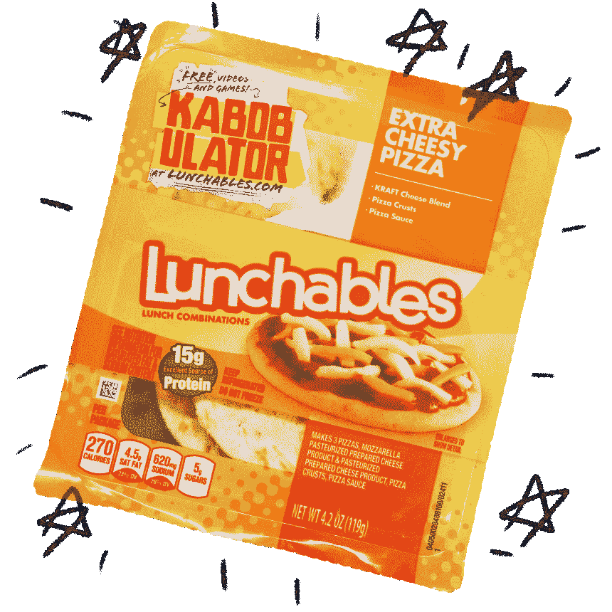
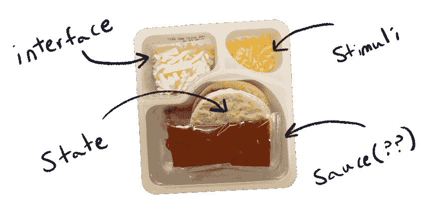

# 我们能用午餐编码吗？

> 原文:[https://dev . to/awfulaxolotl/could-we-code-with-lunchables-3n FJ](https://dev.to/awfulaxolotl/could-we-code-with-lunchables-3nfj)

啊，嗯——抱歉。我当然是指 Lunchables™️.

他们是编程的未来。你先在这里听到的。

看哪！

[T2】](https://res.cloudinary.com/practicaldev/image/fetch/s--OoOeWrkv--/c_limit%2Cf_auto%2Cfl_progressive%2Cq_auto%2Cw_880/https://axolotl.industries/static/lunchable-closed-1136853b87972b9e4f95c80d2c52fd71-5a1d9.png)

# 但实际上

开发软件很难。花几个小时、几天甚至更长的时间去尝试做一些你能用一句话描述的事情是正常的。

事情就是这样吗？

有时候。图灵奖获得者弗雷德·布鲁克斯在他的论文[“没有银弹”](https://en.wikipedia.org/wiki/No_Silver_Bullet)中区分了本质复杂性和偶然复杂性。本质复杂性，即一项任务的核心困难，不同于偶然的复杂性——或我们在使用解决方案时自己制造的困难。布鲁克斯声称程序员处理的大多数复杂性(截至 1986 年)都是必不可少的。

这是事实。我们已经远离了在穿孔带上编码。然而，我相信仍然有比必要的更大数量级的意外复杂性。即使使用现代的抽象技术，创建一个简单的移动应用程序也需要几个月的时间。

我们能不能只做:

```
search bar + results list + Twitter API = Twitter feed app 
```

<svg width="20px" height="20px" viewBox="0 0 24 24" class="highlight-action crayons-icon highlight-action--fullscreen-on"><title>Enter fullscreen mode</title></svg> <svg width="20px" height="20px" viewBox="0 0 24 24" class="highlight-action crayons-icon highlight-action--fullscreen-off"><title>Exit fullscreen mode</title></svg>

或者想做个游戏:

```
first person + punching + trees + cubes = Minecraft 
```

<svg width="20px" height="20px" viewBox="0 0 24 24" class="highlight-action crayons-icon highlight-action--fullscreen-on"><title>Enter fullscreen mode</title></svg> <svg width="20px" height="20px" viewBox="0 0 24 24" class="highlight-action crayons-icon highlight-action--fullscreen-off"><title>Exit fullscreen mode</title></svg>

关于:

```
fur + purring + paws + friendship + withdrawn superiority =
  Brandy, please come back I love you 
```

<svg width="20px" height="20px" viewBox="0 0 24 24" class="highlight-action crayons-icon highlight-action--fullscreen-on"><title>Enter fullscreen mode</title></svg> <svg width="20px" height="20px" viewBox="0 0 24 24" class="highlight-action crayons-icon highlight-action--fullscreen-off"><title>Exit fullscreen mode</title></svg>

为了找到答案，我打算建议我们饿一点，然后讨论一些数学问题。就相信我这一次，也许还能吃顿午餐！

# 一顿有联想的午餐是最好的午餐

我要坦白一件事。

我写的代码中至少有 80%是胶水代码——简单地将系统和第三方库集成在一起的代码。很少是原创思想。我是个骗子。但是妈妈，你说我很特别！

我敢打赌我不是唯一一个这样的人。当我们在更高的抽象层次工作时，更多的工作将会花在合成其他人的工作上。这很好！但这确实意味着在寻求避免本质复杂性的过程中偶然复杂性的蔓延。

让我们试着征服这个讨厌的家伙。

我已经深入研究 ML 语言家族有一段时间了，最近通读了巴托兹·米莱斯基的[“程序员范畴理论”](https://bartoszmilewski.com/2014/10/28/category-theory-for-programmers-the-preface/)。他们都让我非常欣赏我们编码背后的一些数学模型。

最开始是[半群](https://en.wikipedia.org/wiki/Semigroup)——结合合成的定义。它被正式定义为一组元素，`S`和一个操作，`⋅`，其中满足以下条件:

```
a ⋅ (b ⋅ c) = (a ⋅ b) ⋅ c ∀a,b,c ∈ S 
```

<svg width="20px" height="20px" viewBox="0 0 24 24" class="highlight-action crayons-icon highlight-action--fullscreen-on"><title>Enter fullscreen mode</title></svg> <svg width="20px" height="20px" viewBox="0 0 24 24" class="highlight-action crayons-icon highlight-action--fullscreen-off"><title>Exit fullscreen mode</title></svg>

在进入函数式编程之前，我从未听说过这一点。有点奇怪的是，这样一个简单的模式不是常见编程术语的一部分！

# 看那边——一个半群！

尽管如此，半群发现自己总是在代码中偶然形成。这是一种合理的模式。

## 半群的盐和胡椒

### 脱离生活

作为一个人，你期望像颜料混合、加法和集合并这样的基本半群起作用。日常生活中集合并的一个例子是后悔的事情:

```
regret(regret(petBaboon, vegemite), badBlogPosts) ==
  regret(petBaboon, regret(vegemite, badBlogPosts)) 
```

<svg width="20px" height="20px" viewBox="0 0 24 24" class="highlight-action crayons-icon highlight-action--fullscreen-on"><title>Enter fullscreen mode</title></svg> <svg width="20px" height="20px" viewBox="0 0 24 24" class="highlight-action crayons-icon highlight-action--fullscreen-off"><title>Exit fullscreen mode</title></svg>

你们一起后悔的顺序并不重要——最终你会后悔所有的事情。耶！

### 从代码

作为一名编码人员，有些类型的数据你希望能始终如一地融合在一起。一些例子是用户权限、配置和通过组合的纯功能。下面是一些被合并的配置:

```
default = {
  favorites: [],
  email: null,
}

zoo = {
  favorites: ['giraffe', 'koala', 'tapir'],
  email: 'staff@zoo.org',
}

kris = {
  favorites: ['aye-aye', 'lemur', 'tarsier'],
  email: 'kristoffer.wiggletown@zoo.org',
}

merged = {
  favorites: ['aye-aye', 'lemur', 'tarsier', 'giraffe', 'koala', 'tapir'],
  email: 'kristoffer.wiggletown@zoo.org',
}

merged ==
merge( merge( default, zoo ), kris ) ==
merge( default, merge( zoo, kris )) 
```

<svg width="20px" height="20px" viewBox="0 0 24 24" class="highlight-action crayons-icon highlight-action--fullscreen-on"><title>Enter fullscreen mode</title></svg> <svg width="20px" height="20px" viewBox="0 0 24 24" class="highlight-action crayons-icon highlight-action--fullscreen-off"><title>Exit fullscreen mode</title></svg>

## 职业的半群

这些都很棒，但让我们变得更好。这里有一些在现代代码中可以找到的高级结构。我最近做了很多 UI 编程，所以这将是主题。

### UNIX 管道

UNIX 以“做一件事并把它做好”的哲学而闻名。最好的例子就是文本处理命令的标准库！

```
# List of all sub-directories
ls -al | grep '^d'

# How many processes are running?
ps aux | wc -l

# Kill process by name
# Courtesy of https://unix.stackexchange.com/questions/30759/whats-a-good-example-of-piping-commands-together
ps aux | grep <name> | grep -v grep | awk '{print $2}' | xargs kill 
```

<svg width="20px" height="20px" viewBox="0 0 24 24" class="highlight-action crayons-icon highlight-action--fullscreen-on"><title>Enter fullscreen mode</title></svg> <svg width="20px" height="20px" viewBox="0 0 24 24" class="highlight-action crayons-icon highlight-action--fullscreen-off"><title>Exit fullscreen mode</title></svg>

在上一个例子中，我们可以给任意数量的相邻命令设置别名，而且仍然可以工作。这是因为函数在合成下形成半群。UNIX 命令实际上只是有效的函数，它将文本作为输入，并将其作为输出。

因此，理论上，任何 UNIX 命令都可以与任何其他命令组合。实际上，有许多命令采用了特定的文本结构。

### 做出反应

[React](https://reactjs.org/) 掀起了网络应用编程的风暴。许多人引用虚拟 DOM 作为它的特殊酱，但我不同意。它的特别之处在于声明式编程。非常简单，我可以把整个 API 的本质描述为两个函数:

```
component: Data → VirtualHTML
render: VirtualHTML → HTML 
```

<svg width="20px" height="20px" viewBox="0 0 24 24" class="highlight-action crayons-icon highlight-action--fullscreen-on"><title>Enter fullscreen mode</title></svg> <svg width="20px" height="20px" viewBox="0 0 24 24" class="highlight-action crayons-icon highlight-action--fullscreen-off"><title>Exit fullscreen mode</title></svg>

就是这样。这种力量来自虚拟 HTML 和数据本身。

每个组件都是一个纯函数，这意味着我们可以无忧无虑地使用函数组合。然后，要构建一个完整的 UI，我们只需在一个根组件下将所有组件组合在一起！

我们去看看。在 React 的模板语言 JSX 中，复合有两种形式:

```
function nest( OuterComponent, innerElement ) {
  return (
    <OuterComponent>
      { innerElement }
    </OuterComponent>
  )
}

function wrap( ...components ) {
  // Returns an array of components arguments
  return components
}

// Let's construct a page
render(
  nest( Page, wrap(
    <Header />,
    nest( Body, wrap(
      <Title />,
      <Content />,
      <More />,
    ),
    <Footer />,
  )),
) 
```

<svg width="20px" height="20px" viewBox="0 0 24 24" class="highlight-action crayons-icon highlight-action--fullscreen-on"><title>Enter fullscreen mode</title></svg> <svg width="20px" height="20px" viewBox="0 0 24 24" class="highlight-action crayons-icon highlight-action--fullscreen-off"><title>Exit fullscreen mode</title></svg>

你永远不会看到这样的代码；包装和嵌套只是隐含在你写的 JSX 中。然而，这两个功能是如何将组件组合在一起以创建整个 ui 的基本隔离。

你猜怎么着？反应分量是具有这些函数之一的半群。啊，他们又来了！

### GraphQL

GraphQL 是另一项席卷 UI 编程世界的脸书技术。它是一种查询语言，被设计成与 React 的视觉逻辑并行的数据。

```
# Some basic client information  {  loggedIn  {  name  email  }  }  # Specific page information  {  post(id:  45)  {  title  author  content  }  }  # Made into one query  {  loggedIn  {  name  email  }  post(id:  45)  {  title  author  content  }  } 
```

<svg width="20px" height="20px" viewBox="0 0 24 24" class="highlight-action crayons-icon highlight-action--fullscreen-on"><title>Enter fullscreen mode</title></svg> <svg width="20px" height="20px" viewBox="0 0 24 24" class="highlight-action crayons-icon highlight-action--fullscreen-off"><title>Exit fullscreen mode</title></svg>

是的，没错——你实际上只是将顶级查询连接在一起。

那是个半群！

对于持怀疑态度的人来说:是的，还有更复杂的例子。不过不要害怕，因为顶级组合总是被允许的。GraphQL 就是这样设计的，允许将不相交的查询简化为一个单一的组合查询，以提高效率。

# 一路下降的半群

在这一点上，你可能想知道 hooplah 是关于什么的。这如何让我们创建 Twitter 应用程序、方块打孔游戏或再造世界上最好的猫？

如果我们在头脑中探索用半群设计系统的含义，这将变得有趣。只有在彻底失败后，我们才会默认更复杂的模式。

为此，我们必须解决一件事。回头看半群定义:

```
a ⋅ (b ⋅ c) = (a ⋅ b) ⋅ c ∀a,b,c ∈ S 
```

<svg width="20px" height="20px" viewBox="0 0 24 24" class="highlight-action crayons-icon highlight-action--fullscreen-on"><title>Enter fullscreen mode</title></svg> <svg width="20px" height="20px" viewBox="0 0 24 24" class="highlight-action crayons-icon highlight-action--fullscreen-off"><title>Exit fullscreen mode</title></svg>

它只为`S`中的元素定义。如果我们想做类似于
的事情，这是一个问题

```
search bar + results list + Twitter API = Twitter feed app 
```

<svg width="20px" height="20px" viewBox="0 0 24 24" class="highlight-action crayons-icon highlight-action--fullscreen-on"><title>Enter fullscreen mode</title></svg> <svg width="20px" height="20px" viewBox="0 0 24 24" class="highlight-action crayons-icon highlight-action--fullscreen-off"><title>Exit fullscreen mode</title></svg>

什么样的集合`S`包含所有这三个部分*并且*知道一个关联的二元运算符来组合它们？

我会给出这样的答案:

1.  考虑整体结构
2.  将结构分解成几个部分
3.  如果每个部分都是半群，那么整个结构也是半群

在这种情况下，也许应用程序有一个整体结构，每个部分都可以很容易地组合在一起。为了说明这一点，让我们考虑上面具有显式整体结构的伪代码:

```
{ ui: search bar, data: none } +
{ ui: results list, data: none } +
{ ui: none, data: Twitter API } =
{
  ui: search bar + results list,
  data: Twitter API,
} 
```

<svg width="20px" height="20px" viewBox="0 0 24 24" class="highlight-action crayons-icon highlight-action--fullscreen-on"><title>Enter fullscreen mode</title></svg> <svg width="20px" height="20px" viewBox="0 0 24 24" class="highlight-action crayons-icon highlight-action--fullscreen-off"><title>Exit fullscreen mode</title></svg>

这样我们就可以把复杂的不同事物的组合问题转化为简单的相似事物的组合问题。

# 用午餐创建应用

用更简单的半群构造高级半群让我想起了午餐！每一种类型的午餐都有不同的独立部分，它们共同创造出美味、惊奇和怀旧的美妙和谐。

好吧，好吧。也许它们只是卖给疲惫父母的蹩脚零食。

但是！午餐盒类似于一个架构良好的应用程序。你有你的状态、视觉和刺激。刺激影响状态，状态反过来反映在视觉上。Mmmmmmm 多么好的食谱。

所以我们有一个结构。我们能把这些结合起来吗？换句话说，架构良好的应用程序可以充当半群吗？如果几年前你问我，我会拒绝的。但是，时代不同了。我们可能有技术。

一起砸几个 app 吧。

要做到这一点，看看我们如何将各个部分组合在一起——半群:

[T2】](https://res.cloudinary.com/practicaldev/image/fetch/s--TtYmEIj3--/c_limit%2Cf_auto%2Cfl_progressive%2Cq_auto%2Cw_880/https://axolotl.industries/static/lunchable-open-80085ffcabc1f237400b18e11bd9f6f8-fefd9.png)

*   使用 React.js，我们通常只做上面解释的事情。用户界面树由嵌套和包装组成。GraphQL 让这一点变得更加真实——每个组件的数据依赖关系都可以组合到一个查询中。因此，每个组件都可以生活在自己孤立的世界里，等待组合成一个更大的应用程序。
*   **状态:** Redux 在 React 世界很好的服务了我们。状态可以被分割成更小的状态树和单独的归约逻辑。这个逻辑是一个有 [`combineReducers`](http://redux.js.org/docs/api/combineReducers.html) 的半群！
*   **刺激:**我所知道的最好的合成例子是 Purescript Pux 中的[子事件](http://purescript-pux.org/docs/events/#Nesting_events)。

如果这些组成了一个应用程序，那么我们可以开始将整个应用程序组合在一起！漂亮。当我有机会的时候，我真的很想尝试做一个概念验证。也许是通过用小的、独立的部分重新创建 Twitter 应用程序等式。

不过，我确实看到了一个问题，那就是胶水代码。让我们暂时回到 Twitter 应用:

```
search bar + results list + Twitter API = Twitter feed app 
```

<svg width="20px" height="20px" viewBox="0 0 24 24" class="highlight-action crayons-icon highlight-action--fullscreen-on"><title>Enter fullscreen mode</title></svg> <svg width="20px" height="20px" viewBox="0 0 24 24" class="highlight-action crayons-icon highlight-action--fullscreen-off"><title>Exit fullscreen mode</title></svg>

半群需要知道结果列表如何与 Twitter API(它的数据源)和搜索栏(一个中间过滤步骤)相关联。唯一的问题是这些信息没有地方可去。

我们*可以*增加二元操作符来接受第三个参数来配置合并。只是这会使二元算子变成三元算子，从而完全打破了半群的定义。

所以我们的半群不再是半群。哦。

我还没有真正证明这一点，但我猜你可以只让“配置参数”成为应用程序中的子结构。应用程序的这个配置部分定义了所有其他部分如何链接在一起。如果配置就像一个半群，那么你仍然可以把应用程序完整地组合在一起——配置和所有的！[砸](https://www.youtube.com/watch?v=l7AhN70a74A)。

这张修改后的图是这样的:

```
search bar + results list + Twitter API + configuration = Twitter feed app 
```

<svg width="20px" height="20px" viewBox="0 0 24 24" class="highlight-action crayons-icon highlight-action--fullscreen-on"><title>Enter fullscreen mode</title></svg> <svg width="20px" height="20px" viewBox="0 0 24 24" class="highlight-action crayons-icon highlight-action--fullscreen-off"><title>Exit fullscreen mode</title></svg>

很好。当我有一个概念验证工作时，我会更新这篇文章。就目前而言，这只是文字。

# 陌生人便当

构建像我们如何混合颜料这样的应用听起来真的很酷。还有哪里可能？

让我们来看看软件的其他领域:

*   分布式系统:你真的能把小型后端系统组合在一起实现一个更大的系统吗？我知道这已经被彻底地探索过了，但是我找不到任何证据表明我们的目标是让它像半群一样简单。
*   **数据处理:**后端管道是有向无环图，已知可以很好地组合在一起。 [Tensorflow](https://www.tensorflow.org/) 和 [Luna Language](http://www.luna-lang.org/) 与许多其他人一起探索这个问题。
*   机器人学:我真的不知道这个，但探索一下会很酷。一个例子是完全用即插即用部件创造一个机器人。每个部分都会带来机器人需要融合其能力的任何逻辑。

半群和加法合成肯定不是新概念。但我无法摆脱这种感觉，它甚至不在大多数软件平台的考虑范围内。强制性的拼接和特别的配置似乎成了标准，好像这就是软件被创建的方式。

让我们努力变得更简单。[即使很难。](https://www.infoq.com/presentations/Simple-Made-Easy)