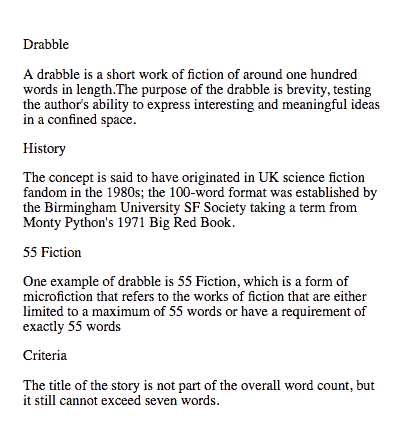
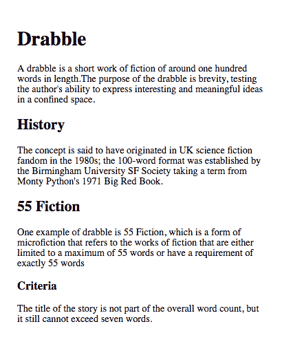
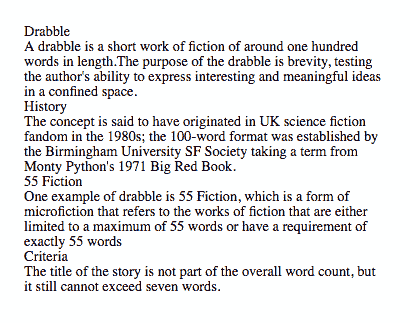
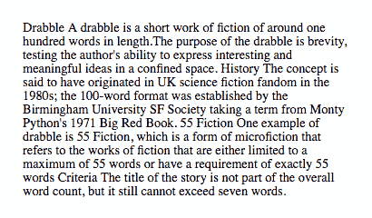

# 让我们来谈谈 HTML 的层次结构

> 原文：<https://dev.to/jenniferlynparsons/lets-talk-about-html-hierarchy-ec3>

好吧，这是我们的肉和土豆，对吧？HTML 是我们构建网站的基础。在某些时候，无论什么框架，JS，Ruby 等。我们用来建立一个网站的花哨，我们将在最后吐出 HTML，供某种浏览器摄取。

我们不知道什么样的浏览器会读取我们的代码。我们只知道它能读懂它。当你说“浏览器”这个词时，人们脑海中通常会出现 Firefox、Chrome、Internet Explorer 和 Safari。它可能是桌面或移动的，但也有许多其他的浏览器。特别是，最常被遗忘的是屏幕阅读器，这些浏览器对于那些有视觉障碍的人来说是容易访问的。

这些有限的浏览器除了是视觉障碍者访问互联网的不可思议的工具之外，还展示了在我们的 HTML 结构中使用语义元素的力量和重要性。

坦白地说，我们都应该更关心可访问性(包括我自己)，但是即使你出于某种原因不关心，这些信息对每个人都是有用的，因为另一个原因:这也是搜索引擎阅读你的页面的方式。想要更好的页面排名？正确使用 HTML 将帮助你。机器人将能够确定页面上最重要的信息是什么。这反过来告诉搜索引擎你的页面是关于什么的，以及当有人搜索与你的页面相关的内容时，是否将你的链接放在结果页面的更高位置。

还有第三个重要的原因让你用语义来写 HTML:它让写 CSS 变得更容易，你将不得不写得更少。我将在另一个时间讨论这个问题，但我只想说语义 HTML 和级联功能的结合是有魔力的。

那么，说了这么多，写“语义 HTML”意味着什么呢？这意味着我们添加到页面的内容是有上下文的。它有层次结构，重要程度帮助告诉浏览器强调什么和不强调什么。它有助于描述我们在页面上显示的数据，以便我们的用户(不要忘记用户！)不用太在意他们在看什么。我们希望他们尽可能直观地理解我们的页面。

好吧，也许举个例子会有帮助。看看这些信息:

[T2】](https://res.cloudinary.com/practicaldev/image/fetch/s--kWJkc2ie--/c_limit%2Cf_auto%2Cfl_progressive%2Cq_auto%2Cw_880/http://jenniferlynparsons.github.io/assets/img/posts/htmlexample1.png)

现在这个:

[T2】](https://res.cloudinary.com/practicaldev/image/fetch/s--mSEd1Tym--/c_limit%2Cf_auto%2Cfl_progressive%2Cq_auto%2Cw_880/http://jenniferlynparsons.github.io/assets/img/posts/htmlexample2.png)

是的，你可能已经解析出这篇维基百科文章的一部分是关于 Drabble 虚构形式 [Drabble - Wikipedia](https://en.wikipedia.org/wiki/Drabble) ，但是不太清楚的是“标准是“55 虚构”的一个子部分。顺便说一下，在上面的两个例子中，这是 Firefox 中呈现的原始 html。没有 CSS 或任何花哨的东西，除了设置身体的宽度，所以我可以拍一张漂亮的截图。

在第一个例子中，所有的信息块都包装在`p`标签中。在第二个例子中，我们有一个类似这样的结构:

```
<h1></h1>
<p></p>
<h2></h2>
<p></p>
<h2></h2>
<p></p>
<h3></h3>
<p></p> 
```

Enter fullscreen mode Exit fullscreen mode

如果我们准确地认为这是一个页面轮廓，并通过缩进来阐明层次结构，可以这样认为:

```
<h1>Title</h1>
    <p>information related to the title</p>

    <h2>Subtitle</h2>
      <p>information related to the subtitle</p>

    <h2>Subtitle</h2>
      <p>information related to the subtitle</p>

      <h3>Sub Subtitle</h3>
        <p>information related to the subsubtitle</p> 
```

Enter fullscreen mode Exit fullscreen mode

在第一个例子中，你能辨别标题的唯一原因是因为它们很短，并且在单独的`p`标签中，在 Firefox 中默认情况下，它们周围有空白。

两个稍微极端的例子。第一种方法只使用了`div`元素，默认情况下这些元素被呈现为类似于`p`标签的块，但是没有任何边距。它们“默认是无样式的:

[T2】](https://res.cloudinary.com/practicaldev/image/fetch/s--W0-c6Fh5--/c_limit%2Cf_auto%2Cfl_progressive%2Cq_auto%2Cw_880/http://jenniferlynparsons.github.io/assets/img/posts/htmlexample3.png)

第二个只包含`span`标签，这是真正用于对具有相似属性的数据进行样式化和分组的内联元素，比如不同语言中的短语:

[T2】](https://res.cloudinary.com/practicaldev/image/fetch/s--15fRnD3M--/c_limit%2Cf_auto%2Cfl_progressive%2Cq_auto%2Cw_880/http://jenniferlynparsons.github.io/assets/img/posts/htmlexample4.png)

是啊，事情开始变得难以分析了，对吧？然而，在这两个例子中，有相同数量的 html 标记，以与前两个例子完全相同的方式包装信息。

有人对我说，像`h1`和`article`等标签。只编码风格。理论上，这可能是真的。标签只是一种在有组织的块中显示信息的抽象方式，它们的名字并不重要。如果我们集体决定用类名来标识语义，`div.h1`将和`h1`具有同样的重要性。然而，这不是我们工作的范式，所以`h1`仍然在页面层次结构中拥有更多的语义权重，浏览器被设计成具有与该层次结构相匹配的默认风格。

语义 HTML 不仅仅是标题和段落。`section`、`article`、`header`、`footer`以及其他一些特殊的标签不仅有助于组织你的内容，使其更易于样式化，还有助于使你的 HTML 对浏览器和阅读你页面的用户更有意义。虽然它们没有任何相关的默认样式，但屏幕阅读器和 SEO 关注点再次从这些标签的正确使用中受益匪浅。

我希望这有助于澄清一些关于 HTML 层次结构如何工作以及如何使用它为用户提供更好的体验的事情。为了在这一过程中帮助你，我将发布一些关于编写更好代码的技巧的后续文章，概述我看到的一些常见错误以及关于编写更干净、更高性能的 HTML 的更多想法。

*一些最终注释和资源:*

我强烈推荐阅读这篇文章，它简要而全面地概述了屏幕阅读器的功能，以及语义如何改善视觉障碍者的体验:
[WebAIM:为屏幕阅读器兼容性而设计](https://webaim.org/techniques/screenreader/)

想更深入地理解语义 HTML 吗？这是一个很棒的资源:
[语义 HTML 教程| HTML & CSS 很硬](https://internetingishard.com/html-and-css/semantic-html/)

对于这里提到的各种标签以及许多其他标签，有一些比 MDN 更好的资源。他们的标签列表很方便地将它们按照预期用途进行了细分:
[HTML 元素引用- HTML | MDN](https://developer.mozilla.org/en-US/docs/Web/HTML/Element)

*几个更新:*

框架用户经常把所有的东西都做成一个 div。这对用户，搜索引擎，甚至是开发人员来说都是不好的！
T3【杰森·史丹普夫】T4】

随着我对这个主题的进一步思考，我还想到了一些你可能没有考虑到的用例:
当使用适当的页面层次结构时，页面的打印/pdf 版本(以及 epub，如果你这样做的话)更容易生成。
RSS 阅读器接收发送过来的不附带任何样式的 html。如果你想让你的标题和一般的页面结构清晰地翻译成其他界面，语义 HTML 是一个不错的选择。