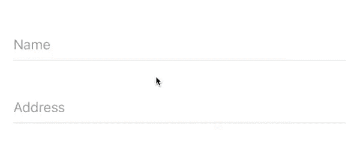

# 仅 CSS 浮动标签

> 原文:[https://dev.to/peiche/css-only-floating-label-3cp](https://dev.to/peiche/css-only-floating-label-3cp)

谷歌在材料设计指南上做的一件很棒的事情是包含了浮动标签。不知道什么是浮动标签？看看这个:

[T2】](https://res.cloudinary.com/practicaldev/image/fetch/s--f0zo6h3d--/c_limit%2Cf_auto%2Cfl_progressive%2Cq_66%2Cw_880/https://thepracticaldev.s3.amazonaws.com/i/yrodhhvpcmg2v09ps4bp.gif)

作为一个永远好奇的人，我想知道这是否可以在没有 JavaScript 的情况下完成。事实证明，它可以，但仅限于必填字段。

这是演示:

[https://codepen.io/peiche/pen/xOVpPo](https://codepen.io/peiche/pen/xOVpPo)

(注:据我所知，dev.to 上还不支持 CodePen 嵌入，如果我说错了请指正！)

要做到这一点，标记必须以一种非常特殊的方式构造:输入必须在标签的前面。(别忘了标签上的`for`属性！)

在这个例子中，我给了标签一个类，`form-control-placeholder`，并使它绝对定位。保存标签和输入的容器被设置为相对定位的，因此标签可以作为输入本身的覆盖，作为占位符出现。

```
.form-group {
  position: relative;
  margin-bottom: 1.5rem;
}

.form-control-placeholder {
  position: absolute;
  top: 0;
  padding: 7px 0 0 13px;
  transition: all 200ms;
  opacity: 0.5;
} 
```

<svg width="20px" height="20px" viewBox="0 0 24 24" class="highlight-action crayons-icon highlight-action--fullscreen-on"><title>Enter fullscreen mode</title></svg> <svg width="20px" height="20px" viewBox="0 0 24 24" class="highlight-action crayons-icon highlight-action--fullscreen-off"><title>Exit fullscreen mode</title></svg>

然后，我们添加一个样式，当它(输入)有焦点时，将标签移动到输入上方。这就是为什么我们把输入放在标签之前；CSS 只在一个方向上起作用(尽管改变这一点是许多开发人员对 CSS 4.0 的愿望，包括你自己)。

```
.form-control:focus + .form-control-placeholder {
  font-size: 75%;
  transform: translate3d(0, -100%, 0);
  opacity: 1;
} 
```

<svg width="20px" height="20px" viewBox="0 0 24 24" class="highlight-action crayons-icon highlight-action--fullscreen-on"><title>Enter fullscreen mode</title></svg> <svg width="20px" height="20px" viewBox="0 0 24 24" class="highlight-action crayons-icon highlight-action--fullscreen-off"><title>Exit fullscreen mode</title></svg>

不幸的是，这还不够。一旦输入失去焦点，标签会再次向下弹出，盖住输入，根本不关心你是否输入了一些文本。(是的，在我的脑海中，每当标签移动时，它就会发出“嗖嗖”的声音。)

光是通过 CSS 是无法确定一个输入是否已经输入了什么。最接近的是`:valid`选择符，它仅在具有`required`参数的输入上实现。

因此，我们更新 CSS 以包含`:valid` :

```
.form-control:focus + .form-control-placeholder,
.form-control:valid + .form-control-placeholder {
  font-size: 75%;
  transform: translate3d(0, -100%, 0);
  opacity: 1;
} 
```

<svg width="20px" height="20px" viewBox="0 0 24 24" class="highlight-action crayons-icon highlight-action--fullscreen-on"><title>Enter fullscreen mode</title></svg> <svg width="20px" height="20px" viewBox="0 0 24 24" class="highlight-action crayons-icon highlight-action--fullscreen-off"><title>Exit fullscreen mode</title></svg>

现在我们有了一个仅使用 CSS 的浮动标签的工作示例。不幸的是，如果不求助于 JavaScript，就没有办法绕过那个`required`，嗯，需求。

*本文最初发表于[eichefam.net](https://eichefam.net/2017/11/01/css-only-floating-label/)。*