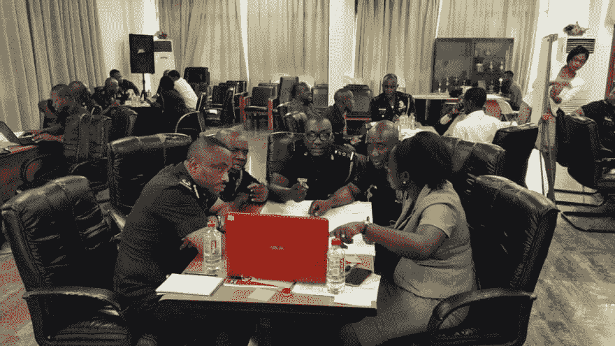
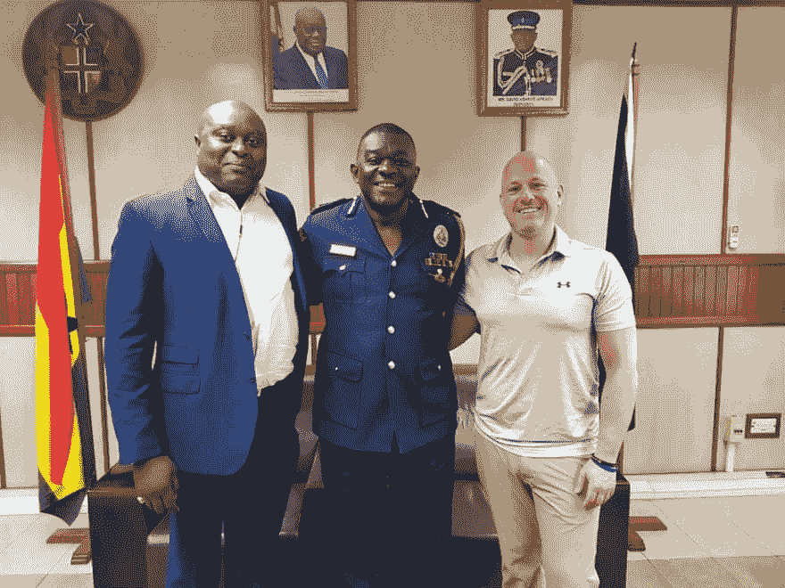
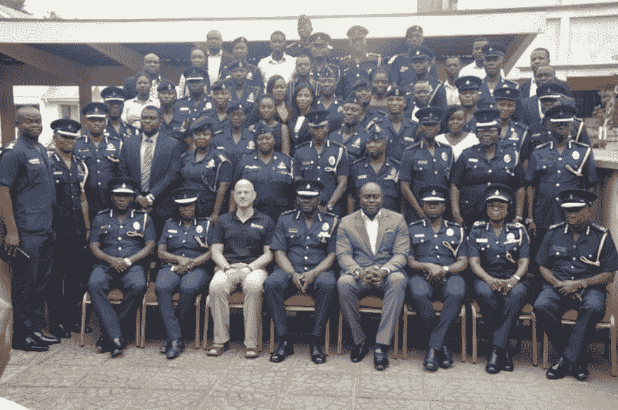
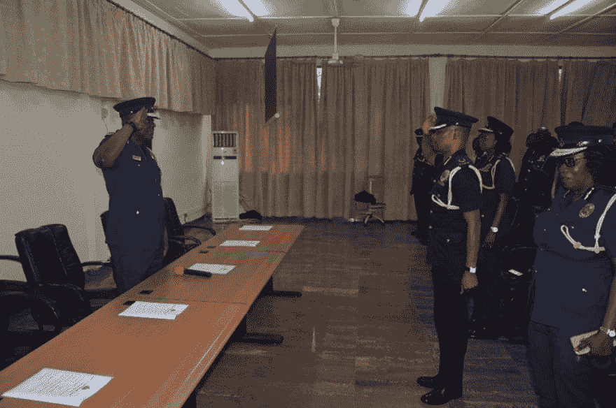
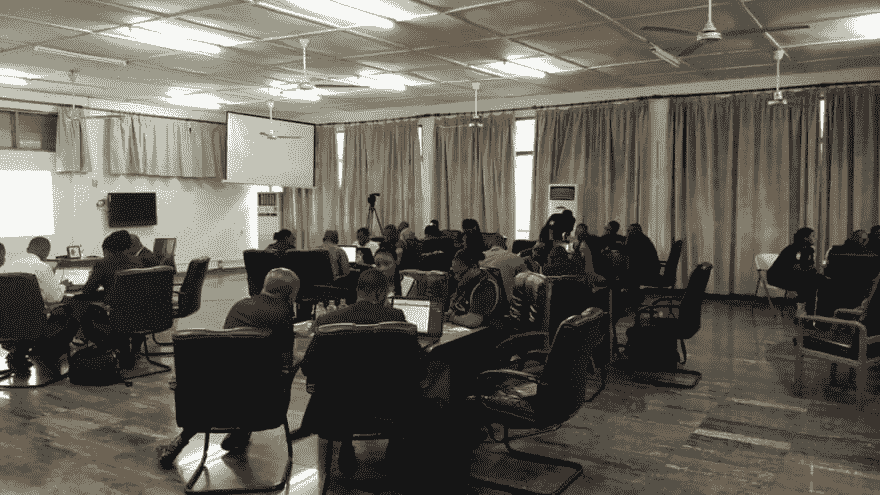
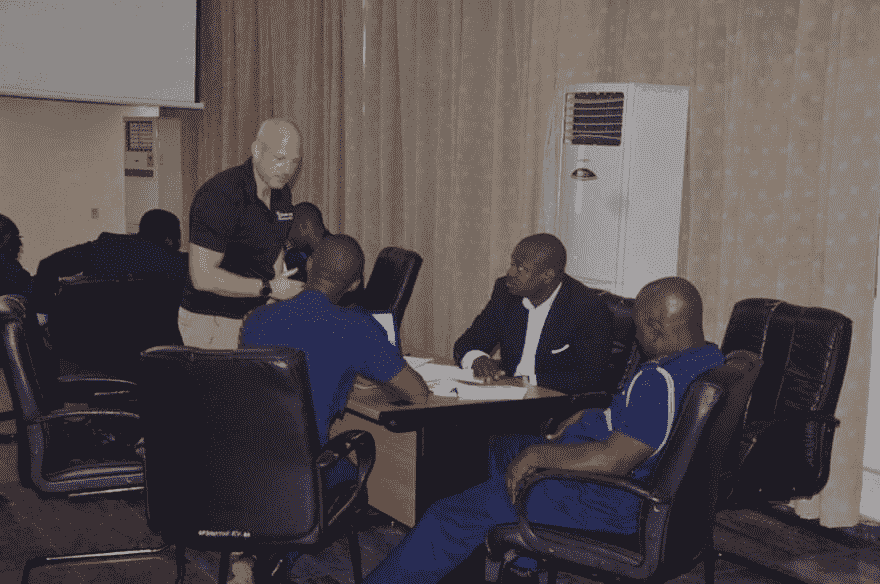
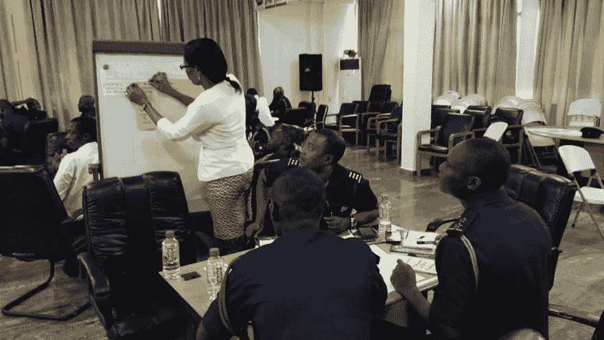
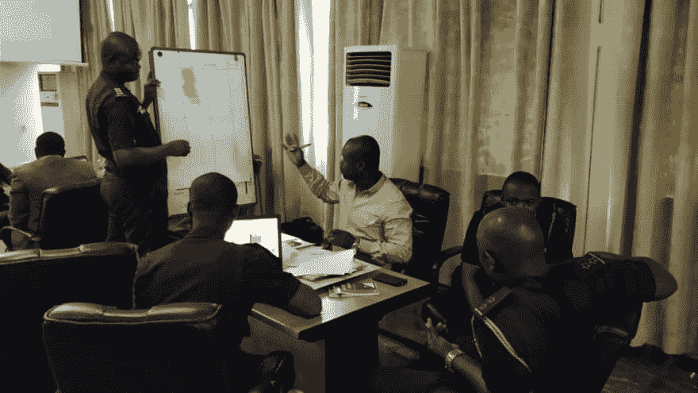

# 加纳警察署的专业 Scrum 培训

> 原文:[https://dev . to/nkd agility/professional-scrum-training-for-the-Ghana-police-service-431 c](https://dev.to/nkdagility/professional-scrum-training-for-the-ghana-police-service-431c)

上次我谈到加纳警察署(GPS)时，我谈到了[专业组织变革](https://dev.to/mrhinsh/professional-organisational-change-at-the-ghana-police-service-5cdf-temp-slug-7621830)和警察总监(IGP)采取的方法；使用 Scrum 对组织进行渐进的改变。当 Nana Abban 和 IGP 专注于全局时，我在加纳通过两个专业的 Scrum 基础(PSF)课程开始了 Scrum 的基层应用，这是加纳有史以来的第一次。

> 注意:你可以从 Scrum.org 下载[基于证据的敏捷变更指南](https://www.scrum.org/resources/agility-guide-evidence-based-change)
> 
> ## 拉开职业 Scrum 训练的序幕

当我说这些了不起的官员分成小组，用有限的 it 知识，围绕着创建网站形式的工作软件进行组织时，我不是在开玩笑，也不是在打比方。你可以想象我提出这样一个任务时他们脸上的表情，但你想象不到他们生产出来的东西里骄傲和满足的表情。

[T2】](https://res.cloudinary.com/practicaldev/image/fetch/s--eRZmRTET--/c_limit%2Cf_auto%2Cfl_progressive%2Cq_auto%2Cw_880/https://nkdagility.com/wp-content/uploads/2017/10/clip_image002.jpg)

> 说到创造性工作的复杂性，没有什么比软件开发更复杂的了。
> 
> Ken Schwaber, CEO and Founder of <cite title="Source Title">Scrum.org</cite>

[T2】](https://res.cloudinary.com/practicaldev/image/fetch/s--x1NhZV4---/c_limit%2Cf_auto%2Cfl_progressive%2Cq_auto%2Cw_880/https://nkdagility.com/wp-content/uploads/2017/10/clip_image004_thumb.jpg)

我周日晚些时候到达，周一的第一件事就是被迅速带到加纳警察总部会见警察总监。我们之前见过面，两年前在非洲的第一次敏捷会议上，当时他不是 IGP，他做了一个关于使用敏捷思想和实践解决复杂追捕(在这个案例中是一个连环杀手)的演讲。他非常喜欢 Scrum，因为他在国际刑警组织的时候看到了它的有效使用，他了解经验主义的基本敏捷概念，以及如何将它们应用到警务中。我之前提到的(愿景和使命)不太可能按预期实现，将需要大量的实证实验才能实现。

[T2】](https://res.cloudinary.com/practicaldev/image/fetch/s--1dM5zQkS--/c_limit%2Cf_auto%2Cfl_progressive%2Cq_auto%2Cw_880/https://nkdagility.com/wp-content/uploads/2017/10/clip_image006_thumb.jpg)

因为这是第一堂课，也是很多普通员工第一次听说敏捷或 Scrum，所以我们举行了一个启动仪式，还拍了一些照片。以防你找不到我，我坐在前排，左三，中间是 IGP，右边是娜娜·阿班。我身后的人是西非第一个专业 Scrum 基础班的学生。当你开始一项新的努力时，确保每个人都理解你计划如何实现目标的基本原则，以及为什么它有效，这很重要。

[T2】](https://res.cloudinary.com/practicaldev/image/fetch/s--EMB8vpEm--/c_limit%2Cf_auto%2Cfl_progressive%2Cq_auto%2Cw_880/https://nkdagility.com/wp-content/uploads/2017/10/clip_image008_thumb.jpg)

仪式结束后，是时候开始学习 Scrum 了。

## 职业 Scrum 基础中的真正冲刺

如果你不熟悉 PSF，它最初是由大卫·斯塔尔设计的，是一门非常实用的课程。仅仅解释敏捷和 Scrum 是不够的，学生必须体验它，感受它。为此，我们在课堂上进行实际的 sprints 构建工作软件。这不仅是西非的第一个 PSF，也是警察和平民合作的第一个球场。对于大多数官员来说，这也是他们第一次使用 Word 和 Excel 来构建软件。

[T2】](https://res.cloudinary.com/practicaldev/image/fetch/s--_HLxpepJ--/c_limit%2Cf_auto%2Cfl_progressive%2Cq_auto%2Cw_880/https://nkdagility.com/wp-content/uploads/2017/10/clip_image010_thumb.jpg)

我已经在软件组织中有效地使用 PSF 来培训每个人，从仓库里开叉车的人到公司的 CEO。它之所以有效，是因为你公司的每个人都知道 Scrum 是如何工作的，为什么会工作，因为每个人都了解问题域。软件是硬的。对于警察来说，我有一个难题；我是应该把话题从软件上转移开，还是应该坚持下去，让人们走出他们的舒适区。

[T2】](https://res.cloudinary.com/practicaldev/image/fetch/s--5WZbiIsr--/c_limit%2Cf_auto%2Cfl_progressive%2Cq_auto%2Cw_880/https://nkdagility.com/wp-content/uploads/2017/10/clip_image012_thumb.jpg)

我决定坚持到底，当我请他们合作创建一个工作网站时，每个人脸上的表情都是无价的。PSF 通常由课程中 4 次 60 分钟的冲刺组成。由于我们也在引进技术，我们实际上只有 2 次冲刺的时间，但我学到了足够的东西，认为下次我可以争取 3 次。关于如何将 Scrum 和我们的软件练习与警察工作联系起来，我没有从软件专业的学生那里得到很多讨论。虽然培训的目标是促进组织变革，但现实是，房间里的人关心他们所做的工作。我们就适合敏捷/Scrum 的创造性工作和适合精益/看板的非创造性工作之间的区别进行了一些特别有趣的讨论。

[T2】](https://res.cloudinary.com/practicaldev/image/fetch/s--TtLAKApz--/c_limit%2Cf_auto%2Cfl_progressive%2Cq_auto%2Cw_880/https://nkdagility.com/wp-content/uploads/2017/10/clip_image014_thumb.jpg)

课程的整体流程反复揭示了 Scrum 的工作原理，实践练习有助于学生逐步获得知识:

*   **介绍**–相互了解对于理解如何组建团队以及确保每个团队都具备所需技能非常重要。
*   **冲刺 1—**第一次冲刺的目的是让学生看到，一群人只是为了一个共同的目标一起工作，就能把事情做好。不需要工作分解结构。
*   Scrum 的基础知识——我们也需要理解我们试图解决的问题。在这里，我们讨论泰勒主义，预测与实证，以及保持改变的能力。
*   Scrum Framework 1——接下来是时候深入 Scrum 和角色(负责)、工件(透明)以及使其工作的事件(检查和调整)了。
*   第二次冲刺——在第二次冲刺中，团队已经选出了 Scrum 大师和产品负责人。他们做明确的冲刺计划、回顾和回顾。事情应该会变得更加顺利。
*   Scrum Framework 2——这是对角色(负责)、工件(透明)和事件(检查和适应)的第二次更深入的迭代，以增加更多的细节并回答第二次冲刺中出现的新问题。
*   掌握 Scrum——Scrum 的附加价值是人们在自组织的团队中一起工作，并被给予自主决定的自由，以实现他们专业的技术掌握。我们非常注重自主性、掌控力和目标，因为这是维持快乐和健康团队的关键。
*   Sprint 3——根据人们的进展情况，我通常会在这个 Sprint 中介绍一些团队功能障碍，展示它们的破坏性。团队在这里通常会感到沮丧，我们在回顾中会有一些严肃的讨论。
*   Scrum 中的计划——打破敏捷团队不做任何计划的神话，更多的计划导致更准确的估计是 Scrum 中计划的顺序。大量的练习和接触许多经常用于计划的补充实践，比如故事和故事点。
*   **Sprint 4**–由于业务需要，第四次 Sprint 通常会带来一些战术方向上的重大变化。这在现实世界中很常见，我们想向学生展示，即使是重大的变化也是可以管理的，不一定会导致混乱。
*   **开始**–课后，学生们希望能够运用他们刚刚学到的知识，并愤怒地使用它们。在这堂课上，每个区域指挥官都将启动 Scrum 团队来实施组织变革。所以让我们稍微充实一下积压的工作。领导虽然善于发现需要做什么样的改变，但往往与正在做的实际工作相差甚远。这导致了对于下一步最重要的事情是改变什么的分歧，这对当地的人们来说是显而易见的。围绕组织如何运作进行了一些讨论后，学生们有时间写他们自己的组织变革待办事项……我们有很多……>注意:我只完成了全科医生的两次冲刺。部分原因是两个班都缩短了半天。第一个是因为 IGP 的一个仪式，第二个是因为星期五是假日。我不得不错过冲刺 4，但从来没有同时错过 3 和 4。第一节课我很心烦意乱，但第二节课我接受了。学生们还是学到了很多东西。##加纳职业 Scrum 培训回顾

在来上课之前，我有一些假设，但这些假设并不正确。我最大的错误是，学生们会知道他们为什么在那里，他们将要学习什么。这在软件组织中通常不是问题，因为至少我们有一个参考框架和大量的知识。对于警察来说，即使我们有几个技术人员，那个参考点也不见了。我们在第一堂课上花了很多时间来创建参考点，并避开死胡同和盲目盟友。许多人不知道他们要用这个做什么。

对于第二节课，我们已经从第一节课的反馈中学到了，是的，就在第二天，我们开始了不同的学习。我们听取了组织变革办公室的一名警官的简短发言，以介绍课程及其目的，特别是在与会者的背景下。这似乎帮了很大的忙，事情变得令人窒息。从第一堂课开始，我也更好地将 Scrum 和软件开发与警察工作联系起来。我现在非常乐意给 35 个不知道如何构建软件的人教授这门课。

[T2】](https://res.cloudinary.com/practicaldev/image/fetch/s--6mXKQsY5--/c_limit%2Cf_auto%2Cfl_progressive%2Cq_auto%2Cw_880/https://nkdagility.com/wp-content/uploads/2017/10/clip_image016_thumb.jpg)

有些事情我会以不同的方式去做:

1.  让所有学生都通过电子邮件发送 Scrum 指南，以及我们在服务中的组织变革领域试图实现的目标。这是我们打算为这些班级做的事情，但是在组织来自许多地区的 50 名警官时遇到了许多困难。他们中的许多人不得不花 10 多个小时去上课。
2.  早些时候提出，课程的目的是让警察熟悉 Scrum，因为他们是组织变革团队的利益相关者，或者可能是团队成员。

## 结论

教非技术人员很难，尤其是对于像我这样一个公认的极客。然而，我非常享受在加纳为加纳警察局教授 Scrum 的时光，并期待着再次这样做。我回到加纳参加敏捷在非洲的会议，并在 12 月再次给一名专业的 Scrum 开发人员上课(这次是给技术人员)。明年会安排更多的课程…

如果你在加纳或西非的任何地方，你都可以联系 Akaditi，为你的组织学习公共和私人课程。

为加纳警察部门进行职业 Scrum 训练的帖子最早出现在 T2 的马丁·辛舍尔伍德-裸体敏捷有限公司。