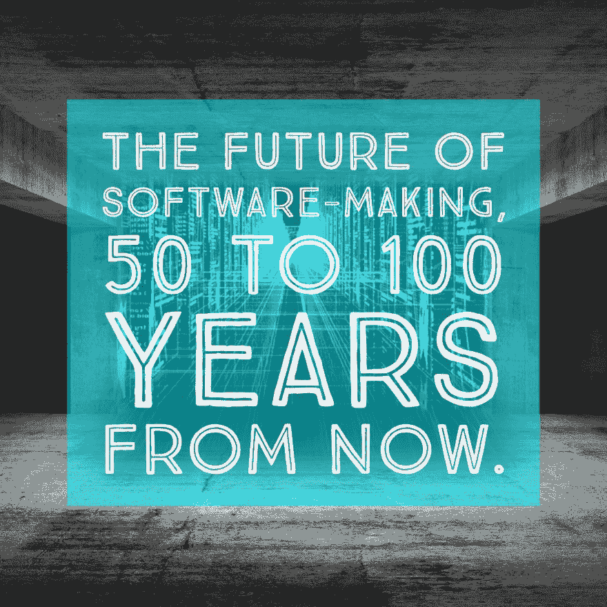

# 从现在起 50 到 100 年后，软件制造的未来

> 原文:[https://dev . to/lpas qualis/the-future-of-the-future-of-software-making-50-100 years from now-3 F4](https://dev.to/lpasqualis/the-future-of-software-making-50-to-100-years-from-now-3f4)

这篇文章最初发表在 CoderHood 上，名为[《50 到 100 年后软件制造的未来》](https://www.coderhood.com/the-future-of-software-making-50-to-100-years-from-now/)。CoderHood 是一个致力于软件工程人类层面的博客。

[T2】](https://www.coderhood.com/the-future-of-software-making-50-to-100-years-from-now/)

## 软件制作才刚刚起步

构建软件仍处于初级阶段。今天，我们当时写了一行代码来描述我们认为机器应该做什么来解决问题。开发人员花了大部分时间整理行为的微小细节。他们这样做是为了确保任务以明确定义和理解的方式精确执行。

不幸的现实是，这种方法的可扩展性不好。这个世界需要软件，但是今天的软件创造过程既缓慢又复杂。我们在过去的其他形式的艺术和工艺中见过这种情况。

## 编码就像绘画

例如，想想肖像制作。它曾经是艺术家从事的职业，他们会学习和练习很多年。肖像制作需要技巧、激情、精确度和坚持不懈的动力。每一个铅笔标记或笔触都需要有条不紊地运用，才能形成完整而逼真的图像。结果因艺术家的技巧和经验而异。

摄影取代了大多数现实的视觉艺术，因为它只需点击一个按钮就能捕捉到真实，将肖像的成本几乎降至零。摄影起初很复杂，但后来变得越来越容易。照相机变得越来越小，越来越自动化。今天，任何人只要用一部手机就可以在几秒钟内创作出一幅像样的肖像。有些肖像比其他的要好，但是大多数人都可以接触到这种工艺。

编码是软件制作阶段，相当于肖像制作的绘画阶段。每个细节都需要人的关注和深思熟虑。虽然计算机语言、框架和库在不断改善这种情况，但我们还远远没有达到人类可以将所有注意力集中在软件的构思和设计上的地步。

一个编码器在一个循环中增加一个变量，一个画家研磨颜料来制作一批 Giallo di Siena。一名软件工程师查看事件日志以检测错误的原因，一名画家盯着一幅未完成的画像以理解为什么它看起来不正确。一个开发者升级一个开发环境，一个画师搭建一个更好的画架。

## 艺术与工艺的题外话

这就是为什么许多人把构建软件等同于一门艺术。我不同意这样的标签，因为我相信编码是一门手艺，而不是一门艺术。原因很简单。编码不是我们用来表达情绪或情感的东西。它是我们用来描述可以用来解决问题的一组特定行为和动作的东西。

同样的，我把外科看做一门手艺，而诗歌是一门艺术，我也把木工、制柜看做手艺，而雕塑是一门艺术，区别在于意图；这种意图决定了一项活动的处理方式和如何进行。如果目的是传递情感，那么活动就是一门艺术。如果意图是建造具有实用功能的东西，即使它碰巧是审美愉悦的，那么活动就是一门手艺。

## 一个可能的未来

软件制作处于早期阶段，编码是一种原始的工具。我没有玻璃球，但我确信未来的事情会非常不同。

有很多可能的未来。其中之一是，从现在起 50 到 100 年后，我设想编码将成为“软件成型”,并将从当前详细和有条不紊的动作描述过渡到根据更具表达力的行为成型来捕获和提炼应用程序。软件工程师将被称为“软件塑造者”，他们将是比工匠更高层次的思考者。代码将被称为“逻辑工件”

### 重复性工作的结束

在未来，需要做样板和重复的工作将完全消失。界面、行为和算法将通过快速和粗略的组件组装来创建，然后进行一系列微调。软件塑造者将有权访问原型库，他们将把原型库链接在一起，以描述用户界面、行为和数据流操作。

最初粗略创建一个程序将需要找到正确的原型，并使用存在于 AR 空间中的视觉界面将它们链接在一起。组件之间的链接细节将不会用代码描述，而是由越来越智能的人工智能生成，它将在整形器的指导下填补空白。这种指导将使用自然语言，并通过提供例子和富有表现力的描述进行提炼。人工智能将学习解释人类的意图，并生成必要的逻辑。塑造应用程序将类似于人和机器之间的头脑风暴。

### 自动申请进化

应用程序将由设计者设想、设计和完善。一旦启动，应用程序将随着人们或人工智能的使用而自动发展和改进。人类塑造者将参与应用程序的发展。他们的目标将是维护一个愿景和道德界限。他们的任务是纠正任何不良趋势，并将应用程序的发展重新导向理想的方向。然而，大部分的维护和优化将是自动的，为塑造者腾出时间来研究需要人类创造力和指导的新愿景。

在未来，原型将是在类似于今天的容器中运行的模块，并使用最适合它的技术来构建。它们将独立运行，公开可与其他原型的输入和输出链接的输入和输出。每个组件都将在一个虚拟化的计算世界中运行——类似于计算云——任何人都可以在全球范围内访问。

### 一个不断进化的 AI

帮助应用程序成型过程的人工智能也将随着时间的推移而成型，并将与计算领域中运行的所有其他应用程序类似地改进。对于人类塑造者来说，编程看起来就像是对应用程序的意图和行为进行智力讨论。塑造者会提出问题，描述结果，并提炼自动生成的逻辑工件。塑造者和机器之间的互动将是关于“是什么”和“为什么”，而不是关于“如何”。

由于人工智能的发展会不断完善自己，大多数人不会理解它如何工作的所有细节。这与今天的人类不了解生命运作的细节没有什么不同。将有可能要求人工智能解释它的模式或记录它自己，但没有人会写下每一条指令或明确地制作每一种算法。它将是一个不断变化的逻辑有机体，进化的速度将超过人类能够跟踪的速度。甚至它运行的硬件也会进化得比我们能理解的更快，越来越像一个独立的、不断进化的有机体。

### 人类作为动物园管理员的角色

人类关注人工智能的高级行为、意图和目标的能力，将使我们处于控制之中；人工智能进化的不断重定向和调整将保持我们的主导地位。

每隔一段时间，就会出现类似现代疾病或瘟疫的恐慌。控制整形软件的人工智能可能会采取流氓或不明确的方向。在这种情况下，人类将不得不进行干预，以保持平衡。

最终，保持控制人工智能和让人工智能全速工作以最大化碳基生命的利益之间的平衡将是人类的主要职业。我们将充当动物园管理员，或园丁，总是驯服，修剪和清理不想要的增长。

## 到达目的地

我们离这个可能的未来还很远，但我们知道事情会改变。他们如何改变取决于我们。虽然细节无法预测，但我们可以看看早期指标。人工智能正在大步向前发展，并在继续进步。电脑越来越快，越来越便宜。AR 变得越来越容易获得，并将不断发展。云计算正在成为大多数软件在网络上运行的方式，分布式系统的去中心化和虚拟化将继续下去。

基于这些趋势，我们可以开始设想我们希望软件制造的未来是什么样子，并朝着这个愿景前进。三十年前，我们用 C 写大部分代码，我们必须用 malloc 和 free 管理内存。今天，内存管理基本上是自动化的，工程师解决的问题要高得多。这种趋势不会停止，我相信人工智能辅助软件制作将改变我们在软件行业的工作方式。

我很想知道你对 50 到 100 年后软件工程师的生活有什么看法。会有怎样的改变？会是什么样子？我在这篇文章中画了一幅画，是我脑海中的许多画中的一幅。有许多可能性，我想请你放开你的想象力，想象你想要的未来，这样我们就可以开始朝着它努力。没有愿景就没有创新，没有想象就没有愿景。

* * *

### 如果你喜欢这篇文章，请保持联系！

*   在 CoderHood 上找到我所有的帖子。
*   在 LinkedIn 上加入我的职业网络。
*   在推特上关注我。
*   加入我的脸书主页。
*   最后，请在 dev.to 上关注我！