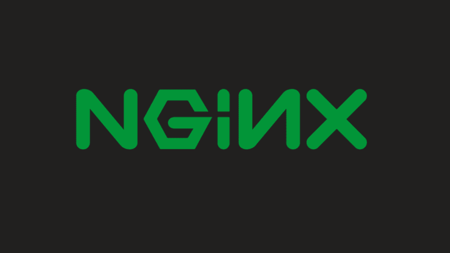

# 如何在 Mac OS X 上用 FPM 设置 Nginx 和 PHP7.1 而不哭

> 原文:[https://dev . to/chiefoleka/how-to-setup-nginx-and-PHP 71-with-fpm-on-MAC-OS-x-with-no-crying-4 M8](https://dev.to/chiefoleka/how-to-setup-nginx-and-php71-with-fpm-on-mac-os-x-without-crying-4m8)

[T2】](https://res.cloudinary.com/practicaldev/image/fetch/s--vmEZnftz--/c_limit%2Cf_auto%2Cfl_progressive%2Cq_auto%2Cw_880/http://media.rehansaeed.com/rehansaeed/2016/08/NGINX.png)

我的 nginx 出了几个月的问题。我在网上看了很多文章，但找不到解决办法。我看到的大部分是给`php7.0`的，他们用的`php-fpm-sock file`显然在`php7.1`不存在。创建和配置`php7.1`来使用`sock file`本身就是另一回事。我失败了几次。当我升级到 High Sierra(由于多次失败，它基本上清除了我的系统)时，我不得不重新开始设置。我决定慢慢来，真正解决这个 nginx 设置问题。仍然没有对我有用的教程。我下定决心要自己解决。我有吗？这篇文章将解释我是如何做到的。

如果您不熟悉本地机器上的 http 服务器，即使您不理解大部分内容，这篇文章也会使设置 nginx 变得非常容易。如果你使用 LAMP 或 WAMP 或任何类似的软件，你可能想在来这里之前阅读一下如何为你的操作系统设置 nginx。nginx 的配置是相同的。只是用于查找 nginx 的`nginx.config`文件的文件夹可能会因操作系统而异。是的，这也适用于非 Mac 用户。

为了让这篇文章对你有用，我会跳过很多不是重点的东西(那些可能已经有 1000 篇文章的东西)。我会快速看完这些。我在 Mac 上使用 High Sierra(我以前使用 Sierra ),所以我不能保证在 macOS X 的其他版本上会发生什么。如果您正在跟踪，但有任何东西丢失，请不要担心。只要谷歌如何安装它，然后继续这个设置。

如果您已经安装了 Nginx 和 PHP7.1，您可以跳到安装部分，直接进入配置。

## 安装

我们将使用`Homebrew`进行所有的安装。它让生活变得简单，而且相当直接。[点击此处](https://brew.sh/)阅读或立即安装。

```
/usr/bin/ruby -e "$(curl -fsSL https://raw.githubusercontent.com/Homebrew/install/master/install)" 
```

完成后，确保家酿的环境设置正确。

```
$ brew doctor 
```

接下来，我们将安装一个 launchctl 包装器，它将停止、启动和重启我们用 brew 安装的任何服务。

```
$ brew tap homebrew/services; brew tap homebrew/dupes 
```

让我们用 fpm 安装 php7.1，并显示安装后的版本。

```
$ brew install php71 --with-fpm --without-apache; php -v; php-fpm -v 
```

马上启动 PHP。

```
$ brew services start php71 
```

我们不需要为 FPM 的 PHP7.1 做太多设置，因为它开箱即用。我们去拿 nginx，让派对开始吧。

```
$ brew install nginx; brew services start nginx 
```

我们现在完成了安装，是时候进行配置了。如果您还安装并运行了 apache，Nginx 应该在端口 8080 上运行。不管是哪种方式，安装后你都应该看到它是在哪个端口上运行的，这样你就可以快速访问`http://localhost:8080`看到默认的 nginx 主页(如果不是 8080，就用你安装后终端显示的端口代替)。

## 配置

当用 homebrew 安装时，Nginx 的配置文件会在`/usr/local/etc/nginx`中找到。用你喜欢的任何编辑器打开它(我用`nano`来节省时间)。

我们将让一切保持原样，只编辑几个部分。安装时会正确配置`nginx.config`文件以服务静态文件。你所有的网站都在`/usr/local/var/www`文件夹中，这样 nginx 就能看到它们。在撰写本文时，Nginx 将所有文件镜像到它的`html`文件夹中，这个文件夹可以在`/usr/local/Cellar/nginx/[version_number]/html`中找到。如果你想为你的文件设置一个不同的部分，编辑配置文件的这个块并设置一个不同的`root`。

```
location / {
            root   html;
            index  index.html index.htm index.php;
        } 
```

不要忘记将`index.php`添加到`index`列表中，这样当 nginx 服务于您的站点时，它可以自动加载该文件。

下一件事是设置我们的 php 文件如何被代理执行。编辑您的块以匹配以下内容。

```
 # proxy the PHP scripts to Apache listening on 127.0.0.1:80
        #
        # location ~ \.php$ {
        #    proxy_pass   http://127.0.0.1;
        #} 
  # pass the PHP scripts to FastCGI server listening on 127.0.0.1:9000
        #
        location ~ \.php$ {
            root           html;
            include        fastcgi.conf;
            fastcgi_pass   127.0.0.1:9000;
            fastcgi_index  index.php;
            #fastcgi_param  SCRIPT_FILENAME  /scripts$fastcgi_script_name;
            include        fastcgi_params;
        } 
```

我把`fastcgi_param`行注释掉了，只是以防你以后需要在那里设置一些东西。所有参数都已经包含在它的下面，`fastcgi.conf`文件应该有使用`php-fpm`所需的所有设置。保存文件并重启 nginx。

```
$ brew services restart nginx 
```

如果您使用多个配置文件(都存储在`/sites-available`中)，您也必须逐个调整它们。您可以将上面的这个安装程序块存储在一个单独的文件中，如果它们都使用同一个根文件夹，则可以将它包含在所有的文件中。

是时候测试我们漂亮的装置了。在`/usr/local/var/www`文件夹中创建一个`info.php file`，并放入你选择的任何可以输出内容的`php`代码(我重复了`phpinfo()`)。转到`http://localhost:8080/info.php`，它应该显示得很好(如果不是 8080，请使用设置后显示在您终端上的端口)。

现在，伙计，去享受你的 nginx，不要再哭了。

* * *

NGINX 是一个免费、开源的高性能 HTTP 服务器，以其高性能、稳定性、丰富的特性集、简单的配置和低资源消耗而闻名。如果你想了解 nginx 与 apache 相比在处理请求和高负载方面的表现，请阅读 [Web 服务器性能比较](https://help.dreamhost.com/hc/en-us/articles/215945987-Web-server-performance-comparison)。如果你想更好地了解 nginx 和 apache 各自的优势，请查看数字海洋上的[这篇文章](https://www.digitalocean.com/community/tutorials/apache-vs-nginx-practical-considerations)。