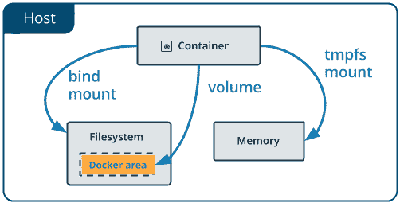

# 今天我学习了:关于 Docker 卷

> 原文：<https://dev.to/shriharshmishra/today-i-learned--about-docker-volume-9pn>

[T2】](https://res.cloudinary.com/practicaldev/image/fetch/s--kMOSgbiQ--/c_limit%2Cf_auto%2Cfl_progressive%2Cq_auto%2Cw_880/https://thepracticaldev.s3.amazonaws.com/i/85wf0mwwix360i3xjckw.png)

在我在 Docker 上运行 Jenkins 的实验中，我想知道当我向 run 命令提供`-v`时，volumne 是如何工作的。

我发现了一篇很棒的文章，它简洁地解释了很多关于 docker 卷的内容——这对任何 Docker 初学者来说都很方便。

原文是[此处](http://container-solutions.com/understanding-volumes-docker/)

我的总结如下:

*   Docker 卷是在容器重启和*之间共享数据的方式*。**
*   卷存储在主机文件系统上。通常在`/var/lib/docker`中的模糊目录中。但是，主机系统上的特定目录也可以作为卷装入容器中。
*   可以使用`docker volume`及其子命令管理卷。
*   除非特别指示，否则 Docker 不会删除卷。这可能会导致主机系统上的数据过时。所以偶尔整理一下可能会派上用场。
*   **重要警告** -不要试图修改 docker 文件中卷的内容(通过运行)，因为每个构建步骤都会创建一个*新的*卷，您的更改将被丢弃。如果你想改变音量内容，使用 docker 文件中的*入口点*命令。看看这个[环节](https://stackoverflow.com/a/34843099/7007521)。
*   如果您想全面了解管理应用程序数据的不同方法，包括使用**卷、绑定装载、tmpfs 装载**，请阅读这篇[长文章](https://docs.docker.com/engine/admin/volumes/)

*图片来源:[https://docs . docker . com/engine/admin/volumimg/types-of-mounts-volume . png](https://docs.docker.com/engine/admin/volumimg/types-of-mounts-volume.png)T3】*